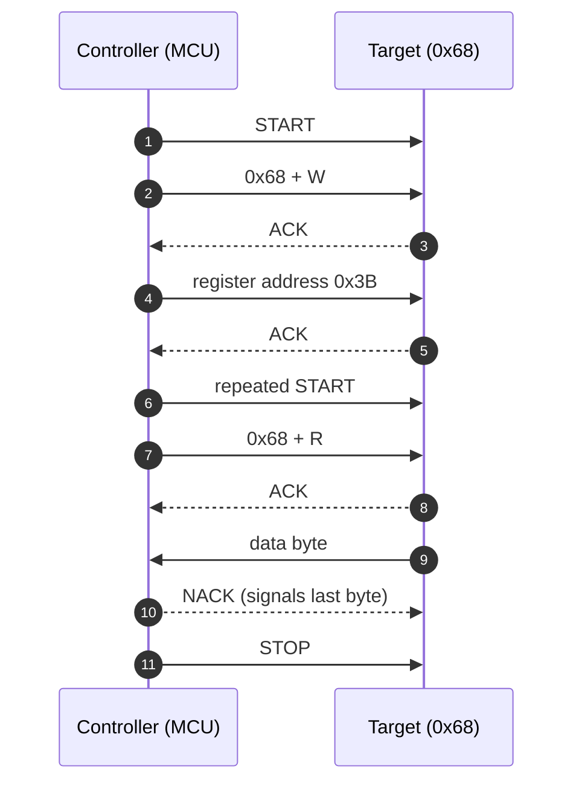

# I2C — Inter-Integrated Circuit

> A two-wire, synchronous, half-duplex bus that lets one controller talk to many chips on the same PCB, using shared open-drain lines and addresses instead of chip-select pins.

**Contents**
[Cheat sheet](#1-cheat-sheet) ·
[How it works](#2-how-it-actually-works) ·
[Frame format](#frame-format) ·
[ACK / NACK](#ack-and-nack) ·
[Clock stretching](#clock-stretching) ·
[Burst transfers](#continuous--burst-transfers) ·
[Finding an address](#finding-a-devices-address) ·
[Registers](#3-register-level-walkthrough) ·
[Code](#4-code) ·
[Captures](#5-captures) ·
[Debugging](#6-debugging-checklist) ·
[Q&A](#7-questions-i-should-be-able-to-answer) ·
[Sources](#8-sources)

---

## 1. Cheat sheet

| Property | Value |
| :--- | :--- |
| **Wires** | 2 — SDA (data), SCL (clock), plus common ground |
| **Duplex** | Half-duplex |
| **Clock** | Synchronous, driven by controller; target may stretch it |
| **Typical speed** | 100 kHz (Standard), 400 kHz (Fast) |
| **Max speed** | 5 MHz (Ultra Fast — unidirectional, rare) |
| **Distance** | Centimetres. Same PCB, sometimes a short ribbon |
| **Device select** | 7-bit address in the first byte (10-bit optional) |
| **Max devices** | Limited by address collisions and 400 pF bus capacitance |
| **Drive type** | Open-drain — external pull-ups required |
| **Error detection** | ACK/NACK per byte only. No CRC (except SMBus PEC) |
| **Pin cost** | 2 pins total, regardless of device count |

**Use it when** several low-speed chips share one board, pins are scarce, and throughput is not the constraint — sensors, EEPROMs, RTCs, PMICs, small OLEDs.

**Avoid it when** you need speed (use SPI), long cable runs (RS-485/CAN), noise immunity, or when the parts share a fixed address you cannot change.

### Top 5 gotchas

| # | Gotcha | Why it bites |
| :--- | :--- | :--- |
| 1 | **Missing or weak pull-ups** | No pull-ups, no rising edge, every transfer NACKs. Too weak, and it fails only at 400 kHz |
| 2 | **7-bit vs 8-bit address** | Datasheets print both. `0x68` shifted left is `0xD0`. The #1 cause of "sensor not responding" |
| 3 | **Bus lockup after reset** | MCU resets mid-transfer, target keeps driving SDA low, bus hangs until clocked out manually |
| 4 | **Clock stretching ignored** | Many peripherals and most bit-banged drivers skip it, and data corrupts silently |
| 5 | **Address collision** | Two identical sensors need an address pin, a TCA9548A mux, or a second bus |

### Key registers — STM32 `I2C_v2` (F0/F3/F7/L4/G0/G4/H7)

| Register | Bits that matter | Purpose |
| :--- | :--- | :--- |
| `CR1` | `PE`, `ANFOFF`, `DNF`, `NACKIE`, `ERRIE` | Enable peripheral, configure input filters |
| `CR2` | `SADD`, `RD_WRN`, `NBYTES`, `START`, `STOP`, `AUTOEND` | Describes the whole transfer; hardware sequences it |
| `TIMINGR` | `PRESC`, `SCLL`, `SCLH`, `SDADEL`, `SCLDEL` | Bus timing. Use CubeMX or AN4235 — do not guess |
| `ISR` | `TXIS`, `RXNE`, `TC`, `NACKF`, `BUSY`, `ARLO`, `BERR` | Everything you poll or interrupt on |
| `ICR` | `NACKCF`, `STOPCF`, `BERRCF`, `ARLOCF` | Flags must be cleared here explicitly |
| `OAR1` | `OA1`, `OA1EN` | Own address — target mode only |

> [!NOTE]
> The older `I2C_v1` peripheral (F1/F4/L1) differs: `CCR` and `TRISE` set timing instead of `TIMINGR`, and clearing `ADDR` requires reading `SR1` **then** `SR2` in that exact order — a well-known trap.

---

## 2. How it actually works

### Electrical basis

Every device drives SDA and SCL through an **open-drain** output. It can pull the line to ground, but it can never drive it high — pull-up resistors do that. The result is **wired-AND** logic: the line is high only if every device has let go.

```text
                    Vcc
                     |
              Rp  [ 4.7k ]        Rp  [ 4.7k ]
                     |                  |
    SDA  ─────────────┬──────────┬──────┴───────┬─────
                      │          │              │
    SCL  ─────────────┼──┬───────┼──┬───────────┼──┬──
                      │  │       │  │           │  │
                   ┌──┴──┴──┐ ┌──┴──┴──┐   ┌────┴──┴────┐
                   │  MCU   │ │ EEPROM │   │   Sensor   │
                   │ (ctrl) │ │ 0x50   │   │   0x68     │
                   └────────┘ └────────┘   └────────────┘
```

Two devices driving at once can never short supply into ground — that is what makes the bus safe. It is also why it is slow: every rising edge is an RC curve, not a driven transition.

<details>
<summary><b>Sizing the pull-ups — the actual math</b></summary>

Two limits bound the value:

| Limit | Formula | At 3.3 V |
| :--- | :--- | :--- |
| **Minimum** (sink current) | `Rp = (Vdd − Vol) / Iol` | ≈ 1 kΩ (0.4 V low, 3 mA sink) |
| **Maximum** (rise time) | `Rp = tr / (0.8473 × Cb)` | ≈ 3 kΩ at 400 pF, ≈ 11 kΩ at 100 pF |

Practical picks:

| Bus speed | Pull-up |
| :--- | :--- |
| 100 kHz | 4.7 kΩ |
| 400 kHz | 2.2 kΩ |
| 1 MHz | 1 kΩ |

Fit **one pair per bus**, not one pair per device. Stacking three breakout modules that each carry their own pull-ups puts them in parallel and over-loads the bus.

</details>

### Frame format

**The address byte** — 7 address bits MSB first, then the direction bit.

```text
    MSB                                     LSB
   ┌────┬────┬────┬────┬────┬────┬────┬─────┐
   │ A6 │ A5 │ A4 │ A3 │ A2 │ A1 │ A0 │ R/W │
   └────┴────┴────┴────┴────┴────┴────┴─────┘
     └──────── 7-bit address ────────┘   └── 0 = Write (ctrl → target)
                                             1 = Read  (target → ctrl)
```

**Write frame** — controller sends, target acknowledges every byte.

```text
 ┌───┬───────────────┬─────┬─────┬──────────┬─────┬──────────┬─────┬───┐
 │ S │ Address 7-bit │ W=0 │ ACK │ Data (8) │ ACK │ Data (8) │ ACK │ P │
 └───┴───────────────┴─────┴─────┴──────────┴─────┴──────────┴─────┴───┘
   ▲                          ▲                                      ▲
   │                          │                                      │
 START                   target pulls                              STOP
                          SDA low
```

**Read frame** — target sends, controller acknowledges, and **NACKs the last byte**.

```text
 ┌───┬───────────────┬─────┬─────┬──────────┬─────┬──────────┬──────┬───┐
 │ S │ Address 7-bit │ R=1 │ ACK │ Data (8) │ ACK │ Data (8) │ NACK │ P │
 └───┴───────────────┴─────┴─────┴──────────┴─────┴──────────┴──────┴───┘
                              ▲                                  ▲
                        target ACKs               controller NACKs to say
                        its address                  "that was the last one"
```

**Combined register read** — the pattern you will use 90% of the time. A write to
set the register pointer, a repeated START, then a read. No STOP in the middle.

```text
 ┌───┬──────┬───┬─────┬──────────┬─────┬────┬──────┬───┬─────┬──────┬──────┬───┐
 │ S │ Addr │ W │ ACK │ Reg addr │ ACK │ Sr │ Addr │ R │ ACK │ Data │ NACK │ P │
 └───┴──────┴───┴─────┴──────────┴─────┴────┴──────┴───┴─────┴──────┴──────┴───┘
   └───────── phase 1: where to read ────────┘└────── phase 2: read it ───────┘
```

`Sr` is the repeated START. Because no STOP was issued, the bus stays reserved
across both phases — no other controller can slip in and move the target's
internal register pointer between them.

### A complete transaction



### START and STOP conditions

These are the only times SDA is allowed to change while SCL is high — which is exactly what makes them unambiguous against data.

```text
        START (S)                        STOP (P)

  SDA  ‾‾‾‾‾‾‾\_________          SDA  _________/‾‾‾‾‾‾‾
  SCL  ‾‾‾‾‾‾‾‾‾‾‾\_____          SCL  _____/‾‾‾‾‾‾‾‾‾‾‾
               ^                            ^
       SDA falls while                SDA rises while
         SCL is HIGH                    SCL is HIGH
```

### ACK and NACK

Every byte is 9 clocks, not 8. The 9th is the acknowledgement, and the **receiver**
drives it — whoever that is at that moment.

```text
         bit 1   bit 2         bit 8    ACK bit
        ┌─┐     ┌─┐           ┌─┐      ┌─┐
 SCL  ──┘ └─────┘ └── ... ────┘ └──────┘ └──
        ─────────────────────────────
 SDA    ╳ data bits (sender drives) ╳ ▁▁▁▁▁   ← ACK: receiver pulls LOW
                                      ‾‾‾‾‾   ← NACK: nobody pulls, stays HIGH
                                      └─ sender releases SDA here
```

The sender releases SDA for that 9th clock and samples it. Low means "got it."
High means nothing pulled it down.

**Who ACKs whom**

| Phase | Sender | Who drives the ACK bit |
| :--- | :--- | :--- |
| Address byte | Controller | Target with the matching address |
| Data, during a write | Controller | Target |
| Data, during a read | Target | Controller |

**What a NACK means depends on where it lands**

| Where | Meaning | Usual cause |
| :--- | :--- | :--- |
| After the address | Nobody answered | Wrong address, device unpowered, wiring, or 7-vs-8-bit confusion |
| Mid-write | Target cannot take more | Buffer full, or an EEPROM still busy with an internal write cycle |
| Last byte of a read | **Normal and intended** | The controller ends the read this way |
| After a register address | Register does not exist | Wrong register map, or wrong device entirely |

> [!TIP]
> An EEPROM NACKing its address right after a write is not a fault — it is
> **acknowledge polling**. The part is busy committing the page internally. Retry
> the address every so often, and the ACK returning is your "write finished"
> signal. Far better than a fixed 5 ms delay.

A NACK is not an error condition on the bus itself. It carries no information about
*why*, only that the low never came — which is exactly why address NACKs are so
often misdiagnosed.

### Clock stretching

A target that needs thinking time holds SCL low after releasing the ACK. Because the
bus is wired-AND, the controller physically cannot raise the clock, so it waits.

```text
              controller releases SCL here
                        │
                        ▼
 SCL  ──┐         ┌─────╳▁▁▁▁▁▁▁▁▁▁▁▁┌─────┐
        └─────────┘     └── target holds it LOW ──┘
                          ← stretch →

 The controller must poll SCL and only proceed once it has actually risen.
```

**Where a target may stretch**

| Point | Why |
| :--- | :--- |
| After the address ACK | Waking from sleep, or preparing a conversion |
| After each byte written to it | Processing or storing the byte |
| Before each byte it sends | ADC conversion not finished yet |

**Why it goes wrong**

- **Bit-banged drivers** that generate a fixed-delay clock instead of reading SCL
  back will simply clock over the top of the stretch. The data is garbage, and the
  bug is intermittent because it depends on target timing.
- **Some MCU peripherals** do not support it, or support it only in target mode.
  Some silicon errata disable it. Check the reference manual, not the marketing
  table.
- **A stuck stretch hangs your firmware** if you poll without a timeout. SMBus
  defines a 25–35 ms limit for this reason; base I2C defines none, so add your own.

> [!WARNING]
> Never block forever waiting for SCL to rise. Always bound the wait, and treat a
> timeout as a trigger for the bus recovery sequence.

### Continuous / burst transfers

Most devices hold an **internal register pointer** that auto-increments after each
byte. Set it once, then keep clocking — you do not resend the register address.

```text
 ┌───┬──────┬───┬─────┬──────────┬─────┬────┬──────┬───┬─────┐
 │ S │ Addr │ W │ ACK │ Reg 0x3B │ ACK │ Sr │ Addr │ R │ ACK │
 └───┴──────┴───┴─────┴──────────┴─────┴────┴──────┴───┴─────┘
   ┌──────┬─────┬──────┬─────┬──────┬─────┬─────┬──────┬───┐
 → │ 0x3B │ ACK │ 0x3C │ ACK │ 0x3D │ ACK │ ... │ 0x40 │ P │
   └──────┴─────┴──────┴─────┴──────┴─────┴─────┴──────┴───┘
     pointer auto-increments ───────────────────►  ▲
                                          NACK on the last byte
```

**Why this matters beyond speed:** reading an accelerometer's X, Y and Z as three
separate transactions can straddle a sensor update, giving you X from one sample and
Z from the next. A single burst read of all six bytes is **atomic** with respect to
the device's update. Many IMUs and ADCs latch their output registers for exactly
this reason.

**Sequential write / page write.** The same trick going the other way. EEPROMs accept
a whole page in one transaction, but the pointer wraps **within the page** rather
than rolling into the next one — write past a 64-byte boundary and you overwrite the
start of the same page instead of continuing. Page size is in the datasheet, and
getting this wrong produces beautifully confusing corruption.

**On STM32 `I2C_v2`:** `NBYTES` is 8 bits, so a transfer longer than 255 bytes needs
the `RELOAD` bit — set it, reload `NBYTES` when `TCR` fires, and clear `RELOAD` for
the final chunk. Use DMA for anything large so the CPU is not babysitting `RXNE`.

> [!NOTE]
> Not every device auto-increments. Some require the register address before every
> single byte, and a few need a specific bit set in the register address to enable
> increment (the MSB, on several ST and Bosch parts). Check the datasheet.

### Finding a device's address

Six ways, roughly in order of how much you should trust them.

**1. The datasheet — and mind the shift.** The address is usually printed as 7-bit,
but plenty of datasheets show the full 8-bit write byte instead. If you see a pair
like "0xD0 write / 0xD1 read," that is the 8-bit form and the 7-bit address is
`0xD0 >> 1 = 0x68`.

| API style | Wants | Example |
| :--- | :--- | :--- |
| STM32 HAL | 8-bit, already shifted | `0xD0` |
| Arduino `Wire` | 7-bit | `0x68` |
| Linux `i2c-tools` | 7-bit | `0x68` |

**2. Address-select pins.** Most parts with a collision risk expose 1–3 pins that set
the low address bits. Tie them, do not float them.

```text
 MPU6050:   AD0 = 0 → 0x68        AD0 = 1 → 0x69
 24LC256:   A2 A1 A0 → 0x50 .. 0x57
 PCF8574:   A2 A1 A0 → 0x20 .. 0x27   (PCF8574A: 0x38 .. 0x3F)
```

**3. Scan the bus.** The definitive answer: try every address and see who ACKs.

- **Arduino:** the stock `i2c_scanner` sketch — `Wire.beginTransmission(addr)` then
  `Wire.endTransmission()`, and a return of 0 means something ACKed.
- **Raspberry Pi / Linux:** `i2cdetect -y 1` prints a grid of what responded.
- **STM32 HAL:** loop `HAL_I2C_IsDeviceReady(&hi2c1, addr << 1, 2, 10)` across the
  range and log every `HAL_OK`.
- **Bare metal:** send START + address + W and check `NACKF` in `ISR`. No `NACKF`
  means a device answered.

Scan `0x08` to `0x77` only. Probing the reserved ranges can put some parts into odd
modes.

**4. Logic analyzer.** If a vendor library already works, capture one transaction and
read the address straight off the decoded output. This also settles the shift
question permanently, because you see the raw byte on the wire.

**5. Part-number variants.** Address is often baked into the suffix — `PCF8574` and
`PCF8574A` differ only by address block, and several sensors ship in `-A`/`-B` variants
for the same reason. Match the exact marking on the chip, not the family name.

**6. Vendor library source.** Grep the driver for a `#define` such as
`MPU6050_ADDR` or `DEV_ADDR`. Quick, and it tells you which convention that library
expects.

> [!TIP]
> Scan **before** writing any driver code. Thirty seconds of scanning removes the
> single most common cause of a sensor that will not talk, and tells you at once
> whether the problem is addressing or wiring — a device that appears in the scan is
> powered, grounded, pulled up, and reachable.

### Arbitration

Each controller reads back what it drives. Write a 1, read a 0, and you have been overruled by someone writing 0 — so you withdraw immediately. The winner never saw a disturbance, so **no data is lost**. Clock synchronisation works the same way: the slowest low period wins.

### Reserved addresses

7-bit addressing gives 128 slots, but not all are usable:

| Address | Reserved for |
| :--- | :--- |
| `0x00` | General call (write) / START byte (read) |
| `0x01`–`0x03` | CBUS and other bus formats |
| `0x04`–`0x07` | Hs-mode controller code |
| `0x78`–`0x7B` | 10-bit addressing |
| `0x7C`–`0x7F` | Reserved |

That leaves roughly **112 usable addresses**.

### Speed modes

| Mode | Max clock | Max bus capacitance | Notes |
| :--- | ---: | ---: | :--- |
| Standard (Sm) | 100 kHz | 400 pF | Works nearly everywhere |
| Fast (Fm) | 400 kHz | 400 pF | Very widely supported |
| Fast Plus (Fm+) | 1 MHz | 550 pF | Needs stronger drivers |
| High Speed (Hs) | 3.4 MHz | 100 pF | Current-source pull-up, uncommon |
| Ultra Fast (UFm) | 5 MHz | — | Push-pull, write-only, effectively unused |

> [!IMPORTANT]
> The bus runs at the speed of its **slowest** device.

---

## 3. Register-level walkthrough

*A single-byte register read, on the `I2C_v2` peripheral.*

**1 — Clocks and pins**
Enable I2C and GPIO clocks. Set both pins to alternate function, **open-drain**, correct AF number. Push-pull here is a classic mistake and will fight the pull-ups.

**2 — Timing**
With `PE = 0`, write `TIMINGR`. `PRESC` divides the peripheral clock, `SCLL`/`SCLH` set low and high periods, `SDADEL`/`SCLDEL` set data setup and hold. These interact with the analogue and digital filters — take the values from CubeMX or AN4235.

**3 — Enable**
Set `PE` in `CR1`.

**4 — Write phase**
Load `CR2`: `SADD` = address, `RD_WRN = 0`, `NBYTES = 1`, `AUTOEND = 0` (a repeated START is coming, so no automatic STOP). Set `START`. Hardware emits START and the address frame.

**5 — Send the register**
Wait for `TXIS`, write the register address to `TXDR`. Wait for `TC` — transfer complete, bus held, no STOP yet.

**6 — Read phase**
Rewrite `CR2`: same address, `RD_WRN = 1`, `NBYTES = 1`, `AUTOEND = 1`, set `START` again. Because the bus was never released, this becomes a **repeated START**.

**7 — Receive**
Wait for `RXNE`, read `RXDR`. The peripheral NACKs the final byte and issues STOP automatically, because `AUTOEND` was set.

**8 — Errors**

| Flag | Meaning |
| :--- | :--- |
| `NACKF` | Nobody home, or wrong address |
| `BERR` | Misplaced START or STOP |
| `ARLO` | Lost arbitration |

Clear each through `ICR`. They do not self-clear.

> [!TIP]
> The thing worth internalising: here you describe the *whole transfer* in `CR2` and hardware sequences it. On the older `v1` peripheral you drive each phase yourself and poll `SR1`/`SR2` — which is why so much legacy STM32 I2C code is full of fragile flag-clearing rituals.

---

## 4. Code

| File | Contents |
| :--- | :--- |
| [`code/bare-metal.c`](code/bare-metal.c) | Registers only, no HAL |
| [`code/hal.c`](code/hal.c) | Same behaviour through HAL, for comparison |

> [!WARNING]
> **Status: not yet written or flashed.** Nothing goes in this section until it has run on real hardware. Record the exact board, the sensor, and the bus speed used.

---

## 5. Captures

Screenshots live in [`captures/`](captures/), each captioned with what to look at and what a failure would look like instead.

- [ ] **Normal register read** — START, addr+W, ACK, reg, repeated START, addr+R, data, NACK, STOP
- [ ] **Address NACK** — remove the device, watch the 9th clock stay high
- [ ] **Rise-time comparison** — same transfer at 10 kΩ vs 2.2 kΩ, showing the rounded edge
- [ ] **Clock stretching** — if the target does it

A cheap 8-channel logic analyzer with I2C decoding covers all four.

---

## 6. Debugging checklist

Symptom-first, so it is usable at 1am.

| Symptom | Likely cause | How to confirm |
| :--- | :--- | :--- |
| Both lines stuck low | No pull-ups, a sh
