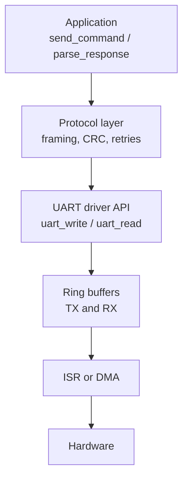
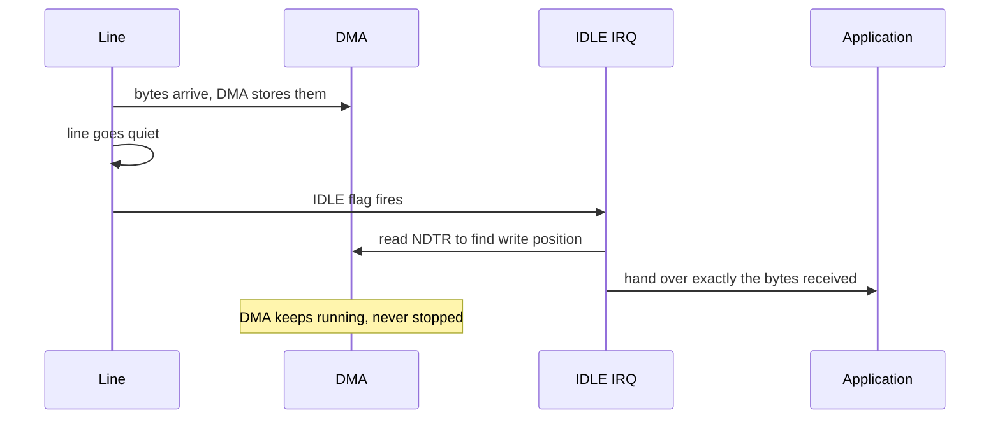

# UART — Universal Asynchronous Receiver/Transmitter

> A two-wire, full-duplex, point-to-point link with **no clock line**. Both ends agree a bit rate in advance and recover timing from the start bit of every single frame.

**Contents**
[Cheat sheet](#1-cheat-sheet) ·
[How it works](#2-how-it-actually-works) ·
[Frame format](#frame-format) ·
[Baud & sampling](#baud-rate-and-sampling) ·
[Errors](#the-four-receive-errors) ·
[Flow control](#flow-control) ·
[Registers](#3-register-level-walkthrough) ·
[Code](#4-code) ·
[Captures](#5-captures) ·
[Debugging](#6-debugging-checklist) ·
[Q&A](#7-questions-i-should-be-able-to-answer) ·
[Sources](#8-sources)

---

## 1. Cheat sheet

| Property | Value |
| :--- | :--- |
| **Wires** | 2 — TX, RX, plus common ground (3 with ground) |
| **Duplex** | Full duplex |
| **Clock** | **None.** Asynchronous — both ends pre-agree the baud rate |
| **Bit order** | **LSB first** (opposite of I2C and SPI) |
| **Idle state** | Line held HIGH |
| **Typical speeds** | 9600, 115200 baud. 1–12 Mbaud on modern MCUs |
| **Distance** | ~1 m at TTL. 15 m with RS-232, 1200 m with RS-485 |
| **Device count** | **Point to point only** — 2 devices, unless you move to RS-485 |
| **Addressing** | None. No addresses exist |
| **Error detection** | Parity bit, plus framing and noise detection |
| **Acknowledgement** | None. The sender never learns whether it arrived |
| **Flow control** | Optional — RTS/CTS hardware, or XON/XOFF in-band |

**Use it when** you need to talk to exactly one other thing: a PC, a GPS or GSM
module, a debug console, a bootloader, another board.

**Avoid it when** you need more than two devices on the wire (use I2C or RS-485),
throughput (SPI), or guaranteed delivery — UART gives you no acknowledgement at all.

### Top 5 gotchas

| # | Gotcha | Why it bites |
| :--- | :--- | :--- |
| 1 | **TX must cross to RX** | Both ends wired TX→TX gives complete silence and no error to diagnose it with |
| 2 | **No shared ground** | Signals have no return path. Sometimes it half-works, which is worse than failing |
| 3 | **Baud mismatch** | You get consistent garbage, not nothing. Looks like corruption, is actually arithmetic |
| 4 | **Overrun (`ORE`)** | Miss one byte and on many parts reception *stops entirely* until the flag is cleared |
| 5 | **Internal RC oscillator** | ±1–2% at room temperature, worse across the range. The classic "works cold, fails warm" bug |

### Key registers — STM32 USART

| Register | Bits that matter | Purpose |
| :--- | :--- | :--- |
| `CR1` | `UE`, `TE`, `RE`, `M0`/`M1`, `PCE`, `PS`, `OVER8`, `RXNEIE`, `TCIE`, `IDLEIE` | Enable, word length, parity, oversampling, interrupts |
| `CR2` | `STOP[1:0]`, `LINEN`, `CLKEN`, `SWAP`, `RXINV`, `TXINV`, `ADD` | Stop bits, LIN mode, pin swap, inversion, node address |
| `CR3` | `RTSE`, `CTSE`, `DMAT`, `DMAR`, `HDSEL`, `ONEBIT`, `EIE` | Flow control, DMA, half-duplex, sampling method |
| `BRR` | Baud rate divider | Set **before** `UE`, or after disabling it |
| `ISR` | `TXE`/`TXFNF`, `TC`, `RXNE`/`RXFNE`, `ORE`, `FE`, `NE`, `PE`, `IDLE` | Status and every error flag |
| `ICR` | `ORECF`, `FECF`, `NCF`, `PECF`, `IDLECF`, `TCCF` | Clear the flags explicitly |
| `RDR` / `TDR` | Data | Separate read and write registers |

> [!IMPORTANT]
> `TXE` and `TC` are **not** the same. `TXE` means the data register is free to accept
> the next byte. `TC` means the last bit has physically left the pin. Using `TXE` to
> decide when to disable an RS-485 driver truncates the final byte — one of the most
> common bugs in RS-485 firmware.

---

## 2. How it actually works

### The core problem

There is no clock line. The receiver has to work out where each bit is using only
its own oscillator and one edge per frame — the falling edge that starts it. Every
design decision below follows from that.

```text
   Idle          Frame                                       Idle
  ‾‾‾‾‾‾‾‾\____ ╳════╳════╳════╳════╳════╳════╳════╳ /‾‾‾‾‾‾‾‾‾
           start  D0   D1   D2   D3   D4   D5   D6   D7  stop
             │                                              │
        falling edge:                              line returns high:
      receiver starts its                          guarantees the next
        bit-time counter                        start bit is a real edge
```

The stop bit is not padding. It forces the line back to idle so the *next* falling
edge is unambiguously a start bit. Without it, a frame ending in 0 followed by
another frame would present no edge at all.

### Frame format

```text
 ┌───────┬────────────────────────────┬────────┬──────┐
 │ START │ DATA — 5 to 9 bits, LSB    │ PARITY │ STOP │
 │  (0)  │ first                      │ (opt)  │ 1/2  │
 └───────┴────────────────────────────┴────────┴──────┘
```

**"8N1"** — the near-universal default — means 8 data bits, No parity, 1 stop bit.
That is 10 bit-times per byte, so **115200 baud ≈ 11.5 kB/s**, not 14.4. Always
divide by 10, not 8, when estimating throughput.

| Field | Options | Notes |
| :--- | :--- | :--- |
| Start | Always 1 bit, always 0 | The only timing reference in the whole frame |
| Data | 5, 6, 7, 8, or 9 bits | 8 is standard. 7 appears in legacy serial. 9 is used for addressing |
| Parity | None, Even, Odd, Mark, Space | Detects single-bit errors only. Cannot correct |
| Stop | 1, 1.5, or 2 bits | 2 gives a slow receiver more time between frames |

> [!NOTE]
> **LSB first** is worth committing to memory, because I2C and SPI are both MSB
> first. Reading a logic analyzer's raw bit sequence by hand and getting a reversed
> byte is the usual symptom of forgetting this.

**Parity** is a single bit making the count of 1s in the frame even or odd. Mark
parity is always 1 and space parity always 0 — both effectively unused today, but
they exist and get asked about. Parity catches an odd number of flipped bits and
misses an even number, so it is weak. Anything that actually matters needs a CRC in
the payload.

### Baud rate and sampling

The receiver runs an internal clock at 8 or 16 times the baud rate. On the falling
edge of the start bit it starts counting, and samples each bit at its **midpoint** —
the point furthest from both edges, so timing error hurts least.

```text
  one bit time = 16 oversampling ticks

  │◄──────────── 16 ticks ────────────►│
  ├────────────────────────────────────┤
                 ▲▲▲
                 789   ← three samples, majority vote
                  │
            centre of the bit
```

Taking three samples around the centre rather than one is what produces the noise
flag: if all three do not agree, the bit was sampled during a transition or the line
is dirty, and `NE` is set.

**Why baud error accumulates.** The receiver resynchronises only on the start bit.
By the stop bit it has free-run for 9.5 bit times, so the two clocks must stay within
half a bit of each other across the whole frame:

```text
   max total error  =  0.5 bit / 9.5 bits  ≈  5.2 %
   split between two ends  →  keep each below ~2 %
```

| Total error | Result |
| ---: | :--- |
| < 2 % | Reliable |
| 2 – 3 % | Works, marginal over temperature |
| > 3 % | Framing errors, usually intermittent |
| > 5 % | Nothing works |

<details>
<summary><b>Why 11.0592 MHz crystals exist</b></summary>

Standard baud rates are awkward divisors of round clock frequencies. At 8 MHz with 16× oversampling, the divider for 115200 is 4.34 — you must round to 4, giving 8.5% error, and it will not work.

11.0592 MHz divides exactly:

```
11059200 / 16 = 691200
691200 / 9600   = 72     exact
691200 / 115200 = 6      exact
```

Zero error at every standard rate, which is why that odd-looking number is on so many boards. Modern MCUs with fractional dividers reduce the problem but do not remove it — check your actual error before blaming the cable.

</details>

> [!WARNING]
> An internal RC oscillator is typically ±1% at 25 °C and considerably worse across
> the temperature range. Combined with the other end's error you can drift past the
> limit as the board warms up — the classic "works on the bench, fails in the
> enclosure" fault. Use a crystal for anything above 9600 baud that must be reliable.

### The four receive errors

| Flag | Meaning | Usual cause |
| :--- | :--- | :--- |
| `FE` — Framing | Stop bit sampled as 0 | Baud mismatch, wrong frame config, or a break condition |
| `PE` — Parity | Parity bit did not match | Noise, or the two ends disagree on parity setting |
| `NE` — Noise | The three centre samples disagreed | Electrical noise, bad edges, long unshielded cable |
| `ORE` — Overrun | New byte completed before the previous was read | ISR too slow, interrupts disabled too long, no DMA |

> [!WARNING]
> **`ORE` is the dangerous one.** On many STM32 parts, once `ORE` is set, `RXNE` stops
> firing and reception halts until you clear it. A driver that ignores overrun does
> not lose one byte — it loses the link permanently, and the symptom is "UART worked
> for a while then stopped," which sends people looking in entirely the wrong place.

### Break condition

The line held low for longer than one full frame — longer than start + data + parity
+ stop can account for. It cannot occur naturally, so it is unambiguous, and it is
used as an out-of-band signal: bus reset, wake-up, or the sync break that opens every
LIN frame. STM32 sets `LBDF` when it detects one, and can generate one with `SBKRQ`.

### Flow control

UART has no acknowledgement, so a fast sender will simply overrun a slow receiver.
Flow control is the fix.

**Hardware — RTS/CTS.** Two extra wires, crossed like TX and RX.

```text
    Device A                    Device B
      RTS  ────────────────────►  CTS
      CTS  ◄────────────────────  RTS
      TX   ────────────────────►  RX
      RX   ◄────────────────────  TX
      GND  ─────────────────────  GND
```

`RTS` is an output meaning "I have buffer space, send to me." `CTS` is an input:
check it before transmitting. Reliable, works with binary data, costs two pins.

**Software — XON/XOFF.** The receiver sends `0x13` (XOFF) to pause and `0x11` (XON)
to resume, in the data stream itself. No extra wires — but it **corrupts binary
data**, because any payload byte that happens to equal 0x11 or 0x13 gets eaten. Fine
for text terminals, unusable for firmware transfer without escaping.

> [!TIP]
> "Works with a terminal program, fails with the real device" is very often a flow
> control mismatch. One end is waiting on `CTS` that nobody is driving, so it never
> transmits and reports no error.

### UART vs USART

The extra S is **Synchronous**. A USART peripheral can also drive a clock line and
run synchronously, which makes it usable for SPI-like modes, smartcards, and IrDA.
In asynchronous mode a USART is just a UART. On STM32, some instances are full USARTs
and some are UART-only — check the datasheet before assigning pins.

### Signalling levels

The frame format is the same in all of these. Only the electrical layer changes.

| Standard | Levels | Logic | Distance | Devices |
| :--- | :--- | :--- | ---: | ---: |
| **TTL / CMOS** | 0 V / 3.3 V or 5 V | Idle high | ~1 m | 2 |
| **RS-232** | ±3 V to ±15 V | **Inverted** — mark is negative | ~15 m | 2 |
| **RS-422** | Differential, ±2 V | — | 1200 m | 1 driver, 10 receivers |
| **RS-485** | Differential, ±1.5 V | — | 1200 m | 32+ nodes |

> [!WARNING]
> RS-232 is inverted **and** runs at up to ±15 V. Connecting a PC serial port
> directly to an MCU pin destroys the pin. A MAX3232 or equivalent does both the
> level shift and the inversion.

### Multiprocessor mode — 9-bit addressing

UART is point to point, but a 9th bit can be repurposed as an address marker, which
is how RS-485 networks give nodes identity.

- 9th bit = 1 → this frame is an **address**
- 9th bit = 0 → this frame is **data**

Receivers sit in **mute mode**, ignoring everything, and wake only on an address
match. The matching node clears mute, takes the following data frames, and returns
to mute at the end. STM32 implements this with `MME`, `WAKE` and the `ADD` field, and
can alternatively wake on an idle line rather than an address match.

### Auto-baud detection

Some peripherals can measure an incoming frame and set `BRR` themselves. STM32 offers
several modes via `ABREN`/`ABRMOD`: measuring the start bit alone, measuring a
falling-edge-to-falling-edge pair, or expecting a known character such as `0x55`.
`0x55` is chosen because its bit pattern is alternating 1s and 0s, giving the maximum
number of edges to measure against. This is how the STM32 system bootloader adapts to
whatever rate the host uses.

---

## 3. Register-level walkthrough

*Sending and receiving one byte at 115200 8N1 on an STM32 USART.*

**1 — Clocks and pins**
Enable the USART and GPIO clocks. Set TX and RX to alternate function, push-pull,
correct AF number. Unlike I2C, **push-pull is right here** — UART lines are actively
driven both directions and there are no pull-ups involved.

**2 — Baud rate**
With `UE = 0`, write `BRR`. With 16× oversampling it is simply the peripheral clock
divided by the baud rate:

```
   BRR = f_CK / baud          e.g.  16 MHz / 115200 = 138.9  →  139
```

That rounding is your error source: 16 MHz / 139 = 115107 baud, an error of 0.08%.
Fine. At 8 MHz the same sum gives 69.4 → 69, which is 115942 baud, 0.64% — still
usable but visibly worse. Always compute the error, do not assume.

**3 — Frame configuration**
`M0`/`M1` in `CR1` set word length, `PCE`/`PS` set parity, `STOP` in `CR2` sets stop
bits. Note the trap: **the parity bit is included in the word length**, so 8 data
bits *with* parity means setting the word length to 9.

**4 — Enable**
Set `TE` and `RE`, then `UE`. Enabling `TE` sends an idle frame first, which is
normal.

**5 — Transmit**
Wait for `TXE`, write the byte to `TDR`. The peripheral moves it to the shift
register and clocks it out. For the *last* byte before disabling the transmitter or
an RS-485 driver, wait for `TC`, not `TXE`.

**6 — Receive**
Wait for `RXNE`, read `RDR`. Reading it clears the flag. Check `ORE`, `FE`, `NE` and
`PE` **before** trusting the byte — on newer parts they are cleared through `ICR`, on
older ones by reading `SR` then `DR` in that order.

**7 — Errors**
Clear `ORE` promptly. Reception does not resume until you do.

> [!TIP]
> Enable `EIE` in `CR3` alongside `RXNEIE`. Error flags do not raise an interrupt on
> their own in every configuration, and silently dropped errors are exactly what
> makes UART bugs so hard to find.

---

## 4. Code

| File | Contents |
| :--- | :--- |
| [`code/bare-metal.c`](code/bare-metal.c) | Registers only, no HAL |
| [`code/hal.c`](code/hal.c) | Same behaviour through HAL, for comparison |

> [!WARNING]
> **Status: not yet written or flashed.** Nothing goes in this section until it has
> run on real hardware. Record the board, the clock source, the baud rate, and the
> measured error.

---

## 5. Captures

Screenshots live in [`captures/`](captures/), each captioned with what to look at.

- [ ] **One clean frame at 9600 8N1** — measure a bit width, confirm 104.17 µs
- [ ] **The same byte at 8N1 and 8E1** — see the parity bit appear
- [ ] **Baud mismatch** — transmit at 9600, receive at 19200, capture the framing error
- [ ] **A break condition**
- [ ] **RTS/CTS in action** — CTS deasserting mid-stream and transmission pausing
- [ ] **RS-485 DE timing**, if you have a transceiver — showing the driver held until `TC`

---

## 6. Debugging checklist

Symptom-first, so it is usable at 1am.

| Symptom | Likely cause | How to confirm |
| :--- | :--- | :--- |
| Complete silence, no bytes at all | TX→TX instead of TX→RX | Scope the pin: is anything moving at all? |
| Bytes only in one direction | One crossover right, one wrong | Swap the suspect pair and retest |
| Consistent garbage characters | Baud mismatch | Measure one bit width on a scope, invert for the actual baud |
| Occasional wrong characters | Clock accuracy, or noise | Check RC vs crystal, and cable length |
| Works cold, fails when warm | Internal RC drifting over temperature | Freeze spray or a heat gun will reproduce it in seconds |
| Received all `0x00` | Line stuck low, or a break | Scope idle level — it should sit high |
| Received all `0xFF` | Floating RX pin, nothing driving it | Check the cable, and add a pull-up if the far end is high-Z |
| Worked, then stopped forever | `ORE` set and never cleared | Read `ISR` — is the overrun flag stuck? |
| First byte lost every time | Receiver enabled too late, or RS-485 turnaround | Send a dummy byte first and see if the rest arrives |
| Last byte truncated | Driver disabled on `TXE` instead of `TC` | Capture DE against the final stop bit |
| Fine with a terminal, fails with the device | Flow control mismatch | Disable RTS/CTS on both ends and retest |
| Half-duplex bus echoes your own transmission | Normal for RS-485 and single-wire | Discard the bytes you just sent, or disable RE while sending |
| Garbage only at high baud | Baud error too large, or cable capacitance | Compute the actual error from `BRR`, do not trust the label |

<details>
<summary><b>Deducing the wrong baud rate from the garbage</b></summary>

Baud mismatch produces *consistent* wrong bytes, not random ones, because the mapping is deterministic. If a known character comes out wrong the same way every time, the two rates are in a fixed ratio.

The reliable method is faster than arithmetic: capture the line and measure the width of the narrowest pulse. That is one bit time, and its reciprocal is the actual baud rate. Compare against what you configured — you will usually find a factor of 2, or an internal RC that is nowhere near nominal.

</details>

---

## 7. Questions I should be able to answer

Cover the answer, try it from memory, then check.

<details>
<summary><b>Why does UART need a start bit if the line is already idle high?</b></summary>

It is the only timing reference in the frame. There is no clock line, so the falling edge is what tells the receiver when to start counting bit times and where the bit centres are.

</details>

<details>
<summary><b>What is the stop bit actually for?</b></summary>

It forces the line back to idle so the next start bit is guaranteed to be a real falling edge. Without it, a frame ending in 0 followed immediately by another frame would present no edge for the receiver to synchronise on.

</details>

<details>
<summary><b>How much baud rate error can you tolerate, and why that number?</b></summary>

The receiver resynchronises only on the start bit, then free-runs for about 9.5 bit times. Accumulated drift must stay under half a bit, giving roughly 5% total — split across both ends, so keep each below about 2%.

</details>

<details>
<summary><b>Why is 115200 baud not 14.4 kB/s?</b></summary>

Baud counts symbols on the wire, not payload bits. In 8N1 each byte costs 10 bit-times — start, eight data, stop — so it is about 11.5 kB/s. Add parity or a second stop bit and it drops further.

</details>

<details>
<summary><b>Difference between TXE and TC, and when does it matter?</b></summary>

`TXE` means the data register is free for the next byte. `TC` means the last bit has left the pin. It matters whenever you disable something after the final byte — an RS-485 driver enable, or the transmitter itself — because acting on `TXE` cuts the last byte off mid-flight.

</details>

<details>
<summary><b>What is an overrun error, and why is it worse than losing one byte?</b></summary>

A new byte finished arriving before the previous one was read. On many parts `ORE` then blocks `RXNE` entirely, so reception stops until the flag is cleared. Ignoring it does not cost one byte, it costs the link.

</details>

<details>
<summary><b>You receive consistent garbage. What is the first thing you check?</b></summary>

Baud rate. Consistent wrong characters mean a deterministic mismatch, not corruption. Measure the narrowest pulse on a scope — its reciprocal is the real baud rate.

</details>

<details>
<summary><b>Why is parity considered weak error detection?</b></summary>

It only detects an odd number of flipped bits, and it cannot correct anything. Two errors in one frame cancel out and pass silently. Anything that matters needs a CRC in the payload.

</details>

<details>
<summary><b>What is a break condition and how is it used?</b></summary>

The line held low longer than a complete frame, which cannot happen in normal data. Because it is unambiguous, it works as an out-of-band signal — bus reset, wake-up, or the sync break at the start of every LIN frame.

</details>

<details>
<summary><b>RTS/CTS versus XON/XOFF — which and why?</b></summary>

RTS/CTS is out of band, works with arbitrary binary data, and costs two pins. XON/XOFF needs no extra wires but consumes 0x11 and 0x13 from the data stream, so it corrupts binary payloads unless you escape them. Use hardware flow control for firmware transfer.

</details>

<details>
<summary><b>Can you put three devices on one UART?</b></summary>

Not on plain UART — it is point to point. Move to RS-485, which is multi-drop, and use 9-bit addressing with mute mode so nodes only wake for frames addressed to them.

</details>

<details>
<summary><b>What is the difference between UART and USART?</b></summary>

A USART can additionally run synchronously with a clock line, which enables SPI-like modes, smartcard and IrDA. In asynchronous mode it behaves as an ordinary UART.

</details>

<details>
<summary><b>Why does 0x55 keep appearing in auto-baud and sync fields?</b></summary>

Its bit pattern alternates 1 and 0, so it presents the maximum number of edges in one frame. That gives the receiver the most timing information to measure a bit period from.

</details>

<details>
<summary><b>Why is LSB first worth remembering?</b></summary>

Because I2C and SPI are MSB first. Reading raw bits off a capture with the wrong assumption gives you a bit-reversed byte, and the resulting confusion looks like a data corruption problem rather than a reading error.

</details>

---

## 8. Sources

| Document | Use it for |
| :--- | :--- |
| STM32 reference manual, USART chapter | Register detail for your specific part |
| ST **AN4991** / USART application notes | DMA patterns, idle-line detection |
| **TIA/EIA-232-F** | RS-232 levels and handshake lines |
| **TIA/EIA-485-A** | RS-485 differential signalling, loading, termination |
| **ISO 17987** | LIN specification |
| The part's **errata sheet** | Several families have documented USART quirks |

---

## 9. Electrical characteristics

TTL/CMOS UART is a plain push-pull digital signal, so the interesting numbers are the
ones that decide whether two boards can talk.

| Parameter | Typical | Notes |
| :--- | :--- | :--- |
| Logic high out | VDD − 0.4 V | Actively driven, unlike I2C |
| Logic low out | 0.4 V | |
| Input high threshold | ~0.7 × VDD | 3.3 V part needs 2.31 V |
| Input low threshold | ~0.3 × VDD | |
| Idle level | High | A floating RX pin reads as idle, which is why it looks "connected" |
| Drive current | 4–20 mA | Enough for short traces only |
| Practical distance | ~1 m | Beyond that, use a transceiver |

**5 V to 3.3 V.** A 5 V transmitter into a 3.3 V RX pin exceeds the absolute maximum
on most parts. A resistor divider (e.g. 1 kΩ / 2 kΩ) works for slow rates; above
about 115200 the RC time constant starts rounding edges, and you want a proper level
shifter. In the other direction, 3.3 V into a 5 V receiver usually works because
0.7 × 5 = 3.5 V is marginal but many 5 V parts have lower thresholds — "usually" is
doing heavy lifting there, so check the datasheet rather than hoping.

**A floating RX pin reads high**, which is indistinguishable from a healthy idle
line. That is why an unplugged cable produces silence rather than an error, and why
enabling a pull-up on RX is a cheap way to make a disconnection behave predictably.

---

## 10. Baud rate arithmetic

The number that matters is not the baud rate, it is the **error** between what you
asked for and what the divider actually produces.

```
    BRR   = round( f_CK / baud )                  (16× oversampling)
    real  = f_CK / BRR
    error = (real − baud) / baud × 100 %
```

| f_CK | Baud | BRR | Actual | Error |
| ---: | ---: | ---: | ---: | ---: |
| 16 MHz | 9600 | 1667 | 9598 | 0.02 % |
| 16 MHz | 115200 | 139 | 115108 | 0.08 % |
| 8 MHz | 115200 | 69 | 115942 | 0.64 % |
| 8 MHz | 921600 | 9 | 888889 | 3.55 % ✗ |
| 11.0592 MHz | 115200 | 96 | 115200 | 0.00 % |

**8× oversampling** (`OVER8 = 1`) doubles the maximum achievable baud rate for a given
clock, at the cost of sampling accuracy — three samples now sit closer to the bit
edges, so noise tolerance drops. Use it only when you need the speed.

**`ONEBIT` in `CR3`** switches from three-sample majority voting to a single centre
sample. It slightly improves tolerance to clock deviation and slightly worsens noise
immunity. Leave it off unless you have a specific reason.

> [!TIP]
> Compute and record the actual error for every baud rate your product uses, at every
> clock configuration. A rate that is fine at 16 MHz can be unusable after someone
> switches the board to the internal 8 MHz RC to save power.

---

## 11. Error handling and recovery

UART fails more quietly than I2C — there is no ACK, so a transmitter never learns
anything went wrong. All the recovery logic lives on the receive side.

**Handle errors before data, every time.**

```c
uint32_t isr = USART1->ISR;

if (isr & (USART_ISR_ORE | USART_ISR_FE | USART_ISR_NE | USART_ISR_PE)) {
    USART1->ICR = USART_ICR_ORECF | USART_ICR_FECF
                | USART_ICR_NECF  | USART_ICR_PECF;   /* clear first */
    (void)USART1->RDR;                                /* discard the bad byte */
    stats.rx_errors++;                                /* count, do not ignore */
    resync();                                         /* drop the partial frame */
    return;
}

if (isr & USART_ISR_RXNE) {
    ring_push(USART1->RDR);
}
```

**Recovery ladder**

| Step | Action | Use when |
| ---: | :--- | :--- |
| 1 | **Clear the flag, discard the byte** | Single `FE`, `NE` or `PE` |
| 2 | **Resynchronise the protocol** — drop to the next frame delimiter | Any error mid-packet |
| 3 | **Flush the RX ring buffer** | Repeated errors, buffer likely holds garbage |
| 4 | **Disable and re-enable `RE`** | `ORE` storm, receiver wedged |
| 5 | **Reinitialise the peripheral** | Flags will not clear |
| 6 | **Reconsider the baud rate or wiring** | Errors are constant, not occasional |

> [!IMPORTANT]
> Always **count** errors rather than silently discarding them. A link running at one
> framing error an hour is a link that will fail in the field, and the counter is the
> only thing that will tell you before it does.

**Framing your protocol.** Because UART delivers a byte stream with no packet
boundaries, the protocol on top has to supply them. Three standard approaches:

| Method | How | Trade-off |
| :--- | :--- | :--- |
| Delimiter | A reserved byte such as `\n` or `0x7E` marks the end | Needs escaping for binary payloads |
| Length prefix | First bytes say how many follow | One corrupted length byte desynchronises everything |
| Idle gap | A quiet period ends the frame | Free with the idle-line interrupt, but timing dependent |

Whichever you choose, **add a CRC**. Parity catches almost nothing, and the peripheral
gives you no integrity guarantee at all.

---

## 12. Driver architecture

### Layering



The ring buffers are the important layer. They decouple the interrupt, which must be
fast, from the application, which cannot be.

### API shape

```c
typedef enum {
    UART_OK = 0,
    UART_ERR_TIMEOUT,
    UART_ERR_OVERRUN,
    UART_ERR_FRAMING,
    UART_ERR_PARITY,
    UART_ERR_BUFFER_FULL
} uart_status_t;

uart_status_t uart_init(uint32_t baud, uart_config_t cfg);
uart_status_t uart_write(const uint8_t *data, uint16_t len);   /* buffered, returns immediately */
uint16_t      uart_read(uint8_t *data, uint16_t max_len);      /* whatever is available */
uint16_t      uart_available(void);
void          uart_flush_rx(void);
uart_status_t uart_write_blocking(const uint8_t *d, uint16_t len, uint32_t timeout_ms);
```

`uart_write` queues and returns. Only the blocking variant waits, and it takes a
timeout — a UART write that can block forever will eventually hang your product.

### Polling vs interrupt vs DMA

| | Polling | Interrupt | DMA |
| :--- | :--- | :--- | :--- |
| CPU cost | Blocks entirely | One ISR per byte | Almost none |
| Max practical rate | Low | ~1 Mbaud, depending on core | Many Mbaud |
| Overrun risk | Very high | Moderate under load | Very low |
| Complexity | Trivial | Ring buffers needed | Highest |
| Good for | Early bring-up, `printf` debug | Most applications | High rate, long packets, low-power |

At 115200 baud a byte arrives every 87 µs. That is comfortable for an ISR. At
921600 it is 11 µs, and any other interrupt holding the core for that long costs you
a byte — which is where DMA stops being optional.

---

## 13. Ring buffers

The data structure UART drivers live or die by, and a very common interview exercise
in its own right.

```c
#define RB_SIZE 256                       /* power of two: mask instead of modulo */

typedef struct {
    uint8_t  buf[RB_SIZE];
    volatile uint16_t head;               /* written by producer */
    volatile uint16_t tail;               /* written by consumer */
} ring_t;

static inline bool rb_push(ring_t *r, uint8_t b) {      /* called from ISR */
    uint16_t next = (r->head + 1) & (RB_SIZE - 1);
    if (next == r->tail) return false;                  /* full — drop, do not overwrite */
    r->buf[r->head] = b;
    r->head = next;
    return true;
}

static inline bool rb_pop(ring_t *r, uint8_t *b) {      /* called from main loop */
    if (r->head == r->tail) return false;               /* empty */
    *b = r->buf[r->tail];
    r->tail = (r->tail + 1) & (RB_SIZE - 1);
    return true;
}
```

**Why this specific shape**

| Choice | Reason |
| :--- | :--- |
| Power-of-two size | `& (SIZE-1)` replaces `%`, which matters inside an ISR |
| One slot sacrificed | `head == tail` means empty, so full is `next == tail`. No separate count to update atomically |
| `volatile` on indices | The compiler must not cache them across the ISR boundary |
| ISR only writes `head`, main only writes `tail` | Single producer, single consumer — **no lock needed** |
| Drop on full, never overwrite | Losing the newest byte is recoverable; corrupting the buffer is not |

> [!WARNING]
> The lock-free property holds **only** for one producer and one consumer. Two tasks
> both calling `uart_write` need a mutex, or a per-task queue feeding a single writer.

**Sizing.** Big enough to cover your worst-case service latency. At 115200 baud you
receive ~11.5 bytes per millisecond, so a 256-byte buffer tolerates about 22 ms of
inattention. Work out your longest interrupt-disabled period and size from that, then
add margin.

**TX side.** Same structure in reverse: `uart_write` pushes and enables the TXE
interrupt; the ISR pops and writes `TDR`; when the buffer empties, the ISR disables
its own interrupt. Forgetting that last step gives you an interrupt storm on an empty
buffer.

---

## 14. DMA and idle-line detection

The standard robust STM32 receive pattern, and a strong thing to be able to describe.

**The problem DMA alone does not solve:** DMA needs to know how many bytes to expect,
but incoming packets are variable length. You do not want to wait for a full buffer.

**The solution:** circular DMA into a buffer, plus the **IDLE line interrupt**, which
fires when the line goes quiet for one frame after data.



```c
void USART1_IRQHandler(void) {
    if (USART1->ISR & USART_ISR_IDLE) {
        USART1->ICR = USART_ICR_IDLECF;

        /* NDTR counts down from the buffer size */
        uint16_t pos = RX_BUF_SIZE - DMA1_Channel5->CNDTR;

        if (pos != old_pos) {
            if (pos > old_pos) {
                process(&rx_buf[old_pos], pos - old_pos);
            } else {                                   /* wrapped */
                process(&rx_buf[old_pos], RX_BUF_SIZE - old_pos);
                if (pos > 0) process(&rx_buf[0], pos);
            }
            old_pos = pos;
        }
    }
}
```

**Why this is the right answer**

- Zero CPU cost per byte, so overrun becomes almost impossible
- Handles variable-length packets naturally, with no length field required
- The DMA never stops or restarts, so there is no window where bytes are lost
- Works down to low-power modes where per-byte interrupts would not

Add the half-transfer and transfer-complete interrupts as well if packets can be
longer than half the buffer, so you drain it before the DMA laps you.

---

## 15. RS-485

How UART becomes a multi-drop industrial bus. Expect this anywhere near Modbus,
building automation, or motor control.

**Differential signalling.** Two wires, A and B, carrying opposite polarities. The
receiver looks at the *difference*, so noise picked up equally by both wires cancels
out. That is what buys 1200 m where TTL manages one.

| Property | Value |
| :--- | :--- |
| Signalling | Differential, ±1.5 V minimum driver output |
| Nodes | 32 standard unit loads, 256 with modern transceivers |
| Distance | 1200 m at 100 kbaud, less as speed rises |
| Duplex | Half (2-wire) or full (4-wire) |
| Termination | 120 Ω at **both** physical ends, nowhere else |
| Topology | Daisy chain. **Not** a star — stubs cause reflections |

**Driver enable is where the bugs are.** On a 2-wire bus only one node may drive at a
time, so the transceiver's DE pin must be raised before transmitting and dropped
after — and "after" means after the last stop bit has physically left the pin.

```c
de_high();                                  /* take the bus */
for (i = 0; i < len; i++) {
    while (!(USART1->ISR & USART_ISR_TXE));
    USART1->TDR = data[i];
}
while (!(USART1->ISR & USART_ISR_TC));      /* ← TC, not TXE */
de_low();                                   /* release */
```

> [!WARNING]
> Dropping DE on `TXE` truncates the final byte, because `TXE` only means the data
> register is free — the shift register is still clocking bits out. This is *the*
> classic RS-485 bug, and the symptom is a last byte that is intermittently wrong.
> Better still, use the peripheral's hardware DE (`DEM` in `CR3`), which handles the
> assertion and de-assertion timing for you.

**Fail-safe biasing.** When no node is driving, the bus floats and receivers output
random data. Pull-up on A and pull-down on B (typically 560 Ω–1 kΩ) hold the idle
state at a valid level. Many transceivers now include internal fail-safe, but on
older parts this is a required external addition.

**Echo.** On a 2-wire bus you receive your own transmission. Either disable RE while
driving, or discard exactly the bytes you just sent — the second is often preferable
because it doubles as a collision check.

**Modbus RTU** is the protocol you will most often meet on top: 8N1 or 8E1, address
byte, function code, data, CRC-16, and frames delimited by a 3.5-character idle gap —
which is precisely what the idle-line interrupt was made for.

---

## 16. RS-232 and the handshake lines

Largely legacy, still asked about, and still what a DB9 connector on a piece of test
equipment means.

| Signal | Direction (DTE) | Purpose |
| :--- | :--- | :--- |
| TXD | Out | Data out |
| RXD | In | Data in |
| RTS | Out | Ready to receive (modern usage) |
| CTS | In | Far end ready to receive |
| DTR | Out | Terminal is present and ready |
| DSR | In | Far end is present and ready |
| DCD | In | Carrier detected — modem heritage |
| RI | In | Ring indicator — modem heritage |
| GND | — | Signal ground |

**Levels are inverted and large:** a logic 1 (mark) is −3 to −15 V, a logic 0 (space)
is +3 to +15 V. Between −3 V and +3 V is undefined. A MAX3232 handles both the
inversion and the level translation, and needs its charge-pump capacitors fitted
correctly or the negative rail never comes up.

**DTE versus DCE** decides whether you need a straight cable or a null modem. A null
modem crosses TX/RX and the handshake pairs, which is exactly what you are doing by
hand whenever you cross TX and RX between two MCU boards.

---

## 17. LIN

Automotive single-wire UART, worth knowing because STM32 has a dedicated mode for it
and because it demonstrates every UART feature at once.

```text
 ┌───────────┬──────────┬─────┬───────────────┬──────────┐
 │  BREAK    │  SYNC    │ PID │  DATA 1..8    │ CHECKSUM │
 │  ≥13 bits │  0x55    │     │               │          │
 └───────────┴──────────┴─────┴───────────────┴──────────┘
   controller sends ──────────────►    responder may supply data
```

- **Break** of at least 13 dominant bits — impossible in normal data, so it
  unambiguously starts a frame
- **Sync** is `0x55`, chosen for its alternating edges so responders can auto-baud
- **PID** is a 6-bit identifier plus 2 parity bits
- Single wire, 12 V, up to 20 kbaud, one controller and up to 16 responders
- Deliberately cheap — used for mirrors, seats, window motors, where CAN is overkill

---

## 18. Board-level failure modes

**No common ground.** The most frequent cross-board failure. TX and RX carry no
return path of their own, so without a shared ground the levels float relative to
each other. Sometimes it half-works through some other coupling path, which wastes
hours.

**Ground loops.** Two mains-powered devices with grounds at slightly different
potentials push current along the signal ground. Symptoms are noise-related errors
that come and go with what else is switched on. Fixes: a single ground reference, or
galvanic isolation with an isolated transceiver or optocouplers.

**Cable length at TTL levels.** Beyond about a metre, capacitance rounds the edges
and noise pickup rises. If the cable leaves the board, use a transceiver — RS-232 for
point to point, RS-485 for distance or multi-drop.

**ESD on exposed connectors.** Any UART reaching a user-accessible connector needs
TVS protection. MCU pins do not survive a finger.

**5 V transmitters into 3.3 V pins.** Exceeds absolute maximum ratings. Works right
up until the pin dies, often weeks later.

**Shared TX on a half-duplex bus with no arbitration.** Two nodes transmitting
simultaneously on RS-485 fight, and unlike I2C there is no arbitration to resolve it
gracefully. The protocol layer has to prevent it, usually with a strict
controller-polls-responders discipline.

---

## 19. UART vs I2C vs SPI

| | UART | I2C | SPI |
| :--- | :--- | :--- | :--- |
| Wires | 2 | 2 | 3 + 1 CS per device |
| Clock | None — pre-agreed baud | Shared, from controller | Shared, from controller |
| Duplex | Full | Half | Full |
| Bit order | LSB first | MSB first | MSB first (usually) |
| Typical speed | 9.6–115.2 kbaud | 100–400 kHz | 1–50 MHz |
| Devices | 2 only | Many, by address | Many, by chip select |
| Addressing | None | 7-bit in-band | Dedicated pin |
| Acknowledgement | None | Per byte | None |
| Error detection | Parity, framing, noise | None built in | None |
| Distance | Metres (more with 485) | Same board | Same board |
| Best at | Talking to another board or a PC | Many slow chips, few pins | Throughput |

**Answering "which would you pick":** state the constraint first, then the cost.
Another board or a PC → UART, and note it is point to point with no acknowledgement.
Many slow sensors on one board → I2C, and note the speed ceiling. A display buffer or
an SD card → SPI, and note the pin cost.

---

## 20. Bootloading over UART

The most common real use of UART in production firmware, and a good thing to have an
opinion about.

**The STM32 built-in system bootloader.** Every STM32 ships with a ROM bootloader.
Hold BOOT0 high at reset, and it listens on a specific USART. The host sends `0x7F`,
the bootloader auto-bauds from that pattern, and a documented command set follows —
get version, read memory, write memory, erase, go. This is how a factory programs a
board with no debugger attached.

**Your own bootloader** typically layers a file transfer protocol on top:

| Protocol | Block size | Integrity | Notes |
| :--- | ---: | :--- | :--- |
| XMODEM | 128 B | Checksum | Simple, everywhere, slow |
| XMODEM-CRC | 128 B | CRC-16 | Preferred over plain checksum |
| YMODEM | 1024 B | CRC-16 | Adds filename and size, much faster |
| Custom | Whatever | CRC-32 | Fine, if you also handle resync and timeouts |

**Things that must be right**

- **Verify before jumping.** CRC the whole image in flash, not just each block on
  arrival.
- **Keep a rollback.** Dual-bank, or a known-good golden image, so a failed update
  does not brick the unit.
- **Time out into the application.** A bootloader that waits forever for a host that
  never comes is a dead product.
- **Do not trust the length field.** A corrupted size can make you erase past the
  application region.

---

## 21. Testing a UART driver

**Loopback first.** Wire TX to RX on the same board. You get a working link with no
second device, and it proves the peripheral, clocks, pins and buffers before anyone
else is involved. Some parts also have an internal loopback mode.

**Fault injection**

| Fault | How to cause it deliberately |
| :--- | :--- |
| Framing error | Configure the two ends at different baud rates |
| Parity error | 8E1 on one end, 8O1 on the other |
| Overrun | Send at full rate with the RX interrupt disabled |
| Break | Hold TX low longer than one frame |
| Noise | Touch the line, or run it alongside a switching supply |
| Buffer full | Send faster than the application drains |
| Truncated last byte | Deliberately drop RS-485 DE on `TXE` and capture it |

**Soak testing.** Loop a known pattern for hours and count errors by type. A link at
one framing error per hour is broken; you just have not noticed yet.

**Stress the ring buffer.** Burst more than the buffer holds and confirm the driver
drops cleanly rather than corrupting. Then confirm it recovers once the burst ends.

**What to say in an interview:** the happy path proves nothing. The tests that matter
are the ones that force `ORE`, force a framing error, and confirm the driver both
counts them and keeps running.

---

### Additions for section 7 — Q&A

<details>
<summary><b>Why is a ring buffer index made volatile, and why is no lock needed?</b></summary>

`volatile` stops the compiler caching an index that the ISR modifies. No lock is needed because the ISR only ever writes `head` and the main loop only ever writes `tail` — single producer, single consumer. Add a second writer on either side and the property is gone.

</details>

<details>
<summary><b>Why size a ring buffer as a power of two?</b></summary>

So the wrap is `& (SIZE - 1)` instead of `%`. Division is expensive, and this runs inside an interrupt on every byte.

</details>

<details>
<summary><b>How do you receive variable-length packets efficiently on STM32?</b></summary>

Circular DMA plus the idle-line interrupt. DMA stores bytes with no CPU cost, the IDLE flag fires when the line goes quiet, and reading `CNDTR` tells you how far the DMA got — so you know exactly how many bytes arrived without any length field.

</details>

<details>
<summary><b>Why must RS-485 DE be dropped on TC rather than TXE?</b></summary>

`TXE` only means the data register is free; the shift register is still clocking out the last byte. Releasing the driver then cuts the final byte off mid-transmission.

</details>

<details>
<summary><b>What does fail-safe biasing do on RS-485?</b></summary>

Holds the bus at a valid idle level when no node is driving. Without it the lines float and receivers emit random bytes. A pull-up on A and pull-down on B, typically 560 Ω to 1 kΩ.

</details>

<details>
<summary><b>Where do you terminate an RS-485 bus?</b></summary>

120 Ω at the two physical ends of the daisy chain and nowhere else. Terminating in the middle, or wiring a star topology, causes reflections.

</details>

<details>
<summary><b>How do you find packet boundaries in a UART byte stream?</b></summary>

The protocol has to supply them — a delimiter byte with escaping, a length prefix, or an idle gap. Modbus RTU uses the third, a 3.5-character silence, which maps directly onto the idle-line interrupt. Whichever you pick, add a CRC.

</details>

<details>
<summary><b>Two boards, UART wired correctly, still nothing works. What is left?</b></summary>

Common ground. TX and RX have no return path of their own, so without a shared ground reference the levels float relative to each other and behaviour is undefined.

</details>

<details>
<summary><b>How does the STM32 system bootloader know what baud rate to use?</b></summary>

It auto-bauds from the host's initial `0x7F` byte, whose bit pattern gives enough edges to measure a bit period. That is why no rate needs configuring in advance.

</details>

<details>
<summary><b>When does interrupt-per-byte stop being viable?</b></summary>

Around 1 Mbaud, where a byte arrives roughly every 10 µs. Any other interrupt holding the core that long costs you a byte and sets `ORE`. Past that point, use DMA.

</details>
