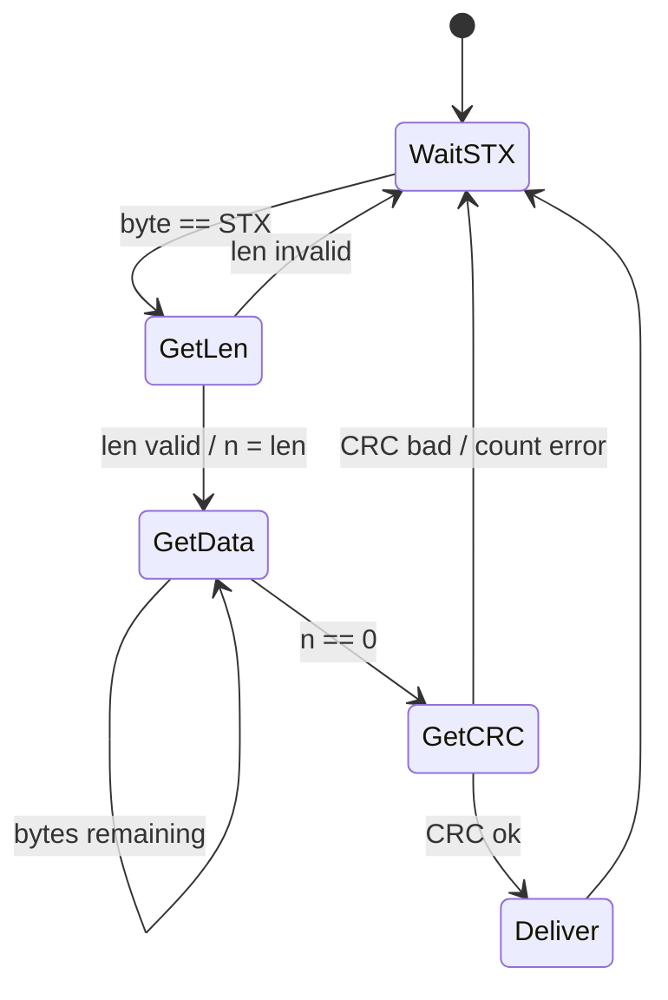
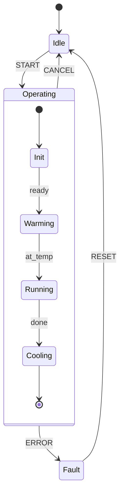
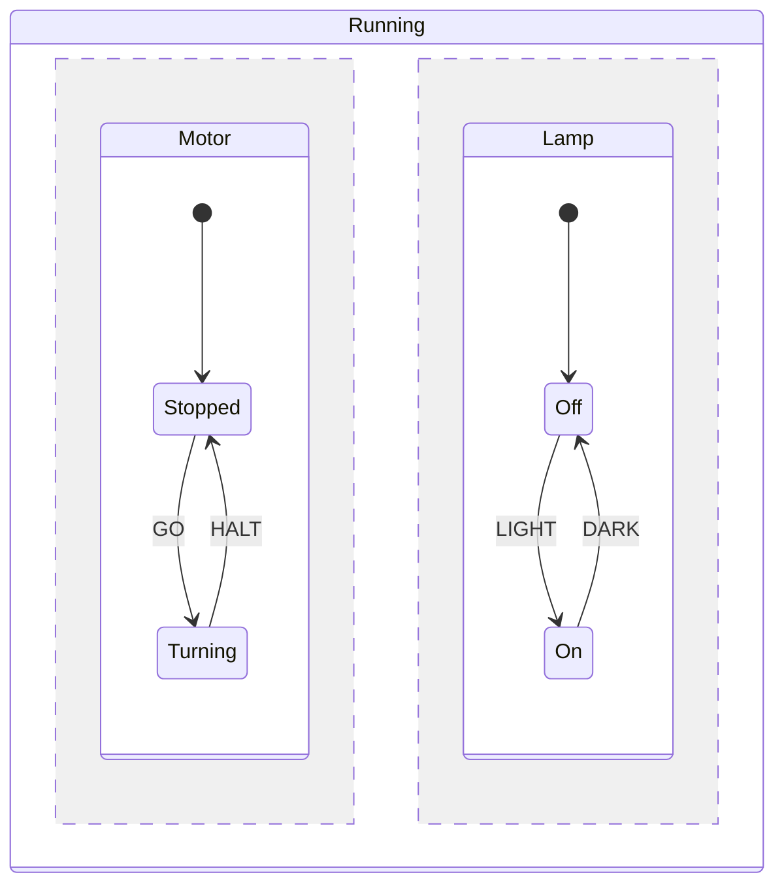
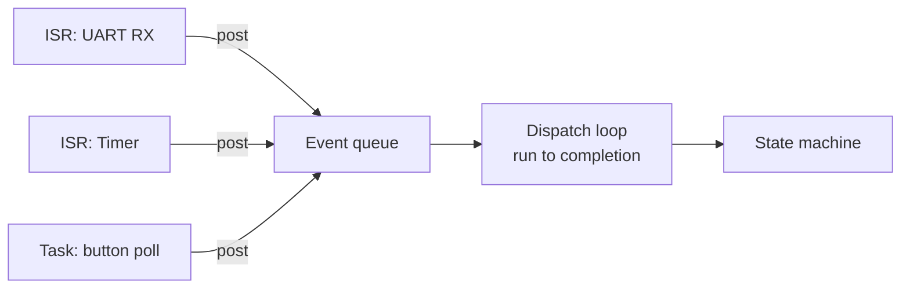
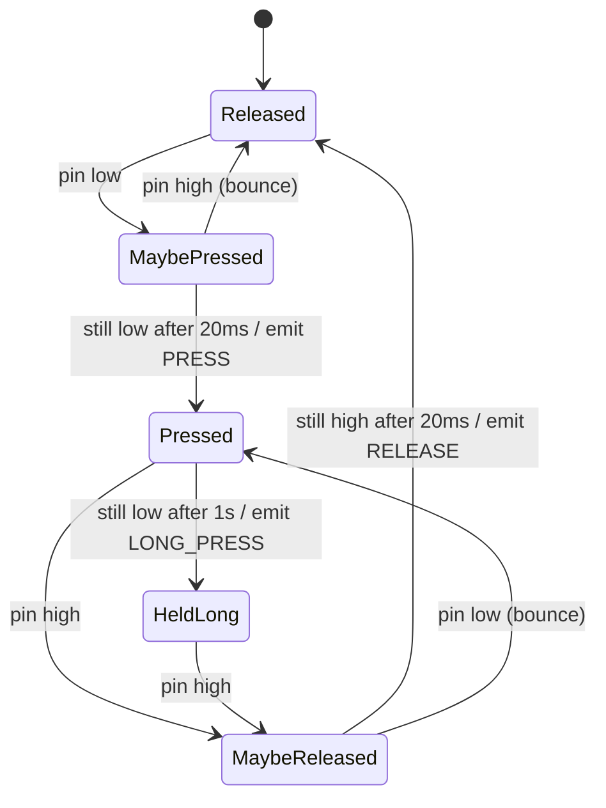

# State Machines and Statecharts

> The pattern that replaces boolean flag soup. If you have ever written `if (initialised && !busy && got_header && !error)` and then found a combination you had not considered, this is the tool you were missing.

**Contents**
[Cheat sheet](#1-cheat-sheet) ·
[Fundamentals](#2-fundamentals) ·
[Moore vs Mealy](#moore-vs-mealy) ·
[When to use](#3-when-to-use-one--and-when-not-to) ·
[Implementations](#4-the-five-implementations) ·
[Hierarchical](#5-hierarchical-state-machines) ·
[Events](#6-events-queues-and-run-to-completion) ·
[Timers](#7-timers-in-state-machines) ·
[Worked examples](#8-worked-examples) ·
[Anti-patterns](#9-anti-patterns) ·
[Testing](#10-testing-a-state-machine) ·
[Code to read](#11-real-code-worth-reading) ·
[Tools](#12-code-generation-and-tooling) ·
[Q&A](#13-questions-i-should-be-able-to-answer)

---

## 1. Cheat sheet

| Term | Meaning |
| :--- | :--- |
| **State** | A condition in which the system waits, and in which behaviour is well defined |
| **Event** | Something that happens: a byte arrives, a timer expires, a pin changes |
| **Transition** | State A + Event → State B |
| **Action** | Code run because of a transition, or on entering/leaving a state |
| **Guard** | A boolean condition that must hold for a transition to be taken |
| **Entry / exit action** | Runs on every entry to / exit from a state, whichever transition caused it |
| **Run-to-completion** | One event is fully processed before the next is dequeued |
| **Determinism** | For any (state, event) pair, exactly one transition applies |

| Variant | Characteristic |
| :--- | :--- |
| **FSM (flat)** | One level of states. Simple, explodes combinatorially |
| **Moore** | Output depends only on the current state |
| **Mealy** | Output depends on state **and** event |
| **HSM / statechart** | Nested states, inheritance of transitions. Solves state explosion |
| **Orthogonal regions** | Concurrent independent sub-machines inside one state |
| **Pushdown automaton** | FSM plus a stack — needed for nested grammars |

### Top 5 gotchas

| # | Gotcha | Why it bites |
| :--- | :--- | :--- |
| 1 | **State kept in more than one variable** | If `state`, `is_busy` and `have_header` all exist, you have not built an FSM |
| 2 | **Blocking inside a state** | The machine stops accepting events. Use a state per wait, never a delay |
| 3 | **No default case** | An unexpected event lands in an undefined state and behaviour is silent and wrong |
| 4 | **Long work inside a transition** | Delays every other event. Transitions should be short and non-blocking |
| 5 | **Events arriving during processing** | Without a queue and run-to-completion, the machine mutates underneath itself |

---

## 2. Fundamentals

A state machine is a formal claim: **the system is in exactly one state at a time, and
what happens next depends only on that state and the next event.** That single constraint
is what makes the behaviour enumerable, testable, and reviewable.

### The three representations

The same machine, three ways. All are useful, for different reasons.

**State diagram** — best for humans, best in a design review.



**State transition table** — best for completeness. Every cell must be filled, which is
precisely how you discover the cases you had not thought about.

| State \ Event | `BYTE=STX` | `BYTE=other` | `TIMEOUT` |
| :--- | :--- | :--- | :--- |
| `WAIT_STX` | → `GET_LEN` | ignore | ignore |
| `GET_LEN` | → `GET_LEN` * | → `GET_DATA` | → `WAIT_STX` |
| `GET_DATA` | store | store | → `WAIT_STX` |
| `GET_CRC` | check | check | → `WAIT_STX` |

\* A STX inside a length field is ambiguous — the table forces you to decide, rather than
discovering the ambiguity in the field.

**Code** — the executable form, covered in section 4.

> [!TIP]
> Draw the diagram first, then fill in the table, then write the code. Most FSM bugs are
> missing table cells, and you cannot see a missing cell in code — only an absent `case`
> you were never going to notice.

### Moore vs Mealy

| | Moore | Mealy |
| :--- | :--- | :--- |
| Output depends on | Current state only | Current state **and** event |
| Output attached to | States | Transitions |
| Typical state count | More | Fewer |
| Reasoning | Easier — "in this state, the output is X" | Harder, but more compact |
| Reacts | On the next clock/state change | Immediately on the event |

```text
   MOORE                              MEALY
   ┌─────────────┐                    ┌─────────────┐
   │ HEATING     │                    │  IDLE       │
   │ entry: on() │                    └─────────────┘
   └─────────────┘                          │ temp_low / heater_on()
         ▲                                  ▼
         │ temp_low                   ┌─────────────┐
   ┌─────────────┐                    │  HEATING    │
   │ IDLE        │                    └─────────────┘
   │ entry: off()│
   └─────────────┘
```

**In practice you use both.** UML statecharts — and every serious embedded FSM — support
entry/exit actions (Moore-flavoured) *and* transition actions (Mealy-flavoured). The useful
rule:

- **Entry/exit actions** for anything that must pair up: acquire/release, enable/disable,
  start timer/stop timer. They run no matter which transition brought you here, so they
  cannot be forgotten on a path you did not think about.
- **Transition actions** for work specific to that one edge.

That rule alone eliminates a large class of resource-leak bugs.

---

## 3. When to use one — and when not to

**Use a state machine when**

- Behaviour depends on history, not just current inputs
- You catch yourself adding a third or fourth boolean flag
- The same input means different things at different times
- You need to prove all cases are handled — certification, safety, review
- The problem is naturally described as a protocol, a sequence, or a mode

**Do not use one when**

- The logic is genuinely stateless — a pure calculation
- There are two states and one transition. `if (on)` is fine
- The state space is unbounded — you need a parser with a stack, not an FSM
- Real concurrency is required, with genuinely simultaneous activity rather than
  interleaved events. Use tasks, and give each one a state machine if it needs one

**The flag-soup smell test.** If your code contains variables like these, they *are* your
state — just encoded badly:

```c
bool initialised, busy, header_received, in_error, waiting_for_ack;
/* 2^5 = 32 combinations. How many are legal? Which ones did you test? */
```

Five booleans give 32 combinations, of which perhaps six are reachable and legal. The other
26 are bugs waiting for the right timing. One `enum state` makes the six explicit and the
other 26 unrepresentable.

---

## 4. The five implementations

The same protocol parser, five ways, so they are directly comparable.

**The problem:** parse `[STX][LEN][DATA×LEN][CRC]` from a byte stream.

```c
typedef enum { S_WAIT_STX, S_GET_LEN, S_GET_DATA, S_GET_CRC, S_COUNT } state_t;
typedef enum { E_BYTE, E_TIMEOUT, E_COUNT } event_id_t;

typedef struct { event_id_t id; uint8_t byte; } event_t;
```

### 4.1 Nested switch

The default, and correct for small machines.

```c
static state_t state = S_WAIT_STX;
static uint8_t buf[256], idx, len;

void parser_dispatch(const event_t *e) {
    switch (state) {

    case S_WAIT_STX:
        if (e->id == E_BYTE && e->byte == STX) {
            idx = 0;
            state = S_GET_LEN;
        }
        break;

    case S_GET_LEN:
        if (e->id == E_TIMEOUT)      { state = S_WAIT_STX; }
        else if (e->byte == 0 ||
                 e->byte > MAX_LEN)  { state = S_WAIT_STX; stats.bad_len++; }
        else                         { len = e->byte; state = S_GET_DATA; }
        break;

    case S_GET_DATA:
        if (e->id == E_TIMEOUT)      { state = S_WAIT_STX; break; }
        buf[idx++] = e->byte;
        if (idx == len) state = S_GET_CRC;
        break;

    case S_GET_CRC:
        if (e->id == E_TIMEOUT)      { state = S_WAIT_STX; break; }
        if (crc8(buf, len) == e->byte) deliver(buf, len);
        else                           stats.bad_crc++;
        state = S_WAIT_STX;
        break;

    default:                          /* never omit this */
        state = S_WAIT_STX;
        break;
    }
}
```

| | |
| :--- | :--- |
| **Good** | No indirection, debugger-friendly, zero framework, fast |
| **Bad** | Grows badly past ~10 states. Entry/exit actions must be written by hand on every path. The structure is invisible — you cannot see the machine, only the code |
| **Use for** | Under 10 states, no hierarchy, one author |

### 4.2 State transition table

The structure becomes data, which means it can be reviewed, generated, and checked for
completeness by a tool.

```c
typedef struct {
    state_t     next;
    void      (*action)(const event_t *e);
} transition_t;

static const transition_t table[S_COUNT][E_COUNT] = {
  /*                E_BYTE                     E_TIMEOUT                */
  [S_WAIT_STX] = { {S_GET_LEN,  act_start},   {S_WAIT_STX, NULL}       },
  [S_GET_LEN]  = { {S_GET_DATA, act_setlen},  {S_WAIT_STX, act_reset}  },
  [S_GET_DATA] = { {S_GET_DATA, act_store},   {S_WAIT_STX, act_reset}  },
  [S_GET_CRC]  = { {S_WAIT_STX, act_check},   {S_WAIT_STX, act_reset}  },
};

void parser_dispatch(const event_t *e) {
    const transition_t *t = &table[state][e->id];
    if (t->action) t->action(e);
    state = t->next;
}
```

| | |
| :--- | :--- |
| **Good** | The machine is visible as data. O(1) dispatch. A missing cell is a compile-time hole you can grep for. Trivially generated from a model |
| **Bad** | Memory is `states × events` even when sparse. Conditional transitions need guards bolted on. Actions become many tiny functions, which can obscure flow |
| **Use for** | Many states with a uniform event set, generated code, anything requiring completeness evidence |

**For sparse machines**, use a transition list rather than a matrix:

```c
typedef struct {
    state_t     from;
    event_id_t  on;
    bool      (*guard)(const event_t *);
    void      (*action)(const event_t *);
    state_t     to;
} rule_t;

static const rule_t rules[] = {
    { S_WAIT_STX, E_BYTE, is_stx,       act_start,  S_GET_LEN  },
    { S_GET_LEN,  E_BYTE, len_valid,    act_setlen, S_GET_DATA },
    { S_GET_LEN,  E_BYTE, NULL,         act_badlen, S_WAIT_STX },  /* fallback, order matters */
    ...
};
```

Search top to bottom, take the first match whose guard passes. Memory is proportional to
actual transitions, and guards fit naturally. The cost is O(n) lookup — irrelevant below a
few dozen rules.

### 4.3 State as a function pointer

Each state *is* a function. The state variable is the pointer.

```c
typedef void (*state_fn)(const event_t *e);
static state_fn state = st_wait_stx;

static void st_get_len(const event_t *e) {
    if (e->id == E_TIMEOUT) { state = st_wait_stx; return; }
    if (e->byte == 0 || e->byte > MAX_LEN) { stats.bad_len++; state = st_wait_stx; return; }
    len = e->byte;
    state = st_get_data;
}

void parser_dispatch(const event_t *e) { state(e); }
```

| | |
| :--- | :--- |
| **Good** | Each state is self-contained and independently testable. Adding a state adds a function, touching nothing else. Dispatch is one indirect call |
| **Bad** | Hard to enumerate all states for logging or coverage. A stale pointer is a HardFault rather than an assertion. Entry/exit still manual |
| **Use for** | States with substantially different behaviour, drivers, anything where states are added over time |

> [!TIP]
> Keep a parallel `const char *` name table, or have each state function return its own
> name, so logs and asserts print `GET_DATA` instead of `0x08001234`. Debuggability is the
> main cost of this pattern and this is the fix.

### 4.4 The state pattern — a struct of function pointers

C's version of virtual dispatch, and the foundation of every hierarchical framework.

```c
typedef struct state_s {
    const char           *name;
    void                (*entry)(void);
    void                (*exit)(void);
    const struct state_s *(*on_event)(const event_t *e);   /* returns next state or NULL */
    const struct state_s *parent;                          /* for hierarchy — see §5 */
} state_desc_t;

static const state_desc_t *current;

void fsm_dispatch(const event_t *e) {
    const state_desc_t *next = current->on_event(e);
    if (next && next != current) {
        if (current->exit) current->exit();
        current = next;
        if (current->entry) current->entry();
    }
}
```

**This is the version that scales**, because entry and exit are handled by the framework
rather than by every transition. The pattern extends directly to hierarchy by following
`parent` — which is exactly what section 5 does.

| | |
| :--- | :--- |
| **Good** | Entry/exit guaranteed. Extends to HSM. Uniform, testable, loggable |
| **Bad** | More boilerplate. Indirect calls. Overkill for five states |
| **Use for** | Anything non-trivial, and anything that might grow |

### 4.5 Coroutine style — protothreads

The opposite approach: write the code as if it were sequential, and let a macro turn it
into a state machine. Adam Dunkels' protothreads, built on a `switch` and `__LINE__`.

```c
static int parse_thread(struct pt *pt, uint8_t byte) {
    PT_BEGIN(pt);

    for (;;) {
        PT_WAIT_UNTIL(pt, byte == STX);
        PT_YIELD(pt);                        /* next byte */
        len = byte;
        for (idx = 0; idx < len; idx++) {
            PT_YIELD(pt);
            buf[idx] = byte;
        }
        PT_YIELD(pt);
        if (crc8(buf, len) == byte) deliver(buf, len);
    }

    PT_END(pt);
}
```

The sequence reads exactly as the protocol is written down — a genuine advantage for
long linear protocols.

| | |
| :--- | :--- |
| **Good** | Sequential logic reads sequentially. Tiny — two bytes of state. No stack per thread |
| **Bad** | **Local variables do not survive a yield** — everything must be static. No `switch` in the body. Debugging is confusing. Concurrency hazards are hidden rather than removed |
| **Use for** | Long linear protocols on very small parts, where the sequence matters more than the states |

### Choosing

| | switch | table | fn pointer | state pattern | protothread |
| :--- | :---: | :---: | :---: | :---: | :---: |
| States before it hurts | ~10 | 50+ | 30+ | 100+ | linear only |
| RAM | 1 byte | 1 byte | 4 bytes | 4 bytes | 2 bytes |
| Flash | Smallest | Table-sized | Small | Largest | Smallest |
| Dispatch | Compare chain | O(1) index | 1 indirect call | 1–2 indirect calls | Jump |
| Entry/exit built in | ✗ | Manual | ✗ | ✔ | ✗ |
| Hierarchy | ✗ | ✗ | Manual | ✔ | ✗ |
| Debugger friendly | Best | Good | Poor | Fair | Worst |
| Generated from a model | Awkward | **Natural** | Awkward | Natural | ✗ |

**Default advice:** start with `switch`. Move to the state pattern when you need entry/exit
actions or hierarchy. Use a table when a tool generates it or when completeness must be
demonstrable.

---

## 5. Hierarchical state machines

### The problem hierarchy solves

A flat machine with a `CANCEL` event that applies in eight states needs eight identical
transitions. Add a `FAULT` event and you have sixteen. Add a mode and the whole machine
doubles. This is **state explosion**, and it is the reason flat FSMs collapse under
real requirements.

```text
   FLAT: every state needs its own CANCEL edge

   ┌──────┐ ┌──────┐ ┌──────┐ ┌──────┐
   │ Init │ │ Warm │ │ Run  │ │ Cool │
   └──┬───┘ └──┬───┘ └──┬───┘ └──┬───┘
      └────────┴────────┴────────┘
                  ▼ CANCEL   (× 4, and × 8 next month)
              ┌───────┐
              │ Idle  │
              └───────┘
```

### The fix: nesting and transition inheritance

Put the shared behaviour on a **parent state**. Substates inherit it. One edge replaces
eight.



`CANCEL` and `ERROR` are declared once on `Operating` and apply automatically in every
substate. That is **transition inheritance**, and it is the single biggest reason to use
statecharts.

### Dispatch algorithm

An event is offered to the current state. If that state does not handle it, it is offered
to the parent, and so on up to the root. First handler wins.

```c
void hsm_dispatch(const event_t *e) {
    const state_desc_t *s = current;
    const state_desc_t *next = NULL;

    while (s && !(next = s->on_event(e)))
        s = s->parent;                 /* bubble up until someone handles it */

    if (next && next != current)
        hsm_transition(current, next);
}
```

This is exactly how exception handling and GUI event bubbling work, and it is the core of
the QP framework.

### Entry and exit order

The subtle part, and a reliable interview question. On a transition, the machine:

1. Runs **exit** actions from the source state **upward** to the least common ancestor
2. Runs the **transition action**
3. Runs **entry** actions from the LCA **downward** to the target state

```text
        ┌──────────── Operating ──────────┐
        │  ┌────── Active ──────┐          │
        │  │  Running    Paused │  Cooling │
        │  └────────────────────┘          │
        └──────────────────────────────────┘

   Running → Cooling:
     exit Running, exit Active           (up to Operating, the LCA)
     [transition action]
     entry Cooling                       (down from Operating)

   Operating is NOT exited and NOT re-entered — it is the common ancestor.
```

Getting this wrong causes resources to be released and immediately re-acquired, or worse,
released twice. It is why hand-rolled hierarchy is harder than it looks and why frameworks
exist.

### History

| Kind | Notation | Restores |
| :--- | :--- | :--- |
| **Shallow** | `H` | The last active substate at that level only |
| **Deep** | `H*` | The full nested configuration, at every depth |

Use it for pause/resume: interrupt a process, then return to exactly where it was rather
than restarting.

### Orthogonal regions

Two independent sub-machines active at once inside one state — the AND to nesting's OR.



Without orthogonality you would need `Stopped+Off`, `Stopped+On`, `Turning+Off`,
`Turning+On` — the product, not the sum. With three regions of four states each, that is
64 states versus 12.

> [!WARNING]
> Orthogonal regions are the point at which hand-written C stops being reasonable. If you
> genuinely need them, use a framework or a code generator. If you *think* you need them,
> check first whether two separate state machines communicating by events would be simpler
> — usually they would.

---

## 6. Events, queues and run-to-completion

### Run-to-completion is the guarantee everything rests on

**One event is processed completely before the next begins.** Not a performance rule — a
correctness rule. It means:

- The machine is never observed mid-transition
- Actions never need locks against the machine itself
- Reasoning is sequential even though events arrive asynchronously

The corollary is strict: **no blocking inside a state.** A state that waits for something
is not a state, it is a bug — split it in two and let the completion be an event.

### Getting events in



```c
/* ISR: capture only, never dispatch */
void USART1_IRQHandler(void) {
    event_t e = { .id = E_BYTE, .byte = USART1->RDR };
    queue_push_isr(&events, &e);
}

/* Main loop or task: dispatch one at a time */
for (;;) {
    event_t e;
    if (queue_pop(&events, &e))
        fsm_dispatch(&e);
}
```

> [!WARNING]
> **Never dispatch a state machine directly from an ISR** when anything else also dispatches
> it. Two dispatch paths means the machine can be re-entered mid-transition, and run-to-completion
> is gone. The ISR posts; one owner dispatches.

### Event parameters and ownership

Events often carry data. Three options, in increasing complexity:

| Approach | Trade-off |
| :--- | :--- |
| Fixed-size struct with a union payload | Simplest. Queue is `sizeof(largest)` per slot |
| Pointer to a static buffer | No copying, but ownership and lifetime become your problem |
| Reference-counted event pool | What QP does. Correct and scalable, but a framework |

For most firmware the first is right — a small struct with an id and a few bytes.

### Deferred events

Sometimes an event arrives that is valid but not *now*. Two honest choices: drop it and
record the drop, or defer it to a secondary queue and re-post on entering a state that can
handle it. Silently ignoring it is the third option and it is the one that produces field
faults.

---

## 7. Timers in state machines

Timeouts are events like any other, and the entry/exit mechanism is what makes them safe.

```c
static void st_get_data_entry(void) { timer_start(&rx_timer, 50 /*ms*/); }
static void st_get_data_exit(void)  { timer_stop(&rx_timer);            }
```

Start the timer in **entry**, stop it in **exit**. Because those run on every path, the
timer cannot be left running when you leave by a route you did not anticipate — which is
the classic source of "a timeout fired for a transfer that finished ages ago."

**Every waiting state should have a timeout.** A state machine that can wait forever will,
eventually, in the field, once. Add a timeout to a fault state and you have converted a
hang into a diagnosable event.

**Stale timer events.** A timer that expires just as you leave its state may already be in
the queue. Guard against it by stamping events with a sequence number and discarding
mismatches, or by checking the current state inside the timeout handler and ignoring
timeouts that no longer apply.

---

## 8. Worked examples

### 8.1 Button debounce

The canonical small FSM, and a good demonstration that the naive version is wrong.



The two `Maybe` states are the debounce. The `HeldLong` state is why an FSM beats a delay
loop: long-press falls out of the structure rather than needing separate timing logic.

### 8.2 A driver state machine

The interrupt-mode I2C or SPI driver in any vendor HAL is a state machine, whether or not
it is written as one. Typical states:

```
   READY → BUSY_TX → BUSY_TX_LISTEN → BUSY_RX → READY
                  ↘ ERROR → ABORT → READY
```

**Worth reading critically.** ST's HAL implements these with a mix of flags and function
pointers, and studying where it gets confusing is as instructive as reading a clean
implementation. Ask yourself: how many variables encode the state here, and what happens
if an error arrives during a transition?

### 8.3 Protocol / connection machines

TCP is the textbook example precisely because the diagram is famous and the code is
public: `CLOSED → LISTEN → SYN_RCVD → ESTABLISHED → FIN_WAIT_1 → …`. Every awkward corner
of TCP — simultaneous close, `TIME_WAIT` — is visible as a state, which is exactly the
argument for the pattern.

### 8.4 Bootloader

```
   IDLE → SYNC → AUTHENTICATE → ERASE → PROGRAM → VERIFY → JUMP
                                            ↘ FAIL → ROLLBACK
```

Every transition is a point where a power cut must leave the device recoverable. Modelling
it as a state machine forces you to answer "what if we lose power here?" for each state —
which is the whole design problem for a bootloader.

---

## 9. Anti-patterns

| Anti-pattern | Why it is wrong | Fix |
| :--- | :--- | :--- |
| **Flag soup** | State is spread over several booleans; illegal combinations are representable | One `enum`, one variable |
| **State stored in two places** | `state` plus `substate` plus `mode` — they will disagree | One variable, or true hierarchy |
| **Blocking in a state** | Breaks run-to-completion; events pile up or are lost | Split into two states with an event between |
| **Long work in a transition** | Delays every other event and inflates worst-case latency | Do work in a state, or hand it to a task |
| **No default case** | Unexpected events vanish silently | Always `default:` — assert, log, or go to a safe state |
| **Dispatching from an ISR and a task** | Re-entrancy destroys run-to-completion | ISRs post; one owner dispatches |
| **Guards with side effects** | Evaluation order and short-circuiting become semantics | Guards must be pure predicates |
| **Encoding data in state names** | `WAIT_BYTE_1`, `WAIT_BYTE_2`, … `WAIT_BYTE_16` | One state plus a counter variable |
| **A state that always transitions immediately** | Not a state — it is an action | Merge it into the transition |
| **Silent unhandled events** | The bug is invisible until the field | Count them; log the (state, event) pair |

> [!IMPORTANT]
> The last one is worth building in permanently. A counter of unhandled `(state, event)`
> pairs, dumped on request, turns "it locked up occasionally" into a specific line of a
> specific table. It costs a few bytes and it is the single most useful diagnostic a state
> machine can carry.

---

## 10. Testing a state machine

The pattern's great advantage is that "did we test everything?" has a precise answer.

| Coverage level | Meaning | Bar |
| :--- | :--- | :--- |
| **State coverage** | Every state entered at least once | Minimum |
| **Transition coverage** | Every edge in the diagram taken | **The real target** |
| **Event coverage** | Every event dispatched in every state, including illegal ones | Where the bugs are |
| **Path coverage** | Every route through the machine | Usually infeasible; sample instead |

**Transition coverage is the number to quote.** State coverage is easy and proves little —
the bugs live on the edges, especially the ones you did not draw.

**Test the whole matrix.** Loop every event against every state and assert the machine
does not crash, does not end up in an invalid state, and either handles or explicitly
counts the event.

```c
for (state_t s = 0; s < S_COUNT; s++) {
    for (event_id_t ev = 0; ev < E_COUNT; ev++) {
        fsm_set_state(s);                       /* test hook */
        fsm_dispatch(&(event_t){ .id = ev });
        assert(fsm_state() < S_COUNT);          /* still valid */
    }
}
```

That loop finds missing table cells and undefined behaviour in seconds, and it is the
strongest single argument for the table-driven form — the matrix is right there.

**Also check for**

- **Unreachable states** — present in the enum, no transition leads there. Either dead code
  or a missing edge
- **Dead-end states** — reachable, nothing leaves except reset. Sometimes correct
  (`FAULT`), often a bug
- **Livelock** — two states bouncing without progress
- **Every waiting state has a timeout**

**Because an FSM has no hidden state, it is trivially unit-testable off-target.** Feed it
event sequences on a PC and assert the resulting state and outputs. This is one of the few
firmware patterns that is genuinely easy to test without hardware — worth saying out loud
in an interview.

---

## 11. Real code worth reading

Ordered by how much you will learn per hour spent.

| Project | File(s) | Why read it |
| :--- | :--- | :--- |
| **Zephyr SMF** | `lib/smf/smf.c`, `include/zephyr/smf.h` | ~200 lines. The clearest small hierarchical implementation in a real RTOS. Read this first |
| **QP / QPC** (Quantum Leaps) | `src/qf/qhsm.c`, `qep_hsm.c` | The canonical HSM dispatch, including the full LCA transition algorithm. Dense but definitive |
| **Node.js http-parser** | `http_parser.c` | A large, real, battle-tested switch-based protocol FSM. Shows how far `switch` scales when done well |
| **lwIP** | `src/core/tcp_in.c` | The TCP state machine in readable form — far easier than the Linux version |
| **Linux kernel** | `net/ipv4/tcp_input.c` | The same machine at production scale. Read after lwIP, for contrast |
| **TinyUSB** | `src/device/usbd.c` | USB enumeration — a genuinely complex sequence handled cleanly |
| **Contiki** | `core/sys/pt.h`, `lc-switch.h` | Protothreads in ~100 lines of macros. Read it once for the trick, then decide if you like it |
| **BTstack** | `src/hci.c` | Bluetooth stack state handling. Big, messy, real |
| **STM32 HAL** | `stm32xx_hal_i2c.c` → `I2C_Master_ISR_IT` | A driver FSM to read **critically**. Count how many variables hold state |
| **Ragel-generated parsers** | any output file | What a machine-generated FSM looks like. Instructive, unreadable by design |

**The book:** Miro Samek, *Practical UML Statecharts in C/C++*. It is the reference for
hierarchical state machines in embedded systems, and QP is its accompanying implementation.
If you read one thing on this page beyond the Zephyr source, read this.

> [!TIP]
> Read Zephyr's `smf.c` alongside section 5 of this file. It is short enough to hold in your
> head, and it implements the exact entry/exit and LCA behaviour described there. Being able
> to say "I read the implementation and here is how it walks the hierarchy" is a much
> stronger interview answer than reciting the definition.

---

## 12. Code generation and tooling

| Tool | Input | Output | Notes |
| :--- | :--- | :--- | :--- |
| **QM** (Quantum Leaps) | Graphical statechart | C/C++ for QP | Free, model and code stay in sync |
| **Yakindu / itemis CREATE** | Statechart editor | C, C++, Java | Simulation and tracing built in |
| **Ragel** | Regular grammar | C state machine | For parsers. Very fast, unreadable output |
| **SCXML** | W3C XML standard | Various | Interchange format more than a tool |
| **PlantUML / Mermaid** | Text | Diagram only | Documentation. Mermaid renders on GitHub |
| **Enterprise Architect, Rhapsody** | UML | C/C++ | Heavyweight, common in automotive and aerospace |

**Should you generate?** Generation pays when the machine is large, when the diagram is the
specification and must not drift from the code, or when a certification standard requires
traceability from model to implementation. It costs a build-step dependency and often
awkward debugging. For most firmware, a hand-written table plus a Mermaid diagram in the
README — kept honest by review — is the better trade.

> [!TIP]
> Since Mermaid renders natively on GitHub, keeping the diagram in the source file next to
> the code is nearly free. A diagram that lives beside the table it describes is far more
> likely to stay accurate than one in a separate document.

---

## 13. Questions I should be able to answer

<details>
<summary><b>What problem does a state machine actually solve?</b></summary>

It makes implicit state explicit. Scattered boolean flags allow combinations that are illegal but representable, and those combinations are where the bugs live. One state variable makes the legal set enumerable, reviewable and testable.

</details>

<details>
<summary><b>Moore versus Mealy — and which do you use?</b></summary>

Moore outputs depend only on the current state; Mealy outputs depend on state and event. Moore needs more states but is easier to reason about; Mealy is more compact and reacts immediately. In practice you use both — entry/exit actions are Moore-flavoured, transition actions are Mealy-flavoured.

</details>

<details>
<summary><b>Why prefer entry/exit actions over putting the code on every transition?</b></summary>

Entry and exit run on every path in and out, so paired operations cannot be forgotten on a route you did not anticipate. Start a timer in entry and stop it in exit and it can never be left running — which is exactly the bug you get when the stop lives on only three of four outgoing transitions.

</details>

<details>
<summary><b>What is run-to-completion and why does it matter?</b></summary>

One event is processed fully before the next is dequeued. It means the machine is never observed mid-transition, actions need no locking against the machine itself, and reasoning stays sequential despite asynchronous inputs. It is why you must never block inside a state.

</details>

<details>
<summary><b>What is state explosion and how does hierarchy fix it?</b></summary>

An event that applies in N states needs N transitions in a flat machine, and independent conditions multiply rather than add. Hierarchy lets a parent state declare the transition once and every substate inherit it; orthogonal regions turn a product of states into a sum.

</details>

<details>
<summary><b>Describe the entry and exit order for a transition in a hierarchical machine.</b></summary>

Exit actions run from the source state upward to the least common ancestor, then the transition action, then entry actions downward to the target. The common ancestor is neither exited nor re-entered — which is what stops a resource being released and immediately reacquired.

</details>

<details>
<summary><b>Shallow versus deep history?</b></summary>

Shallow history restores the last active substate at one level. Deep history restores the entire nested configuration at every depth. Both exist for resume-where-you-left-off behaviour after an interruption.

</details>

<details>
<summary><b>When would you choose a table over a switch?</b></summary>

When the machine is large, when the event set is uniform across states, when the table is generated from a model, or when you must demonstrate that every (state, event) pair is handled. The matrix makes completeness visible; a `switch` hides missing cases.

</details>

<details>
<summary><b>What breaks if you dispatch the machine from an ISR and from the main loop?</b></summary>

Run-to-completion. The ISR can re-enter the machine mid-transition, so state is observed and modified while inconsistent. ISRs should post events to a queue; exactly one owner dispatches.

</details>

<details>
<summary><b>How do you test a state machine, and what coverage do you aim for?</b></summary>

Transition coverage, not state coverage — bugs live on the edges. Then dispatch every event in every state, including illegal combinations, and assert the machine stays in a valid state. Because an FSM has no hidden state, all of this runs off-target on a PC.

</details>

<details>
<summary><b>Why must guards be free of side effects?</b></summary>

Guards may be evaluated more than once, or not at all, depending on transition ordering and short-circuiting. If evaluating one changes something, the machine's behaviour depends on evaluation order rather than on the model.

</details>

<details>
<summary><b>Where do timeouts belong?</b></summary>

Start the timer in the state's entry action, stop it in the exit action, and treat expiry as an ordinary event. Every waiting state should have one — a machine that can wait forever eventually will.

</details>

<details>
<summary><b>Name a real state machine you have read.</b></summary>

Zephyr's `lib/smf/smf.c` is about 200 lines and implements hierarchical dispatch with proper entry/exit ordering. lwIP's `tcp_in.c` is the TCP state machine in readable form. Node's `http_parser.c` shows how far a plain `switch` scales when written carefully.

</details>

<details>
<summary><b>When is a state machine the wrong tool?</b></summary>

When the logic is stateless, when there are two states and one transition, when the state space is genuinely unbounded and you need a stack — a pushdown automaton or a parser — or when you need real concurrency rather than interleaved events, in which case use tasks and give each one its own machine if needed.

</details>

---

## 14. Sources

| Source | Use it for |
| :--- | :--- |
| Miro Samek, *Practical UML Statecharts in C/C++* | The reference for embedded HSMs |
| David Harel, *Statecharts: A Visual Formalism* (1987) | The original paper. Short, and still the clearest explanation of why hierarchy |
| **UML State Machine** specification | Formal semantics of entry/exit, history, orthogonality |
| Zephyr `lib/smf/` source | A small, readable, real implementation |
| Adam Dunkels, *Protothreads* paper | The coroutine alternative, and its honest limitations |
| **W3C SCXML** | Standard interchange format for state machines |
