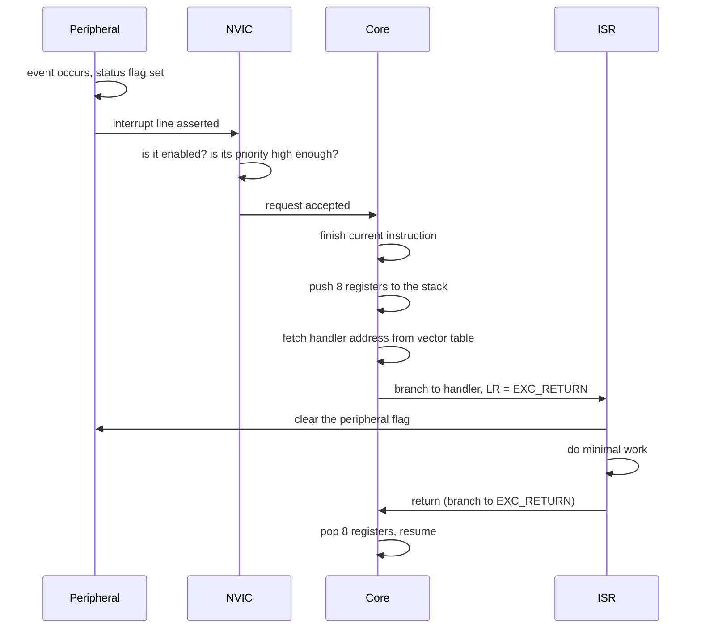

# Interrupts and the NVIC

> The mechanism that lets hardware interrupt software. Everything about embedded timing, concurrency, and the hardest class of bug you will ever chase lives here.

**Contents**
[Cheat sheet](#1-cheat-sheet) ·
[How it works](#2-how-it-actually-works) ·
[Stacking](#stacking-and-the-exception-frame) ·
[Priority](#priority-and-preemption) ·
[Masking](#masking-interrupts) ·
[Registers](#3-register-level-walkthrough) ·
[Debugging](#6-debugging-checklist) ·
[Q&A](#7-questions-i-should-be-able-to-answer) ·
[volatile](#10-volatile) ·
[Races](#11-race-conditions-and-critical-sections) ·
[Atomicity](#12-atomicity) ·
[Faults](#17-fault-exceptions)

---

## 1. Cheat sheet

| Concept | Value / meaning |
| :--- | :--- |
| **Controller** | NVIC — Nested Vectored Interrupt Controller, part of the Cortex-M core |
| **Vector table** | Array of handler addresses, normally at address 0, relocatable via `VTOR` |
| **Entry 0** | Initial **stack pointer**, not a handler |
| **Entry 1** | Reset handler |
| **Priority** | **Lower number = higher priority.** Reset = −3, NMI = −2, HardFault = −1 |
| **Priority bits** | Implementation defined. STM32 uses **4 bits → 16 levels**, in the upper bits of a byte |
| **Latency** | 12 cycles on Cortex-M3/M4, 16 on M0, **6 when tail-chaining** |
| **Auto-stacked** | R0–R3, R12, LR, PC, xPSR — 8 words, AAPCS compliant |
| **Consequence** | ISRs are plain C functions. No assembly wrapper needed |
| **Nesting** | Automatic. A higher-priority interrupt preempts a running ISR |
| **Flag clearing** | **The peripheral flag is yours to clear.** The NVIC pending bit is not enough |

### Top 5 gotchas

| # | Gotcha | Why it bites |
| :--- | :--- | :--- |
| 1 | **Not clearing the peripheral flag** | The ISR re-enters immediately and forever. Looks like a hang |
| 2 | **Missing `volatile`** | The optimiser caches an ISR-modified variable in a register. `while (!flag);` never exits |
| 3 | **`counter++` shared with an ISR** | Three instructions, not one. An interrupt between them loses the update |
| 4 | **Clearing a flag at the end of an ISR** | Write buffering means it may not land before return, causing a spurious re-entry |
| 5 | **Priority numbers feel backwards** | 0 is the *highest*. Setting "priority 15" to make something important does the opposite |

### Key registers

| Register | Purpose |
| :--- | :--- |
| `NVIC_ISER[n]` | Interrupt Set-Enable — write 1 to enable |
| `NVIC_ICER[n]` | Interrupt Clear-Enable — write 1 to disable |
| `NVIC_ISPR` / `NVIC_ICPR` | Set / clear the pending bit manually |
| `NVIC_IABR` | Active — is this handler currently running? |
| `NVIC_IPR[n]` | Priority, one byte per interrupt, **upper bits only** |
| `SCB->AIRCR` | `PRIGROUP` — splits priority into preemption and sub-priority |
| `SCB->VTOR` | Vector table base address — bootloaders must set this |
| `SCB->ICSR` | Pending/active summary, `VECTACTIVE` tells you which handler is running |
| `PRIMASK` | Disable all configurable-priority interrupts |
| `BASEPRI` | Disable interrupts *at or below* a given priority |
| `FAULTMASK` | Like PRIMASK, but also masks HardFault |

---

## 2. How it actually works

### The path from event to handler



**Two separate flags exist**, and confusing them causes gotcha 1:

| Flag | Owned by | Cleared by |
| :--- | :--- | :--- |
| Peripheral status flag (e.g. `USART_ISR_RXNE`) | The peripheral | **Your ISR** — read the data register, or write to `ICR` |
| NVIC pending bit | The NVIC | Automatically, on handler entry |

If the peripheral flag is still set when the handler returns, the peripheral simply
re-asserts its line, the NVIC pends it again, and the ISR runs forever. This is the
number one interrupt bug and it presents as a completely frozen system.

### The vector table

An array of function pointers at the start of flash.

```text
   Address    Contents
   ────────   ─────────────────────────────
   0x0000     Initial stack pointer value      ← not a handler
   0x0004     Reset_Handler
   0x0008     NMI_Handler
   0x000C     HardFault_Handler
   0x0010     MemManage_Handler
   0x0014     BusFault_Handler
   0x0018     UsageFault_Handler
   ...        reserved
   0x002C     SVC_Handler
   0x0038     PendSV_Handler
   0x003C     SysTick_Handler
   0x0040     IRQ0   ← device-specific from here on
   0x0044     IRQ1
   ...
```

The first entry is the stack pointer, which is why the core can push registers before
executing a single instruction of your code. `SCB->VTOR` relocates the table — essential
for a bootloader, which must point the core at the application's table before jumping to
it.

**Exception numbers vs IRQ numbers.** System exceptions have fixed negative or low
numbers; device interrupts are numbered from 0 upward and are entirely vendor-specific.
`NVIC_EnableIRQ(USART1_IRQn)` uses the IRQ number, which is why the enum lives in the
device header rather than the core header.

### Stacking and the exception frame

The core automatically pushes eight registers before entering the handler:

```text
   Higher address
   ┌──────────┐
   │  xPSR    │   ← program status
   │  PC      │   ← where to resume
   │  LR      │   ← caller's link register
   │  R12     │
   │  R3      │
   │  R2      │
   │  R1      │
   │  R0      │   ← SP points here on handler entry
   └──────────┘
   Lower address
```

These are exactly the **caller-saved registers under AAPCS**, the ARM calling convention.
That is a deliberate design choice with a large consequence: since the hardware saves
precisely what a C function is allowed to clobber, **an ISR can be an ordinary C function**
with no assembly wrapper. On architectures without this, every ISR needs a prologue that
saves context by hand.

With an FPU, **lazy stacking** reserves space for S0–S15 and `FPSCR` but only actually
writes them if the handler uses floating point — keeping latency low for the common case.

**`EXC_RETURN`.** On entry, LR is loaded with a magic value such as `0xFFFFFFF9` rather
than a real address. Branching to it triggers the unstacking sequence, and its bit pattern
encodes which stack (MSP or PSP) and which mode to return to.

### Latency, tail-chaining and late arrival

| Situation | Cycles (M3/M4) |
| :--- | ---: |
| Interrupt to first handler instruction | 12 |
| **Tail-chaining** — next interrupt already pending | **6** |
| Late arrival — higher priority arrives during stacking | 12, redirected |
| Return with nothing pending | 12 |

**Tail-chaining** is the important optimisation. If a second interrupt is pending when the
first handler returns, the core skips the pop-then-push entirely and branches straight to
the next handler. Two back-to-back interrupts cost 12 + 6 cycles, not 12 + 12 + 12.

**Late arrival** means a higher-priority interrupt that appears *during* the stacking for a
lower one gets serviced first, reusing the stack frame already being built.

> [!NOTE]
> These numbers are the *hardware* latency. Real-world latency is dominated by software:
> the longest period during which you have interrupts disabled, or a lower-priority ISR
> running that cannot be preempted. That is the number that matters, and it is the one you
> control.

### Priority and preemption

**Lower number means higher priority.** This trips up nearly everyone once.

| Exception | Priority |
| :--- | ---: |
| Reset | −3 (highest) |
| NMI | −2 |
| HardFault | −1 |
| Everything else | 0 to 255, configurable |

**Not all priority bits are implemented.** The Cortex-M spec allows 3 to 8 bits; STM32
implements **4**, giving 16 levels. Crucially, they occupy the **upper** bits of the byte:

```text
   8-bit priority field, 4 bits implemented:

   ┌───┬───┬───┬───┬───┬───┬───┬───┐
   │ P3│ P2│ P1│ P0│ - │ - │ - │ - │
   └───┴───┴───┴───┴───┴───┴───┴───┘
     used for priority   ignored

   So priority 1 is written as 0x10, not 0x01.
```

Use `NVIC_SetPriority()`, which does the shift for you. Writing `NVIC_IPR` by hand and
forgetting the shift means every interrupt ends up at priority 0.

**Priority grouping** splits the implemented bits into preemption priority and sub-priority
via `PRIGROUP` in `SCB->AIRCR`:

| | Effect |
| :--- | :--- |
| **Preemption priority** | Decides whether one interrupt can interrupt another |
| **Sub-priority** | Only decides which runs first when two are pending **simultaneously**. Never causes preemption |

```text
   4 implemented bits, PRIGROUP = 5:

   ┌───┬───┬───┬───┐
   │ preempt│ sub │
   └───┴───┴───┴───┘
     2 bits   2 bits   →  4 preemption levels, 4 sub-levels each
```

> [!TIP]
> Set the grouping **once**, at startup, before configuring any priorities. Changing it
> later silently reinterprets every priority you already set. If you use FreeRTOS, it
> expects all four bits to be preemption priority — group 4 (`NVIC_PRIORITYGROUP_4`).

### Masking interrupts

Three mechanisms, and picking the wrong one causes real problems.

| Register | Effect | Use for |
| :--- | :--- | :--- |
| `PRIMASK` | Blocks **all** configurable-priority interrupts. NMI and HardFault still run | Short critical sections |
| `BASEPRI` | Blocks interrupts at or numerically below a given priority | RTOS kernels — keeps high-priority ISRs alive |
| `FAULTMASK` | Like PRIMASK plus HardFault | Fault handlers only. Almost never in application code |

```c
__disable_irq();          /* PRIMASK = 1 */
__enable_irq();           /* PRIMASK = 0 */
__set_BASEPRI(0x50);      /* block priority 5 and below (with 4 bits, 0x50 = level 5) */
__set_BASEPRI(0);         /* unblock */
```

**`BASEPRI` is what makes an RTOS usable.** It lets you protect kernel data structures
while leaving genuinely time-critical interrupts — motor commutation, a comms deadline —
running with no added jitter. `PRIMASK` blocks everything and adds your critical section's
duration to every interrupt's worst-case latency.

---

## 3. Register-level walkthrough

*Configuring a falling-edge interrupt on PA0, STM32.*

**1 — GPIO**
Enable the GPIO clock, set PA0 as input, and configure a pull-up or pull-down. A floating
input generates interrupts from noise alone.

**2 — Route the pin to the EXTI line**
Enable the `SYSCFG` clock, then select port A for EXTI line 0 in `SYSCFG_EXTICR1`.

> [!WARNING]
> **EXTI line N accepts exactly one port.** PA0 and PB0 both map to EXTI0, and only one can
> be selected. If two drivers each claim "pin 0" on different ports, the second silently
> steals the line from the first — a genuinely nasty bug because both pins are configured
> correctly and only one works.

**3 — Configure the edge**
Set the bit for line 0 in `EXTI_FTSR` for falling edge, `EXTI_RTSR` for rising, or both.

**4 — Unmask**
Set bit 0 in `EXTI_IMR`. Masked means the event is detected but never reaches the NVIC.

**5 — Priority, then enable, in that order**
```c
NVIC_SetPriority(EXTI0_IRQn, 5);
NVIC_EnableIRQ(EXTI0_IRQn);
```
Setting priority after enabling leaves a window where the interrupt can fire at its
default priority of 0 — the highest in the system.

**6 — The handler**
```c
void EXTI0_IRQHandler(void) {
    if (EXTI->PR & EXTI_PR_PR0) {
        EXTI->PR = EXTI_PR_PR0;      /* clear by writing 1 — FIRST, not last */
        __DSB();                     /* ensure the write lands before we return */

        button_pressed = true;       /* volatile. Minimal work only */
    }
}
```

**Why each line matters**

| Line | Reason |
| :--- | :--- |
| Checking `PR` first | Lines 5–9 and 10–15 **share one IRQ**. The handler must identify which fired |
| Writing 1 to clear | Counter-intuitive, but that is the hardware convention. Writing 0 does nothing |
| Clearing early | See gotcha 4 below |
| `__DSB()` | Forces the buffered write to complete before the handler returns |
| One flag set, nothing else | Everything substantial belongs in the main loop |

> [!WARNING]
> **The late-clear race.** Clearing a peripheral flag as the last statement of an ISR can
> fail: the store sits in the write buffer, the handler returns, and the peripheral is
> still asserting its line — so the NVIC pends it again and the ISR runs a second time
> with nothing to do. Clear the flag **early**, or issue `__DSB()` after clearing. The
> symptom is an ISR that occasionally fires twice for one event, which is maddening to
> reproduce.

---

## 4. Code

Runnable, in this repository:

| Program | What it demonstrates | Verified |
| :--- | :--- | :--- |
| [`code/qemu-cortex-m/common/startup.c`](../code/qemu-cortex-m/common/startup.c) | The vector table itself, weak default handlers, and why entry 0 is a stack pointer rather than code | Runs under QEMU |
| [`code/qemu-cortex-m/02-systick-timebase/`](../code/qemu-cortex-m/02-systick-timebase/) | SysTick from the ARM ARM alone; `volatile` on the tick counter; overflow-safe delays | Runs under QEMU |
| [`code/qemu-cortex-m/03-nvic-priority-and-preemption/`](../code/qemu-cortex-m/03-nvic-priority-and-preemption/) | Two IRQs at different priorities, with the high one observably preempting the low one; runtime probe of implemented priority bits | Runs under QEMU |
| [`code/qemu-cortex-m/05-hardfault-decoder/`](../code/qemu-cortex-m/05-hardfault-decoder/) | Recovering the stacked frame, decoding CFSR/HFSR, six selectable fault causes | Runs under QEMU |

```bash
cd code/qemu-cortex-m/03-nvic-priority-and-preemption && make run
cd code/qemu-cortex-m/05-hardfault-decoder && make FAULT=3 run
```

Two things those examples pin down that are easy to get wrong on paper:

- **Core exceptions and external IRQs use different priority registers.**
  SysTick's priority lives in `SCB->SHPR3`, not `NVIC->IPR`. Setting the wrong
  one silently leaves the default.
- **Enabling the configurable faults changes where a fault lands.** Once
  `SHCSR.USGFAULTENA` is set, a UsageFault no longer escalates to HardFault, so
  a handler installed only on `HardFault_Handler` is bypassed. Example 05 points
  all four fault vectors at one decoder for exactly this reason.

> [!NOTE]
> **Still outstanding: measured latency on real silicon.** QEMU's timing is
> approximate, so the 12-cycle figure in section 14 cannot be confirmed here.
> That needs a scope and a GPIO toggle.

---

## 5. Captures

**Not yet taken** — needs a scope or logic analyzer.

- [ ] **Measured latency** — scope the trigger signal against a GPIO toggled as the first
      instruction of the ISR. Compare against the theoretical 12 cycles
- [ ] **Preemption** — a low-priority ISR toggling one pin, interrupted by a high-priority
      ISR toggling another. The nesting is visible directly
      (the logical behaviour is already demonstrated in software by example 03)
- [ ] **Tail-chaining** — two interrupts arriving close together, showing the shorter gap
- [ ] **Jitter** — the same periodic interrupt captured with persistence on, showing the
      spread caused by other ISRs and critical sections
- [ ] **The re-entry bug** — deliberately omit the flag clear and capture the storm

---

## 6. Debugging checklist

| Symptom | Likely cause | How to confirm |
| :--- | :--- | :--- |
| System frozen, ISR runs forever | Peripheral flag never cleared | Break in the debugger — is it always in that handler? |
| ISR never fires | Not enabled in NVIC, masked in `EXTI_IMR`, or `PRIMASK` set | Read `NVIC_ISER` and `PRIMASK` |
| ISR fires once then never again | Flag cleared but source not serviced, or `ORE`-style latch set | Read the peripheral's status register |
| ISR fires twice per event | Late-clear race, or both edges enabled | Clear the flag earlier, add `__DSB()`, check `RTSR`/`FTSR` |
| `while (!flag);` never exits | `flag` not `volatile` | Look at the disassembly — is it re-read each iteration? |
| Counter loses increments | Non-atomic read-modify-write | Wrap it, or use an atomic primitive |
| Works in debug, fails in release | Optimiser exposing a missing `volatile` or a race | Build release with symbols and compare disassembly |
| Random HardFault | Stack overflow, null pointer, or bad function pointer | Read `CFSR` and the stacked PC — see section 17 |
| Interrupt arrives late, jitter high | Long critical section, or a lower-priority ISR hogging | Toggle a pin around every `__disable_irq()` region |
| High-priority ISR starved | Grouping misconfigured, or sub-priority mistaken for preemption | Read `AIRCR.PRIGROUP` |
| Two pins, only one interrupt works | Both mapped to the same EXTI line | Check `SYSCFG_EXTICR` |
| RTOS asserts inside an ISR | Called an RTOS API above `configMAX_SYSCALL_INTERRUPT_PRIORITY` | Check that ISR's priority number |
| Everything breaks after adding one ISR | Its priority defaulted to 0 and now preempts everything | Set priorities explicitly for every interrupt |

---

## 7. Questions I should be able to answer

<details>
<summary><b>Walk through what the hardware does between an event and your ISR's first line.</b></summary>

The peripheral sets its status flag and asserts its interrupt line. The NVIC checks it is enabled and higher priority than whatever is running, then requests it. The core finishes the current instruction, pushes eight registers, loads the handler address from the vector table, sets LR to `EXC_RETURN`, and branches. About 12 cycles on Cortex-M3/M4.

</details>

<details>
<summary><b>Why can a Cortex-M ISR be a plain C function?</b></summary>

The hardware stacks exactly the caller-saved registers defined by AAPCS — R0–R3, R12, LR, PC, xPSR. Since that is precisely what a C function may clobber, the compiler's normal prologue and epilogue are sufficient and no assembly wrapper is needed.

</details>

<details>
<summary><b>What is tail-chaining and why does it matter?</b></summary>

When one handler returns and another is already pending, the core skips the unstack-then-restack and branches directly to the next handler — about 6 cycles instead of 24. It keeps back-to-back interrupts cheap, which matters under load.

</details>

<details>
<summary><b>Which is higher priority, 3 or 7?</b></summary>

3. Lower numbers are higher priority. Reset, NMI and HardFault sit at −3, −2 and −1, above anything configurable.

</details>

<details>
<summary><b>Why does STM32 priority 1 get written as 0x10?</b></summary>

Only four of the eight priority bits are implemented, and they occupy the upper nibble. `NVIC_SetPriority()` performs the shift; writing `NVIC_IPR` directly without it puts everything at priority 0.

</details>

<details>
<summary><b>Difference between preemption priority and sub-priority?</b></summary>

Preemption priority decides whether one interrupt can interrupt another. Sub-priority only breaks ties between interrupts pending at the same instant — it never causes preemption.

</details>

<details>
<summary><b>Your ISR runs continuously and the system is frozen. First thing you check?</b></summary>

Whether the peripheral status flag is being cleared. The NVIC pending bit clears automatically on entry, but the peripheral keeps asserting its line until you service it — so the interrupt immediately re-pends.

</details>

<details>
<summary><b>Why clear a peripheral flag at the start of an ISR rather than the end?</b></summary>

Write buffering. A store issued at the end may not have reached the peripheral before the handler returns, leaving the line asserted and causing a spurious second entry. Clear early, or follow the write with `__DSB()`.

</details>

<details>
<summary><b>PRIMASK versus BASEPRI — when would you use each?</b></summary>

`PRIMASK` blocks every configurable interrupt and is fine for very short critical sections. `BASEPRI` blocks only interrupts at or below a chosen priority, so time-critical ISRs keep running. RTOS kernels use `BASEPRI` for exactly that reason.

</details>

<details>
<summary><b>Is `counter++` safe if both an ISR and main touch it?</b></summary>

No. On ARM it compiles to load, add, store. An interrupt landing between the load and the store loses the update. `volatile` does not help — it controls optimisation, not atomicity.

</details>

<details>
<summary><b>What does `volatile` actually guarantee?</b></summary>

That the compiler will not cache the value in a register, will not eliminate accesses it thinks are redundant, and will not reorder them with respect to other volatile accesses. It says nothing about atomicity and nothing about multi-core memory ordering.

</details>

<details>
<summary><b>Two pins configured for interrupts, only one fires. Why?</b></summary>

Both are probably on the same EXTI line — PA0 and PB0 both map to EXTI0, and `SYSCFG_EXTICR` selects only one port per line. Whichever driver configured it last wins.

</details>

---

## 8. Sources

| Document | Use it for |
| :--- | :--- |
| ARM **Cortex-M3/M4 Generic User Guide** | NVIC registers, exception model, priority |
| ARM **Architecture Reference Manual (ARMv7-M)** | Exception entry/exit in full detail |
| Joseph Yiu, *The Definitive Guide to Arm Cortex-M* | The best single explanation of the exception model |
| STM32 reference manual, NVIC and EXTI chapters | Device-specific IRQ numbers and EXTI mapping |
| ARM **AAPCS** | Why the stacked register set is what it is |

---

## 9. What belongs in an ISR

The single rule: **an ISR should do the least possible and hand everything else to the
main loop.** Every cycle spent in a handler is added to the worst-case latency of every
lower-priority interrupt in the system.

| Do | Do not |
| :--- | :--- |
| Clear the peripheral flag | Call `printf` or anything that formats |
| Move one byte to or from a buffer | Call `malloc` or `free` |
| Set a `volatile` flag | Wait on anything — a flag, a mutex, a peripheral |
| Post to a queue with a `FromISR` API | Loop for more than a few microseconds |
| Toggle a pin | Use floating point without checking the FPU context cost |
| Start a DMA transfer | Take a mutex — semaphores only, and only `FromISR` variants |

**Why `printf` is disqualifying.** It is slow, it is often not reentrant, it may allocate,
and it usually blocks on a UART. A `printf` in a 1 kHz timer ISR at 115200 baud needs more
time than the interval between interrupts, so the system enters a state where it does
nothing but format strings.

**Deferred processing — the standard pattern.**

```c
/* ISR: minimal */
void USART1_IRQHandler(void) {
    if (USART1->ISR & USART_ISR_RXNE) {
        ring_push(&rx_ring, USART1->RDR);      /* one byte, no parsing */
    }
}

/* Main loop or task: everything else */
while (ring_pop(&rx_ring, &byte)) {
    protocol_feed(byte);                       /* parsing, CRC, dispatch */
}
```

The interrupt captures; the application interprets. This is called the top-half/bottom-half
split in Linux, and deferred procedure calls elsewhere. On Cortex-M, `PendSV` at the lowest
priority is the hardware-supported way to run the bottom half — which is exactly how RTOS
context switches are implemented.

---

## 10. `volatile`

`volatile` tells the compiler: **this memory can change without you seeing it happen.**
Without it, the optimiser assumes it owns the only path to that variable.

```c
bool flag = false;                 /* BROKEN */

void EXTI0_IRQHandler(void) { flag = true; }

int main(void) {
    while (!flag);                 /* optimiser: flag is never written here,
                                      so hoist the read out and loop forever */
}
```

The compiler is not wrong. Within its view of `main`, nothing modifies `flag`, so caching
it in a register is a legal and desirable optimisation. `volatile bool flag` forces a
re-read every iteration.

**Where it is required**

| Case | Why |
| :--- | :--- |
| Memory-mapped registers | Hardware changes them; reads can have side effects |
| Variables shared with an ISR | The main-line code has no visible write |
| Variables shared between tasks | Same reasoning |
| Delay loops | Otherwise optimised away entirely |

**Placement with pointers** — a favourite interview question:

```c
volatile uint32_t *p;          /* pointer to volatile data — the usual case for registers */
uint32_t * volatile p;         /* volatile pointer to normal data */
volatile uint32_t * volatile p;/* both */
```

Read declarations right to left from the identifier. `const volatile` is legal and correct
for a read-only status register: your code may not write it, and the hardware may change
it.

> [!WARNING]
> **`volatile` does not provide atomicity, and it is not a memory barrier.** It stops the
> compiler optimising, not the processor reordering, and it does not make read-modify-write
> indivisible. Treating it as a concurrency primitive is one of the most common
> misunderstandings in embedded C.

---

## 11. Race conditions and critical sections

A race is any place where an interrupt can land in the middle of a sequence that assumed
it would not be interrupted.

```c
volatile uint32_t ticks;                    /* 32-bit: safe on a 32-bit core */
volatile uint64_t micros;                   /* 64-bit: NOT safe */

void TIM2_IRQHandler(void) { micros += 1000; }

uint64_t read_micros(void) {
    return micros;                          /* two loads. The ISR can fire between them */
}
```

Reading a 64-bit value on a 32-bit core takes two loads. An interrupt between them returns
a value composed of the old high word and the new low word — a number that never existed.
It fails roughly once per 2³² increments, which is exactly often enough to reach the field
and not often enough to catch in testing.

**Critical sections — nest-safe form**

```c
uint32_t primask = __get_PRIMASK();   /* save current state */
__disable_irq();

uint64_t v = micros;                  /* the indivisible part, as short as possible */

__set_PRIMASK(primask);               /* restore — does NOT blindly re-enable */
return v;
```

> [!IMPORTANT]
> Never write bare `__disable_irq()` … `__enable_irq()` in code that might be called from
> somewhere that already disabled interrupts. The inner `__enable_irq()` re-enables them
> early and breaks the outer critical section. Always save and restore.

**The read-twice alternative**, which needs no masking at all:

```c
uint64_t read_micros(void) {
    uint32_t hi, lo;
    do {
        hi = micros_high;
        lo = micros_low;
    } while (hi != micros_high);       /* retry if the high word changed mid-read */
    return ((uint64_t)hi << 32) | lo;
}
```

Slightly more code, zero added interrupt latency. Worth knowing because "how would you do
it without disabling interrupts" is a natural follow-up question.

**Keep critical sections microscopic.** Their length is added directly to the worst-case
latency of every interrupt in the system. A 50 µs critical section makes a 10 µs deadline
impossible no matter how you set priorities.

---

## 12. Atomicity

```c
counter++;
```

On ARM this is three instructions:

```asm
    LDR  r0, [r1]      ; load
    ADDS r0, r0, #1    ; modify
    STR  r0, [r1]      ; store
```

An interrupt between the load and the store, whose handler also increments `counter`,
produces one lost update. The variable being `volatile` changes nothing — it guarantees the
accesses happen, not that they happen indivisibly.

**Four ways to fix it**

| Approach | Cost | Notes |
| :--- | :--- | :--- |
| Disable interrupts briefly | Adds to worst-case latency | Simple, always works, keep it to a few instructions |
| `LDREX`/`STREX` | None to latency | Exclusive access with retry. `__LDREXW`/`__STREXW` in CMSIS |
| Bit-banding | None | Cortex-M3/M4 only. Single-bit writes to SRAM and peripherals are atomic by construction |
| Single-writer design | None | Only one side ever writes. Usually the best answer |

**`LDREX`/`STREX` in practice**

```c
uint32_t val;
do {
    val = __LDREXW(&counter);
} while (__STREXW(val + 1, &counter) != 0);   /* retry if the exclusive monitor was cleared */
```

`STREX` fails if anything else touched the location since the `LDREX`, so the loop retries.
This is the mechanism every lock-free structure and every RTOS mutex is built on.

**Single-writer design is usually the real answer.** The ring buffer in the UART file works
without any locking because the ISR only writes `head` and the main loop only writes `tail`.
Designing the race out beats defending against it.

**A note on `sig_atomic_t` and `_Atomic`.** C11 atomics exist, but support on bare-metal
toolchains varies and they may pull in library calls you do not want in an ISR. On Cortex-M,
a naturally aligned 32-bit read or write is already atomic — which covers most cases without
any special machinery.

---

## 13. ISR-to-main communication

| Pattern | Use when | Watch out for |
| :--- | :--- | :--- |
| **`volatile` flag** | One event, no data | Two events before servicing collapse into one |
| **Flag + data word** | One value | Update the data before the flag, or main reads stale data |
| **Ring buffer** | Byte or sample streams | Single producer, single consumer only |
| **Double buffer** | Blocks — audio, ADC frames | ISR fills one, main reads the other, swap on completion |
| **RTOS queue** | Structured messages | `FromISR` variants only, and `portYIELD_FROM_ISR` |
| **Counting semaphore** | "N events happened" | Naturally handles bursts a flag would lose |
| **DMA + completion flag** | Bulk data | The cheapest option — no per-byte interrupt at all |

**Ordering matters with flag-plus-data:**

```c
/* ISR */
shared_value = new_reading;    /* data FIRST */
__DMB();                       /* barrier so the compiler and core do not reorder */
data_ready = true;             /* flag SECOND */
```

Set the data before the flag. Reversed, the main loop can observe `data_ready` while
`shared_value` still holds the previous reading.

---

## 14. Latency and jitter

**Latency** is the delay from event to first handler instruction. **Jitter** is the
variation in that delay, and for control loops jitter is usually what actually hurts.

```text
   total latency =  hardware entry (12 cycles)
                 +  time interrupts were disabled
                 +  time spent in equal-or-higher-priority handlers
                 +  the instruction currently executing finishing
```

Only the first term is fixed. The rest is your software.

**Things that inflate it**

| Cause | Fix |
| :--- | :--- |
| Long critical sections | Shorten them; use `BASEPRI` instead of `PRIMASK` |
| Long lower-priority ISRs | Move work to the main loop |
| Flash wait states, no cache | Enable the prefetch/ART accelerator; consider RAM functions |
| Multi-cycle instructions (division) | Avoid in ISRs |
| DMA contending for the bus | Arbitration priority, or separate SRAM banks |
| FPU lazy stacking | Avoid floating point in high-priority ISRs |

**Measuring it properly:** toggle a GPIO as the *first* statement of the ISR and scope it
against the triggering signal. Turn on infinite persistence and let it run — the width of
the smear is your real jitter, and it is nearly always worse than expected.

**Placing an ISR in RAM.** On parts where flash is slower than the core, moving a critical
handler and the vector table into SRAM removes wait states from the entry path. Worth doing
only after measuring.

---

## 15. Nesting

Preemption is automatic and needs no configuration beyond priorities. A higher-priority
interrupt arriving during a lower-priority handler simply preempts it.

```text
   main ──────┐                              ┌───── main
              │  ISR_low ──┐        ┌─── ISR_low
              │            │ ISR_hi │
              └────────────┴────────┴──────────────
                    each level stacks 8 more words
```

**The consequence for stack sizing:** worst case is every priority level nested at once.
Eight words per level, plus each handler's own locals, plus 18 more words per level if the
FPU is in use.

```
   stack needed  ≈  Σ over levels ( 32 bytes + handler locals )  +  main's deepest path
```

Underestimate it and you get a stack overflow, which on Cortex-M without an MPU silently
corrupts whatever lives below the stack and surfaces later as an unrelated HardFault.

> [!TIP]
> Fill the stack region with a known pattern at startup and check the high-water mark
> later. It turns "probably enough" into a number. FreeRTOS does this for task stacks with
> `uxTaskGetStackHighWaterMark`.

---

## 16. Interrupts and an RTOS

**The priority ceiling.** FreeRTOS defines `configMAX_SYSCALL_INTERRUPT_PRIORITY`. Any ISR
at a higher priority (numerically lower) than that value **must not call any RTOS API at
all** — it runs above the kernel's `BASEPRI` masking, so kernel data structures are
unprotected while it executes.

```text
   priority 0  ┐
        ...    │  ← above the ceiling: no RTOS calls. Lowest latency
   ceiling ────┼───────────────────────────────────────────────
        ...    │  ← below: FromISR APIs allowed
   priority 15 ┘
```

That is a feature, not a restriction: it lets you run a hard-real-time handler with
kernel-independent latency, provided it communicates by other means.

**Always the `FromISR` variants.**

```c
BaseType_t woken = pdFALSE;
xQueueSendFromISR(queue, &item, &woken);
portYIELD_FROM_ISR(woken);        /* switch immediately if a higher-priority task woke */
```

Omitting `portYIELD_FROM_ISR` is not fatal — the task simply waits for the next scheduler
tick — but it converts a microsecond response into a millisecond one, and it is a common
source of "the RTOS is slow" complaints.

**Never take a mutex in an ISR.** Mutexes support priority inheritance, which requires an
owning *task*; an ISR has no task context. Use a binary or counting semaphore.

**`PendSV`** is set to the lowest priority and is where the context switch actually happens,
so switching never preempts a real handler. `SVC` is the entry point for system calls.
Recognising both in a vector table is worth a mark in any RTOS interview.

---

## 17. Fault exceptions

| Exception | Fires on |
| :--- | :--- |
| **HardFault** | Escalation from any other fault that is disabled or itself faulted |
| **MemManage** | MPU violation, or execution from a no-execute region |
| **BusFault** | Bad address, failed bus transaction |
| **UsageFault** | Undefined instruction, unaligned access, divide by zero (if enabled) |

By default the configurable faults are disabled and everything escalates to HardFault. Enable
them via `SCB->SHCSR` to find out which one it actually was.

**Extracting the state at the fault.** The registers you need were pushed by the hardware
before the handler ran.

```c
void HardFault_Handler(void) {
    __asm volatile (
        "tst lr, #4        \n"     /* which stack was in use? */
        "ite eq            \n"
        "mrseq r0, msp     \n"
        "mrsne r0, psp     \n"
        "b hard_fault_c    \n"
    );
}

void hard_fault_c(uint32_t *sp) {
    uint32_t pc   = sp[6];         /* the faulting instruction */
    uint32_t lr   = sp[5];         /* who called it */
    uint32_t psr  = sp[7];
    uint32_t cfsr = SCB->CFSR;     /* which fault, precisely */
    uint32_t hfsr = SCB->HFSR;
    uint32_t mmar = SCB->MMFAR;    /* faulting address, if valid */
    uint32_t bfar = SCB->BFAR;

    for (;;);                      /* break here and inspect */
}
```

**Reading it:** look up the stacked `PC` in your `.map` file or disassembly to find the
faulting instruction. `CFSR` bits name the cause. `BFAR`/`MMFAR` hold the offending address
when their corresponding valid bits are set.

**Common causes, in rough order of frequency**

| Cause | Signature |
| :--- | :--- |
| Null or wild pointer | `BFAR` near 0, or an obviously bogus address |
| **Stack overflow** | Stacked values look like data; SP has run into another region |
| Calling an uninitialised function pointer | PC in an implausible place |
| Unaligned access | `UNALIGNED` bit in `CFSR` |
| Array overrun corrupting a return address | LR or the stacked PC is nonsense |
| Peripheral accessed with its clock disabled | `BusFault` on a valid-looking peripheral address |

That last one catches everyone at least once: touching a peripheral register before
enabling its clock in `RCC` faults immediately, and the address in `BFAR` looks perfectly
reasonable.

---

## 18. Testing

**Fault injection**

| Fault | How to cause it deliberately |
| :--- | :--- |
| Missing flag clear | Comment it out and watch the storm |
| Missing `volatile` | Remove it, build with `-O2`, watch the loop hang |
| Lost increment | Increment from both ISR and main, compare against expected total |
| Priority inversion | Give a slow handler a high priority and measure the damage |
| Stack overflow | Recurse in an ISR until it faults, then verify your detection catches it |
| Late-clear race | Move the flag clear to the last line and run it for hours |

**Measure, do not assume**

- Toggle a pin at ISR entry and exit — width is execution time, gap is latency
- Count interrupts per second and compare against the expected rate. Missing ones mean
  overrun; extra ones mean spurious re-entry
- Fill the stack with a pattern at boot and check the high-water mark after a long soak
- Instrument the longest interrupt-disabled region; it is your real worst-case latency

**In an interview**, the strong answer to "how would you test this" is: measure latency with
a scope, deliberately break `volatile` and the flag clear to confirm the failure modes are
what you think, and soak-test long enough for the once-per-2³² races to show up.

---

### Additions for section 7 — Q&A

<details>
<summary><b>You need to read a 64-bit counter shared with an ISR. Two approaches?</b></summary>

Disable interrupts briefly around the two loads and restore the previous `PRIMASK` rather than blindly re-enabling. Or read the high word, read the low word, re-read the high word, and retry if it changed — no masking and no added latency.

</details>

<details>
<summary><b>Why is bare `__disable_irq()` / `__enable_irq()` dangerous?</b></summary>

It does not nest. If the caller had already disabled interrupts, the inner enable re-enables them early and silently breaks the outer critical section. Save `PRIMASK`, disable, then restore.

</details>

<details>
<summary><b>How would you make a counter increment atomic without disabling interrupts?</b></summary>

`LDREX`/`STREX` in a retry loop — `STREX` fails if anything touched the location since the load. On Cortex-M3/M4, bit-banding makes single-bit accesses atomic. Best of all, restructure so only one side writes.

</details>

<details>
<summary><b>Why must the data be written before the flag in an ISR?</b></summary>

Otherwise the main loop can observe the flag set while the data still holds its previous value. Write data, issue a barrier, then set the flag.

</details>

<details>
<summary><b>How do you size an interrupt stack?</b></summary>

Worst case is all priority levels nested simultaneously: 8 words per level, plus each handler's locals, plus 18 more words per level if the FPU is used. Then verify empirically by filling the stack with a pattern and checking the high-water mark after a soak test.

</details>

<details>
<summary><b>What is configMAX_SYSCALL_INTERRUPT_PRIORITY for?</b></summary>

It is the ceiling below which ISRs may call FreeRTOS APIs. Handlers at higher priority run above the kernel's `BASEPRI` masking, so they must not touch kernel structures — in exchange, they get latency the kernel cannot affect.

</details>

<details>
<summary><b>Why can't you take a mutex in an ISR?</b></summary>

Mutexes implement priority inheritance, which requires an owning task. An ISR has no task context to inherit to or from. Use a binary or counting semaphore instead.

</details>

<details>
<summary><b>What are PendSV and SVC used for?</b></summary>

`SVC` is the system-call entry point. `PendSV` runs at the lowest priority and is where the RTOS performs its context switch, so switching never preempts a real interrupt handler.

</details>

<details>
<summary><b>You hit a HardFault. What do you do?</b></summary>

Recover the stacked frame — MSP or PSP depending on bit 2 of LR — and read the stacked PC to find the faulting instruction in the map file. Then read `CFSR` for the cause and `BFAR`/`MMFAR` for the address. Enable the configurable fault handlers so it does not all escalate to HardFault next time.

</details>

<details>
<summary><b>Most common causes of a HardFault?</b></summary>

Null or wild pointers, stack overflow, uninitialised function pointers, unaligned access, and accessing a peripheral whose clock is still disabled in `RCC`.

</details>

<details>
<summary><b>Why does jitter matter more than latency in a control loop?</b></summary>

A constant delay can be compensated for in the loop design. A varying one cannot — it appears as noise in the sampling interval and degrades stability. Constant lateness is manageable; unpredictable lateness is not.

</details>
