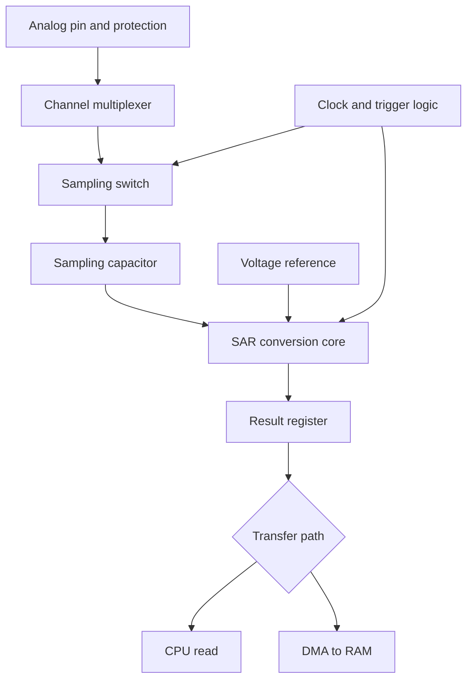
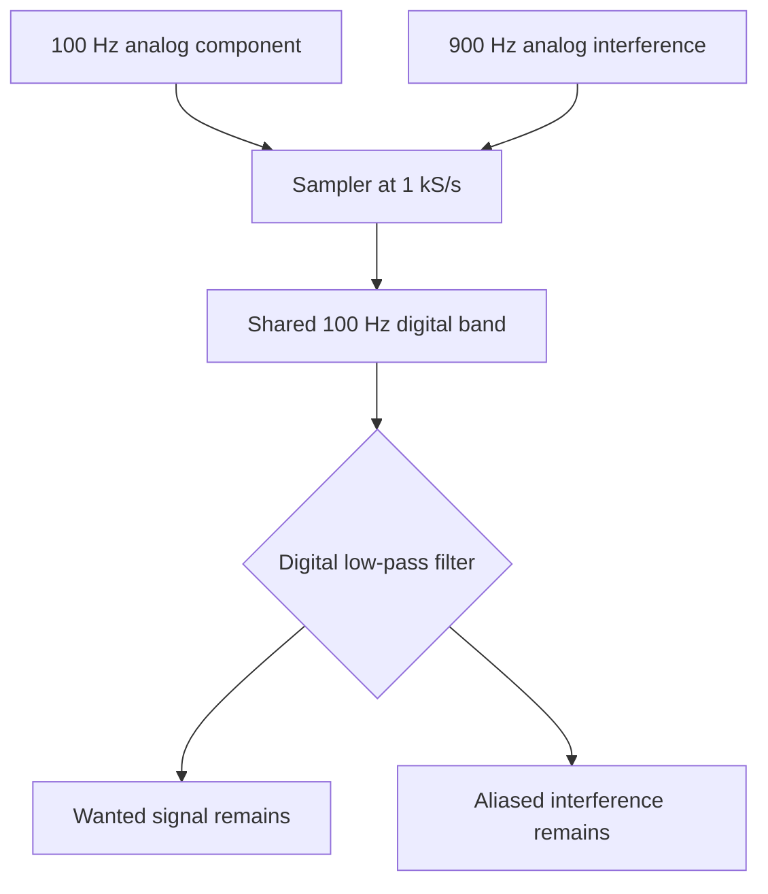
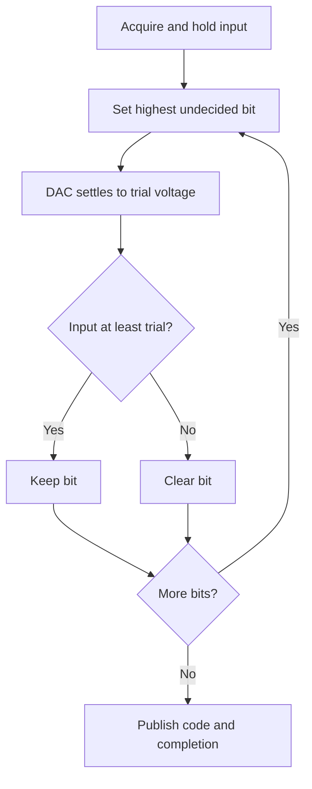
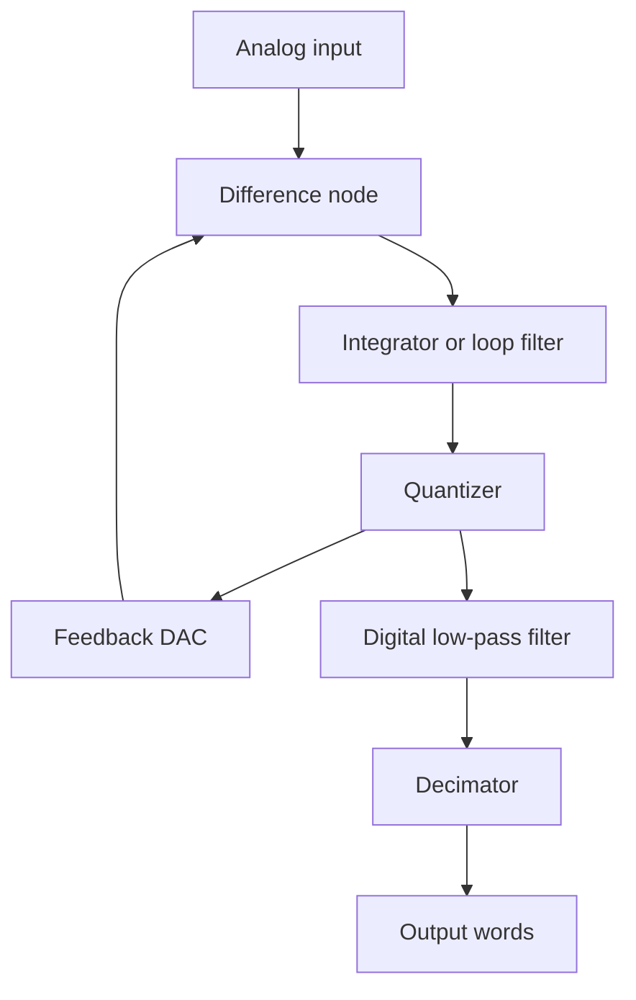
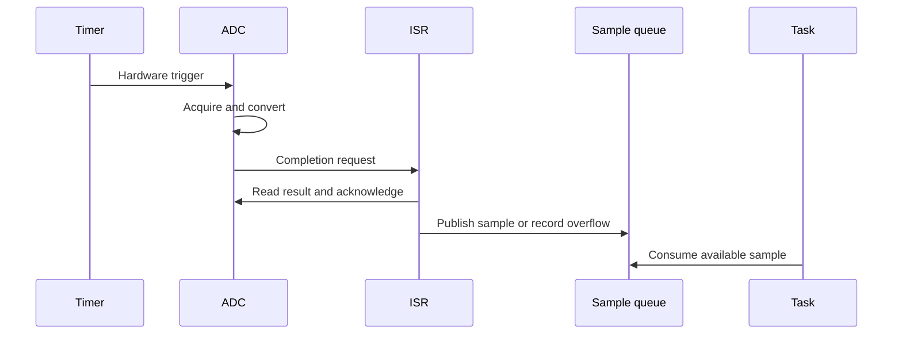
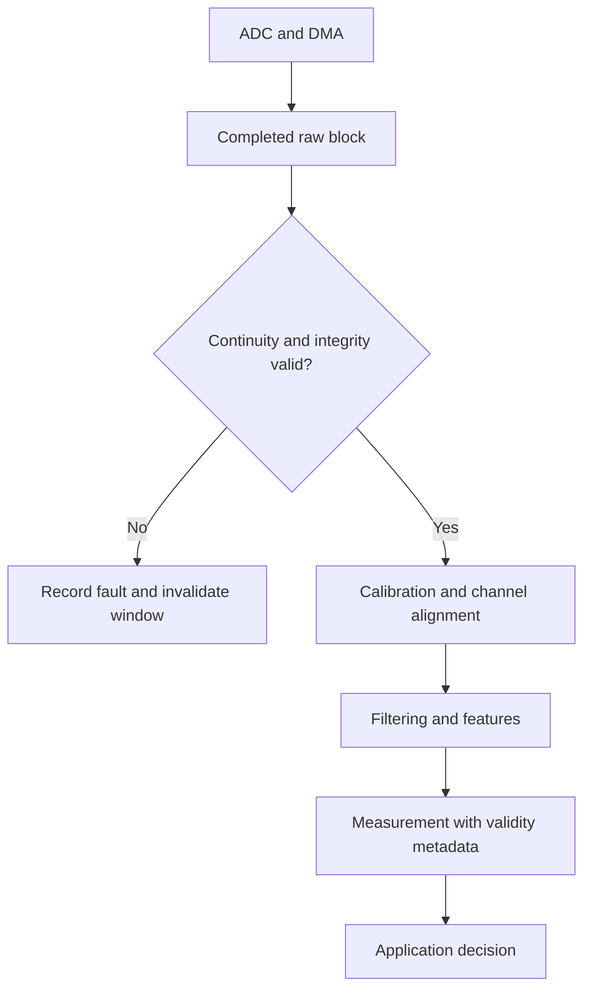
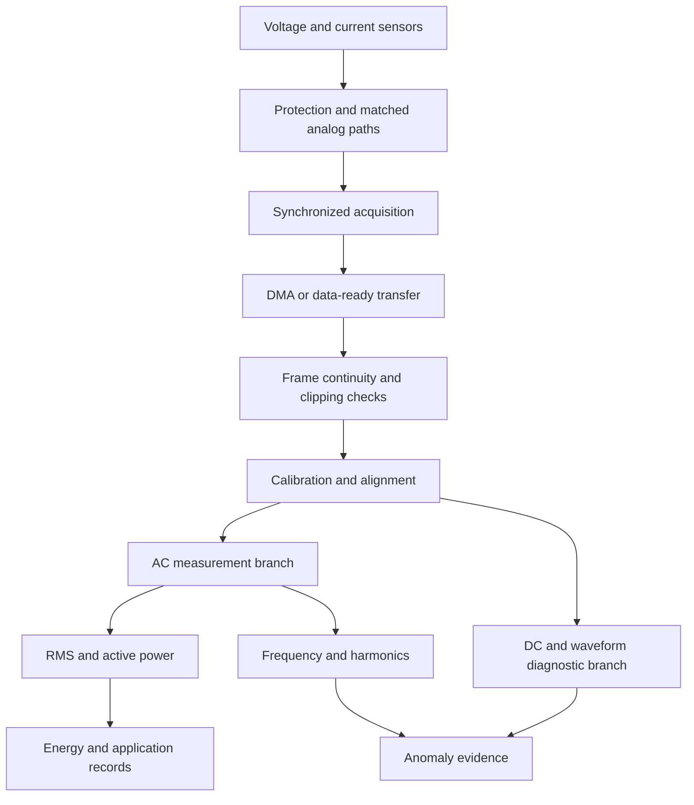
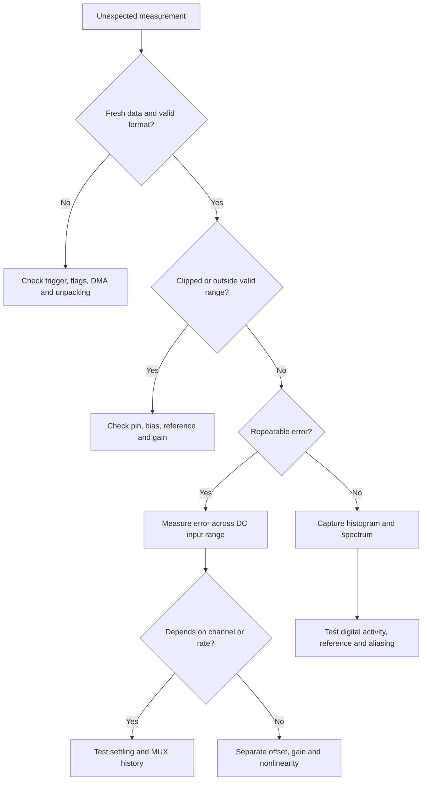

# ADC: From First Principles to Subject-Matter-Expert Practice

*A continuous engineering story from the sensor to a trustworthy measurement*

Prepared for an embedded firmware engineer. Companion subjects: analog electronics, MCU peripherals, real-time acquisition, signal processing, and energy metering.

## How to use this handbook

Read Chapters 1–12 to understand what physically reaches the converter, 13–24 to understand conversion and error, 25–33 to build the firmware pipeline, and 34–50 to measure, characterize, and debug a complete system. The chapters intentionally revisit the same signal from different perspectives. Exercises and interview answers are included; do the arithmetic before reading the solutions.

Every major topic connects five questions: what happens, why it is needed, how hardware performs it, what firmware observes, and what failure looks like. Numerical examples are independently worked teaching examples, not specifications for a real MCU. Manufacturer references support the implementation-specific checkpoints and further reading. They do not replace the exact device datasheet, reference manual, and errata.

**Notation:** `N` means ADC resolution in bits unless stated otherwise. `M` means a number of samples. `Fs` is samples per second **per channel**, unless explicitly called aggregate throughput. `VFS` is the width of an input range, not necessarily its positive endpoint. `q = VFS / 2^N` is nominal one-LSB width. Frequencies are in hertz, times in seconds, resistances in ohms, capacitances in farads, and voltages in volts. `≈` marks an approximation.

**Code status:** portable computational functions are supplied in Appendix D and host-tested. Peripheral operations elsewhere are illustrative pseudocode or board-support contracts, not a tested driver for a particular board. No physical ADC, PCB, or metering accuracy has been validated by this document.

**Model boundary:** the input-switch/capacitor picture primarily describes an unbuffered switched-capacitor SAR input. Other architectures can use different input networks. A sigma-delta output often represents a filtered interval of modulator activity, not one newly captured point.

## Contents

- [1. Why ADC exists](#1-why-adc-exists)
- [2. ADC as a black box](#2-adc-as-a-black-box)
- [3. Complete ADC anatomy](#3-complete-adc-anatomy)
- [4. The ADC input pin](#4-the-adc-input-pin)
- [5. The analog multiplexer](#5-the-analog-multiplexer)
- [6. Sample-and-hold: charge must actually arrive](#6-sample-and-hold-charge-must-actually-arrive)
- [7. Sampling theory: how time becomes an index](#7-sampling-theory-how-time-becomes-an-index)
- [8. Aliasing: two analog stories, one digital sequence](#8-aliasing-two-analog-stories-one-digital-sequence)
- [9. Anti-aliasing filters: spend attenuation before information is lost](#9-anti-aliasing-filters-spend-attenuation-before-information-is-lost)
- [10. Quantization: selecting a bin is not measuring an exact voltage](#10-quantization-selecting-a-bin-is-not-measuring-an-exact-voltage)
- [11. Resolution, accuracy, and useful information](#11-resolution-accuracy-and-useful-information)
- [12. Voltage reference: the ruler can move](#12-voltage-reference-the-ruler-can-move)
- [13. ADC architectures: different ways to ask the same question](#13-adc-architectures-different-ways-to-ask-the-same-question)
- [14. Flash ADC: a whole bank of yes/no questions](#14-flash-adc-a-whole-bank-of-yesno-questions)
- [15. SAR ADC deep dive: binary search performed by analog hardware](#15-sar-adc-deep-dive-binary-search-performed-by-analog-hardware)
- [16. Sigma-delta ADC deep dive: precision from feedback and bandwidth tradeoffs](#16-sigma-delta-adc-deep-dive-precision-from-feedback-and-bandwidth-tradeoffs)
- [17. Pipeline ADC: high throughput despite delayed answers](#17-pipeline-adc-high-throughput-despite-delayed-answers)
- [18. ADC timing: four clocks that people accidentally mix](#18-adc-timing-four-clocks-that-people-accidentally-mix)
- [19. Source impedance: the ADC input is a dynamic load](#19-source-impedance-the-adc-input-is-a-dynamic-load)
- [20. ADC errors: how the ideal staircase deforms](#20-adc-errors-how-the-ideal-staircase-deforms)
- [21. Performance metrics: what exactly is in the denominator?](#21-performance-metrics-what-exactly-is-in-the-denominator)
- [22. Noise: why a stable voltage still makes moving codes](#22-noise-why-a-stable-voltage-still-makes-moving-codes)
- [23. Oversampling and averaging: information needs variation](#23-oversampling-and-averaging-information-needs-variation)
- [24. Calibration: estimate the error model you can actually correct](#24-calibration-estimate-the-error-model-you-can-actually-correct)
- [25. MCU peripheral anatomy: software controls the machinery around the core](#25-mcu-peripheral-anatomy-software-controls-the-machinery-around-the-core)
- [26. Polling acquisition: the CPU waits for completion](#26-polling-acquisition-the-cpu-waits-for-completion)
- [27. Interrupt-driven acquisition: completion is an event](#27-interrupt-driven-acquisition-completion-is-an-event)
- [28. ADC plus DMA: moving results without a per-sample CPU copy](#28-adc-plus-dma-moving-results-without-a-per-sample-cpu-copy)
- [29. Timer-triggered sampling: make time a hardware property](#29-timer-triggered-sampling-make-time-a-hardware-property)
- [30. Multi-channel ADC: a frame is not automatically simultaneous](#30-multi-channel-adc-a-frame-is-not-automatically-simultaneous)
- [31. Firmware buffer architecture: samples need an owner and a deadline](#31-firmware-buffer-architecture-samples-need-an-owner-and-a-deadline)
- [32. ADC code to voltage: 4096 and 4095 answer different questions](#32-adc-code-to-voltage-4096-and-4095-answer-different-questions)
- [33. Sensor scaling: recover the physical quantity through the whole chain](#33-sensor-scaling-recover-the-physical-quantity-through-the-whole-chain)
- [34. AC waveform sampling at 3906.25 samples/s](#34-ac-waveform-sampling-at-390625-sampless)
- [35. RMS: average squared magnitude, then take the square root](#35-rms-average-squared-magnitude-then-take-the-square-root)
- [36. Power measurement: voltage and current must describe the same instant](#36-power-measurement-voltage-and-current-must-describe-the-same-instant)
- [37. FFT and harmonics: map a time record into frequency evidence](#37-fft-and-harmonics-map-a-time-record-into-frequency-evidence)
- [38. Energy-meter acquisition pipeline: a complete system contract](#38-energy-meter-acquisition-pipeline-a-complete-system-contract)
- [39. ADC-based tamper and anomaly detection: preserve evidence, avoid universal thresholds](#39-adc-based-tamper-and-anomaly-detection-preserve-evidence-avoid-universal-thresholds)
- [40. PCB and analog hardware: return current is part of the circuit](#40-pcb-and-analog-hardware-return-current-is-part-of-the-circuit)
- [41. Op-amp driving an ADC: “unity gain” does not mean effortless](#41-op-amp-driving-an-adc-unity-gain-does-not-mean-effortless)
- [42. Differential ADC: measure a difference within valid absolute voltages](#42-differential-adc-measure-a-difference-within-valid-absolute-voltages)
- [43. Signed ADC data: bits need a representation contract](#43-signed-adc-data-bits-need-a-representation-contract)
- [44. ADC datasheet masterclass: convert specifications into design obligations](#44-adc-datasheet-masterclass-convert-specifications-into-design-obligations)
- [45. ADC debugging masterclass: choose experiments that separate causes](#45-adc-debugging-masterclass-choose-experiments-that-separate-causes)
- [46. Common ADC mistakes and the replacement habit](#46-common-adc-mistakes-and-the-replacement-habit)
- [47. Advanced topics: extend the model without breaking it](#47-advanced-topics-extend-the-model-without-breaking-it)
- [48. Engineering exercises with detailed solutions](#48-engineering-exercises-with-detailed-solutions)
- [49. Interview questions with reasoned answers](#49-interview-questions-with-reasoned-answers)
- [50. The final ADC mental model: audit every boundary](#50-the-final-adc-mental-model-audit-every-boundary)
- [Appendix A. Equation cheat sheet, with assumptions](#appendix-a-equation-cheat-sheet-with-assumptions)
- [Appendix B. Concise glossary](#appendix-b-concise-glossary)
- [Appendix C. Final architecture comparison and oscilloscope checklist](#appendix-c-final-architecture-comparison-and-oscilloscope-checklist)
- [Appendix D. Portable C computational reference](#appendix-d-portable-c-computational-reference)
- [Appendix E. Primary references and study route](#appendix-e-primary-references-and-study-route)


## 1. Why ADC exists

A temperature, pressure, light level, sound wave, or current exists without being a number in RAM. A transducer turns that quantity into an electrical signal. A processor needs a finite representation it can store and calculate with. An ADC is the bridge, but it only measures the electrical quantity presented to its input. It does not know whether 1.8 V means temperature, current, or a broken sensor.

Consider a fictional temperature sensor with output `V = 0.5 + 0.01 T`, where `T` is degrees Celsius. At 25 °C, it produces 0.75 V. An ADC produces a code; firmware converts the code to volts and then evaluates `T = (V - 0.5)/0.01`. Sensor accuracy, voltage measurement accuracy, and scaling accuracy are three separate questions.

| Operation | What becomes discrete? | What is retained? |
| --- | --- | --- |
| Sampling | Time | A sequence of measured amplitudes |
| Quantization | Amplitude | One bin/index from a finite set |
| Encoding | Representation | A binary word representing that index |

An analog waveform is commonly modeled as continuous in time and amplitude. Ideal sampling creates discrete-time, continuous-amplitude values. Quantization creates discrete-amplitude values. Encoding chooses unsigned binary, offset binary, two's complement, or another representation. Real acquisition adds bandwidth limits, noise, and finite apertures to this mathematical story.

For example, reading a 1 Hz temperature signal 100 times per second does not create 100 independent pieces of temperature information. It gives a denser time sequence, useful for noise filtering and disturbance detection. Increasing code width does not correct the sensor's own 1 °C offset.

**Firmware consequence:** carry physical units and calibration provenance alongside the raw code interpretation. A register value of 930 is not inherently 930 mV.

**Expert checkpoint:** before selecting an ADC, define the physical range, signal bandwidth, acceptable error, update latency, and fault behavior. Interview question: *Can the ADC be working correctly while the reported temperature is wrong?* Yes: an incorrect sensor slope, reference assumption, or wiring model is enough.

## 2. ADC as a black box

For a simple unipolar converter, the input is constrained to a nominal range from zero to a reference-related full-scale value. A trigger requests a conversion or acquisition sequence. A clock advances internal operation. The result eventually appears in a register or FIFO, with a completion indication.

| Interface | Its actual job | Common mistake |
| --- | --- | --- |
| Analog input | Presents a voltage within specified electrical limits | Assuming digital-input tolerance applies |
| VREF | Establishes the measurement scale | Treating a nominal 3.3 V rail as exact |
| ADC clock | Runs acquisition/conversion logic | Confusing it with sample rate |
| Trigger | Determines when acquisition starts, subject to device rules | Assuming a busy ADC queues every trigger |
| Channel selector | Connects an input or selects a conversion path | Assuming every pin has its own ADC |
| EOC / EOS | Indicates end of conversion / sequence under device rules | Treating both as interchangeable |
| Data register / FIFO | Holds results | Ignoring overwrite/overrun |
| IRQ / DMA request | Notifies CPU or moves data | Assuming data transfer determines sampling time |

A 12-bit result has 4096 possible codes, numbered 0–4095. With a 3.3 V range, nominal bin width is `3.3/4096 = 0.805664 mV`. Around midscale, 1.65 V corresponds to code 2048 in the floor-bin model introduced below.

| Nominal bits | Code count | Maximum unsigned code | Nominal q for 3.3 V |
| --- | ---: | ---: | ---: |
| 8 | 256 | 255 | 12.890625 mV |
| 10 | 1024 | 1023 | 3.222656 mV |
| 12 | 4096 | 4095 | 805.664 µV |
| 16 | 65536 | 65535 | 50.354 µV |
| 24 | 16777216 | 16777215 | 196.695 nV |

These are mathematical increments, not guaranteed measurable changes. A 24-bit output register with microvolts of input noise cannot distinguish every 197 nV step in one reading.

**Conversion time** is how long conversion takes under a defined mode. **Acquisition time** is how long the input is allowed to settle or track. **Throughput** is results per second. **Latency** is the delay between represented input time and availability. These can differ greatly in pipelined and digitally filtered converters.

**Expert checkpoint:** ask whether the advertised MSPS applies to a single channel, total conversions, a particular resolution, and the minimum acquisition setting. The fastest setting may fail with your sensor impedance.

## 3. Complete ADC anatomy

Follow a sample through a typical multiplexed SAR path:



The protection structures survive specified handling or transients; they are not a precision clamp for arbitrary external voltages. The MUX connects one selected source. The sampling switch conducts while charge moves onto a capacitor. When the switch opens, the capacitor approximately preserves the sampled voltage. The conversion core compares that stored quantity with reference-derived trial levels. Digital logic encodes the result and makes it available to software.

A capacitor stores charge `Q = C V`. A 10 pF capacitor at 2 V stores 20 pC. Changing its voltage by 1 V requires moving 10 pC. Small charge does not mean no engineering problem: that charge must arrive within a short acquisition interval, through finite impedance, without destabilizing the driver.

Some SARs reuse a capacitor array for both sampling and the internal DAC. The conceptual blocks need not be separate physical components. Some ADCs have internal buffers, programmable gain, independent sample/holds, or FIFOs. Sigma-delta converters add feedback modulation and digital filtering; the above diagram is not their universal transistor-level anatomy.

**What firmware sees:** usually a code and flags, not the capacitor's settling history. A legal-looking result can contain an analog error that no error flag detects.

**Expert checkpoint:** draw the actual source-to-capacitor circuit from the datasheet before interpreting a suspicious code. Ask which block retains state from the previous conversion.

## 4. The ADC input pin

An analog pad includes package and PCB parasitics, input leakage, capacitance, and protection structures. Digital input buffers and pull resistors may share the pad unless analog mode disables them. Configuring the pin correctly prevents unwanted current paths and switching near the analog threshold.

There are three distinct limits:

1. The **recommended conversion range**, over which specified measurements are meaningful.
2. The **normal operating electrical limits**, including common-mode, supply, and injection-current restrictions.
3. The **absolute maximum ratings**, beyond which damage may occur; operation near these limits does not imply valid conversion.

A 3.3 V ADC input is not automatically safe at 5 V because the same package has other 5 V-tolerant digital pins. A negative voltage can forward-bias a protection junction. A powered sensor can back-power an unpowered MCU through input structures. Restrictions are pin- and device-specific.

Leakage also causes measurement error. If input leakage is 10 nA through a 100 kΩ source, the potential DC error is `I R = 1 mV`, already about 1.24 nominal LSB at 12 bits over 3.3 V. Leakage can change strongly with temperature, and board contamination may exceed device leakage.

**Firmware view:** clipping, offsets, or neighboring-channel corruption may be the only symptoms. Software cannot infer that an input is electrically safe simply because the code is within range.

**Bench experiment:** connect a safe, known DC source; compare measurements through 100 Ω and 100 kΩ, keeping acquisition time long. A source-resistance-dependent residual offset suggests leakage, bias currents, or incomplete settling. Separate them by changing sample rate and temperature.

**Expert checkpoint:** verify pin mode, pull configuration, injection limits, power sequencing, leakage maximum, and test temperature. Protection design must include the protection component's own capacitance and leakage.

## 5. The analog multiplexer

Several input channels often share a single core. A MUX selects which signal is connected to the sampling network. Selecting channel B does not instantly erase charge left by channel A.

Suppose A is 3 V and B is 0.3 V. When the network switches, the sampling capacitor must move by 2.7 V. If B is high impedance, it cannot supply the needed charge quickly. The result for B is then biased toward A. Read B repeatedly and its value may converge: this is a diagnostic clue, not proof of ADC randomness.

For a simplified first-order network:

\[
V_C(t)=V_B+(V_{C,0}-V_B)e^{-t/\tau}
\]

`VC,0` is the retained capacitor voltage, `VB` the new source voltage, and `τ` the effective settling constant. If only one time constant elapses, 36.8% of the original difference remains. For the 2.7 V transition that is almost 1 V of error.

**Hardware remedies:** reduce source impedance, allow more acquisition time, buffer the source, or redesign the input RC. Channel order can reduce voltage jumps, but it is not a substitute for a worst-case design. A dummy conversion may help only if it gives the relevant network enough additional settling and the device sequencing behaves as assumed.

**Firmware consequences:** scan rank matters; DMA element order must match it. Changing the sequence can change apparent analog readings. Internal temperature/reference channels can require different acquisition settings from external channels.

**Expert checkpoint:** test alternating low/high inputs and then reverse the scan order. A datasheet's maximum throughput is not a guarantee of accuracy for all channel transitions.

## 6. Sample-and-hold: charge must actually arrive

During acquisition, a switch connects the source to a sampling capacitor. During hold, the switch disconnects it so the converter can make decisions about a substantially fixed value. Think of acquisition as allowing a container to fill, but retain the electrical model: voltage difference drives current through resistance, and current changes capacitor charge.

For a DC step through total resistance `R` into capacitance `C`:

\[
\tau=RC,\qquad |e(t)|=|\Delta V|e^{-t/(RC)}
\]

To make settling error less than half an LSB after a full-range step:

\[
V_{FS}e^{-t/(RC)} < \frac{V_{FS}}{2^{N+1}}
\quad\Rightarrow\quad
 t > (N+1)\ln(2)RC
\]

The range cancels because the target is expressed relative to full scale. For 12 bits, the requirement is about `9.011 RC`; for 16 bits, `11.784 RC`.

**Worked example:** `Rsource = 10 kΩ`, sampling-switch resistance `Rsw = 1 kΩ`, and effective sample capacitance `C = 10 pF`. Then `R = 11 kΩ`, `τ = 110 ns`, and the idealized 12-bit acquisition requirement is about 991 ns. A 0.2 µs acquisition is not “almost enough”; its residual fraction is `exp(-0.2/0.11) ≈ 0.162`, huge compared with half an LSB.

For a smaller voltage step, use:

\[
t > RC\ln\left(\frac{|\Delta V|}{e_{allowed}}\right)
\]

This model assumes one dominant linear RC, a constant source during the interval, and known initial charge. Real op-amp settling, multiple capacitances, switch nonlinearity, reference settling, and changing inputs require a more complete model and margin. Do not count only PCB capacitance while omitting the datasheet's input network.

During hold, leakage causes droop approximately `ΔV = I Δt/C`; charge injection and clock feedthrough can shift the held level. A larger capacitor reduces some noise and droop effects but demands more drive charge.

**Firmware action:** select acquisition cycles based on source behavior and ADC clock. Doubling the ADC clock with unchanged sample cycles halves the time available to settle.

**Expert checkpoint:** “The ADC is 12-bit” means the target is small; it does not mean the input settles to 12 bits automatically. Relevant implementation checks are discussed in [ST AN2834](https://www.st.com/resource/en/application_note/cd00211314-how-to-get-the-best-adc-accuracy-in-stm32-microcontrollers-stmicroelectronics.pdf).

## 7. Sampling theory: how time becomes an index

Uniform sampling observes a waveform at `tn = n Ts`. If there are `Fs` samples per second, each interval lasts `Ts = 1/Fs`. At 10 kS/s, `Ts = 100 µs`. The discrete sequence is `x[n] = x(n Ts)` in the ideal point-sampling model.

For a real low-pass signal strictly band-limited below `Fmax`, ideal reconstruction requires a sampling frequency greater than twice that highest frequency. The Nyquist frequency is `Fs/2`. These statements assume an appropriate band limit and ideal processing; they do not promise accurate measurements for a practical signal at exactly half the sample rate.

At `Fs = 2 Fin`, a sine sampled at its zero crossings yields all zeros. Changing phase changes the apparent sequence. Practical designs need guard band for anti-alias filter roll-off, clock error, signal variation, and any desired amplitude/phase accuracy.

**Bandwidth is not always fundamental frequency.** A 50 Hz sine has a narrow spectrum. A distorted 50 Hz current can contain hundreds or thousands of hertz. “It is a 50 Hz meter” does not justify sampling at 101 samples/s if harmonic power matters.

Oversampling means sampling faster than the minimum rate needed for the retained signal band. Undersampling can intentionally translate a carefully band-limited high-frequency band into baseband. That requires a suitable band-pass filter, adequate input bandwidth, a planned alias map, and sufficiently low clock jitter. Unplanned undersampling is information loss.

**Firmware view:** changing `Fs` changes time scales, digital-filter coefficients, FFT bin spacing, and energy integration. A buffer is not a timeline unless its sample rate and continuity are known.

**Expert checkpoint:** specify both wanted bandwidth and unwanted signal spectrum. A faster ADC clock is not the same thing as a faster hardware trigger.

## 8. Aliasing: two analog stories, one digital sequence

For integer `k`:

\[
\cos\left(2\pi(f+kF_s)n/F_s\right)=\cos(2\pi fn/F_s)
\]

The extra term is `2πkn`, a whole number of rotations at every sample. Once only the samples remain, those cosines are indistinguishable.

At `Fs = 1000 Hz`, a 900 Hz cosine and a 100 Hz cosine give the following same samples:

| n | Time (ms) | 100 Hz cosine | 900 Hz cosine |
| ---: | ---: | ---: | ---: |
| 0 | 0 | 1.0000 | 1.0000 |
| 1 | 1 | 0.8090 | 0.8090 |
| 2 | 2 | 0.3090 | 0.3090 |
| 3 | 3 | −0.3090 | −0.3090 |
| 4 | 4 | −0.8090 | −0.8090 |
| 5 | 5 | −1.0000 | −1.0000 |

A convenient real-signal alias-frequency calculation is to choose integer `k` such that `|f - k Fs|` lies in `[0, Fs/2]`. For example, 7 kHz sampled at 10 kS/s folds to 3 kHz. Phase or sign relationships also matter when predicting the exact sequence.



A digital filter cannot generally distinguish two sources that already occupy the same sampled frequency. If the aliased signal falls outside the application band it can be filtered, but that is not recovery of information lost by aliasing.

**Debug experiment:** inject a known tone above Nyquist and vary `Fs`. A peak that moves according to the alias map indicates an analog component being folded. Do this with safe signal levels and a known generator.

**Expert checkpoint:** apparently low-frequency noise can originate from a high-frequency switcher or radio. Investigate the analog path before inventing a software smoothing fix.

## 9. Anti-aliasing filters: spend attenuation before information is lost

An analog anti-alias filter attenuates unwanted frequency content before the relevant sampling operation. It must pass the desired band with acceptable amplitude/phase error and suppress frequencies that could fold into that band.

For an unloaded first-order RC low-pass:

\[
f_c=\frac{1}{2\pi RC},\quad |H(f)|=\frac{1}{\sqrt{1+(f/f_c)^2}},\quad
\phi(f)=-\tan^{-1}(f/f_c)
\]

With `R = 1 kΩ` and `C = 100 nF`, `fc ≈ 1591.55 Hz`. At 1 kHz, magnitude is about 0.8467, or −1.45 dB. At 9 kHz it is about 0.1741, or −15.18 dB. This attenuates a 1 kHz wanted signal substantially and barely suppresses a strong 9 kHz interferer that would alias to 1 kHz when sampled at 10 kS/s.

The passband is the range with acceptable response; the stopband has required rejection; the transition band lies between. A single pole rolls off asymptotically at 20 dB/decade. It is rarely enough when a strong unwanted tone sits near the edge of the sampling band.

**Budget example:** a 1 V peak interferer must contribute less than 0.1 mV peak after filtering at a frequency that aliases into the measurement band. Required attenuation is `20 log10(1/0.0001) = 80 dB`. A nominal cutoff frequency alone does not establish this.

For an ideal Butterworth low-pass of order `p`:

\[
A(f)=10\log_{10}\left(1+(f/f_c)^{2p}\right)\;\mathrm{dB}
\]

This equation supports order selection, but an actual implementation must account for component tolerances, op-amp behavior, loading, noise, and phase. Chapter 48 develops a full example.

**ADC interaction:** a resistor used for anti-aliasing also increases source impedance. A nearby capacitor can serve as a charge reservoir, but creates recovery-time and stability questions. Filter design and ADC drive design must be solved together.

**Expert checkpoint:** define attenuation at actual alias frequencies, not just at `Fs/2`. Sigma-delta digital filters change the problem but do not remove all analog filtering requirements.

## 10. Quantization: selecting a bin is not measuring an exact voltage

To make endpoint conventions explicit, start with a floor-bin teaching model for input range `[0,VFS)`:

\[
q=V_{FS}/2^N,\qquad C=\operatorname{clip}\left(\left\lfloor V_{in}/q\right\rfloor,0,2^N-1\right)
\]

Code `C` identifies a bin `[Cq,(C+1)q)`. At full-scale or beyond, clipping returns the top code. This is a convenient model; a real datasheet may define transition points relative to half-LSB-centered output levels instead.

For 3 bits over 0–8 V, `q = 1 V`. Inputs 2.1 V and 2.9 V both produce code 2 in this model. A code is evidence of an interval, not proof of an exact point within it.

| Voltage interval | Code | Lower-edge estimate | Bin-center estimate |
| --- | ---: | ---: | ---: |
| [0,1) V | 0 | 0 V | 0.5 V |
| [1,2) V | 1 | 1 V | 1.5 V |
| [2,3) V | 2 | 2 V | 2.5 V |
| [7,8) V | 7 | 7 V | 7.5 V |

Using lower-edge reconstruction `Vhat = Cq`, the reconstruction error `Vhat - Vin` lies in `(-q,0]` for interior bins. Using the bin center `(C+0.5)q`, it lies approximately within `±q/2`. A rounding quantizer gives the familiar centered error with appropriately placed thresholds. Saturation breaks the bounded-error claim.

If the quantization error is approximately uniformly distributed across a bin, its RMS value follows from integration:

\[
\sigma_q^2=\frac{1}{q}\int_{-q/2}^{q/2}e^2\,de=\frac{q^2}{12},\qquad
\sigma_q=q/\sqrt{12}
\]

Uniformity and lack of correlation are assumptions, not laws. A fixed DC input can produce the same code forever. A coherent periodic input can produce periodic quantization error and spectral lines. Dither can change these properties, at a noise cost.

**Firmware consequence:** do not silently mix a floor-bin model, centered-error derivation, and endpoint-fit voltage formula. State the convention, then calibrate against the actual transfer function.

**Expert checkpoint:** ask, “Which analog interval can generate this code?” before asking, “What exact voltage does this number equal?”

## 11. Resolution, accuracy, and useful information

Resolution is the fineness of the nominal code grid. Accuracy is closeness to the correct value under stated conditions. Precision is repeatability. These are independent enough that a converter can be repeatable but wrong, or accurate on average but noisy in individual readings.

Imagine a 12-bit ADC measuring a stable 2 V input. It always reports 2.020 V because the scaling is wrong. Its excellent repeatability does not remove the 20 mV error. Conversely, readings centered around 2.000 V with 2 mV standard deviation may average accurately, but individual results are uncertain.

Several “bit” metrics describe different things:

| Metric | Typical definition or meaning | Limitation |
| --- | --- | --- |
| Nominal resolution | Width of available code space | Says little about noise or bias |
| Dynamic ENOB | Derived from measured SINAD for a sine test | Depends on frequency, amplitude, bandwidth |
| RMS effective resolution | Often `log2(VFS / input RMS noise)` | Definition and units must be checked |
| Noise-free resolution | Often `log2(VFS / peak-to-peak noise)` | Depends on record length and peak statistics |
| Absolute accuracy | Error against a known input | Includes conditions and calibration |

If a 3.3 V range has 1 mV RMS input-referred noise, `log2(3.3/0.001) ≈ 11.69` under that RMS definition. This is not automatically 11.69 SINAD-based ENOB. Different normalizations produce different numbers.

**Firmware view:** extra output bits from averaging can be useful without making the entire system equally accurate. A 32-bit variable holding an averaged 12-bit reading does not create a 32-bit instrument.

**Expert checkpoint:** report uncertainty in volts or engineering units before translating it into bits. Ask for measurement bandwidth, temperature, source conditions, sample count, and whether noise is RMS or peak-to-peak.

## 12. Voltage reference: the ruler can move

An ADC usually measures a ratio involving the input and a reference. In a simple unipolar ideal model, `C ≈ 2^N Vin/VREF`. If the reference rises while the input stays constant, the result falls. If firmware assumes the reference never changed, it reports a voltage error.

Suppose firmware uses 3.300 V, but the actual reference is 3.267 V, 1% lower. Ignoring quantization:

\[
\widehat V_{in}=V_{in}\frac{3.300}{3.267}\approx 1.010101V_{in}
\]

A true 2.000 V becomes about 2.020202 V. The sign matters: a smaller actual reference produces larger codes, which firmware overinterprets when using the larger nominal reference.

An internal reference can simplify design but has tolerance, drift, startup time, and noise. A supply reference makes results sensitive to supply behavior unless the sensor is ratiometric. An external precision reference can improve the scale but must drive the ADC's dynamic reference current and required capacitance stably.

**Temperature example:** a nominal 10 ppm/°C coefficient over 50 °C suggests approximately 500 ppm, or 0.05%, change under a simple linear bound. A 2 V reading could shift about 1 mV. Real temperature-coefficient definitions and curvature must be checked; a typical coefficient is not a worst-case guarantee.

Reference noise can enter as signal-dependent conversion noise. Differentiating the ideal relation gives `δC/C ≈ δVin/Vin - δVREF/VREF`, away from zero input. Decoupling must supply fast local charge while the reference source restores average charge. A reference can look correct on a DMM and still droop during conversions.

**Ratiometric insight:** if both sensor output and ADC reference are proportional to the same excitation voltage, their ratio can cancel much of the excitation variation. This only works to the extent both paths track each other in gain and time.

**Expert checkpoint:** distinguish an internal reference *measured as a channel* from an internal reference *used as the ADC's conversion reference*. These are not the same feature.

## 13. ADC architectures: different ways to ask the same question

The common task is to assign a digital representation to an analog input. Architectures differ in where they spend time, analog precision, and digital processing.

| Architecture | Main operation | Typical strength | Main cost |
| --- | --- | --- | --- |
| Flash | Compare many thresholds simultaneously | Very low conversion latency | Comparator count and input loading |
| SAR | Binary-search a held input | Deterministic conversion, efficient multiplexing | Input/reference settling |
| Sigma-delta | Feedback modulation, noise shaping, filtering | High in-band precision | Filter latency and settling |
| Pipeline | Convert coarse pieces and amplify residue | High sustained throughput | Multi-cycle latency and stage errors |
| Dual-slope | Integrate input, then integrate opposite reference | Excellent slow DC measurement | Long conversion interval |
| Other integrating | Measure charge or time balance | Noise rejection/precision | Usually limited bandwidth |
| Counter/ramp | Advance a ramp or DAC until crossing | Simple concept | Slow or input-dependent conversion time |

These are qualitative tendencies, not fixed speed or bit limits. Modern parts combine architectures, use calibration, interleave cores, and overlap operations. Select the actual part against performance, latency, power, input-drive, and cost requirements.

For a counter-DAC ADC, a clock increments a DAC code until a comparator detects the input crossing. Worst-case decisions scale roughly as `2^N`, compared with roughly `N` binary decisions in a basic SAR. At 12 bits and 1 MHz decision clock, an elementary counter could take about 4.096 ms; 12 SAR decisions would occupy 12 µs before acquisition and overhead. This is an architectural illustration, not a device timing specification.

For ideal dual-slope conversion, integrate `Vin` for fixed time `Tint`, then integrate an opposite-polarity reference until returning to the starting level:

\[
V_{in}T_{int}=V_{ref}T_{deint},\qquad V_{in}=V_{ref}T_{deint}/T_{int}
\]

The same integrator constant cancels ideally. Integrating over an integer number of mains periods can reject that periodic interference. At 100 ms, both five 50 Hz cycles and six 60 Hz cycles fit ideally. Frequency drift, finite settling, and nonidealities limit actual rejection.

**Expert checkpoint:** “integrating” is a broad family; dual-slope is one member. A 24-bit label does not imply sigma-delta, and “MCU ADC” does not always imply SAR.

## 14. Flash ADC: a whole bank of yes/no questions

A flash ADC generates many reference thresholds, compares the input with all of them, and encodes the comparator pattern. For an ideal `N`-bit full flash, the threshold bank contains `2^N - 1` comparators: 7 at 3 bits, 255 at 8 bits, and 4095 at 12 bits.

For a floor-bin 3-bit teaching example over 0–3.2 V, the thresholds are 0.4, 0.8, 1.2, 1.6, 2.0, 2.4, and 2.8 V. Define a comparator as 1 when input is at least its threshold. List outputs from lowest to highest threshold:

| Input interval (V) | Comparator outputs | Binary result |
| --- | --- | --- |
| [0,0.4) | 0000000 | 000 |
| [0.4,0.8) | 1000000 | 001 |
| [0.8,1.2) | 1100000 | 010 |
| [1.2,1.6) | 1110000 | 011 |
| [1.6,2.0) | 1111000 | 100 |
| [2.0,2.4) | 1111100 | 101 |
| [2.4,2.8) | 1111110 | 110 |
| [2.8,3.2) | 1111111 | 111 |

At 2.1 V, five thresholds are exceeded; the result is 5. The string of adjacent ones is called a thermometer code. The encoder turns that pattern into binary.

Comparator offset moves thresholds, resistor mismatch changes spacing, and unequal comparator timing can produce invalid patterns called bubbles. Real encoders may tolerate certain bubbles, but that does not remove all input ambiguity near a transition. Driving many comparator inputs also places a demanding load on the source.

**Firmware view:** the result may arrive quickly, but the digital interface and capture timing still matter. A fast ADC with a mishandled interface gives corrupted words.

**Expert checkpoint:** derive comparator scaling before assuming flash is an easy route to high resolution. The architecture trades time for substantial parallel analog hardware. Manufacturer architecture background: [Analog Devices MT-020](https://www.analog.com/media/en/training-seminars/tutorials/MT-020.pdf).

## 15. SAR ADC deep dive: binary search performed by analog hardware

A successive-approximation ADC answers one weighted yes/no question at a time about a held input. Its conceptual components are a sample/hold, DAC, comparator, and successive-approximation register. The CPU does not run the search; dedicated hardware does.

Start with no accepted bits. Set the highest remaining trial bit, make the corresponding DAC voltage, wait for settling, then compare. If the held input is at least the trial voltage, retain that bit. Otherwise clear it. Repeat down to the least significant bit.

### Every decision for 4 bits, 3.3 V range, 2.0 V input

Use `VDAC = trial × 3.3/16`, and retain a trial when `Vin ≥ VDAC`. This implements the earlier floor-bin teaching model. One LSB is 0.20625 V.

| Decision | Trial word | Trial integer | DAC voltage | Comparison | Accepted word |
| --- | --- | ---: | ---: | --- | --- |
| Bit 3 | 1000 | 8 | 1.65000 V | 2.0 ≥ 1.65 | 1000 |
| Bit 2 | 1100 | 12 | 2.47500 V | 2.0 < 2.475 | 1000 |
| Bit 1 | 1010 | 10 | 2.06250 V | 2.0 < 2.0625 | 1000 |
| Bit 0 | 1001 | 9 | 1.85625 V | 2.0 ≥ 1.85625 | 1001 |

The final code is 9, identifying `[1.85625,2.0625)` V. A bin-center estimate is 1.959375 V. The converter has not “failed to reach 2 V”; its finite code grid groups an interval of inputs into one result.



### What physically makes the trial voltage?

Many SARs use a capacitor DAC. During acquisition, charge represents the input. During conversion, switches connect weighted capacitors to reference nodes. Charge redistribution shifts the comparator input by binary-weighted amounts. A conceptual bank might have weights `8C, 4C, 2C, C`, with additional capacitance depending on the topology. Split arrays and redundancy reduce practical size and sensitivity; do not infer transistor-level details from the simple bank.

The reference must supply switching charge. The comparator must settle and resolve small differences. Capacitor mismatch creates nonlinearity. Comparator offset can shift transition locations. Incomplete DAC settling can produce a wrong early decision that later small bits cannot fix in a simple nonredundant design.

### Scaling the idea to a 12-bit MCU

A 12-bit search makes nominally 12 binary decisions, but conversion time is not necessarily exactly 12 peripheral clock periods. Internal clocks, redundancy, calibration, synchronization, and pipeline overhead can change timing. Acquisition time must also be included. Use the device timing table.

For `Vin = 2 V` and `VFS = 3.3 V`, the floor-bin ideal code is `floor(2 × 4096/3.3) = 2482`. The interval represented by that code is approximately `[1.999658,2.000464)` V.

**Firmware view:** enable/configure, trigger, wait for completion, read or DMA-transfer the result. Firmware does not observe the trial words on an ordinary MCU ADC. A slow input driver and a poor reference can both corrupt results while the control registers remain correct.

**Expert checkpoint:** distinguish source settling onto the sampling capacitor from internal DAC/reference settling during conversion. Longer acquisition may fix the former and leave the latter unchanged. Architecture reference: [Analog Devices MT-021](https://www.analog.com/media/en/training-seminars/tutorials/MT-021.pdf).

## 16. Sigma-delta ADC deep dive: precision from feedback and bandwidth tradeoffs

Instead of resolving all bits of one held sample directly, a sigma-delta system repeatedly measures an error inside a feedback loop. The modulator runs fast. Digital filtering retains the desired low-frequency content and rejects much of the shaped quantization noise. Decimation then reduces the output rate.



In a simple one-bit conceptual loop, the DAC selects one of two levels. If the average feedback is too low, accumulated error pushes the quantizer toward more high outputs. If feedback is too high, it pushes toward more low outputs. With feedback levels 0 and 1 V, an ideal average feedback of 0.75 V corresponds to roughly 75% ones. With feedback levels −VREF and +VREF, the mapping is instead `average ≈ VREF(2p-1)`, where `p` is the fraction of ones. The bitstream is not an ordinary binary word.

A density explanation is useful for DC intuition but incomplete. The arrangement and correlation of bits are essential to the noise spectrum. A simplified linear model for a first-order loop is:

\[
Y(z)=STF(z)X(z)+NTF(z)E(z),\qquad NTF(z)\approx1-z^{-1}
\]

`X` is input, `Y` output, `E` modeled quantization error, and `STF/NTF` are signal/noise transfer functions. The exact signal delay depends on topology. At low normalized frequency, `|1-e^{-jω}| ≈ |ω|`, so low-frequency quantization noise is suppressed and more noise appears at high frequency. This linearized model does not prove stability or fully predict idle tones.

**Oversampling ratio:** for a low-pass modulator with sampling frequency `fmod` and retained bandwidth `B`, a common definition is `OSR = fmod/(2B)`. This is not automatically equal to the decimation factor. If `fmod = 1.024 MHz` and output rate is 4 kS/s, the decimation factor is 256; usable bandwidth depends on the filter, and may be much less than 2 kHz.

**Latency:** a new output word every 250 µs does not imply that each word depends only on the latest 250 µs. A filter can combine many earlier modulator samples. A linear-phase FIR of length `L` has group delay `(L-1)/(2 fmod)` before accounting for subsequent rate changes and interface timing. Cascaded sinc filters have their own settling and notch patterns.

**Channel switching:** if a shared modulator or filter is switched to a new input, old information remains in filter state. Required settling may take multiple output periods. Dedicated synchronized channels behave differently. A single dummy read is not a universal fix.

**Practical failures:** input overload, reference noise, idle tones, incorrect filter-rate assumptions, reading unsettled outputs, or pairing channels with different delays. A 24-bit word does not guarantee 24 noise-free bits. Multi-bit and continuous-time modulators complicate the simple one-bit picture.

**Firmware view:** configure gain, reference, modulator/filter rates, synchronization, data-ready handling, signed format, and startup/settling discard rules. Precision and energy-metering designs benefit from the architecture, but phase alignment remains essential. Further architecture reading: [Analog Devices MT-022](https://www.analog.com/media/en/training-seminars/tutorials/MT-022.pdf).

## 17. Pipeline ADC: high throughput despite delayed answers

A pipeline divides conversion into stages. A stage estimates several coarse bits, reconstructs their analog equivalent with a DAC, subtracts that from the input, and amplifies the residue for the next stage. Digital logic aligns stage results from the same original sample.

A simplified unipolar two-bit stage over 0–1 V chooses `d = floor(4 Vin)` and passes `r = 4(Vin - d/4)`. For `Vin = 0.65 V`, it chooses `d = 2`, reconstructs 0.5 V, and passes residue 0.6 V. The next stage quantizes this smaller uncertainty. Real pipelines commonly use redundancy and overlapping ranges to tolerate stage errors; this arithmetic is an ideal nonredundant illustration.

Imagine four stages, each taking a clock cycle. The first result arrives after about four cycles, but once filled, the pipeline can produce a result every cycle. At 100 MHz, that illustration gives approximately 40 ns latency and 10 ns output spacing. Actual latency includes device-specific stages and interface behavior.

**Why it works:** stage 1 can process sample `n+1` while stage 2 processes sample `n`. Throughput measures the rate at which finished products leave; latency measures how long an individual product spends inside.

**Failure modes:** residue amplifier gain error, insufficient settling, reference problems, and timing/data alignment errors. Interleaved pipelines also introduce mismatch between parallel cores.

**Firmware consequence:** timestamps refer to the original acquisition instant, not arrival at the CPU. Feedback-control design must include conversion and transport latency. A fast output stream does not imply a short feedback delay.

**Expert checkpoint:** ask for both latency and sample rate, including digital-interface buffering. Architecture background: [Analog Devices MT-024](https://www.analog.com/media/en/training-seminars/tutorials/MT-024.pdf).

## 18. ADC timing: four clocks that people accidentally mix

Keep separate the CPU clock, ADC kernel clock, trigger frequency, and data-output rate. A prescaler or independent oscillator can make their relationship non-obvious.

For a hypothetical nonoverlapping SAR:

\[
t_{acq}=S/f_{ADC},\quad t_{conv}=K/f_{ADC},\quad
t_{result}=(S+K+O)/f_{ADC}
\]

`S` is acquisition cycles, `K` conversion cycles, and `O` other overhead expressed in ADC cycles. Synchronization delay may instead belong to a different clock domain. Some ADCs overlap operations, so this sum is not universal.

**Example:** `fADC = 20 MHz`, `S = 47.5`, `K = 12.5`, and no additional overhead. Acquisition is 2.375 µs, conversion is 0.625 µs, and total time is 3 µs. Maximum ideal back-to-back aggregate rate is about 333.3 kS/s. A hardware trigger at 10 kHz still produces only 10 k samples/s in a one-conversion-per-trigger mode.

For three such conversions in a scan, total scan time is 9 µs and each channel can be sampled at 10 kS/s if the scan is triggered every 100 µs. The aggregate result rate is 30 kS/s. Channels are separated in time within each scan.

An EOC event may occur for each conversion, while EOS may occur only after the last rank. DMA request generation can be tied to different conditions. Flags may be write-one-to-clear, cleared by a data read, or cleared by a defined sequence. Use the actual manual.

**Overload case:** if triggers arrive every 5 µs but the scan needs 9 µs, the ADC may ignore triggers, flag an overrun, or behave differently by mode. Do not assume it queues them.

**Expert checkpoint:** check minimum as well as maximum clock constraints, supply/resolution conditions, startup time, calibration time, trigger synchronization, and first-conversion behavior. Probe a timer output and count completed frames to verify the design.

## 19. Source impedance: the ADC input is a dynamic load

A sensor that drives a DMM correctly may fail to drive an ADC. The DMM draws a small, comparatively steady current. A switched-capacitor ADC demands bursts of charge.

For a resistor divider, the relevant small-signal source resistance is the Thevenin resistance. A 100 kΩ/100 kΩ divider has `Rth = 50 kΩ`, not 200 kΩ. With a 10 pF sampling capacitor and an additional 1 kΩ switch resistance, `τ = 510 ns`; a 12-bit, half-LSB full-step model requires about 4.60 µs.

**Ways to improve it:** increase acquisition time; reduce divider resistance while accepting more current; add a suitable buffer; or redesign the local RC network. These options trade power, bandwidth, noise, and cost.

A local capacitor can supply immediate sample charge. If 10 pF initially at 0 V is connected to 10 nF at 3 V, a pure charge-sharing estimate gives a drop of:

\[
\Delta V\approx3\frac{10\,pF}{10\,nF+10\,pF}\approx3.0\,mV
\]

That is about 3.7 nominal 12-bit LSB at 3.3 V before replenishment. The real driver acts during acquisition, so this is a limiting illustrative event, not the final error. It demonstrates why “add a capacitor” is not a complete calculation.

A switched capacitance can also cause an average input current of order `C ΔV Fs` under an appropriate charging model. The exact charge depends on the internal topology and input history. Local capacitance must recover between conversions; increasing its value can worsen recovery from channel steps or sensor changes.

**Diagnostic sequence:** lengthen acquisition; lower sample rate; measure with a lower-impedance source; repeat across scan orders. Distinct improvements identify different settling/recovery mechanisms.

**Expert checkpoint:** budget driver settling, external RC settling, and sampling charge separately before combining them in a realistic model.

## 20. ADC errors: how the ideal staircase deforms

Use a measured transfer function to separate errors. First choose the ideal convention and fitting method. A straight-line gain/offset fit, endpoint INL, and best-fit INL are different calculations.

| Error | Intuition / transfer change | Numerical illustration | Likely symptom and mitigation |
| --- | --- | --- | --- |
| Offset | Staircase shifts horizontally or output shifts vertically, depending on sign convention | +3 codes ≈ +2.417 mV at 12-bit/3.3 V | Similar error across range; calibrate zero or known low point |
| Gain | Slope wrong after offset removal | +0.2% at 2 V ≈ +4 mV | Error grows with input; reference/AFE gain check and two-point calibration |
| DNL | Individual code bins have wrong widths | Width 1.5q gives DNL +0.5 LSB | Uneven code histogram; characterize, choose better ADC/conditions |
| INL | Residual transfer curvature after removing line terms | +1 LSB residual ≈ +0.806 mV | Errors remain between calibration points; characterize across range |
| Missing code | A code has no finite input interval | Zero width gives DNL −1 LSB | A code absent from sufficient ramp/histogram test; inspect spec and test quality |
| Nonmonotonicity | Increasing input can produce a decreasing output | Code falls at an increasing input | Control instability; verify converter guarantee and data integrity |
| Full-scale error | Upper-range behavior differs from ideal | Offset and gain combine near top | Range-edge mismatch; check precise datasheet definition |
| Reference error | Measurement ruler is wrong | −1% actual VREF gives about +1.01% scale error using nominal VREF | Correlated channel gain error; reference measurement/calibration |
| Drift | Errors vary with temperature/time | 10 ppm/°C × 50 °C ≈ 500 ppm | Warm-up or temperature trend; characterize and compensate |
| Noise | Repeated codes spread | 2 LSB RMS ≈ 1.611 mV RMS | Random/periodic variation; identify bandwidth and source |
| Aperture jitter | Sampling instant varies | Larger voltage errors on steep edges | Frequency-dependent SINAD loss; improve clock path |

For interior transition levels `Tk`, nominal width `q`, and ideal transitions `Tk,ideal`:

\[
DNL_k=\frac{T_{k+1}-T_k}{q}-1,\qquad
INL_k=\frac{T_k-T_{k,ideal}}{q}
\]

Define which offset/gain terms have been removed before using the INL equation. A DNL lower bound strictly above −1 LSB prevents zero-width bins in the specified static transfer model. Do not infer a device's full monotonicity guarantee from one shorthand statement without checking its definitions.

Small timing variation causes approximate voltage error `δv ≈ (dv/dt)δt`. For a sine at frequency `Fin` and uncorrelated RMS sampling jitter `σt`:

\[
SNR_{jitter}\approx-20\log_{10}(2\pi F_{in}\sigma_t)
\]

At 1 kHz and 1 ns, the jitter-only limit is about 104 dB; at 1 MHz it is about 44 dB. These are jitter-only limits, not total system SNR. Uncorrelated clock and aperture jitter can be combined by root-sum-square; correlated timing errors require another model. See [Analog Devices MT-007](https://www.analog.com/media/en/training-seminars/tutorials/MT-007.pdf).

**Expert checkpoint:** two-point calibration fixes an affine slope and intercept, not missing codes, aliasing, clipping, or arbitrary curvature. Establish an error budget with deterministic bounds separate from independent random noise contributions.

## 21. Performance metrics: what exactly is in the denominator?

Spectral metrics compare a wanted signal against different combinations of unwanted energy. State the input frequency/amplitude, sample rate, analysis bandwidth, FFT/window method, and which bins are excluded. Otherwise impressive numbers may not be comparable.

| Metric | Definition in power terms | Interpretation |
| --- | --- | --- |
| SNR | `10 log10(Psignal/Pnoise)` | Noise denominator excludes designated harmonic distortion |
| SINAD | `10 log10(Psignal/(Pnoise+Pdistortion))` | Combined noise and distortion |
| THD | `10 log10(sum Pharmonics/Pfundamental)` | Usually negative dB; specify harmonic count/band |
| SFDR | Fundamental level minus largest spur level | May be stated in dBc or relative to full scale |
| ENOB | `(SINAD - 1.76)/6.02` for specified full-scale sine convention | Equivalent ideal dynamic resolution |
| Dynamic range | Largest useful signal relative to a defined minimum/noise level | Test definition varies |

For equal impedance, ratios of RMS voltage use `20 log10`, because power is proportional to voltage squared. Do not use `20 log10` on an already-computed power ratio.

### Deriving the ideal sine SNR

An ideal full-scale sine spanning range width `VFS` has peak amplitude `VFS/2`, so its RMS AC amplitude is `VFS/(2√2)`. With `q = VFS/2^N` and modeled quantization RMS noise `q/√12`:

\[
\frac{V_{signal,rms}}{V_{noise,rms}}
=2^N\sqrt{3/2}
\]

Taking `20 log10` gives `6.0206 N + 1.7609 dB`. This is approximately 74 dB for 12 bits. It assumes ideal quantization, an unclipped full-scale sine, suitable quantization-error behavior, and noise integrated over the Nyquist band. It does not include reference, thermal, clock, or distortion errors. Reducing measurement bandwidth with proper filtering can improve in-band SNR. See [Analog Devices MT-001](https://www.analog.com/media/en/training-seminars/tutorials/MT-001.pdf).

For measured SINAD = 66.8 dB, the common ENOB calculation gives about 10.80 bits. An input below full scale can require amplitude normalization when comparing against full-scale-referred ENOB conventions. SNR can remain high while SINAD is poor because harmonic distortion is excluded from one denominator and included in the other. Definitions and test conventions are detailed in [Analog Devices MT-003](https://www.analog.com/media/en/training-seminars/tutorials/MT-003.pdf).

**Firmware consequence:** an FFT with wrong scaling, leakage, clipped samples, or included DC can report a meaningless ENOB. Test the acquisition chain and analysis method together with a sufficiently clean source.

## 22. Noise: why a stable voltage still makes moving codes

At room temperature, resistors generate thermal noise. Amplifiers add input voltage/current noise and low-frequency noise. References fluctuate. Supplies and grounds carry switching currents. The ADC itself adds internal noise. EMI can couple into long sensor wiring. Each can create code variation even when the intended physical quantity is constant.

For an ideal resistor `R` at absolute temperature `T`, with equivalent noise bandwidth `B`:

\[
v_{n,rms}=\sqrt{4k_BTRB}
\]

`kB ≈ 1.380649 × 10^-23 J/K`. At 300 K, 10 kΩ, and 1 kHz noise bandwidth, this is approximately 0.407 µV RMS. For a one-pole low-pass, equivalent noise bandwidth is `πfc/2`, not simply `fc`. The equation applies to a particular noise model and observation bandwidth.

Sampling introduces a related thermal noise scale often modeled as `sqrt(kBT/C)`. With 10 pF at 300 K, that is about 20.35 µV RMS. Actual input-referred ADC noise includes additional sources and topology-dependent factors; do not treat this number as a complete converter specification.

A floating input can act as an antenna and retain prior charge. “Unconnected input gives random data” is not a useful noise characterization. Use the vendor-recommended low-noise termination within valid input/common-mode ranges.

**Experiment:** capture a long raw record at fixed input. Compute mean, standard deviation, min/max, histogram, and spectrum. Repeat with CPU/radio/PWM activity changed individually. Periodic lines suggest correlated disturbance; a broad floor suggests stochastic noise, though aliasing can redistribute both.

**Firmware consequence:** averaging reduces some random noise, but a periodic disturbance synchronized to sampling can become a DC bias. Also inspect the actual pin and reference using an appropriate probing technique; a long oscilloscope ground lead can create apparent noise.

**Expert checkpoint:** refer all noise to a common point and bandwidth before root-sum-square addition. Separate correlated sources and deterministic spurs.

## 23. Oversampling and averaging: information needs variation

For `M` independent, zero-mean noise samples with variance `σ²`, the average has variance `σ²/M`. Therefore RMS noise drops by `√M`, and SNR improves by `10 log10(M)` dB when the signal is preserved. Equating this improvement with roughly 6.02 dB per bit gives:

\[
\Delta N\approx\tfrac12\log_2 M
\]

Thus 4× samples can yield about +1 bit, 16× about +2 bits, and 64× about +3 bits **under suitable conditions**. The result is extra effective resolution over a reduced bandwidth, not a free gain in full-bandwidth ADC accuracy.

A 12-bit ADC repeatedly returning 2000 cannot reveal a fractional code by averaging. Some suitable variation—natural noise, changing signal, or intentional dither—must carry information across thresholds. Too much noise still degrades precision, and correlated error may not reduce at all.

For arbitrary correlation, the average's variance contains covariance terms:

\[
\mathrm{Var}(\bar x)=\frac{1}{M^2}\left(\sum_i\mathrm{Var}(x_i)+2\sum_{i<j}\mathrm{Cov}(x_i,x_j)\right)
\]

This is why correlated reference drift, interference, and 1/f noise violate the simple square-root rule.

**Worked example:** a slowly changing sensor is sampled at 64 kS/s. Averaging nonoverlapping blocks of 16 gives 4 k outputs/s and can reduce uncorrelated noise by four. A moving average at the original output rate also smooths data but introduces correlation between outputs. Neither approach automatically provides adequate stopband rejection for downsampling.

For a 16-point boxcar, summing 12-bit codes needs 16 bits for the maximum sum `16 × 4095 = 65520`. To express a result on an extended 14-bit scale, divide that sum by four, rather than by sixteen; explain the new scale. To retain original code units, divide by sixteen, preferably preserving fractional bits or using floating point.

**Cannot fix:** clipping, wrong gain, missing codes, insufficient settling, aliased in-band interference, missing samples, or poor phase alignment.

**Expert checkpoint:** specify the final bandwidth and decimation filter. A boxcar has substantial sidelobes; “I averaged before downsampling” is not a complete anti-alias argument.

## 24. Calibration: estimate the error model you can actually correct

Factory calibration typically addresses specified internal errors. It does not automatically calibrate your sensor, external divider, reference loading, PCB leakage, or complete temperature behavior. User calibration measures the assembled system against traceable or otherwise adequately known inputs.

A two-point model maps raw code `C` to physical value `y`:

\[
y=aC+b,\qquad a=\frac{y_2-y_1}{C_2-C_1},\qquad b=y_1-aC_1
\]

Here `a` has units of physical quantity per code and `b` has the physical unit. If 0.5 V produces code 625 and 2.5 V produces code 3110:

- `a = 2/2485 ≈ 0.000804829 V/code`.
- `b ≈ -0.003018109 V`.
- Code 2000 maps to approximately 1.606639839 V.

Use points well separated within the intended valid range; do not rely on a clipped zero or full-scale endpoint. Average sufficient data at each point, include source uncertainty, and test intermediate points to detect nonlinearity. Calibration fitted to two noisy points can worsen results.

A compact C implementation appears in Appendix D as `adc_cal_fit()` and `adc_cal_apply()`. It rejects identical code points and nonfinite inputs. The coefficients are computed in `double` and preserve fractional scaling. On an MCU where double precision is costly, fit coefficients offline or at calibration time, then use a bounded fixed-point representation at runtime.

**Temperature compensation:** characterize offset and gain over temperature, choose an appropriate model, and validate at temperatures not used for fitting. A simple linear compensation is reasonable only if residuals meet requirements.

**Production record:** retain coefficient units, channel, gain/reference configuration, serial identity, version, checksum, calibration temperature, and timestamp. Reject incompatible records after a hardware or ADC-mode change.

**Expert checkpoint:** distinguish changing the ADC's internal calibration from applying an external engineering-unit calibration. Two-point amplitude calibration cannot correct channel time skew or the sensor's frequency-dependent phase.

## 25. MCU peripheral anatomy: software controls the machinery around the core

A peripheral wraps the analog core with clocks, triggers, a channel sequencer, status, data handling, and sometimes digital processing. These are implementation-specific control mechanisms, not part of the universal mathematical definition of an ADC.

| Register concept | What it controls | What to verify |
| --- | --- | --- |
| Clock enable / divider | Peripheral access and conversion clock | Bus clock versus kernel clock |
| Pin/analog configuration | Pad mode, pulls, alternate analog routes | Correct pin/channel mapping |
| Power / enable / ready | Analog regulator and core state | Startup delay and ready flags |
| Calibration control | Internal offset/gain routines, where supported | Required state and lost configuration |
| Sample-time field | Acquisition duration | Per-channel versus common setting |
| Sequence / rank fields | Conversion order and length | Internal channels and gaps |
| Trigger selector / edge | Event routing | Busy-trigger behavior and synchronization |
| Status / interrupt enable | EOC, EOS, overrun, watchdog | Flag clearing semantics |
| Data / FIFO | Result packing and alignment | Width, signedness, channel tags |
| DMA control | Requests and continuation | Per-conversion versus per-sequence behavior |

A generic initialization order is: stop triggers; enable clocks and analog supplies; configure pins; configure/calibrate the ADC in the documented state; configure DMA/buffers and error handling; enable/arm ADC and DMA; clear stale events; start the timer last. The exact sequence must come from the chosen MCU manual.

### Vendor translation without pretending peripherals are identical

| Family context | Useful way to approach it | Do not assume |
| --- | --- | --- |
| STM32 | Identify exact ADC instance, kernel clock, sequence, trigger and DMA request settings | All STM32 series share sampling cycles or register semantics |
| Renesas RL78/I1B | Separate ordinary ADC and metrology sigma-delta paths, their filters and synchronization | All RL78 ADC results follow a generic SAR timeline |
| Nordic nRF devices | Inspect the selected SAADC/peripheral revision, task/event routing, acquisition and RAM-transfer mechanism | Features and buffering rules are identical across nRF generations |
| ESP32 family | Select exact chip and SDK version; inspect attenuation, calibration, output format, and continuous-driver constraints | Pin voltage equals raw code times nominal supply divided by maximum code |
| Generic Cortex-M | Treat the CPU core as separate from the vendor's analog peripherals | Cortex-M defines a universal ADC register block |

Renesas documents the RL78/I1B family with a 24-bit sigma-delta metering converter and separate 10-bit ADC channels; channel counts depend on product option. This makes it particularly important to identify which acquisition path firmware uses. [Renesas RL78/I1B product documentation](https://www.renesas.com/en/products/rl78-i1b).

For the original ESP32 target, Espressif provides calibration support that considers reference variation and selected attenuation/bit width, and returns calibrated millivolts through the driver. Other targets may use different calibration schemes. [ESP-IDF ADC calibration documentation](https://docs.espressif.com/projects/esp-idf/en/stable/esp32/api-reference/peripherals/adc/adc_calibration.html).

**Expert checkpoint:** translate concepts, not register names, when moving between vendors. For Nordic, use the exact part's product specification; no numerical timing or universal EasyDMA behavior is assumed here.

## 26. Polling acquisition: the CPU waits for completion

Polling is a reasonable first bring-up method or a low-rate measurement strategy. The CPU requests conversion, repeatedly checks status, then reads the result. It consumes CPU time while waiting and can hang forever without a timeout.

The following is illustrative C using **board-support functions that you must implement**. It assumes exclusive ownership, a single-channel one-shot mode, no DMA, a wraparound 32-bit microsecond timer, and timeout below half its wrap interval.

```c
#include <stdint.h>
#include <stdbool.h>

/* BSP contract, not vendor APIs: */
extern uint32_t monotonic_us(void);
extern bool adc_hw_busy(void);
extern void adc_hw_prepare_one_shot(void); /* clear stale state correctly */
extern void adc_hw_start(void);
extern bool adc_hw_eoc(void);
extern bool adc_hw_overrun(void);
extern uint16_t adc_hw_read_and_ack(void);
extern void adc_hw_abort_and_clear(void);

bool adc_poll_one(uint16_t *out, uint32_t timeout_us)
{
    if (out == 0 || timeout_us == 0 ||
        timeout_us >= UINT32_C(0x80000000) || adc_hw_busy()) {
        return false;
    }
    adc_hw_prepare_one_shot();
    uint32_t start = monotonic_us();
    adc_hw_start();
    for (;;) {
        if (adc_hw_overrun()) {
            adc_hw_abort_and_clear();
            return false;
        }
        if (adc_hw_eoc()) {
            *out = adc_hw_read_and_ack();
            return true;
        }
        if ((uint32_t)(monotonic_us() - start) >= timeout_us) {
            adc_hw_abort_and_clear();
            return false;
        }
    }
}
```

The peripheral performs analog acquisition and conversion while the processor executes the loop. A fast CPU does not make a fixed-clock ADC conversion happen faster. A status flag can be stale if previous completion was not acknowledged correctly.

**Timing consequence:** a loop that calls this function, prints a result, and repeats has a variable sample period. Polling data readiness after an independently hardware-triggered conversion is a different design and can preserve deterministic sampling if results are always serviced in time.

**Expert checkpoint:** verify timeout-clock availability during low-power transitions and preemption. Do not let two tasks or polling and DMA compete to read a register with read side effects.

## 27. Interrupt-driven acquisition: completion is an event

A timer can trigger the ADC in hardware. After conversion, EOC requests an interrupt. The ISR retrieves the result and publishes it to a buffer. This separates the sampling instant from variable ISR entry latency, provided the ADC can retain data until service.



This is different from a timer ISR calling a software-start function. In that design, higher-priority work can delay the actual conversion start.

An illustrative C ISR can make the handoff contract concrete. These functions are **application-defined BSP/queue interfaces**, not portable hardware APIs. `sample_queue_try_push_from_isr()` must publish a complete item atomically for the chosen platform and return false on full. The error path must also cause affected measurement windows to be marked invalid.

```c
#include <stdint.h>
#include <stdbool.h>

extern bool adc_irq_has_overrun(void);
extern bool adc_irq_has_result(void);
extern void adc_irq_clear_overrun(void);
extern uint16_t adc_irq_read_and_ack(void);
extern bool sample_queue_try_push_from_isr(uint16_t sample);
extern void acquisition_note_loss_from_isr(void);
extern void acquisition_notify_from_isr(void);

void example_adc_isr(void)
{
    if (adc_irq_has_overrun()) {
        adc_irq_clear_overrun();
        acquisition_note_loss_from_isr();
    }
    if (adc_irq_has_result()) {
        uint16_t sample = adc_irq_read_and_ack();
        if (!sample_queue_try_push_from_isr(sample)) {
            acquisition_note_loss_from_isr();
        } else {
            acquisition_notify_from_isr();
        }
    }
}
```

This sketch assumes a simple single-result peripheral; FIFO draining and flag ordering need the actual device rules. Notification/yield behavior must follow the RTOS ISR API and interrupt-priority restrictions.

A practical ISR does minimal bounded work: acknowledge the correct flags, read required data, publish a sample/frame, increment error counters, and notify processing if necessary. Formatting strings, blocking I/O, flash writes, and long DSP routines create avoidable latency.

For 10 k samples/s and a 2 µs ISR, average ISR execution occupies 2% of a core, excluding additional overhead. That does not guarantee service deadlines: a single 150 µs interrupt-disabled interval can lose samples if the hardware has only one result slot.

**Synchronization:** `volatile` helps preserve accesses to memory-mapped registers under the compiler's embedded rules. It does not make a queue thread-safe, guarantee atomic multiword access, impose all necessary memory ordering, or maintain DMA cache coherency.

Use an ISR-safe RTOS queue, a correctly implemented single-producer/single-consumer queue, or a short interrupt-protected handoff appropriate to the core. C11 atomic operations used in an ISR must be confirmed lock-free on that target; library-lock implementations are unsuitable.

**Overflow policy:** decide whether to drop newest data, drop oldest data, stop acquisition, or enter a fault state. Count and surface losses. For waveform metrology, a missing sample should invalidate or explicitly qualify affected windows.

**Expert checkpoint:** calculate worst-case interrupt latency, not only average CPU load. On a 16-bit MCU, a 32-bit shared counter may require protection even if it is declared volatile.

## 28. ADC plus DMA: moving results without a per-sample CPU copy

DMA responds to peripheral requests by moving data from the result register/FIFO into RAM. It reduces CPU overhead and usually makes sustained acquisition easier, but still consumes bus bandwidth and needs correctly configured ownership.

| DMA setting | Typical ADC stream choice | Why it matters |
| --- | --- | --- |
| Direction | Peripheral to memory | Reversed direction is not acquisition |
| Peripheral address | Fixed result register or FIFO port | Do not increment through unrelated registers |
| Memory address | Start of an accessible sample buffer | DMA may not access all RAM regions |
| Transfer widths | Match peripheral access and packed sample format | 12 useful bits may still require 16/32-bit access |
| Memory increment | Enabled for an array | Otherwise all results overwrite one location |
| Count | Number of transfer elements, per controller definition | Bytes and samples are not interchangeable |
| Circular / linked mode | As supported | Determines what happens at buffer end |
| Half/full interrupts | Block boundaries | Creates processing deadlines |
| Error handling | DMA and ADC errors | DMA completion does not prove analog validity |

For three 16-bit channels at 3906.25 frames/s, sample payload is `3 × 2 × 3906.25 = 23437.5 bytes/s`. Add tags, padding, bus overhead, and other DMA traffic when sizing the real system.

### Circular buffer timeline

Take a buffer with two halves, each holding 128 three-channel frames. DMA fills half A in 32.768 ms, then half B in the next 32.768 ms. The half-A completion event marks a processing opportunity, but DMA will begin overwriting A when B completes. Therefore A must be consumed or copied before that reuse deadline.

A notification is not ownership. A delayed task can awaken after the notified half has already been overwritten. A queue containing a pointer to that half does not preserve the samples.

### Cache coherency

On a cached MCU, DMA can write RAM while the CPU keeps stale cache lines. Use a documented noncacheable DMA region or correct cache maintenance, alignment, and memory barriers. Invalidate completed receive-buffer lines before CPU reads according to platform rules, and ensure they do not share dirty unrelated data. The initial handoff to DMA also needs appropriate treatment. `volatile` does not solve this.

**Driver example:** Espressif's ESP32 continuous ADC driver organizes results into frames, includes channel/raw information in the target-defined result format, and transfers acquisition data using DMA. Application code must honor its format and buffering constraints. [ESP-IDF continuous ADC documentation](https://docs.espressif.com/projects/esp-idf/en/stable/esp32/api-reference/peripherals/adc/adc_continuous.html).

**Expert checkpoint:** prove both “the DMA receives every conversion” and “the consumer reads every completed block before reuse.” They are different deadlines.

## 29. Timer-triggered sampling: make time a hardware property

A hardware timer event routed directly to an ADC removes CPU scheduling from the trigger path. It does not remove ADC aperture uncertainty, trigger synchronizer effects, or converter-clock jitter, but usually eliminates large software-induced variation.

For a simple upcounting timer with source frequency `ftimer`, prescaler register `PSC`, and reload register `ARR`:

\[
f_{event}=\frac{f_{timer}}{(PSC+1)(ARR+1)}
\]

This assumes one relevant event per overflow and the common inclusive counter convention. Center-aligned PWM, repetition counters, compare events, and vendor clock multipliers can alter it.

At 80 MHz, `PSC = 79` and `ARR = 99` give 10 kHz. At a 1 MHz counter, `ARR = 255` gives 3906.25 Hz and an exact nominal 256 µs interval. The oscillator's tolerance still affects real frequency.

**Startup sequence:** prefill/initialize buffer metadata; configure timer without generating unintended ADC triggers; arm DMA; arm ADC; clear stale events; enable trigger generation last. Some timer update-generation writes can emit events. Verify this on the selected peripheral.

**PWM synchronization:** choose a sampling phase based on the physical quantity to measure and available analog settling. Sampling near a quiet portion of a switching cycle can reduce disturbance, but always sampling at one phase can conceal ripple. Motor-current acquisition often has valid measurement windows constrained by topology.

**Measurement:** route a related timer event to a pin, or capture it with a logic analyzer. An ISR GPIO pulse measures ISR timing, not exactly the ADC aperture. Frame counts over a known interval verify effective rate and lost-trigger behavior.

**Expert checkpoint:** a stable timer frequency and a stable per-channel sample frequency are only equivalent if every trigger causes the intended scan with no dropped or extra frames.

## 30. Multi-channel ADC: a frame is not automatically simultaneous

Consider voltage `V`, phase current `Ip`, neutral current `In`, and temperature `T`. In a multiplexed SAR sequence, these are normally acquired at different instants. In a simultaneous-sampling converter, each channel can have its own track/hold. Separate sigma-delta channels can be synchronized but still require matching filter delay and settings.

For an illustrative sequence where each of V, Ip, and In occupies 3 µs and T occupies 10 µs, the scan lasts 19 µs before additional overhead. The V, Ip, and In aperture offsets can be approximately 3 µs apart if their acquisition phases are identical. Exact offsets depend on where each hold event occurs. The slower temperature channel consumes time even when its value changes slowly.

At frame rate 3906.25 Hz, the 256 µs period comfortably contains this hypothetical 19 µs scan. Each channel still has only 3906.25 samples/s, not four times that value. The aggregate conversion rate is 15625 results/s.

**Phase consequence:** time skew `Δt` produces phase shift `Δφ = 2π f Δt`. At 50 Hz and 10 µs, that is 0.003142 rad or 0.18°. At the 25th harmonic, the shift is 25 times larger.

**Practical strategy:** keep the fast metrology channels at consistent positions; acquire temperature less often through a design that preserves the fast channels' cadence. Inserting occasional extra conversions into an unplanned free-running scan can change their sample intervals.

Match firmware unpacking to actual scan order, result tags, and resolution. Never assume DMA memory is laid out as channel-major arrays when hardware actually writes interleaved frames.

**Expert checkpoint:** characterize electrical crosstalk and temporal skew separately. More acquisition time can cure previous-channel contamination while increasing channel skew.

## 31. Firmware buffer architecture: samples need an owner and a deadline

The acquisition layer should produce complete, ordered frames with known timing. The processing layer converts them into engineering quantities. The application consumes measurements together with their validity information.



A raw block descriptor should identify sequence number, first frame index or hardware timestamp, frame count, channel layout, rate/configuration version, and fault flags. A time reconstructed from sample index is valid only while continuity is proven. Add explicit discontinuity markers after restarts or losses.

### Three buffering patterns

| Pattern | Strength | Risk |
| --- | --- | --- |
| ISR sample ring | Simple for moderate rates | Per-sample CPU cost and queue synchronization |
| Two-half circular DMA | Efficient continuous stream | Completed half has a fixed overwrite deadline |
| DMA block pool / linked descriptors | Clear ownership and backlog allowance | Hardware support, descriptor management, pool exhaustion |

For a pool-based design, blocks move through `FREE → DMA_OWNED → READY → CPU_OWNED → FREE`. Only the current owner may modify the block. On completion, the hardware must already have a valid next destination, or the system must stop safely before it writes into a block still owned by the CPU.

Illustrative control flow, requiring an actual DMA driver and an ISR-safe descriptor queue:

```text
DMA completion callback:
    acknowledge completion/error according to the MCU manual
    finalize the completed block's sequence and fault metadata
    publish its descriptor using an ISR-safe queue
    ensure a FREE block is armed before the hardware reuse deadline
    if queue/pool is exhausted:
        gate further triggers and stop DMA using documented ordering
        record discontinuity; do not silently reuse CPU-owned data
    notify the processing task

Processing task:
    claim one READY block
    verify sequence continuity and configuration
    make DMA-written data visible to the CPU as required
    calculate measurements and propagate validity
    return block to FREE pool
```

This is a design contract, not a generic register-level implementation. Some DMA engines need the next descriptor installed before the current block completes.

**Worked budget:** 128 frames at 3906.25 Hz represent 32.768 ms. If block processing costs 4 ms, scheduling delay can reach 20 ms, and cache/copy overhead costs 1 ms, the 25 ms total leaves only 7.768 ms before a two-half buffer's reuse. A longer high-priority task can still break it. Measure worst-case behavior under flash writes, radio traffic, and interrupt load.

**Expert checkpoint:** detect stale descriptors, missed completions, ADC overrun, DMA transfer errors, and queue overflow separately. A single `data_ready` Boolean can merge multiple events and hide loss.

## 32. ADC code to voltage: 4096 and 4095 answer different questions

For a 12-bit unipolar range, there are 4096 bins but only 4095 steps between integer code labels 0 and 4095. This is why both denominators appear.

For `VREF = 3.3 V` and `C = 2482`:

| Convention | Formula | Result |
| --- | --- | ---: |
| Nominal bin width | `q = 3.3/4096` | 0.0008056640625 V |
| Floor-bin lower edge | `C q` | 1.999658203125 V |
| Floor-bin center estimate | `(C+0.5)q` | 2.00006103515625 V |
| Endpoint line mapping | `C × 3.3/4095` | 2.00014652014652 V |

The endpoint line forces code 0 to 0 V and code 4095 to 3.3 V. It is a convenient scale convention, not the definition of LSB width or proof that the maximum code uniquely means exactly VREF. In a floor-bin model the maximum code also represents inputs below VREF. Other ideal transfer conventions position transitions differently.

The difference between the lower-edge and endpoint estimates here is about 0.488317 mV. This is smaller than one nominal LSB, but can matter in a tightly reasoned error budget. Actual calibrated slope/intercept and datasheet transition definitions take priority over a memorized formula.

**Firmware arithmetic:** promote before multiplying and dividing. `(code / 4095) * 3300` with integer operands produces zero for almost all codes. `code * 3300 / 4095` may be safe in one word width but not in another. Explicitly use a sufficiently wide type.

For an unsigned 12-bit endpoint-mapped millivolt result, an illustrative expression is `(uint32_t)code * 3300u / 4095u`. To round rather than truncate, add half the denominator before division, provided the widened numerator cannot overflow. This still assumes the selected endpoint model and reference estimate.

**Expert checkpoint:** masking and shifting result bits must happen before scaling. A left-aligned 12-bit result in a 16-bit register is not directly a 0–4095 code.

## 33. Sensor scaling: recover the physical quantity through the whole chain

Write the forward model before the inverse. For a sensor signal `x`, a simple analog chain may be:

\[
V_{ADC}=V_{bias}+G_{AFE}K_{sensor}x
\]

`Ksensor` has volts per physical unit before AFE gain, `GAFE` is dimensionless, and `Vbias` centers a bipolar signal in a unipolar ADC range. Recover:

\[
x=\frac{V_{ADC}-V_{bias}}{G_{AFE}K_{sensor}}
\]

A polarity inversion can make the combined gain negative. Preserve that sign when calculating power; RMS alone hides it.

**Mains-voltage teaching example:** suppose an appropriately isolated and designed front end maps a 230 V RMS sine to 0.8 V RMS at the ADC, biased at 1.65 V. The combined ratio is `K = 0.8/230 ≈ 0.003478261 V/V`. The ADC waveform ranges approximately from 0.518629 to 2.781371 V because peak amplitude is `0.8√2 ≈ 1.131371 V`. This leaves some headroom within a nominal 0–3.3 V range.

For a 2.0 V instantaneous ADC input, the recovered mains-side instantaneous voltage is `(2.0-1.65)/K = 100.625 V`. This is not the RMS mains voltage. RMS must be computed across a suitable time interval after removing the appropriate bias.

Headroom must cover highest expected line voltage, crest factor, transients permitted by the protection design, gain tolerances, op-amp swing limits, and the ADC's actual valid range. A sine-based sizing calculation can fail on peaky current waveforms.

This example is a transfer-function exercise, **not a mains wiring schematic**. For bench learning, use isolated low-voltage signals. A real mains input requires rated isolation/protection, creepage/clearance, component fault analysis, and suitable measurement equipment; never attach a grounded oscilloscope clip arbitrarily to a live measurement node.

**Expert checkpoint:** sensor ratio, phase, bandwidth, saturation, and temperature dependence belong in the measurement model. A current transformer cannot directly report DC; a shunt or appropriate Hall sensor may.

## 34. AC waveform sampling at 3906.25 samples/s

For a 50 Hz input:

\[
N_{cycle}=F_s/F_{in}=3906.25/50=78.125
\]

The sample interval is 256 µs. A 50 Hz period lasts 20 ms, which is not an integer number of sample intervals. Taking groups of 78 samples creates 19.968 ms windows, not exact cycles. At 49 Hz there are about 79.7194 samples/cycle; at 51 Hz about 76.5931.

This matters for mean removal, RMS, spectral analysis, and phase. A pure sinusoid does not have exactly zero sample mean over every arbitrarily cut partial cycle. Subtracting each short block's mean can remove part of the real waveform and bias AC RMS.

**Coherent sampling** means an integer number of signal cycles fits the observation interval: `Fin M/Fs` is an integer. At exactly 50 Hz and 3906.25 Hz, 625 samples span 0.16 s and exactly eight cycles. This follows from the ratio `Fin/Fs = 8/625`. A 625-point DFT is coherent in this example; an ordinary power-of-two FFT at the same rate is not exactly coherent with 50 Hz.

Real mains frequency drifts, so coherence is not permanent. Options include longer windows, frequency tracking, interpolation at cycle boundaries, resampling to a phase grid, or windowed spectral methods. Every method has an error/latency tradeoff.

**Frequency estimation:** remove the correct bias; detect positive-going crossings with hysteresis and a slope/noise criterion; interpolate between bracketing samples; average several periods. For bracketing values `x0 < 0` and `x1 ≥ 0`, linear interpolation gives crossing time `t0 + Ts(-x0)/(x1-x0)`. Harmonics, noise, and low signal level can invalidate a simple zero-crossing estimate.

**Expert checkpoint:** a frequency number needs a valid amplitude and waveform context. During voltage collapse or clipping, mark frequency invalid instead of reporting precise-looking noise.

## 35. RMS: average squared magnitude, then take the square root

RMS is the constant magnitude that gives the same average squared value over an interval. For a resistor, heating power is proportional to current squared, which gives RMS a physical meaning.

For samples `x[n]` in volts or amperes:

\[
x_{RMS}=\sqrt{\frac{1}{M}\sum_{n=0}^{M-1}x[n]^2}
\]

Squaring makes positive and negative contributions nonnegative. Averaging accounts for the observation duration. The square root returns to the original unit. For `[1,-1,1,-1] V`, the mean is zero and RMS is 1 V. For a sinusoid of peak amplitude `A` over appropriate cycles, RMS is `A/√2`.

### Total RMS, AC RMS, and offset are different

Write `x = μ + xac`, where the finite-record mean of `xac` is zero. Then:

\[
x_{RMS}^2=\mu^2+x_{AC,RMS}^2
\]

Samples `[2,0,2,0] V` have mean 1 V, total RMS `√2 V`, and mean-removed AC RMS 1 V. If the mean is unwanted circuit bias, remove it. If it is a real DC component you want to measure, keep and report it. Blindly removing the mean destroys information needed for certain anomaly detectors.

With calibrated code offset `C0` and scale `K` units/code:

\[
x[n]=K(C[n]-C_0),\qquad x_{RMS}=|K|\sqrt{\frac1M\sum(C[n]-C_0)^2}
\]

A block-mean estimate of `C0` can be biased by noninteger cycles and by real DC. A slow bias estimator or zero-input calibration needs an explicit bandwidth and purpose.

### C arithmetic traps

A signed 16-bit sample of −32768 squares to 1073741824. Several such squares overflow a signed 32-bit accumulator. Even if the final sum variable is 64-bit, `sum += x*x` can overflow in the multiplication before assignment. Widen first: `int64_t d = sample; sum += d*d;`, and still bound the accumulated sum.

For arbitrary full-range 32-bit samples, even signed 64-bit accumulation may overflow quickly. Use a scaled fixed-point design with documented limits or double-precision accumulation. Appendix D provides a bounded 12-bit raw-code RMS function and a general floating-point block-statistics function.

**Firmware view:** compute outside the ISR on a stable block. Preserve clipping, continuity, and calibration flags with the result.

**Expert checkpoint:** RMS is meaningful only for the defined bandwidth and time window. Noise adds squared energy, and clipping usually biases a waveform's measured RMS downward.

## 36. Power measurement: voltage and current must describe the same instant

Instantaneous electrical power is `p(t) = v(t)i(t)`. For aligned, calibrated samples:

\[
p[n]=v[n]i[n],\qquad P=\frac1M\sum p[n],\qquad
S=V_{RMS}I_{RMS},\qquad PF=P/S
\]

`P` is active power in watts, `S` apparent power in volt-amperes, and `PF` dimensionless when `S` is meaningfully above the noise floor. Under the passive sign convention, negative active power represents reverse energy flow. Define the application's polarity and import/export convention.

For sinusoidal voltage and current separated by phase `φ`, `P = Vrms Irms cos φ`. With 230 V, 5 A, and `φ = 60°`, active power is 575 W, apparent power 1150 VA, and PF 0.5. For distorted waveforms, power factor is not generally just the cosine of fundamental phase difference; RMS harmonics and cross-products matter.

### Channel-skew error

If current is delayed by `Δt`, the additional phase error at frequency `f` is `δ = 2πfΔt`. For a sinusoidal case with a small added lag:

\[
\frac{\Delta P}{P}\approx-\tan(\phi)\delta
\]

At 50 Hz, 10 µs skew, and true PF 0.5, relative active-power error is about −0.544% for that sign of lag. Near unity PF the first-order term is small; at low PF the same skew is much more serious. Sensor phase, analog filters, digital filters, and aperture skew all contribute.

Alignment options include simultaneous sampling, matched synchronized channels, or calibrated fractional-delay processing. Delaying by an integer sample may be far too coarse. Calibrate phase over relevant frequencies and loads; one correction at 50 Hz does not guarantee harmonic accuracy.

### Energy accumulation

For uniform valid samples, `E = sum(p[n] Ts)` in joules. In kilowatt-hours, divide joules by 3.6 million. At 575 W for one second, energy is 575 J or approximately 0.000159722 kWh. Clock scale error produces energy error even if amplitude calibration is perfect.

**Expert checkpoint:** do not silently integrate across missing samples as though they existed. Define and log the gap policy. Near-zero apparent power needs a validity threshold derived from the noise floor, not an arbitrary PF division.

## 37. FFT and harmonics: map a time record into frequency evidence

The discrete Fourier transform is:

\[
X[k]=\sum_{n=0}^{M-1}x[n]e^{-j2\pi kn/M},\qquad f_k=kF_s/M
\]

The FFT efficiently computes that transform. Bin spacing is `Δf = Fs/M`, and record duration is `M/Fs`. At 3906.25 Hz with 1024 points, spacing is approximately 3.814697 Hz and duration 262.144 ms. A 50 Hz tone lies at bin index 13.1072, so it does not fit exactly into one bin.

A finite record implicitly limits the observation. If the ends do not join smoothly under periodic extension, energy spreads across bins: spectral leakage. A window changes this tradeoff by tapering the record, reducing sidelobes at the expense of a wider main lobe and changed amplitude/noise scaling.

For a periodic Hann window:

\[
w[n]=0.5-0.5\cos(2\pi n/M)
\]

A symmetric Hann uses `M-1` in the denominator. They are different definitions. Use the actual window coefficients to calculate coherent gain `CG = sum(w)/M` and equivalent noise bandwidth.

For a coherent isolated real sinusoid away from DC/Nyquist, a common one-sided peak-amplitude estimate is `Apeak ≈ 2|Xw[k]|/sum(w)`. Off-bin tones require main-lobe integration, interpolation, or another estimator; reading one bin causes scalloping error. DC and Nyquist bins do not receive the same doubling.

**Harmonic workflow:** verify continuity and clipping; establish/calibrate sample rate; remove only the intended DC term; apply a defined window; transform; estimate fundamental frequency; locate harmonic bands around multiples of that estimate; correct amplitude/noise scaling; report the included bandwidth and harmonic count.

\[
THD=\frac{\sqrt{V_2^2+V_3^2+\cdots+V_H^2}}{V_1}
\]

Here each `Vh` is RMS amplitude of the h-th harmonic, measured consistently. Multiply by 100 for percent, or use `20 log10(THD)` for dB. THD excludes broadband noise unless the measurement definition intentionally includes it.

At 3906.25 Hz, Nyquist is 1953.125 Hz. The 39th harmonic of 50 Hz is 1950 Hz, but its proximity to Nyquist leaves almost no practical transition margin. Do not claim accurate 39th-harmonic measurement just because the arithmetic is below Nyquist.

**Expert checkpoint:** zero-padding makes a smoother-looking spectral curve but does not improve the information-limited resolving power of a short record.

## 38. Energy-meter acquisition pipeline: a complete system contract

A practical system captures voltage, phase current, and neutral current with known gain, polarity, sample timing, and frequency response. Temperature/reference monitoring provides diagnostics and compensation. The converter may be multiplexed SAR or synchronized sigma-delta; the software architecture must represent that difference.



**Example processing block:** 128 frames at 3906.25 Hz arrive every 32.768 ms. Do not assume this block contains an integer mains cycle. Use it as a transport unit; measurement windows can span multiple blocks and use separate state.

Each frame might contain V, Ip, and In raw values; a block descriptor stores the first frame number, known aperture offsets, configuration version, and error flags. Apply gain/offset coefficients per channel. Align channels before power. Keep a separate diagnostic path capable of preserving real DC where the sensor supports it.

Maintain accumulators for squared voltage/current and instantaneous power; use frequency estimates or a chosen fixed-duration policy to end reporting windows. FFT windows can differ from RMS windows. Frequency trackers and filters need state across DMA blocks; restarting them every block creates transients.

**Resource discipline:** the raw two-half buffer in this example uses 1536 bytes at 16 bits/channel. A floating-point copy, FFT workspace, stacks, RTOS objects, and other application buffers can exceed a small MCU's RAM quickly. Stream sums instead of storing every sample when the calculation permits; reserve full windows only for algorithms that need them.

For sigma-delta output, include digital-filter settling and group delay in initialization and channel alignment. For multiplexed SAR, include sequence offsets and acquisition constraints. Do not transplant one timing model into the other.

**Production validity:** missing samples, clipped inputs, invalid coefficients, unsettled filters, or a rate change should qualify/invalidate relevant outputs. Store reason codes. A “valid-looking” number without quality context is dangerous to the measurement logic.

**Expert checkpoint:** metering accuracy requires characterized sensors, reference, filters, clock, phase, temperature, low-current behavior, and load range. This architecture alone is not a certification or accuracy-class claim.

## 39. ADC-based tamper and anomaly detection: preserve evidence, avoid universal thresholds

Waveform features can reveal abnormal operating conditions, but they rarely prove intent by themselves. Sensor faults, unusual legitimate loads, clipping, and wiring changes can imitate suspicious signatures. Use multiple features, persistence, and validation data.

| Feature | What it might indicate | Important ambiguity |
| --- | --- | --- |
| Nonzero physical DC mean | Rectification or DC injection | Analog bias drift; sensor may reject DC |
| Positive/negative energy asymmetry | Half-wave/diode behavior | Clipping or unequal analog headroom |
| Phase/neutral RMS difference | Alternate current path or sensor/wiring fault | Gain mismatch, topology, noise at low current |
| Excess harmonics | Nonlinear load, clipping, distortion | Many normal appliances are nonlinear |
| Missing current with voltage present | Open sensor or no-load condition | Normal no-load behavior |
| Saturated/repeated codes | Overrange, stuck source, data fault | Rail-level valid inputs need context |

For an ideal half-wave rectified current `i(θ)=Ipk sin θ` over `0…π`, and zero over `π…2π`:

\[
I_{mean}=I_{pk}/\pi,\qquad I_{RMS}=I_{pk}/2
\]

Therefore `mean/RMS = 2/π ≈ 0.63662`. The AC-only RMS is `Ipk sqrt(1/4 - 1/π²) ≈ 0.385589 Ipk`. This is an ideal mathematical signature, not a deployment threshold. A DC-blocking sensor or high-pass path changes the observed mean and shape.

Define positive and negative squared-energy measures over a window:

\[
E_+=\sum_{x[n]>0}x[n]^2,\quad E_-=\sum_{x[n]<0}x[n]^2,\quad
A=\frac{E_+-E_-}{E_++E_-}
\]

Compute `A` only above a justified minimum energy. It lies in `[-1,1]` under exact arithmetic. First subtract known circuit bias; automatically subtracting the current window's mean would alter the physical DC/asymmetry you are trying to detect.

For phase/neutral comparison, a normalized feature might be `|Ip,rms - In,rms|/max(Ip,rms, In,rms, Ifloor)`, with `Ifloor` derived from uncertainty. Align observations and account for calibration and sensor polarity. Depending on sensor orientation, instantaneous currents may have opposite signs even when RMS agrees.

**Firmware policy:** accumulate evidence over multiple windows, include hysteresis and startup exclusions, log raw snippets around events where practical, and separate “anomaly detected” from “tamper confirmed.”

**Expert checkpoint:** build thresholds from labeled normal/abnormal data across voltage, current, temperature, loads, and manufacturing variation. Never turn an ideal waveform ratio into a universal field threshold.

## 40. PCB and analog hardware: return current is part of the circuit

A signal is not only the forward trace. Its current returns through a reference path, and shared impedance converts unrelated current into measurement error. “Ground” on a schematic is not a zero-impedance point across a real board.

At high frequency, return current tends to follow paths that minimize loop impedance, often close to the signal over a continuous plane. A split in that plane can force a detour, enlarge the loop, and increase coupling. Therefore “always split analog and digital ground” is not a universal rule. Follow the ADC's grounding guidance and control current paths with placement and routing.

**Concrete layout priorities:** place reference decoupling at its pins with short return paths; keep sensitive analog nodes away from clock/PWM/switcher traces; route differential pairs consistently; avoid sharing a narrow return neck with high-current switching loads; locate anti-alias/driver components close enough to the ADC to control the input loop; and keep high-impedance nodes short and clean.

A 50 mA switching current through 20 mΩ of shared return resistance makes 1 mV of voltage error—already about 1.24 nominal LSB in the 12-bit/3.3 V example. Inductive effects can be worse during fast edges: `V = L di/dt`.

Supply filtering and reference filtering serve different loads. An arbitrary ferrite bead or large capacitor can resonate or destabilize a regulator/reference. Select impedance and damping using the relevant device requirements. Shielding helps only with a sensible connection and return-current plan.

**Firmware interaction:** burst DMA, GPIO toggles, radio transmission, and flash operations can correlate with noise. Schedule or synchronize where appropriate, but first correct an avoidable layout/return-path defect.

**Expert checkpoint:** inspect the PCB and measurement setup, not just the schematic. Repeat tests with short-ground probing, isolated low-voltage sources, and different digital activity patterns before attributing noise to the ADC core.

## 41. Op-amp driving an ADC: “unity gain” does not mean effortless

A buffer isolates a high-impedance sensor from the sampling network, but the buffer must rapidly deliver and absorb charge without oscillating or adding excessive error. DC gain accuracy alone does not establish ADC-driver suitability.

| Specification | Why the ADC cares | Example or check |
| --- | --- | --- |
| Input common-mode range | Sensor voltage must be valid for the amplifier | Rail-to-rail wording may apply to input, output, or both |
| Output swing | ADC range may exceed achievable amplifier swing under load | Check headroom versus current and temperature |
| Output impedance | Sampling pulses produce transient voltage error | Use frequency-dependent behavior, not only DC resistance |
| Bandwidth | Closed-loop response must track/settle | Gain-bandwidth is only a first-order clue |
| Slew rate | Large changes need adequate `dV/dt` | A 1 V peak, 100 kHz sine needs at least 0.628 V/µs just to avoid slew limiting |
| Settling | Final small error matters after the large transition | A 0.01% settling spec is not automatically sufficient for every resolution |
| Noise / offset / bias | Adds uncertainty before conversion | Current noise matters with high source resistance |
| Capacitive-load stability | ADC capacitor/filter can reduce phase margin | Check recommended isolation resistor and load network |
| Overload recovery | Faults can delay valid measurements | Validate after clipping or protection conduction |

Sine-wave maximum slope is `2π f A`, giving the slew-rate example above. Meeting that inequality is necessary for avoiding slew limiting but insufficient for low distortion or precision settling. Provide margin and inspect the actual waveform response.

For an ideal single-pole closed-loop response with bandwidth `fcl`, step error decays approximately as `exp(-2π fcl t)`. Combining with a 12-bit half-LSB full-step target gives `t ≳ 9.011/(2π fcl)`. At 1 MHz this is about 1.434 µs. A real op-amp may have additional poles, ringing, slew limiting, and load-dependent recovery, making this optimistic.

An isolation resistor between amplifier and local ADC capacitor can improve stability and tame kickback, but it also adds acquisition impedance and changes the filter. Select the pair together and confirm response at worst-case channel transitions.

**Expert checkpoint:** test settling at the ADC pin while sampling, not just the amplifier's unloaded DC output. An amplifier can look stable on a slow scope timebase yet ring enough to spoil conversion accuracy.

## 42. Differential ADC: measure a difference within valid absolute voltages

A differential converter responds to `Vdiff = V+ - V−`. The common-mode voltage is `Vcm = (V+ + V−)/2`. Therefore:

\[
V_+=V_{cm}+V_{diff}/2,\qquad V_-=V_{cm}-V_{diff}/2
\]

A small valid difference does not guarantee that either pin lies within its allowed range. Both differential and common-mode restrictions must be met.

**Example:** for an illustrative 0–3.3 V pin-limited converter with `Vcm = 1.65 V`, `Vdiff = +2 V` places the pins at 2.65 and 0.65 V. `Vdiff = +4 V` places them at 3.65 and −0.35 V, outside those illustrative limits. The actual ADC may impose a narrower common-mode window and a differential range tied to reference and gain.

Single-ended conversion measures one input against a reference return. Pseudo-differential conversion provides a second input but restricts how much or how fast it can move, depending on the part. Fully differential conversion supports a specified varying difference and common-mode operating region. Do not infer the allowed range from these names alone.

Common-mode rejection is finite and frequency-dependent. Mismatched source resistances and input filter components convert common-mode interference into a differential error before the ADC can reject it. Differential routing helps only when the whole path is reasonably balanced.

**Firmware view:** bipolar results often use a signed representation, but differential does not inherently mean two's complement. Read the coding table. A programmable gain changes the input-referred full-scale range and potentially allowed common mode.

**Expert checkpoint:** solve for both actual pin voltages at worst-case differential signal, common-mode variation, faults, and supply tolerance. Checking only `V+ - V−` is incomplete.

## 43. Signed ADC data: bits need a representation contract

An N-bit two's-complement result spans `−2^(N−1)` through `2^(N−1)−1`. An offset-binary result places zero differential input near the middle of an unsigned code range. Endianness, alignment, channel tags, and sign representation are separate concerns.

For a hypothetical 16-bit two's-complement converter with nominal bipolar span −2.5 to +2.5 V, `q = 5/65536 ≈ 76.293945 µV`. Under a simple code-times-q model:

| Hex word | Signed code | Approximate voltage |
| --- | ---: | ---: |
| 0x8000 | −32768 | −2.500000 V |
| 0xC000 | −16384 | −1.250000 V |
| 0x0000 | 0 | 0 V |
| 0x4000 | 16384 | +1.250000 V |
| 0x7FFF | 32767 | +2.499924 V |

The positive endpoint does not have an extra code available. A vendor may define transition locations and endpoint behavior differently; use its transfer table.

A portable arithmetic decode avoids relying on out-of-range unsigned-to-signed casts:

```c
#include <stdint.h>

int32_t adc_decode_tc16(uint16_t raw)
{
    return (raw & UINT16_C(0x8000))
        ? (int32_t)raw - INT32_C(65536)
        : (int32_t)raw;
}

int32_t adc_decode_tc24(uint32_t raw)
{
    raw &= UINT32_C(0x00ffffff);
    return (raw & UINT32_C(0x00800000))
        ? (int32_t)raw - INT32_C(16777216)
        : (int32_t)raw;
}
```

For offset-binary 16-bit data, the centered integer is simply `(int32_t)raw - 32768`. That is a different operation from interpreting the word as two's complement. For a signed 12-bit field in a wider register, first isolate the actual 12 bits and then extend bit 11 appropriately.

**Expert checkpoint:** test zero, +1, −1, most negative, and most positive codes through the entire transport/unpack path. A plausible sine plot can still have corrupted negative samples if sign extension is wrong.

## 44. ADC datasheet masterclass: convert specifications into design obligations

Consider a fictional ADC advertised as 12-bit, 2 MSPS, INL ±1 LSB, DNL ±0.5 LSB, ENOB 10.8 bits, input capacitance 8 pF, and VREF 3.3 V. Treat each phrase as the beginning of a question.

| Statement | First interpretation | Missing conditions to locate |
| --- | --- | --- |
| 12-bit | 4096 nominal codes | Alignment, coding, configurable resolution |
| 2 MSPS | Maximum specified output/conversion rate | Clock, sample time, mode, supply, aggregate/per-channel |
| INL ±1 LSB | At most about ±0.806 mV residual under specified definition | Maximum or typical; endpoint or best-fit; gain/offset removal |
| DNL ±0.5 LSB | Bins nominally 0.5q–1.5q in the specified model | Temperature, missing-code guarantee, test method |
| ENOB 10.8 | SINAD equivalent about 66.78 dB for the stated convention | Input frequency/amplitude, clock, bandwidth |
| Cin 8 pF | Relevant input capacitance figure | Sampling capacitor versus total pin capacitance, switched behavior |
| VREF 3.3 V | One reference operating condition | Permitted range, current, decoupling, startup, gain dependency |

At a 2 MSPS cycle time of 500 ns, acquisition may occupy only part of that interval. If it were 100 ns, an ideal 12-bit half-LSB RC model with 8 pF would require total resistance less than approximately `100 ns/(9.011 × 8 pF) ≈ 1.387 kΩ`. Subtract internal switch resistance to estimate the remaining external budget, then account for nonidealities. The 100 ns is a hypothetical example, not inferred from the 2 MSPS label.

### Read in this order

1. Block diagram and architecture: is the output instant-sampled, pipelined, or filtered?
2. Pin descriptions and absolute/operating limits: what is electrically legal?
3. DC electrical table: reference, gain, offset, linearity, leakage, temperature conditions.
4. AC electrical table: SINAD, THD, bandwidth, jitter, and test setup.
5. Timing: acquisition, conversion, trigger spacing, interface timing, latency, first result.
6. Input/reference drive recommendations and layout.
7. Data coding, register side effects, status and synchronization.
8. Calibration sequences, errata, and revision-specific limitations.

**Expert checkpoint:** typical performance is not a production guarantee. A test at room temperature and one input frequency cannot justify worst-case performance across temperature and bandwidth. Record which limits your design depends on.

## 45. ADC debugging masterclass: choose experiments that separate causes

Start with raw codes, known configuration, a safe known source, and a measured reference. Disable application scaling temporarily only for diagnosis; keep both raw and scaled logs. A wrong algorithm can disguise good hardware, and a smoothing filter can disguise bad hardware.



| Symptom | Discriminating experiment | Likely direction |
| --- | --- | --- |
| Constant offset | Apply several known voltages; compare residual error | ADC/AFE offset, wrong bias, leakage |
| Error proportional to input | Measure actual VREF and fit slope | Reference assumption, divider/gain error |
| Curved error versus input | Multi-point slow sweep | INL, amplifier distortion, attenuation model |
| Depends on previous channel | Reverse order; repeat one channel | MUX/sample settling |
| Improves with longer acquisition | Keep rate fixed, increase sample cycles if possible | Input-drive settling |
| Improves only at lower rate | Keep acquisition fixed, change trigger spacing | Reservoir/reference recovery, bus load |
| Periodic noise | Change PWM/radio/clock activity; inspect spectrum | Coupling, coherent interference, aliasing |
| Repeated old blocks | Add frame counters; inspect DMA destination/count | Ownership or cache coherency |
| Abrupt isolated discontinuities | Correlate error counters and scheduler events | Overrun, dropped frames, unpacking |
| Wrong AC power with correct RMS | Use aligned known-phase sine inputs | Phase skew/polarity/filter mismatch |

**Instruments:** a DMM establishes average DC levels but may miss fast reference droop. An oscilloscope shows settling, clipping, and switching correlation. A logic analyzer verifies digital timing and interface words. A signal generator supplies controlled frequency/amplitude; verify its distortion is below the ADC test target. A precision source supports DC transfer tests. Firmware logs reveal long-term drift and rare timing faults.

For a grounding/noise test, change one condition at a time. Use the same bandwidth, sample count, and source settings for before/after comparisons. Capture the configuration with the data.

**Expert checkpoint:** a successful fix must explain the symptom. “Averaging made it look stable” is not root-cause evidence if the mean remains wrong.

## 46. Common ADC mistakes and the replacement habit

| Mistake | Replacement habit |
| --- | --- |
| Equating 12 bits with 12-bit absolute accuracy | Build a system error budget |
| Assuming 3.3 V reference is exact | Measure/calibrate the reference or use justified ratiometric design |
| Treating a high-impedance sensor as an ideal source | Calculate acquisition and recovery |
| Skipping analog anti-alias filtering | Allocate rejection at actual interfering frequencies |
| Setting the fastest ADC clock everywhere | Check permitted clock and acquisition time |
| Sampling inside an irregular application loop | Use deterministic hardware events where timing matters |
| Treating scan channels as simultaneous | Document aperture offsets and align |
| Ignoring first results after a mode/channel change | Apply documented settling and startup discard rules |
| Using 4095 as a universal LSB denominator | Separate bin width, transfer convention, and calibration |
| Unsigned subtraction before centering | Widen/cast to an appropriate signed type first |
| Widening only after multiplication | Widen operands before multiply and bound the sum |
| Treating volatile as a concurrency solution | Use synchronization, ownership, and cache rules |
| Assuming DMA prevents lost data | Prove peripheral and consumer deadlines |
| Clearing flags by guessed register writes | Read exact side-effect semantics |
| Splitting ground without considering return current | Design paths and placement deliberately |
| Reducing all noise with averaging | Identify correlation, aliasing, and bias first |
| Subtracting every block mean for tamper analysis | Preserve a calibrated DC-sensitive branch |
| Reporting PF when current is effectively zero | Gate by justified signal/noise validity |
| Calling a clipped waveform “high THD load” | Reject/flag acquisition clipping before interpretation |
| Applying calibration across changed gain/rate modes | Version coefficients and invalidate incompatible state |

**Expert checkpoint:** most “ADC problems” are system-interface problems: analog source to sampling network, trigger to conversion, register to memory, or samples to interpretation. Debug those boundaries explicitly.

## 47. Advanced topics: extend the model without breaking it

### Simultaneous sampling and interleaving

Simultaneous sampling aligns channels to observe different signals at the same time. Interleaving staggers multiple ADC cores to sample one signal faster. They solve different problems. In a two-core interleaver, gain, offset, and timing mismatches create characteristic spurs. Calibration must account for each core, not only the combined stream.

### Aperture delay versus jitter

Fixed aperture delay shifts time; sample-to-sample variation adds uncertainty. A known fixed delay can often be compensated for alignment. Random jitter cannot simply be removed by subtracting one constant. For multiple channels, mismatch in fixed delay matters even if each channel has low jitter.

### Dither

Small controlled noise can decorrelate quantization error and improve estimation below one code when averaging/filtering. It adds noise before any benefit is recovered. Non-subtractive and subtractive dither have different requirements; do not add arbitrary noise and assume the textbook guarantees apply. Dither cannot recover clipped data.

### Decimation and digital filters

Decimation by `D` requires appropriate low-pass filtering before retaining every D-th sample. The new Nyquist limit is `Fs/(2D)`. Filter attenuation must suppress content that would alias into the retained band. FIR filters can provide exact linear phase with coefficient symmetry; IIR filters can offer efficient magnitude responses but usually have frequency-dependent delay. Filter state and startup transients matter in both.

### Ratiometric bridges and instrumentation amplifiers

A bridge sensor often produces a small differential voltage proportional to excitation. Referencing the ADC to the same excitation can reduce excitation-scale error. An instrumentation amplifier boosts a small difference while tolerating common mode, but its input/output headroom, bias, noise, and gain accuracy remain in the budget. Lead resistance and excitation current distribution can break ideal cancellation.

### Isolation ADCs and isolated sigma-delta modulators

Isolation separates electrical domains; it does not automatically provide a calibrated engineering-unit measurement. An isolated modulator may output a bitstream that needs a digital filter elsewhere. Specify the clock, filter, group delay, synchronization, isolation ratings, and startup/error behavior. An isolated digital link after a conventional ADC is a different architecture.

### Control-loop implications

A filtered ADC can produce excellent low-frequency noise performance but too much delay for a fast loop. Include sample/hold, conversion, transport, processing, and output-actuation delay in phase-margin analysis. Selecting by ENOB alone can destabilize an otherwise sound controller.

**Expert checkpoint:** when a new feature is added, ask which earlier assumption it changes: timing, range, noise spectrum, independence, ownership, or calibration.

## 48. Engineering exercises with detailed solutions

### Exercise A — Design a 1 kHz-bandwidth, 12-bit sensor acquisition path

**Requirements:** useful input band DC–1 kHz; maximum sensor output inside a 0–3.3 V ADC range with headroom; passband loss less than 0.1 dB; a 1 V peak unwanted tone at 9 kHz must contribute less than 0.1 mV peak in-band after sampling; source resistance 10 kΩ. Use an illustrative ADC with 10 pF sample capacitor and 1 kΩ switch resistance. These are design inputs, not a part selection.

**Step 1: sample rate.** Choose 10 kS/s initially. Nyquist is 5 kHz. The 9 kHz interferer aliases to 1 kHz, so its attenuation must be at least 80 dB. The choice `Fs > 2 kHz` alone would not solve this.

**Step 2: filter feasibility.** For Butterworth order `p`, require:

\[
10\log_{10}(1+(1000/f_c)^{2p})\le0.1
\]

and

\[
10\log_{10}(1+(9000/f_c)^{2p})\ge80
\]

Eliminating `fc` gives:

\[
p\ge\frac{\log_{10}[(10^{80/10}-1)/(10^{0.1/10}-1)]}{2\log_{10}(9)}\approx5.047
\]

Thus choose at least order 6 under this ideal response model. A nominal 6th-order Butterworth with `fc = 1.5 kHz` gives approximately 0.0333 dB loss at 1 kHz and 93.38 dB attenuation at 9 kHz. The residual 9 kHz tone is approximately 21.4 µV peak, satisfying the specified single-tone target in the ideal calculation.

This does not guarantee all out-of-band interference rejection. Check the entire unwanted spectrum, actual tolerances, amplifier limits, and other frequencies that fold into DC–1 kHz. Six ideal poles are not six unbuffered identical RC sections: the required Butterworth pole positions and Q values must be realized correctly.

**Step 3: ADC drive.** Directly driving from the 10 kΩ source needs about 0.991 µs acquisition in the simple full-step model. If the ADC allows 2 µs, that provides ideal-model margin. A filter output can have a different impedance; calculate from the actual final stage, not the original sensor resistance.

**Step 4: conversion timing.** If acquisition plus conversion takes 3 µs, the 100 µs trigger period is comfortable. Configure a 10 kHz hardware event, one conversion per event, and DMA blocks of 100 samples. Each block represents 10 ms. A two-half circular buffer needs processing or copying before the next 10 ms reuse interval.

**Step 5: error and verification.** Budget sensor error, passband response, reference accuracy, gain/offset, noise, and INL. Test known DC points, a 1 kHz sine, and the 9 kHz interferer alone and combined. Confirm raw data continuity and no clipping. The result is a justified acquisition specification; component selection and board validation remain required.

### Exercise B — Three-channel 50 Hz energy-meter acquisition

**Requirements:** V, Ip, In at 3906.25 samples/s each, near 78 samples/cycle, known channel skew, and continuous power accumulation. Use illustrative 3 µs SAR conversions and 16-bit storage.

**Step 1: timer.** A nominal 1 MHz counter with reload 255 produces one frame every 256 µs. Verify timer source accuracy. `3906.25/50 = 78.125` samples/cycle.

**Step 2: sequence.** Three 3 µs conversions occupy 9 µs. The remaining nominal frame interval is 247 µs. Aperture offsets must be calculated from actual acquisition/hold events, not assumed to coincide with trigger or EOC. If current follows voltage by 3 µs, its 50 Hz phase offset is about 0.054° before sensor/filter phase errors.

**Step 3: transport.** 128 frames × 3 channels × 2 bytes = 768 bytes per half; two halves use 1536 bytes. Each half fills in 32.768 ms. Result payload is 23437.5 bytes/s. Prove the worst-case processing/copy deadline under concurrent workload.

**Step 4: scaling.** Calibrate channel bias, gain, polarity, and phase. Validate with a known resistive load and a known phase-shifted test signal. Correct RMS at unity PF alone does not validate phase measurement.

**Step 5: windows.** Keep transport blocks independent from measurement windows. At exact nominal rates, 625 frames span eight cycles. For drifting mains, use a defined tracked-cycle or longer fixed-time strategy and quantify its residual error. A 1024-point FFT needs windowing or a frequency-aware estimator.

**Step 6: power/energy.** For 230 V RMS, 5 A RMS, and PF 0.5, expect 575 W. An additional 10 µs current lag yields approximately −0.544% active-power error, demonstrating why timing belongs in the calibration budget. Integrate valid instantaneous power with the actual sample interval.

**Step 7: diagnostics.** Keep DC/asymmetry data before aggressive mean removal; track clipping and phase-neutral imbalance; invalidate affected measurement windows after lost frames. Repeat over low current, high crest factor, temperature, and frequency variation.

### Exercise C — Unstable lower bits on a DC input

**Observation:** a 12-bit ADC reports a stable mean near code 2000, with standard deviation 2 codes. There are no obvious clipped samples. A moving-average display looks better, but accuracy is unknown.

**Step 1: verify reality.** Use a low-noise source within range, measure VREF, check pin configuration, and capture raw blocks without printing every sample in the acquisition path. Confirm the data are fresh and correctly aligned.

**Step 2: separate bias from variance.** The input-referred noise is about `2 × 0.805664 = 1.611328 mV RMS` under nominal scaling. Compare the mean with the known source. Low noise cannot excuse a wrong mean.

**Step 3: identify mechanism.** Increase acquisition time; change sample rate independently; lower source impedance; disable/synchronize digital disturbances; inspect histogram and spectrum. A 1 kHz spectral line is not the same as white noise with equal RMS.

**Step 4: conditional averaging prediction.** If the noise is independent and the signal is sufficiently slow, 64-sample averaging predicts standard deviation `2/8 = 0.25 code`, or 0.201416 mV. It improves resolution in the reduced bandwidth; it does not prove a 15-bit-accurate system.

**Step 5: test prediction.** Compare measured standard deviation with that prediction at multiple averaging lengths. A plateau suggests correlated noise/drift or another limit. A shifted mean suggests processing error, settling, aliasing, or nonstationarity. Record the resulting bandwidth and latency alongside noise.

### Exercise D — High-impedance channel contamination

**Observation:** a 0.3 V channel reads too high only after a 3.0 V channel. Repeating the low channel reduces the error.

The 2.7 V capacitor step and high source resistance make incomplete acquisition plausible. Test longer sample time at unchanged frame rate; replace the source temporarily with a low-impedance 0.3 V source; reverse channel order. If all three results agree with the settling explanation, redesign impedance/acquisition with worst-case step and temperature margin. A dummy conversion is acceptable only after its timing and residual error are verified. Do not calibrate out an input-history-dependent error using one constant offset.

## 49. Interview questions with reasoned answers

### Beginner level

**1. What does an ADC actually measure?**

It quantizes an input electrical quantity relative to a defined range/reference and input configuration. The engineering unit comes from sensor and analog-chain scaling. A temperature code is not intrinsically a temperature.

**2. Why are there 4096 levels but maximum code 4095?**

There are 4096 integers starting with zero. Nominal bin width uses the number of bins, while an endpoint line spans the 4095 intervals between code labels. Explain the transfer convention before using either scale.

**3. What is the difference between sampling and quantization?**

Sampling selects time instants or effective observation intervals. Quantization selects finite amplitude bins. You can have excellent amplitude resolution with insufficient time resolution, and vice versa.

**4. Why can a constant input toggle between codes?**

Input/reference/internal noise and timing effects can move the effective measured value across a threshold. One toggling bit near a transition is not automatically a defect. Use histograms, known input, and a noise budget.

**5. Does averaging make the ADC more accurate?**

It can improve precision for appropriate uncorrelated noise and bandwidth. It does not inherently remove bias, gain error, clipping, nonlinearity, or aliased in-band interference. State which error is being reduced.

**6. Why is Nyquist not a complete sampling design?**

The theorem assumes a suitable band limit. Real filters have transition regions and finite attenuation, and real signals contain unwanted components. Define bandwidth and interference before choosing sample rate.

### Senior firmware engineer level

**7. A channel reads correctly with a DMM but incorrectly with the ADC. What next?**

Investigate source impedance and switched-capacitor charging, then reference and range. Lengthen acquisition without changing the physical input; lower source impedance; inspect channel history. A DMM's load is different from an ADC's pulsed load.

**8. Why prefer a hardware timer trigger to calling ADC start in a timer ISR?**

The direct route removes ISR latency and scheduling variability from the sampling command. Completion ISR latency then affects data servicing, not the already-established aperture, provided hardware does not overrun.

**9. How do you calculate scan throughput?**

Sum each channel's acquisition/conversion/overhead under the device timing model. Ensure the scan fits inside the trigger period. Per-channel rate equals frame rate for one sample of each per frame; aggregate conversion rate is the sum across channels.

**10. DMA half-complete fired. Is the half safe to process indefinitely?**

No. Circular DMA has a known reuse deadline. The task must finish or copy the block before DMA returns to it. Notifications and pointers do not extend lifetime. Use ownership/pool rules and detect missed deadlines.

**11. Is volatile sufficient for an ISR/task queue?**

No. Queue indices and data publication need an appropriate synchronization model. Atomicity depends on width/core; memory ordering matters; DMA caches require separate management. Use verified RTOS primitives or a rigorously designed queue.

**12. Why does channel order change measurements?**

Retained sampling charge, switch injection, coupling, and different settling intervals can create history dependence. Alternating low/high inputs is an effective diagnostic. Longer acquisition or better drive addresses the cause.

**13. RMS looks right but power is wrong. What do you suspect?**

Polarity, channel alignment, sensor/filter phase mismatch, and an incorrect active-power calculation. RMS is insensitive to a time shift of a stationary sine; average voltage-current product is not. Test at low PF as well as unity PF.

**14. How do you prevent integer overflow in RMS?**

Bound the centered sample, square width, sample count, and accumulator. Widen operands before multiplication. Do not assume a 64-bit destination repairs a 32-bit intermediate. Keep signedness deliberate and test extremes.

**15. What must accompany a raw sample block?**

At minimum, enough metadata to establish layout, sequence continuity, rate, timing, and validity. Calibration/configuration version matters when settings change. Without these, subsequent DSP may produce precise-looking but uninterpretable results.

### Subject-matter-expert level

**16. Derive the acquisition-time requirement for half an LSB.**

Start with full-step error `VFS exp(-t/RC)`. Require it below `VFS/2^(N+1)` and solve for `t > (N+1)ln(2)RC`. Then explicitly challenge the one-pole, constant-source, known-capacitance assumptions before using it as a design guarantee.

**17. What limits a SAR after the input capacitor has settled?**

Internal DAC settling, reference dynamic impedance/noise, comparator behavior, capacitor mismatch, clocking, and calibration. Acquisition and conversion are different error opportunities. A correct input voltage at hold does not guarantee a perfect code.

**18. When does `6.02N + 1.76 dB` fail as a prediction?**

It describes an ideal full-scale sine with the specified quantization-noise assumptions and bandwidth. Correlated quantization error, clipping, thermal noise, distortion, reduced input amplitude, clock jitter, or a different integration bandwidth changes the result. ENOB is a test result, not just a register setting.

**19. Explain sigma-delta noise shaping without saying “it averages a lot.”**

The feedback loop changes the transfer of quantization error so less appears in the desired low-frequency band and more at high frequencies. A digital filter removes much of the latter before decimation. Oversampling, shaping, filtering, and rate reduction are distinct operations.

**20. A 24-bit sigma-delta output arrives every millisecond. Can you multiplex a new precision channel every millisecond?**

Not necessarily. Output rate is not channel settling time. Filter state may include earlier inputs, and modulator/PGA settling can add constraints. Read the mode-specific settling specification or choose dedicated channels.

**21. Why does jitter matter more at high frequency?**

Voltage error is approximately slope times time error. A sine's slope scales with frequency and amplitude. The jitter-only SNR limit is `−20log10(2πfσt)` under its assumptions. Fixed delay and random jitter require different remedies.

**22. PWM noise disappears when sampling at one phase. Is the measurement now correct?**

Not proven. The selected phase can avoid a switching transient or consistently sample a biased ripple point. Define whether the target is instantaneous, average, peak, or reconstructed waveform measurement. Test across duty cycle, load, and PWM/ADC phase.

**23. Can VREF noise be averaged away?**

Only its appropriate uncorrelated contribution reduces under averaging. Slow drift or synchronous reference droop may remain as gain error. Reference variation also interacts with signal level; inspect both spectrum and dynamic loading.

**24. What is the right anti-alias filter for a 50 Hz meter?**

There is no answer from the fundamental alone. Specify harmonics, power accuracy, unwanted spectrum, sample rate, passband gain/phase, and channel matching. The filter must reject frequencies that would fold into the retained measurement band.

**25. How do you establish production confidence?**

Tie requirements to guaranteed specifications and measured margins; characterize complete units across input, source impedance, rate, temperature, supply, loads, and digital activity; validate calibration; test error handling; and preserve traceable configurations/data. A successful room-temperature demonstration is only one data point.

## 50. The final ADC mental model: audit every boundary

A trustworthy result is the end of a chain of evidence. The following table connects the complete path and asks what can go wrong at each arrow.

| Boundary | What crosses it | What can go wrong | Evidence to retain |
| --- | --- | --- | --- |
| Physical signal → sensor | Quantity becomes electrical response | Wrong range, drift, saturation, inadequate bandwidth | Sensor characterization |
| Sensor → protection | Signal enters protected electronics | Clamp leakage, capacitance, overload, isolation failure | Fault/range tests |
| Protection → AFE | Safe signal is scaled/buffered | Gain/offset, op-amp headroom, loading | Analog transfer measurements |
| AFE → amplification/bias | Signal is positioned in ADC range | Wrong bias, crest-factor clipping, noise | Worst-case headroom |
| Amplification/bias → anti-alias filter | Wanted band is retained | Passband droop, phase mismatch, inadequate rejection | Filter response |
| Filter → ADC pin | Voltage reaches the sampling load | High impedance, kickback, bad return path | Settling under acquisition |
| ADC pin → sample/hold | Voltage becomes stored charge | Incomplete acquisition, leakage, jitter | Acquisition/timing budget |
| Sample/hold → quantizer | Analog estimate becomes a bin | Comparator/DAC/reference error, nonlinearity | DC and dynamic ADC tests |
| Quantizer → digital code | Bin becomes a bit pattern | Wrong coding/packing interpretation | Known pattern tests |
| Code → register/FIFO | Result becomes readable | Overrun, stale flags, dropped trigger | Peripheral error counters |
| Register/FIFO → DMA | Result is moved | Wrong width/address/request, bus starvation | DMA setup and errors |
| DMA → RAM buffer | Stream becomes a block | Cache incoherence, overwrite, alignment | Ownership and sequence checks |
| RAM → DSP | Samples become estimates | Missing samples, overflow, wrong rate/window/filter | Tested math and metadata |
| DSP → calibration | Raw estimates become corrected values | Wrong coefficients, units, mode, or phase model | Versioned calibration |
| Calibration → measurement | Values become engineering results | Uncertainty/validity omitted | Error budget and quality flags |
| Measurement → decision | Result drives the application | Unsupported thresholds, stale data, false certainty | Decision logic validation |

Calibration is drawn late here to expose its responsibility; in an implementation, gain/offset and phase corrections may need to happen **before** RMS, power, or FFT. Multiplicative gain can sometimes be moved through a calculation; offset and phase generally cannot be moved arbitrarily. Similarly, a real protection/filter/amplifier order is topology-dependent. Draw the actual chain used by the board.

For sigma-delta acquisition, replace the single sample/hold-to-code interpretation with modulator → digital filter → decimation, and account for its effective time support and settling. The downstream questions about transport, validity, scaling, and decisions still apply.

The professional objective is to explain not only the resulting number, but which physical interval it represents, which time interval it describes, how it was transported, and why its remaining uncertainty is acceptable.

## Appendix A. Equation cheat sheet, with assumptions

| Equation | Meaning and assumptions |
| --- | --- |
| `Codes = 2^N` | Number of representable codes for an N-bit result |
| `q = VFS/2^N` | Nominal uniform LSB/bin width for range width VFS |
| `C = floor((Vin−Vmin)/q)` then clip | Explicit floor-bin ideal model; other transfer conventions exist |
| `Vhat = Vmin + (C+0.5)q` | Center estimate for that floor-bin model, without overload |
| `Vhat = Vmin + C VFS/(2^N−1)` | Endpoint line mapping; not a universal physical transfer law |
| `Ts = 1/Fs` | Uniform sample period |
| `Fs > 2Fmax` | Ideal low-pass band-limited reconstruction condition; practical guard band required |
| `falias = |f−kFs|` within `[0,Fs/2]` | Real-signal alias frequency; phase/sign must also be considered |
| `fc = 1/(2πRC)` | Unloaded single-pole RC cutoff |
| `τ = RC` | First-order time constant |
| `e(t) = ΔV exp(−t/RC)` | Ideal step-settling residual |
| `tacq > (N+1)ln(2)RC` | Full-range step settling below half LSB in a one-pole model |
| `Ns = Fs/Fin` | Samples per signal cycle; need not be integer |
| `RMS = sqrt(sum(x²)/M)` | Uniformly sampled squared magnitude over defined window |
| `RMS² = mean² + AC_RMS²` | Finite-record mean decomposition |
| `P = sum(v i)/M` | Mean active power using aligned calibrated samples |
| `S = Vrms Irms` and `PF = P/S` | Apparent power and true PF; meaningful only above noise floor |
| `E_J = sum(p Ts)` | Energy in joules for uniform valid samples |
| `E_kWh = E_J/3600000` | Unit conversion |
| `Δφ = 2π f Δt` | Phase equivalent of a time shift |
| `ΔP/P ≈ −tan(φ)δ` | Small additional lag δ for a sinusoidal case; sign depends on lag direction |
| `SNRideal ≈ 6.02N + 1.76 dB` | Full-scale sine, ideal modeled quantization noise over Nyquist band |
| `ENOB = (SINAD−1.76)/6.02` | Common full-scale-referred dynamic convention |
| `SNRjitter ≈ −20log10(2πFin σt)` | Sine, small uncorrelated RMS timing uncertainty |
| `σaverage = σ/√M` | Independent zero-mean noise with equal variance |
| `ΔN ≈ 0.5log2 M` | Conditional oversampling benefit after suitable bandwidth reduction |
| `Δf = Fs/M` | DFT bin spacing, not a complete practical resolution specification |
| `THD = sqrt(sum Vh²)/V1` for `h ≥ 2` | RMS harmonics over specified count/band; excludes broadband noise |
| `a = (y2−y1)/(C2−C1)`; `b = y1−aC1` | Two-point affine calibration |
| `Vdiff = V+−V−`; `Vcm = (V++V−)/2` | Check both pin ranges and common-mode limits |

## Appendix B. Concise glossary

| Term | Meaning |
| --- | --- |
| ADC | Analog-to-digital converter |
| DAC | Digital-to-analog converter; used internally in several ADC architectures |
| AFE | Analog front end: protection, scaling, filtering, and drive circuitry |
| Sample | One observation; its effective time support depends on architecture |
| Sampling rate | Observations per second; specify per channel or aggregate |
| Quantization | Mapping a continuum of amplitudes to finite bins |
| Encoding | Representing a quantized value as a digital word |
| Resolution | Nominal code granularity, commonly stated in bits |
| Accuracy | Closeness to a correct/reference value under stated conditions |
| Precision | Repeatability; may be good despite a systematic error |
| LSB | Least significant bit; also shorthand for nominal code width |
| VREF | Reference voltage used to establish conversion scale |
| Full-scale range | Width and endpoints of the specified input span |
| SNR | Signal-to-noise ratio under a defined noise measurement |
| SINAD | Signal-to-noise-and-distortion ratio |
| ENOB | Effective number of bits derived from dynamic performance under a convention |
| THD | Total harmonic distortion for specified harmonic set |
| SFDR | Spurious-free dynamic range relative to largest spur |
| INL | Integral nonlinearity: residual transfer deviation from a chosen ideal line |
| DNL | Differential nonlinearity: code width deviation from nominal |
| EOC | End of conversion; exact event/flag semantics vary |
| EOS | End of sequence; exact event/flag semantics vary |
| DMA | Direct memory access: hardware data movement between peripheral/memory regions |
| Aliasing | Different analog frequencies becoming indistinguishable after sampling |
| Nyquist frequency | Half the sampling rate |
| Nyquist rate | Twice the highest frequency of an ideal low-pass band-limited signal |
| Oversampling | Sampling faster than required for the retained signal band |
| Decimation | Appropriate digital filtering followed by sample-rate reduction |
| Dither | Deliberate perturbation used to modify quantization behavior |
| Noise shaping | Frequency-dependent redistribution of modeled quantization error |
| Aperture delay | Effective fixed timing offset between command/clock and sampling |
| Aperture jitter | Sample-to-sample variation of effective sampling time |
| Acquisition time | Interval provided for the input sampling network to track/settle |
| Conversion time | Interval needed to produce a conversion under specified mode |
| Throughput | Rate of completed results |
| Latency | Delay from represented input event/interval to usable output |
| Group delay | Frequency-dependent time delay associated with phase response |
| Coherent sampling | Integer signal cycles within the observation record |
| Ratiometric | Measurement arranged as a ratio that can cancel shared excitation variation |
| Common mode | Average of two differential input pin voltages |
| CMRR | Common-mode rejection ratio under defined frequency and conditions |
| Overrun | New data arrives before prior data can be retained/serviced as intended |
| Clipping | Input or intermediate signal exceeds representable/linear range |

## Appendix C. Final architecture comparison and oscilloscope checklist

### Architecture comparison

These are architectural tendencies, not guaranteed numerical boundaries. Real parts overlap and may combine techniques.

| Architecture | Internal work | Speed tendency | Resolution tendency | Latency | Power / complexity tendency | Best-fit examples | Main disadvantage |
| --- | --- | --- | --- | --- | --- | --- | --- |
| Flash | Parallel thresholds and encoder | Very high | Usually modest standalone | Low core latency | Large comparator bank; high input load | Very fast threshold/conversion stages | Exponential comparator scaling |
| SAR | Held input, DAC trials, comparator | Broad low-to-high range | Moderate to high | Predictable per conversion in basic designs | Often efficient; demanding settling | MCU sensing, multiplexed acquisition, control | Source/reference drive and settling |
| Sigma-delta | Feedback modulation plus digital filtering | Best understood by signal bandwidth and output rate | High in-band effective resolution possible | Often significant filter delay | Digital filter and clocking; analog loop varies | Precision sensors, audio, metering | Settling/latency and bandwidth tradeoffs |
| Pipeline | Coarse decisions plus residue stages | High sustained rate | Moderate to high | Multiple cycles | Stage amplifiers, alignment, calibration | Communications, imaging, instrumentation | Delay and stage errors |
| Dual-slope | Integrate input and reference return | Low | High DC precision possible | Long measurement interval | Integrator and timing logic | DMM-style DC measurement | Poor fast-signal throughput |
| Other integrating | Charge/time balance | Commonly low-to-moderate bandwidth | Precision-oriented | Architecture dependent | Often good interference rejection | Sensors and precision measurement | Response-time constraints |
| Counter/ramp | Sweep known level to comparator crossing | Low in simple form | Scales with count/ramp quality | Often input dependent | Simple concept, ramp/DAC quality critical | Basic conversion, instructional designs | Slow worst-case conversion |

### Checklist beside the oscilloscope

- [ ] Confirm the source, probe, and instrument connections are safe for the electrical domain.
- [ ] Record MCU/ADC part, silicon revision, clock, mode, rate, reference, gain, and firmware version.
- [ ] Confirm actual input pin, analog mode, pulls disabled as appropriate, and allowed input/common-mode range.
- [ ] Measure source voltage, bias, reference, and supply under active conversion.
- [ ] Check clipping and headroom at worst input and crest factor.
- [ ] Verify source impedance and acquisition time; inspect worst-case channel transitions.
- [ ] Verify actual timer rate and effective per-channel frame count.
- [ ] Check raw packing, signedness, byte order, alignment, and channel order.
- [ ] Inspect ADC overrun, DMA errors, sequence gaps, queue overflow, and stale block counts.
- [ ] Verify buffer ownership, reuse deadlines, DMA memory accessibility, and cache treatment.
- [ ] Capture raw DC histogram and noise spectrum with specified bandwidth.
- [ ] Change digital/PWM/radio activity one factor at a time.
- [ ] Change acquisition time independently from sample rate where possible.
- [ ] Inject known low- and above-Nyquist tones to check gain, aliasing, and filter rejection.
- [ ] Validate gain/offset at multiple DC points and phase at relevant AC frequencies.
- [ ] Check RMS/power arithmetic with known waveforms and extreme numeric values.
- [ ] Preserve calibration identity, test setup, raw data, and validity flags with results.

## Appendix D. Portable C computational reference

This single C11 translation unit implements two-point calibration, 16/24-bit two's-complement decoding, bounded 12-bit RMS, stable block mean/AC RMS, aligned-sample power, and energy integration. It deliberately contains no hardware register or DMA code.

**Contracts:** the caller owns stable input arrays for the entire call; pointers and lengths describe valid memory; the chosen physical units must be consistent. The power function expects samples already corrected for circuit bias and channel alignment. It preserves real DC. The block-statistics function reports both total RMS and mean-removed AC RMS so callers can choose intentionally. The 12-bit RMS function permits at most 1,048,576 samples and a 0–4095 offset, which bounds its 64-bit squared sum below overflow.

On a small MCU, `double` may be slow or have compiler-dependent width. Verify `DBL_MANT_DIG` and timing. A production fixed-point implementation should be derived from explicit amplitude, window, and error bounds rather than translated blindly.

<!-- ADC_C_REFERENCE_BEGIN -->
```c
#include <stdint.h>
#include <stddef.h>
#include <stdbool.h>
#include <math.h>

typedef struct {
    double units_per_code;
    double offset_units;
} adc_cal_t;

typedef struct {
    double mean;
    double rms_total;
    double rms_ac;
} adc_stats_t;

typedef struct {
    double v_rms;
    double i_rms;
    double active_w;
    double apparent_va;
    double pf;
    bool pf_valid;
} adc_power_t;

bool adc_cal_fit(double c1, double y1, double c2, double y2,
                 adc_cal_t *out)
{
    if (!out || !isfinite(c1) || !isfinite(c2) ||
        !isfinite(y1) || !isfinite(y2) || c1 == c2) {
        return false;
    }
    double a = (y2 - y1) / (c2 - c1);
    double b = y1 - a * c1;
    if (!isfinite(a) || !isfinite(b)) return false;
    *out = (adc_cal_t){a, b};
    return true;
}

bool adc_cal_apply(const adc_cal_t *cal, double code, double *out)
{
    if (!cal || !out || !isfinite(code) ||
        !isfinite(cal->units_per_code) || !isfinite(cal->offset_units)) {
        return false;
    }
    double y = cal->units_per_code * code + cal->offset_units;
    if (!isfinite(y)) return false;
    *out = y;
    return true;
}

int32_t adc_decode_tc16(uint16_t raw)
{
    return (raw & UINT16_C(0x8000))
        ? (int32_t)raw - INT32_C(65536) : (int32_t)raw;
}

int32_t adc_decode_tc24(uint32_t raw)
{
    raw &= UINT32_C(0x00ffffff);
    return (raw & UINT32_C(0x00800000))
        ? (int32_t)raw - INT32_C(16777216) : (int32_t)raw;
}

bool adc_rms12(const uint16_t *raw, size_t n, int32_t offset_code,
               double units_per_code, double *out)
{
    if (!raw || !out || n == 0 || n > UINT32_C(1048576) ||
        offset_code < 0 || offset_code > 4095 ||
        !isfinite(units_per_code)) return false;
    uint64_t sum_sq = 0;
    for (size_t k = 0; k < n; ++k) {
        if (raw[k] > 4095) return false;
        int64_t d = (int64_t)raw[k] - (int64_t)offset_code;
        sum_sq += (uint64_t)(d * d);
    }
    double y = fabs(units_per_code) * sqrt((double)sum_sq / (double)n);
    if (!isfinite(y)) return false;
    *out = y;
    return true;
}

bool adc_stats(const double *x, size_t n, adc_stats_t *out)
{
    if (!x || !out || n == 0) return false;
    double mean = 0.0;
    double m2 = 0.0;
    /* Welford accumulation avoids E[x^2] - E[x]^2 cancellation. */
    for (size_t k = 0; k < n; ++k) {
        if (!isfinite(x[k])) return false;
        double delta = x[k] - mean;
        mean += delta / (double)(k + 1);
        m2 += delta * (x[k] - mean);
        if (!isfinite(mean) || !isfinite(m2)) return false;
    }
    /* Population moment: RMS of this record, not an unbiased estimator. */
    double variance = m2 / (double)n;
    if (variance < 0.0) variance = 0.0; /* roundoff guard */
    double ac = sqrt(variance);
    double total = hypot(mean, ac);
    if (!isfinite(total)) return false;
    *out = (adc_stats_t){mean, total, ac};
    return true;
}

bool adc_power(const double *v, const double *i, size_t n,
               double min_apparent_va, adc_power_t *out)
{
    if (!v || !i || !out || n == 0 ||
        !isfinite(min_apparent_va) || min_apparent_va < 0.0) return false;
    double sv2 = 0.0, si2 = 0.0, svi = 0.0;
    for (size_t k = 0; k < n; ++k) {
        if (!isfinite(v[k]) || !isfinite(i[k])) return false;
        sv2 += v[k] * v[k];
        si2 += i[k] * i[k];
        svi += v[k] * i[k];
    }
    if (!isfinite(sv2) || !isfinite(si2) || !isfinite(svi)) return false;
    double vr = sqrt(sv2 / (double)n);
    double ir = sqrt(si2 / (double)n);
    double p = svi / (double)n;
    double s = vr * ir;
    if (!isfinite(s)) return false;
    bool valid = s > min_apparent_va && s > 0.0;
    double pf = valid ? p / s : 0.0;
    if (!isfinite(pf)) return false;
    /* Do not silently clamp a large PF error; diagnose upstream data. */
    *out = (adc_power_t){vr, ir, p, s, pf, valid};
    return true;
}

bool adc_energy_kwh(double active_w, double elapsed_s, double *out)
{
    if (!out || !isfinite(active_w) || !isfinite(elapsed_s) ||
        elapsed_s < 0.0) return false;
    double e = active_w * elapsed_s / 3600000.0;
    if (!isfinite(e)) return false;
    *out = e;
    return true;
}
```
<!-- ADC_C_REFERENCE_END -->

### Using the functions in an acquisition task

1. Claim a complete block according to Chapter 31; establish continuity and make DMA data visible.
2. Decode the actual result format. For each channel, apply the matching code-to-engineering calibration.
3. Apply required channel alignment with appropriate cross-block state. The power function itself does not align signals.
4. Pass voltage/current arrays in volts/amperes to `adc_power()`, with an application-derived apparent-power floor.
5. Use `adc_stats()` for both mean and RMS evidence. Do not substitute its AC RMS for total RMS accidentally.
6. Accumulate energy only over the known duration represented by valid data. Treat missing intervals according to explicit system policy.
7. Publish results plus quality flags, then release the block before its reuse deadline.

`adc_energy_kwh()` converts a **mean power for a known interval** into energy. Calling it once per block with that block's mean active power and duration implements rectangular integration of the sampled product. For irregular samples, use correct interval weights rather than the uniform-rate formulas.

### Validation scope

The computational reference is checked on the host for calibration endpoints, signed boundary decoding, overflow-prone 12-bit RMS extremes, total versus AC RMS, coherent synthetic sine power at unity/0.5/negative power factor, zero-signal PF validity, energy conversion, and invalid input rejection. All four C blocks compile as C11 with strict warnings enabled; the computational reference also passes host runtime checks with address and undefined-behavior instrumentation (leak detection disabled in this runtime). The BSP examples are compile-checked only. Those checks establish the arithmetic behavior exercised; they do not establish real-time performance, analog accuracy, DMA correctness, or hardware integration.

## Appendix E. Primary references and study route

The explanation and worked examples in this handbook are original instructional material. The following manufacturer documents are implementation cross-checks and useful next readings. Select the exact device, silicon revision, and SDK version before applying vendor-specific instructions.

| Reference | Use it for |
| --- | --- |
| [ST AN2834: ADC accuracy in STM32 MCUs](https://www.st.com/resource/en/application_note/cd00211314-how-to-get-the-best-adc-accuracy-in-stm32-microcontrollers-stmicroelectronics.pdf) | Input settling, reference behavior, hardware causes of error |
| [ADI MT-001: Ideal quantization SNR](https://www.analog.com/media/en/training-seminars/tutorials/MT-001.pdf) | Assumptions behind the ideal sine SNR relationship |
| [ADI MT-003: SINAD, ENOB, SNR, THD, SFDR](https://www.analog.com/media/en/training-seminars/tutorials/MT-003.pdf) | Dynamic measurement definitions |
| [ADI MT-007: Aperture delay and jitter](https://www.analog.com/media/en/training-seminars/tutorials/MT-007.pdf) | Distinguishing timing shift from timing uncertainty |
| [ADI MT-020: Flash converters](https://www.analog.com/media/en/training-seminars/tutorials/MT-020.pdf) | Parallel comparator architecture |
| [ADI MT-021: SAR converters](https://www.analog.com/media/en/training-seminars/tutorials/MT-021.pdf) | Successive approximation and drive considerations |
| [ADI MT-022: Sigma-delta basics](https://www.analog.com/media/en/training-seminars/tutorials/MT-022.pdf) | Feedback modulation, filtering, and noise shaping |
| [ADI MT-024: Pipelined converters](https://www.analog.com/media/en/training-seminars/tutorials/MT-024.pdf) | Subranging and residue stages |
| [Renesas RL78/I1B documentation](https://www.renesas.com/en/products/rl78-i1b) | Identifying the metrology and conventional ADC paths |
| [Espressif ESP32 ADC calibration](https://docs.espressif.com/projects/esp-idf/en/stable/esp32/api-reference/peripherals/adc/adc_calibration.html) | Target-specific raw-to-voltage calibration |
| [Espressif ESP32 continuous ADC](https://docs.espressif.com/projects/esp-idf/en/stable/esp32/api-reference/peripherals/adc/adc_continuous.html) | Conversion frames, packed data, DMA, and driver constraints |

**Suggested hands-on progression:** first measure safe DC sources using polling; next characterize acquisition time and source resistance; then capture a low-voltage sine with timer/DMA; add channel alignment and RMS/power; finally characterize frequency response, aliasing, and error under digital load. Keep raw data and a written explanation of every observed change. The aim is to connect each measurement to its physical and software cause.

