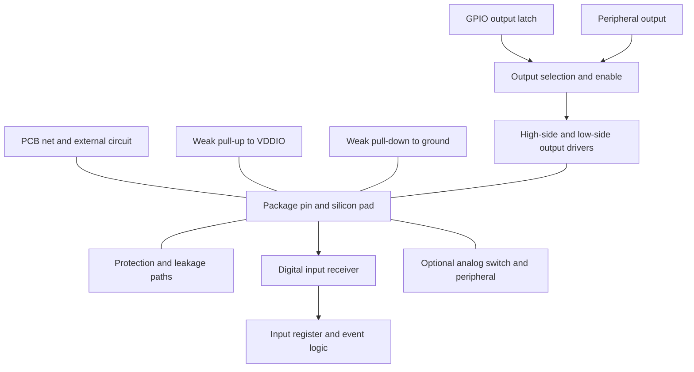
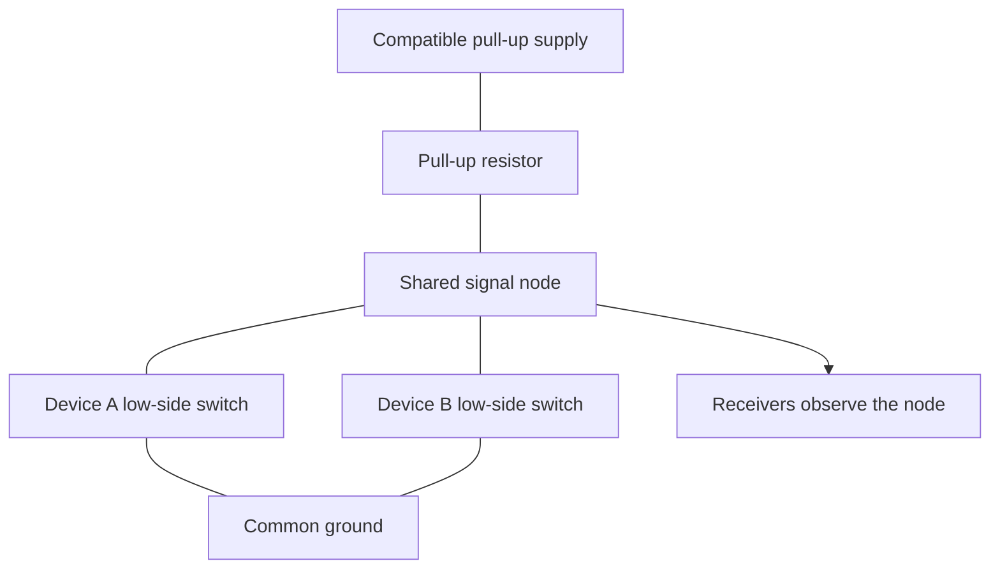
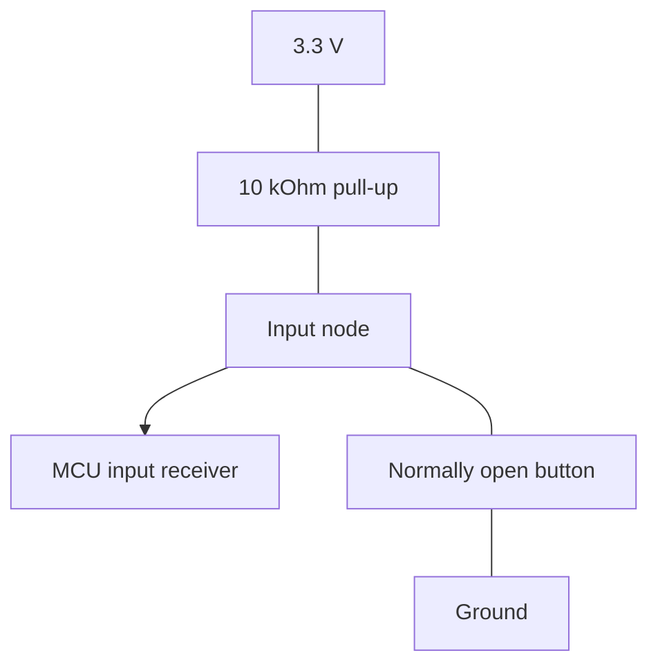
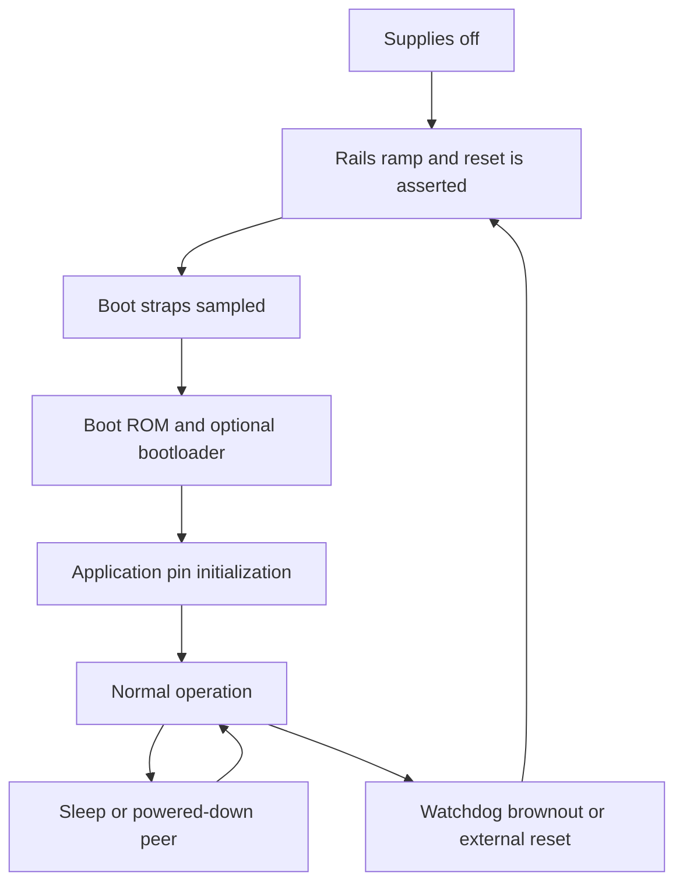

# GPIO: from the silicon pad to a reliable board

> A GPIO is a configurable electrical circuit attached to a package pin. Software selects which circuits connect to that pin; voltage, resistance, capacitance, and the external wiring determine what actually happens.

This chapter starts with voltage and current, opens up the pin cell, and builds toward practical firmware and board decisions. It covers ordinary microcontroller GPIOs, important exceptions, and the questions to ask of an unfamiliar device. It is not a substitute for the electrical limits of your exact part, package, pin, and operating mode.

**Verification:** numerical examples below are calculations with explicitly stated assumptions, not measured MCU characteristics. The C examples are teaching examples with verification notes in section 4. No hardware captures or physical measurements are claimed. Diagrams are simplified functional models, not transistor schematics extracted from a manufacturer.

## Reading map

Read section 2 first for the conceptual foundation. Sections 9 through 18 develop the electrical details; sections 19 through 25 turn them into design and debugging decisions. The first eight sections follow this repository's peripheral-reference format.

| Need | Section |
| :--- | :--- |
| Fast configuration reference | [1. Cheat sheet](#1-cheat-sheet) |
| Understand the inside of a pin | [2. How it actually works](#2-how-it-actually-works) |
| Connect electrical behavior to registers | [3. Register-level walkthrough](#3-register-level-walkthrough) |
| Read and configure pins in C | [4. Code](#4-code) |
| Plan measurements | [5. Captures and bench experiments](#5-captures-and-bench-experiments) |
| Find a fault from its symptom | [6. Debugging checklist](#6-debugging-checklist) |
| Check understanding | [7. Questions and explained answers](#7-questions-and-explained-answers) |
| Find primary references | [8. Sources and scope](#8-sources-and-scope) |
| Compare pin types | [9. GPIO types are several independent choices](#9-gpio-types-are-several-independent-choices) |
| Choose pull resistors | [10. Pull-ups and pull-downs from first principles](#10-pull-ups-and-pull-downs-from-first-principles) |
| Calculate current | [11. Every important current path](#11-every-important-current-path) |
| Understand shared open-drain wires | [12. Open-drain networks and rise time](#12-open-drain-networks-and-rise-time) |
| Handle unused pins | [13. Unused pins and low-power states](#13-unused-pins-and-low-power-states) |
| Handle reset and power sequencing | [14. Reset boot and power sequencing](#14-reset-boot-and-power-sequencing) |
| Interface different voltages | [15. Logic levels and voltage translation](#15-logic-levels-and-voltage-translation) |
| Understand speed and ringing | [16. Drive strength slew rate and signal integrity](#16-drive-strength-slew-rate-and-signal-integrity) |
| Read buttons and generate interrupts | [17. Inputs interrupts and debouncing](#17-inputs-interrupts-and-debouncing) |
| Use analog-capable pins | [18. Analog mode and shared pin functions](#18-analog-mode-and-shared-pin-functions) |
| Connect actual loads and interfaces | [19. Practical connection recipes](#19-practical-connection-recipes) |
| Avoid firmware races and glitches | [20. Firmware ownership and safe transitions](#20-firmware-ownership-and-safe-transitions) |
| Understand protection limits | [21. Protection injection and latch-up](#21-protection-injection-and-latch-up) |
| Read an unfamiliar datasheet | [22. A datasheet reading procedure](#22-a-datasheet-reading-procedure) |
| Design a board's pin policy | [23. A worked board-level pin plan](#23-a-worked-board-level-pin-plan) |
| Practice calculations | [24. Worked exercises](#24-worked-exercises) |
| Review a finished design | [25. Final engineering checklist](#25-final-engineering-checklist) |

## 1. Cheat sheet

| Configuration or term | Electrical meaning | Typical use | What it does not guarantee |
| :--- | :--- | :--- | :--- |
| Digital input | Observe pad voltage through an input receiver; strong output drivers off | Button, interrupt, another IC's output | A defined level when nobody drives it |
| Input with pull-up | Input plus a weak path to the I/O supply | Switch to ground, idle-HIGH input | Accurate resistance or operation during every reset/sleep state |
| Input with pull-down | Input plus a weak path to ground | Switch to supply, idle-LOW input | Availability on every pin |
| Push-pull output | Actively drive toward supply or ground | LED through resistor, chip select, logic signal | Constant output voltage at arbitrary load current |
| Open-drain output | Actively drive LOW or release the wire | Shared interrupt, I2C, compatible reset nets | A HIGH level without a pull-up; higher-voltage tolerance |
| High impedance, Hi-Z | Strong output drive is disconnected | Bus turnaround, released open-drain wire | Zero volts, zero leakage, or isolation from protection circuits |
| Analog mode | Configure the pad for an analog path, often disabling its digital input receiver | ADC, DAC, comparator; unused-pin policy on some MCUs | Unlimited analog voltage or automatically enabled ADC |
| Alternate function | A peripheral takes control of some pad signals | UART, SPI, timers | Automatically correct output type, pulls, speed, or board wiring |
| Drive strength / speed | Select electrical output-drive characteristics | Meet edge timing for the actual load | A software toggle-frequency setting or regulated current source |
| Active LOW | The external function is asserted by a LOW | Reset, chip select, interrupt | Any particular output transistor topology |

**Five working rules:** identify the driver, identify the receiver, identify the return path, calculate worst-case levels and currents, and check every power state. Most GPIO faults are a failure in one of these five steps.

## 2. How it actually works

### 2.1 Start with voltage, charge, and a complete circuit

A voltage is a difference in electric potential between two points. Saying a pin is at 3.3 V normally means 3.3 V relative to the board's ground at the measurement location. Two boards without a suitable shared reference cannot assume the same meaning for that number.

Current is a flow of charge. A pin can be at a steady voltage while carrying almost no external DC current: a charged capacitor is the useful first model. Sustained current requires a complete path. The familiar resistor relationship is:

$$I = \frac{V}{R}$$

If a 3.3 V source is connected to a 10 kOhm resistor and then to ground, the current is 330 uA. If the path is opened, that resistor no longer carries this current. A HIGH logic level alone does not imply 330 uA, 1 mA, or any other fixed current.

For a capacitance:

$$Q = CV, \qquad i = C\frac{dv}{dt}$$

The pin, PCB trace, cable, probes, and receiving inputs all contribute capacitance. Moving their voltage requires current even if the receiver draws almost no current once the voltage settles.

### 2.2 What is physically inside the package?

The package lead or ball connects to an on-die pad through package interconnect. Around that pad is an I/O cell. A common configurable cell has an input receiver, output transistors, bias elements, protection structures, and switches that select peripheral functions. Not every pin includes every block.



The connections in this diagram express possible paths, not paths that are all enabled at once. Mode bits control them. Protection structures do not usually disappear when firmware chooses input or analog mode.

The CPU core may run from a different internal supply than the I/O bank. The relevant rail for output voltage is the pad's I/O supply, often named VDDIO, VDD, VCC, or a bank-specific name. The core's instruction-set architecture does not define its GPIO electrical behavior.

### 2.3 The input receiver: turning a voltage into a bit

A digital input does not measure the exact voltage. Its receiver interprets voltage regions as LOW or HIGH. Look for:

| Symbol | Meaning |
| :--- | :--- |
| `VIL(max)` | Highest input voltage guaranteed to be accepted as LOW |
| `VIH(min)` | Lowest input voltage guaranteed to be accepted as HIGH |
| `VOL(max)` | Highest LOW voltage an output guarantees at its specified load |
| `VOH(min)` | Lowest HIGH voltage an output guarantees at its specified load |

Between `VIL(max)` and `VIH(min)`, the input has no guaranteed logical interpretation. This region is not a supported third data value, and the thresholds are not universally half the supply.

**Illustrative receiver:** assume `VIL(max) = 0.3 VDDIO` and `VIH(min) = 0.7 VDDIO` at 3.3 V. At or below 0.99 V is guaranteed LOW; at or above 2.31 V is guaranteed HIGH, within allowed input limits. A 1.7 V signal is not valid simply because your debugger currently reports a one. Many real pins use different limits or formulas.

An ordinary CMOS input has very high DC impedance within its permitted range because it controls transistor gates. Real input leakage still exists, changes with temperature, and can flow in either direction. Enabled pulls, clamps, analog circuits, and board contamination add other paths.

### 2.4 Why a floating input is unpredictable

With the output driver off and no pull or external driver, the pad is a small capacitive node with weak leakage paths. Nearby switching wires, mains electric fields, a finger, or a probe can change its charge and therefore its voltage. A value that appears stable on one board is not a defined default.

When an enabled CMOS receiver sits in its transition region, internal conduction and unwanted switching can increase supply current. Crucially, that current can flow **inside the receiver from its supply to ground**, even when an ammeter in the external pin wire would see little current. TI's SCBA004E discusses this mechanism; its example current figures are for the illustrated logic families, not universal MCU numbers. [S2]

### 2.5 Schmitt trigger: separate thresholds for rising and falling

A Schmitt-trigger receiver introduces hysteresis. On a rising input it changes to HIGH at an upper switching threshold. On a falling input it changes to LOW at a lower threshold. Between the thresholds, it retains the previous logical state.

This resists repeated transitions from small noise on a slow-moving signal. It does not make a floating pin defined, eliminate mechanical contact bounce, protect against excessive voltage, or imply zero supply current at every intermediate voltage. Use the specified hysteresis and input-transition conditions of the actual receiver.

### 2.6 Push-pull output: two controlled paths

A useful model is a high-side transistor connecting the pad toward VDDIO and a low-side transistor connecting it toward ground. In CMOS these are commonly PMOS and NMOS devices, with internal control circuitry.

| Requested output | High-side driver | Low-side driver | Pad tendency |
| :--- | :--- | :--- | :--- |
| HIGH | On | Off | Toward VDDIO |
| LOW | Off | On | Toward ground |
| Output disabled | Off | Off | External circuit and bias determine voltage |

This is a logical steady-state model. Real drivers have finite resistance, transition behavior, leakage, and protection. They are not ideal switches. Their control circuit is designed to manage switching; GPIO firmware does not directly drive the individual transistor gates.

**How does a TX pin pull a wire LOW?** The UART selects a zero in its output path. The pad driver turns on its low-side path and turns off its high-side path. The low-side device discharges the wire capacitance and sinks whatever current the external circuit supplies. It does not have to create a negative voltage. A standard non-inverted UART TX normally drives its idle HIGH actively; it does not ordinarily require a pull-up to generate that HIGH.

### 2.7 Source and sink are directions of conventional current

**Sourcing:** current leaves the pin. Example: VDDIO supplies the high-side driver, current exits the pin, crosses an LED and resistor, and returns to ground.

**Sinking:** current enters the pin. Example: the supply feeds a resistor and LED; current enters a LOW output and returns through the low-side driver to ground.

A LOW output can therefore carry substantial current. A HIGH output connected only to a compatible CMOS input can carry very little steady current. Logical value and current direction are related through the external circuit, not interchangeable concepts.

### 2.8 Open drain: LOW or released

In an open-drain model the high-side output drive is absent or disabled. The low-side device can conduct to ground or turn off. A pull-up elsewhere establishes HIGH when all low-side drivers are off.



If either switch closes, the node is LOW. If both open, the resistor charges the node toward its supply. No device actively drives HIGH, so multiple devices can assert LOW without fighting a HIGH driver. This is the basis of many shared active-LOW interrupt lines.

For many GPIO peripherals, writing zero means sink and writing one means release in open-drain mode. That bit encoding must still be checked. Reading the output latch says what you requested; reading the input path, where supported and enabled, says what the pad is actually doing.

### 2.9 Hi-Z is not LOW

High impedance describes a weak electrical connection, not a voltage. A released pin can measure HIGH, LOW, intermediate, or changing depending on the rest of the circuit. It may retain charge briefly.

Input mode, an open-drain output commanded to release, and analog mode can all disable strong output drive. They still differ in their input receiver, bias paths, analog connections, and event logic. Treating them as identical is a common low-power mistake.

### 2.10 One layer deeper: how the transistor makes the connection

A MOSFET has gate, source, drain, and body terminals. The gate is separated from the semiconductor by a thin insulating structure. Gate voltage creates an electric field that changes how readily a conducting channel forms between source and drain. That is why a gate can control current without requiring a continuous gate current comparable to the controlled current.

In a simplified low-side N-channel output transistor, the source is near ground and the drain connects to the pad. Raising its gate sufficiently relative to its source enables the channel. Charge can then move between the pad and ground. If a pull-up is attached, a continuous conventional-current path runs from the pull-up supply, through the resistor, into the drain and through the transistor to ground.

In a simplified high-side P-channel device, its source is at the I/O supply. Pulling its gate sufficiently below its source turns it on, connecting the supply toward the pad. Internal circuitry translates the requested logic value into these gate-control voltages. Firmware writes a logical control register; it does not send the output-load current through the CPU data bus.

The word "sufficiently" matters. A transistor's threshold is not a boundary between a perfect open circuit and a perfect zero-Ohm wire. Conduction increases over a range and depends on terminal voltages, temperature, and device geometry. Pin specifications hide that complexity behind guaranteed output levels at defined loads.

The gate insulation also does not mean the whole package pin has infinite resistance or unlimited voltage tolerance. The external signal pad includes drain junctions, receiver structures, and protection. Even gate insulation has leakage and finite breakdown strength. A pin cell is more than the one transistor shown in a teaching sketch.

### 2.11 Follow one complete output transition

Suppose a push-pull output initially holds a trace and receiving input LOW. Their combined capacitance contains little charge relative to ground. A HIGH request enables the high-side path; current initially flows into that capacitance. As its voltage approaches the I/O rail, charging current falls. Once stable, only leakage and any resistive load require steady external current.

On a LOW request, the high-side path turns off and the low-side path removes the stored charge toward ground. If the load includes an external pull-up, the low-side driver continues to carry pull current after the capacitive discharge ends. If there is only a compatible capacitive input load, the external current again becomes small after settling.

This explains three otherwise confusing observations: switching consumes energy even without an LED or resistor; a static HIGH can draw little current; and a static LOW can draw significant current when another circuit pulls upward.

### 2.12 Which circuits remain enabled in each mode?

The following is a common conceptual model, not a universal register truth table:

| Mode | Strong drive | Digital receiver | Bias | Output value means |
| :--- | :--- | :--- | :--- | :--- |
| Input | Off | On | Optional pull | Latch may be stored but not drive the pad |
| Push-pull output | HIGH or LOW | Often still available | Device-dependent | Drive toward selected rail |
| Open-drain output | LOW or off | Often still available | Pull-up needed somewhere for HIGH | Sink or release |
| Alternate function | Controlled by selected peripheral and pad setup | Peripheral/device-dependent | Device-dependent | GPIO latch may no longer control the pad |
| Analog/input-disconnected | Normally off for analog input; analog output is a separate case | Disabled where specified | Normally no unwanted pull | Digital read may not represent the pad |

Use the actual functional diagram to find overrides. An oscillator, debug interface, analog peripheral, or low-power controller may bypass the settings that ordinary GPIO uses.

## 3. Register-level walkthrough

### 3.1 Translate each decision into one hardware setting

Before choosing register values, answer these questions in order:

1. Which exact package pin reaches the board net, and which I/O rail powers it?
2. Is the MCU observing the net, driving it, or sharing ownership?
3. Which block owns it: GPIO, UART, timer, ADC, debugger, or another function?
4. If driving, is the topology push-pull or open drain?
5. What establishes its voltage when the strong driver is off?
6. What level must exist before firmware starts and while it sleeps?
7. What input threshold, current budget, and edge timing are required?

Registers implement these decisions; a HAL configuration structure does not replace them.

### 3.2 Concrete STM32F407 register vocabulary

The repository already contains a register layout in [stm32f4_regs.h](https://github.com/ChitranshBaregama/embedded-systems-resources/blob/main/code/stm32f4/stm32f4_regs.h). For the STM32F407-style block, the principal settings are:

| Register | Role |
| :--- | :--- |
| `RCC_AHB1ENR` | Enable access clock for a GPIO port |
| `MODER` | Two bits per pin: input, output, alternate function, analog |
| `OTYPER` | Push-pull versus open-drain output type |
| `OSPEEDR` | Output speed selection |
| `PUPDR` | Pull-up, pull-down, or neither |
| `IDR` | Sampled input state |
| `ODR` | Output latch |
| `BSRR` | Set/reset selected output bits through one write |
| `AFR[0]`, `AFR[1]` | Alternate-function selection |
| `LCKR` | Configuration-lock mechanism; follow its documented sequence |

This map is device-family-specific. Classic AVR uses `DDRx`, `PORTx`, and `PINx`; on those devices `PORTx` can control the pull-up while a pin is an input. Newer AVR devices use a different port design. A register name carried over from another MCU can be actively misleading. [S3, S4]

### 3.3 Configure an output without an avoidable pulse

For an ordinary GPIO output on this STM32F4 block, initialize the output latch to the desired level **before** connecting the output driver through `MODER`. Set output type, bias, and speed before that final mode change. Start from a known state in which no peripheral is actively driving the pin.

Suppose a sensor chip-select is active LOW and must remain inactive. An external pull-up holds it HIGH through reset. Firmware preloads HIGH, configures push-pull, then enables the output. Enabling output first while the latch contains zero can produce an unintended selection pulse.

This technique controls the application handover. It does not control boot ROM activity or every internal mux transient. Capture startup if even a short pulse matters; an external enable gate or supervisor may be necessary.

### 3.4 Atomic bit operations and their limits

An expression such as `port->ODR |= mask` reads a whole register, modifies a local value, then writes the whole register. Another context can update a different bit between the read and write and have its update lost.

Where the device provides write-only set/reset operations, use those for independent output bits. On this block, `BSRR` lower bits request sets and upper bits request resets. Assign a constructed value directly; do not read-modify-write a write-action register.

A set/reset operation avoids that particular race. It does not make a multi-register pin reconfiguration atomic, make an `ODR`-based toggle race-free, or make independent peripherals share a pin safely. See section 20.

## 4. Code

### 4.1 Register example: preloaded output and pulled input

**Scope:** STM32F407-style GPIO, using this repo's existing header. PA5 is an arbitrary teaching output and PA0 an arbitrary button input. Their availability and external connections must be checked on your board. This is initialization under exclusive ownership, before interrupts or tasks can reconfigure GPIOA; it is not a live peripheral handover routine.

**Verification level:** the complete block passed host GCC checks against the repository header with `-std=c11 -Wall -Wextra -Werror -Wconversion -Wshadow`. That does not verify Arm code generation, register timing, pin voltage, or hardware operation. It is not a complete firmware image and has not been run on a board.

```c
#include <stdbool.h>
#include <stdint.h>
#include "stm32f4_regs.h"

#define STATUS_BIT (UINT32_C(1) << 5)
#define BUTTON_BIT (UINT32_C(1) << 0)

void gpio_example_init(void)
{
    RCC->AHB1ENR |= RCC_AHB1ENR_GPIOAEN;
    (void)RCC->AHB1ENR;

    /* PA5: preload LOW before enabling its output driver. */
    GPIOA->BSRR = STATUS_BIT << 16;
    GPIOA->OTYPER &= ~STATUS_BIT;
    GPIOA->OSPEEDR &= ~(UINT32_C(3) << 10);
    GPIOA->PUPDR &= ~(UINT32_C(3) << 10);
    GPIOA->MODER = (GPIOA->MODER & ~(UINT32_C(3) << 10))
                 | (UINT32_C(1) << 10);

    /* PA0: input with pull-up; a button connects PA0 to ground. */
    GPIOA->MODER &= ~UINT32_C(3);
    GPIOA->PUPDR = (GPIOA->PUPDR & ~UINT32_C(3)) | UINT32_C(1);
}

void status_set(bool high)
{
    GPIOA->BSRR = high ? STATUS_BIT : (STATUS_BIT << 16);
}

bool button_is_pressed_raw(void)
{
    return (GPIOA->IDR & BUTTON_BIT) == 0u;
}
```

The two-bit fields for PA5 start at bit 10 because `2 * 5 = 10`. `01` in its `MODER` field selects output; `00` in its `OSPEEDR` field selects the lowest speed setting. The button's active-LOW wiring explains the `== 0u`; it is not an inversion performed by the pull-up.

To configure a native open-drain output, preload its release state, select open drain in the output-type register, and then enable output mode. An external pull-up must already have a suitable voltage and value. An internal pull-up is not automatically an adequate bus pull-up.

### 4.2 Portable button debouncer

This block translates sampled raw button states into one stable-state change notification. It has no register access and no interrupt dependency. Call it periodically, for example every 1 ms, from one owner. A state must remain unchanged for 20 ms **in the samples observed by this function** before it is accepted. Pulses between samples are not detected.

The 20 ms interval is a teaching choice, not a universal switch specification. Choose it from measured bounce and required response time. Initialize before use; a button already held at startup becomes the initial state without generating a new press event.

**Verification level:** host checks passed for bouncing press and release, the acceptance-time boundary, a button held at startup, suppression of duplicate events, and timer wraparound, with AddressSanitizer and UBSan. Leak detection was disabled because it is unsupported in the execution environment; this example allocates no dynamic memory. These tests do not model real switch waveforms or validate hardware.

```c
#include <stdbool.h>
#include <stdint.h>

typedef struct {
    bool stable_pressed;
    bool candidate_pressed;
    uint32_t candidate_since_ms;
} button_filter_t;

void button_filter_init(button_filter_t *f, bool raw_pressed,
                        uint32_t now_ms)
{
    f->stable_pressed = raw_pressed;
    f->candidate_pressed = raw_pressed;
    f->candidate_since_ms = now_ms;
}

bool button_filter_update(button_filter_t *f, bool raw_pressed,
                          uint32_t now_ms)
{
    if (raw_pressed != f->candidate_pressed) {
        f->candidate_pressed = raw_pressed;
        f->candidate_since_ms = now_ms;
    }

    if ((f->candidate_pressed != f->stable_pressed)
        && ((uint32_t)(now_ms - f->candidate_since_ms) >= UINT32_C(20))) {
        f->stable_pressed = f->candidate_pressed;
        return true;
    }
    return false;
}
```

After a `true` return, inspect `stable_pressed` to distinguish a press from a release. Do not interpret `true` as always meaning a press. Unsigned elapsed-time subtraction works across a 32-bit timer wrap when the actual elapsed interval is less than one full counter period; regular polling satisfies this for a 20 ms filter. A tick source that stops in sleep needs a deliberate wake policy.

### 4.3 Why a host test cannot prove GPIO electrical behavior

A host test can check debounce state transitions, wraparound arithmetic, and event counts. It cannot prove a pull resistor exists in silicon, a driver meets `VOL`, or a boot pulse is absent. Even a register mock only checks software's intended writes. Verification must match the claim being made.

## 5. Captures and bench experiments

**Status: proposed experiments, not recorded results.** Start with a low-voltage development board, its documented I/O rail, passive resistors, and a known-compatible load. Do not create a deliberate short or exceed a pin rating to test a concept.

| Experiment | Setup | What to capture | What a failure suggests |
| :--- | :--- | :--- | :--- |
| Floating versus biased input | Compare input/no-pull with input/pull-up and input/pull-down | Pad voltage and reported bit | Floating results change with probe, touch, or nearby activity |
| Button current | Pull-up to rail, button to ground | Supply current in open and closed states | Wrong resistor, hidden board load, or opposite pull |
| Open-drain release | Switch LOW/release with known pull-up and measured load | Analog rise and fall waveforms | Slow rise: excess RC; high `VOL`: excess sink load |
| Reset default | Probe reset, VDDIO, and a control pin from power-on | Entire boot interval and reset events | Unexpected boot-ROM drive or missing external bias |
| Output loading | Add permitted resistive loads incrementally | `VOH` or `VOL` at each known current | Output resistance and specification limits becoming relevant |
| Low-power policy | Compare approved pin configurations in the same sleep mode | Settled board supply current | Bias conflict, floating receiver, powered-down peer, wake activity |
| Debounce | Record a real button plus software event output | Contact bounce and event timing | Multiple events, slow polling, or incorrect state ownership |

A logic analyzer tells you which side of its own threshold the signal crossed. It does not prove valid MCU input levels, absence of overshoot, or acceptable rise time. Use an oscilloscope for analog shape. A DMM averages many waveforms: a 50% duty-cycle signal can resemble an intermediate DC voltage.

Probe loading matters. The probe adds capacitance and resistance; a weakly biased node may change when measured. Use a short ground connection for fast edges. Measure current in series with the intended supply path; placing a current meter directly across a supply or output creates a low-resistance path.

For each saved capture, record MCU and board revision, exact pin, I/O rail, register settings, external resistors, load, firmware revision, probe type, time scale, and trigger. See [driver bring-up](https://github.com/ChitranshBaregama/embedded-systems-resources/blob/main/patterns/driver-bring-up.md) for a systematic measurement workflow.

## 6. Debugging checklist

| Symptom | Plausible mechanism | First useful check |
| :--- | :--- | :--- |
| Input changes when touched | Floating or excessively weak bias | Verify actual pull availability and measure voltage |
| Input always LOW | External short, pull-down, active driver, wrong pin, analog/input path disabled | Inspect schematic, mux, then isolate external connection |
| Open-drain never reaches HIGH | Missing pull-up, a participant stuck LOW, too much leakage | Measure the released node and isolate participants |
| HIGH output is below its rail | Excess load, contention, rail problem, leakage into unpowered device | Measure current, VDDIO, and the other device's supply |
| LOW output remains too high | Sink load too large, poor ground, wrong mode | Calculate sink current and inspect `VOL` conditions |
| Works on bench, fails warm | Leakage growth, weak pull, small logic margin | Recalculate worst-case leakage and thresholds |
| Battery current unexpectedly high | Opposing pull, mid-level input, repeated wake, back-power | Audit each net in the actual sleep state |
| GPIO register changes but pin does not | Peripheral owns pin, wrong port, clock/reset issue, board short | Read mux, mode, pad voltage, and physical continuity |
| Output latch is HIGH but pad reads LOW | Open-drain release held LOW externally, contention, wrong input configuration | Separate latch state from pad state |
| Pin pulses during startup | Default latch, late bias, boot ROM, unsafe mux handover | Capture before application initialization |
| MCU stays partly alive with its power off | Signal injection through an I/O path | Measure the nominally off rail; inspect powered peers |
| More than one button event per press | Mechanical bounce or repeated level interrupt | Capture contacts and examine debounce/acknowledgment logic |
| Interrupt never arrives | Wrong routing, masked source, unsupported wake mode, pulse too short | Trace pad-to-event-to-controller configuration |
| Selecting fastest speed causes failures | Ringing, overshoot, crosstalk, ground bounce | Scope the receiver end and lower edge strength if timing permits |
| ADC changes when pulls change | Pull loads sensor or divider | Disable unintended pulls and check acquisition time |
| Cannot debug after initialization | Application repurposes debug pins | Preserve SWD/JTAG and use supported connect-under-reset recovery |

When a UART RX line is unexpectedly LOW, first identify who should drive it. Check the remote TX, both supplies, common ground, pin mux, inversion, break condition, and any transceiver. A pull-up may define a disconnected RX input, but it cannot fix an actively LOW peer or a wrong-voltage interface. See [UART](https://github.com/ChitranshBaregama/embedded-systems-resources/blob/main/peripherals/uart.md).

## 7. Questions and explained answers

1. **Does setting a pin HIGH inject a fixed current into the wire?** No. The driver establishes a voltage subject to its output characteristics; the load determines the current within that operating region.
2. **Where does pull-up current flow when the button is open?** Mostly nowhere after the node charges, apart from input and board leakage. The large `V/R` current appears when the button closes a path to ground.
3. **Can a LOW pin consume more power than a HIGH pin?** Yes. A LOW open-drain pin sinks its pull-up current, and a LOW LED output may be the LED's ON state.
4. **Is an input an open circuit?** Only approximately within its allowed voltage range. There are leakage, capacitance, protection, and possibly bias paths.
5. **Is open drain with latch value one a HIGH output?** It is a release request. An external pull-up and the other participants determine whether the wire becomes HIGH.
6. **Why not use a 1 Ohm pull-up for a clean edge?** A LOW would demand approximately supply voltage divided by 1 Ohm. The pull must satisfy the sink-current limit as well as edge timing.
7. **Why not use 10 MOhm to save current?** Leakage, coupled noise, and RC delay may prevent valid levels. Current saving must fit within an electrical design window.
8. **Does analog mode start the ADC?** No. It configures a pin path. ADC enable, channel selection, reference, sampling time, and conversion control are separate.
9. **Should every unused pin become output LOW?** No. That could fight another device or corrupt a boot/debug function. First classify what the net connects to and consult the specific device's unused-pin guidance.
10. **Does 5 V tolerance mean the pin outputs 5 V?** No. It describes permitted input conditions. Output voltage normally follows the I/O rail.
11. **Does 5 V tolerance guarantee safe operation when VDDIO is zero?** No. Powered-off behavior is a separate specification.
12. **Does a Schmitt trigger debounce a button?** Not by itself. A bouncing contact can make multiple full valid transitions through both thresholds.
13. **Does a GPIO speed of 50 MHz generate a 50 MHz output?** No. It describes a driver setting under specified conditions. Actual toggling depends on the signal source and load.
14. **Can a host test establish a pin's maximum safe current?** No. That limit comes from the silicon documentation and operating conditions; measurements can validate a design within those limits.
15. **Can two push-pull outputs share a wire if they normally agree?** Do not assume so. Startup, updates, faults, and propagation differences can make them disagree. Use an interface designed for sharing.
16. **Why can disabling a peripheral increase current?** Its output may become Hi-Z and leave a receiver floating, or an external pull may then oppose the new state. Re-evaluate the entire net.

## 8. Sources and scope

The explanations and worked circuits are original teaching material. Numerical design examples are hypothetical unless explicitly identified as a manufacturer value. Device-specific facts must be applied only under the cited device's conditions.

| ID | Primary reference | Applicable detail |
| :--- | :--- | :--- |
| S1 | ST, [STM32F405xx/STM32F407xx datasheet DS8626](https://www.st.com/resource/en/datasheet/stm32f407ig.pdf), Rev 12, March 2026 | Pin descriptions; section 6.2 absolute maxima; section 6.3.16 I/O characteristics and footnotes |
| S2 | TI, [Implications of Slow or Floating CMOS Inputs, SCBA004E](https://www.ti.com/lit/an/scba004/scba004.pdf), July 2021 revision | CMOS input conduction, slow transitions, floating inputs, bus hold |
| S3 | ST, [RM0090](https://www.st.com/resource/en/reference_manual/rm0090-stm32f405415-stm32f407417-stm32f427437-and-stm32f429439-advanced-armbased-32bit-mcus-stmicroelectronics.pdf), register reference used by the existing repo header: Rev 19, GPIO chapter | Further register reference; this chapter reuses the repository's existing definitions rather than claiming a fresh full-manual audit |
| S4 | Microchip, [AVR MCU Digital I/O Ports](https://developerhelp.microchip.com/xwiki/bin/view/products/mcu-mpu/8-bit-avr/structure/ioports/), page modified November 9, 2023 | Classic AVR `DDR`, `PORT`, and `PIN` behavior |
| S5 | Microchip, [Getting Started with GPIO, DS90003229B](https://www.microchip.com/content/dam/mchp/documents/MCU08/ApplicationNotes/ApplicationNotes/Getting-Started-with-GPIO-DS90003229B.pdf), 2021; [HTML chapter](https://onlinedocs.microchip.com/oxy/GUID-78D70ED6-D060-4984-8F25-B119A2A89ABB-en-US-3/GUID-5D30D1DD-F533-422F-85F5-B5C4EE00AD86.html) | Modern AVR port structure, input-buffer disable, pull-ups; do not transfer register names to classic AVR |
| S6 | Microchip, [Unconnected Pins](https://onlinedocs.microchip.com/oxy/GUID-80B1922D-872B-40C8-A8A5-0CBE009FD908-en-US-3/GUID-1202C854-A818-468D-9DA4-90465F1E4C4D.html), online manual section 18.2.4, accessed September 22, 2026 | Defined idle levels, reset/active states, avoiding direct ties on configurable outputs |
| S7 | NXP, [I2C-bus specification UM10204](https://www.nxp.com/docs/en/user-guide/UM10204.pdf), Rev 7.0, October 1, 2021 | Section 3.1.1 open-drain interconnection; section 7.1 pull-up sizing |
| S8 | TI, [PCF8574 datasheet SCPS068K](https://www.ti.com/lit/ds/symlink/pcf8574.pdf), September 2024 revision | Section 7, quasi-bidirectional operation; a distinct topology from normal push-pull MCU GPIO |
| S9 | Espressif, [ESP32 GPIO and RTC GPIO](https://docs.espressif.com/projects/esp-idf/en/stable/esp32/api-reference/peripherals/gpio.html), rolling ESP-IDF documentation, accessed September 22, 2026 | Original ESP32 pin restrictions, input-only pins, and strap/peripheral reservations |
| S10 | TI, [Eliminate Power Sequencing With Powered-Off Protection, SCDA015](https://www.ti.com/document-viewer/lit/html/SCDA015), online application brief, accessed September 22, 2026 | Powered-off protection and back-powering; apply each selected component's own limits |
| S11 | ST, [AN4899 GPIO hardware settings and low-power consumption](https://www.st.com/resource/en/application_note/an4899-stm32-microcontroller-gpio-configuration-for-hardware-settings-and-lowpower-consumption-stmicroelectronics.pdf) | Further reading for STM32 pad modes and unused pins; use the revision applicable to your product with its reference manual and datasheet |
| S12 | ST, [STM32F4 HAL GPIO implementation](https://github.com/STMicroelectronics/stm32f4xx-hal-driver/blob/master/Src/stm32f4xx_hal_gpio.c), inspected September 22, 2026 | Register field handling, initialization order, `BSRR` writes, and EXTI port selection; source implementation, not an electrical specification |

For Renesas RL78, Nordic, ESP32-S3, or a custom Cortex-M33 SoC, apply the circuit reasoning but obtain that exact part's hardware manual. An RL78 port mode, an STM32 analog mode, and a Nordic input-disconnect setting are not interchangeable register recipes. Errata, package restrictions, and board wiring remain part of the specification.

## 9. GPIO types are several independent choices

Asking "what type is this GPIO?" can refer to five different axes. Separate them to avoid combinations such as assuming an interrupt-capable pin must be an input-only pin.

| Axis | Possible choices | Question it answers |
| :--- | :--- | :--- |
| Physical pad capability | Input-only, output-only, bidirectional, analog-capable, special-voltage pad | What circuits exist? |
| Output topology | Push-pull, open drain, open source, quasi-bidirectional | How can it drive the net? |
| Input behavior | Ordinary threshold, Schmitt trigger, optional filter, disconnectable buffer | How is voltage observed? |
| Functional owner | GPIO, UART, SPI, timer, analog peripheral, boot/debug logic | Who controls or reads it? |
| Power domain | Main I/O bank, always-on/RTC bank, retention-capable bank | What works in each power state? |

An **input-only** pin lacks a usable output driver. It may also lack pulls. On the original ESP32, GPIO34 through GPIO39 are input-only and do not provide software-controlled pulls. Do not extend that numbering rule to ESP32-S3 or other ESP32-family parts. [S9]

An **open-collector** output uses a bipolar-transistor collector rather than a MOSFET drain. Its external LOW-or-release behavior resembles open drain; saturation voltage, leakage, and drive characteristics differ.

An **open-source** output has the complementary behavior: source current toward a supply or release. It generally needs a pull-down for a defined inactive LOW. It is less common than open drain in MCU configuration menus.

A **quasi-bidirectional** pin, exemplified by PCF8574, combines a strong LOW capability with a weak HIGH source and device-specific transition behavior. Writing one allows it to be used as an input; an external circuit can pull it LOW against the weak source. It is neither an ordinary strong push-pull HIGH nor a perfectly disconnected open-drain release. Check its source capability before using it to drive a load. [S8]

A **bus keeper** weakly maintains the most recent logical state. Unlike a fixed pull-up, it does not select a universal idle HIGH. A newly attached device must overcome its holding current. Power-up behavior is specified by the device. [S2]

An **interrupt or wake-capable** GPIO has an event-detection path. Wake capability may be limited to certain pins, levels, edges, or power modes. It does not imply different normal drive capability.

An **RTC or always-on GPIO** may remain functional while main-domain GPIO loses configuration or power. Its numbering and mux ownership can differ. A **touch-capable** pad connects to a capacitance-measurement circuit; its pulls and digital activity can interfere with sensing.

**NC, DNC, reserved, supply, oscillator, and reset pins are not automatically GPIOs.** NC and DNC meanings are manufacturer-specific. Follow the pin table rather than assigning a generic unused-GPIO policy.

## 10. Pull-ups and pull-downs from first principles

### 10.1 A weak default with an override path

A pull-up is a resistor or weak bias element between a node and a positive rail. It gives the node a HIGH default while allowing an external switch or transistor to pull it LOW with manageable current. A pull-down does the complementary job.

Calling a pull "weak" means its effective impedance is high compared with the intended active driver. It does not mean it is always physically a precision resistor. Internal pulls may use transistor structures and have a wide specified variation with process, voltage, and temperature.

For a pulled-up button:



Button open: after charging, the input is near 3.3 V. Almost the entire resistor has nearly zero voltage across it, so its current is approximately the leakage needed to sustain the node. Button closed: the node is near ground, the resistor sees nearly 3.3 V, and about 330 uA flows through the button. The receiver observes LOW without needing that current to flow through its transistor gate.

The pull does not force a voltage regardless of load. It establishes one end of a circuit whose other paths decide the final node voltage.

### 10.2 Why a push-pull output usually needs no pull

A push-pull output already has a strong path for HIGH and a strong path for LOW. An extra pull is not normally needed to create either state. A pull may still be needed for reset, sleep, a disconnected driver, or handover between owners.

If an output drives LOW against a pull-up, there is continuous current. If it drives HIGH against a pull-down, there is continuous current. A matching pull produces little DC current once the output settles, although it still loads transitions and affects power-off behavior.

### 10.3 Internal or external?

| Requirement | Internal pull | External pull |
| :--- | :--- | :--- |
| Quick local button experiment | Often suitable if available | Also suitable |
| Defined state before firmware | Only if reset documentation guarantees it | Can establish it while its rail is valid |
| Controlled resistor tolerance | Usually broad | Selectable tolerance and temperature coefficient |
| Long/noisy wire | May be too weak | Can be sized with filtering and protection |
| Shared open-drain bus | Must calculate; often insufficient | Normally selected from sink and timing constraints |
| Bias during deep sleep | Verify retention and power domain | Exists independently of firmware, but rail must remain powered |
| Unpowered MCU with live peer | Can create unwanted rail paths | Still requires powered-off compatibility analysis |

An external pull is not inherently correct just because it is external. Its voltage, tolerance, resistor value, rail sequence, and failure state all matter.

### 10.4 Upper resistance bound from leakage

Model the worst-case leakage as a current pulling a HIGH input downward:

$$V_{node} \geq V_{PU,min} - I_{leak,max}R_{PU,max}$$

To preserve a valid HIGH with additional margin `M`:

$$R_{PU,max} \leq \frac{V_{PU,min}-V_{IH,min}-M}{I_{leak,max}}$$

Use the worst applicable HIGH requirement and include leakage from every attached device, protection component, connector, and expected contamination. If the numerator is not positive, resistor choice alone cannot establish the required HIGH margin.

**Calculated example:** a 3.0 V minimum pull rail, a required HIGH of 2.1 V, 5 uA worst-case net leakage to ground, and 0.2 V desired margin allow at most 140 kOhm actual pull resistance. A nominal 150 kOhm part is already outside that budget. A 100 kOhm part might pass DC yet still fail edge timing or noise requirements.

For a pull-down with leakage injecting current into the node:

$$V_{node} \leq I_{leak,max}R_{PD,max}$$

Require that result to remain below the applicable `VIL(max)` with margin.

### 10.5 Lower resistance bound from sink capability

A LOW driver must sink the pull-up current while keeping the node below the receiver's LOW limit. If the driver guarantees `VOL(max)` at current `IOL`:

$$R_{PU,min} \geq \frac{V_{PU,max}-V_{OL,max}}{I_{OL}}$$

This is a load-line bound using the guaranteed `VOL` test condition; do not substitute the pin's absolute-maximum current for `IOL`. Other loads also consume sink-current budget. For a strict current ceiling under a near-zero output voltage, use the more conservative `VPU,max / Iallowed` bound as well.

The same reasoning applies to a pull-down overridden by a HIGH source. Check source capability and guaranteed `VOH` rather than assuming it equals the sink capability.

### 10.6 Opposing pulls create a divider

For a pull-up `RU` and pull-down `RD`, neglecting leakage:

$$V_{node}=V_{DD}\frac{R_D}{R_U+R_D}, \qquad I=\frac{V_{DD}}{R_U+R_D}$$

Equal 10 kOhm pulls on a 3.3 V rail make 1.65 V and 165 uA. That voltage may sit in the undefined digital region. If a board already has a pull-up, enabling an internal pull-down does not make a clean LOW by declaration; it changes this divider.

Never assume a reserved "both pulls" register encoding enables a useful divider. Hardware may prohibit it or implement a keeper instead.

### 10.7 Multiple pull-ups add in parallel

Two sensor boards with 4.7 kOhm pull-ups produce 2.35 kOhm when connected together. Three produce about 1.57 kOhm. This improves RC rise time but increases the LOW-state current every participant must sink. Inventory module resistors before adding another.

## 11. Every important current path

### 11.1 A current accounting table

| Situation | Dominant path | First calculation |
| :--- | :--- | :--- |
| Valid static input, no pull | Input leakage and internal receiver supply current | Datasheet maxima, temperature, actual input voltage |
| Floating enabled input | Uncontrolled receiver conduction and switching | Cannot assign a reliable value from `V/R` alone |
| Pull-up held LOW | Pull rail through resistor and sink driver | `(VPU - VOL) / R` |
| Pull-down held HIGH | Source driver through resistor to ground | `VOH / R` |
| HIGH output driving LED | I/O supply through driver, LED, resistor | `(VOH - VF) / R` |
| LOW output sinking LED | Supply through resistor and LED into pin | `(Vsupply - VF - VOL) / R` |
| Output driving capacitance | Charge/discharge of net capacitance | `i = C dv/dt` |
| Two conflicting outputs | One high-side driver through another low-side driver | Output resistances and interconnect; avoid this state |
| Driven unpowered input | Possible protection path into dead rail | Device powered-off and injection specifications |
| GPIO drives transistor gate | Gate charging and discharging; gate-bias resistor | Gate charge times switching rate |

### 11.2 Output resistance explains droop

For intuition, approximate an active output transistor by an on-resistance. A HIGH output becomes `VDDIO - I RON`; a LOW output rises to `I RON`. Real output devices are nonlinear and temperature-dependent, so this model does not replace guaranteed `VOH`/`VOL` tables.

If a hypothetical output drops 0.2 V at 4 mA, the local effective resistance is 50 Ohm. You cannot safely extrapolate that line to arbitrary current. The absolute-maximum table is a damage boundary, not a recommended load setting or a promise of valid logic voltage.

Check per-pin, per-port/group, total source/sink, supply-pin, and package thermal limits. Ten individually legal loads can exceed a shared limit. A pin configured for a larger drive setting does not create additional package current capacity.

### 11.3 Capacitive switching power

For an ideal capacitor repeatedly charged from zero to `V` by a conventional driver and discharged to ground, the supply provides `C V^2` energy per complete charge/discharge cycle. Half is stored during charging; over the full cycle that stored energy is also dissipated. Therefore:

$$P_{load} \approx C V^2 f_{cycles}, \qquad I_{supply,avg} \approx C V f_{cycles}$$

Here `f_cycles` is complete LOW-HIGH-LOW cycles per second. Equivalently use the number of zero-to-one charging events per second. Do not count both edges and multiply by this same expression without adjusting the factor.

**Calculated example:** `C = 50 pF`, `V = 3.3 V`, and one million full cycles/s gives about 0.5445 mW and 165 uA average supply current for the capacitive load alone. This excludes internal driver switching, core activity, resistive loads, and leakage. Short edge-current peaks can be much greater than the average.

### 11.4 Static open-drain power

For a pull-up at voltage `V`, resistance `R`, and fraction `DLOW` of time held near ground:

$$P_{pull,avg} \approx D_{LOW}\frac{V^2}{R}$$

For 3.3 V, 4.7 kOhm, and a LOW duty fraction of 0.5, this is about 1.16 mW. An idle-HIGH bus dissipates little resistor power except from leakage. A bus stuck LOW can consume this current continuously while also preventing sleep or generating retries.

### 11.5 Why an unused input can matter more than a sleeping CPU

Suppose a board targets 5 uA sleep current. One externally held-LOW pin with an assumed 40 kOhm pull-up at 3.3 V adds about 82.5 uA. The software can enter its deepest sleep perfectly and still miss the board target by an order of magnitude.

The 40 kOhm value is illustrative; use actual pull limits. If an assumed pull ranges from 30 to 60 kOhm, the same path spans 110 to 55 uA before other variation. Typical values cannot establish a worst-case battery budget.

Measure the whole product's supply as well as relevant rail currents. LEDs, debuggers, regulators, external pulls, and unpowered peripherals can dominate the MCU number.

## 12. Open-drain networks and rise time

### 12.1 Why the rising edge is different from the falling edge

The active low-side transistor can discharge a modest capacitance quickly. On release, the pull-up must charge it through resistance. For a simple RC net beginning at zero:

$$V(t)=V_{PU}\left(1-e^{-t/(RC)}\right)$$

At one time constant `RC`, the voltage is about 63.2% of the rail. To reach 70%, it takes approximately `1.204 RC`. A valid HIGH is reached according to the receiver's threshold, not when firmware writes the release bit.

The 30%-to-70% rise time is:

$$t_r=RC\ln\left(\frac{0.7}{0.3}\right)\approx0.8473RC$$

The 10%-to-90% rise time is approximately `2.197 RC`. They are different measurement conventions; do not compare a scope number using one convention with a specification using the other. NXP uses the former relationship in I2C pull-up sizing. [S7]

### 12.2 Calculate a feasible pull-up window

Assume a 3.3 V bus, 100 pF total load, a 300 ns maximum 30%-to-70% rise time, and a sink guaranteed to meet 0.4 V at 3 mA. These are example design inputs, not a universal GPIO specification.

The sink condition gives approximately 967 Ohm minimum resistance. The timing condition gives:

$$R_{max}=\frac{300\text{ ns}}{0.8473\times100\text{ pF}}\approx3.54\text{ kOhm}$$

A nominal 2.2 kOhm is inside this first-pass window. Calculate again with actual rail tolerance, resistor tolerance, worst-case capacitance, every participant's sink guarantee, and leakage. Also meet the full protocol's timing, not only rise time.

If capacitance becomes 400 pF with the same timing requirement, the upper bound becomes about 885 Ohm. That is below the 967 Ohm lower bound: **no passive pull resistor meets these assumed requirements**. Reduce capacitance or speed, change the allowed timing, or use an appropriate bus buffer/driver. Repeatedly guessing resistor values cannot solve an empty design window.

### 12.3 Wired logic and release semantics

In positive logic, the shared node acts as a wired AND of participants' release requests: it is HIGH only when all release. Interpreted as active-LOW requests, any participant can assert the shared condition.

For bidirectional protocols, read the actual line after release. A different device may hold it LOW. Where the input path is independently controlled, ensure it remains enabled. Never emulate release by driving push-pull HIGH on a shared open-drain wire.

Open-drain level translation is conditional: the pull-up voltage must be permitted by every attached pad in every relevant supply state. A disabled high-side driver does not remove its protection circuitry or grant new voltage tolerance.

## 13. Unused pins and low-power states

### 13.1 First decide what "unused" means

An unbonded die pad, an unconnected package pin, a test point, a connector pin, and a pin connected to a powered-down sensor are different cases. So is a peripheral that is unused only during sleep.

The design objective is to avoid undefined enabled receivers and unnecessary current paths while preserving the circuit's required state. There is no cross-vendor rule that every spare pin must be driven LOW or that every spare pin must be analog.

### 13.2 Decision table

| Net classification | Candidate policy | What must be verified |
| :--- | :--- | :--- |
| Truly unconnected ordinary GPIO | Disable digital receiver through documented analog/input-disable mode; disable unneeded pulls | Recommended by the MCU documentation; no hidden analog load or special function |
| Unconnected GPIO with receiver that cannot be disabled | Input with an available pull to a valid rail; output at fixed level if explicitly suitable | Reset/sleep behavior, future test access, accidental external connection |
| Spare pin routed to connector | Defined input bias or documented disconnect policy plus interface protection | Someone may later drive it; do not assume safe output drive |
| Net with an external fixed pull | Match the needed default and avoid an opposing internal pull | Rail remains valid; leakage and timing limits |
| Net connected to powered IC output | Receive it without fighting it | Voltage compatibility in all power states |
| Net connected to powered-down IC | Choose Hi-Z, safe LOW, or isolation according to that IC's spec | No back-power; required state when peer restarts |
| Wake input | Enable the documented wake path and idle bias | Supported pin, polarity, minimum pulse, pull retention |
| Reset/boot/debug/oscillator pin | Follow dedicated hardware guidance | Boot mode, recovery, crystal network, debugger access |
| NC/DNC/reserved pin | Follow exact pin-table instruction | Do not apply a blanket GPIO initialization loop |

For STM32 parts where analog mode disables the digital receiver, analog/no-pull is a common low-power choice for truly unused ordinary GPIOs. For classic AVR, enabling a pull-up is a documented way to define an unconnected input; newer AVR devices also offer explicit input-buffer controls. These examples illustrate why the vendor's recommendation matters. [S5, S6, S11]

Disabling the receiver permits the external unused pad voltage to be undefined without driving that receiver through its threshold region. It does not make external overvoltage acceptable or protect an exposed connector from ESD.

### 13.3 Why directly tying a configurable pin to a rail is risky

If firmware, boot ROM, or a test process later enables an output of the opposite polarity, a direct tie creates contention. A bias resistor limits current if that configuration error occurs and is usually more flexible. Some dedicated strap or address inputs are explicitly intended for direct ties; follow their own documentation rather than this general GPIO rule. [S6]

### 13.4 Audit each low-power mode separately

Light sleep, stop, standby, system-off, and reset can have different pin behavior. Ask whether the mode retains output latches, output enables, pulls, input receivers, alternate-function selection, and wake logic. A register retaining its value does not always prove the pad remains driven if its supply domain is off.

Before sleeping, place external devices in their required state, settle shared buses, configure approved pin states, and clear or handle pending wake conditions. After waking, restore required ownership and clocks in the documented order. Check whether a bootloader or runtime initialization subsequently overwrites your configuration.

Turning off a GPIO peripheral clock is not generally the same thing as disconnecting its output or stopping an external pull's DC current. A retained output can stay driven while register access is clock-gated.

## 14. Reset boot and power sequencing

### 14.1 A pin has a life before main



The diagram is a conceptual lifecycle, not a timing specification. Different reset sources may affect domains differently. A pin may be an input at initial power-on, a boot communication signal next, then an application output. Its external load sees all of those states.

Use external bias where a chip-select, enable, transistor gate, or reset must have a defined level before firmware. Check which rail supplies that bias. A pull to a rail that rises late cannot define an early state; a pull to an always-on rail may inject current into an unpowered MCU.

### 14.2 Boot straps are sampled under specified conditions

A button or peripheral attached to a strap pin can change boot selection. The relevant question is not only its normal running level: what voltage exists during the strap sample window, with all internal and external pulls and peripheral startup behavior included?

Do not rely on application code to repair a wrong boot mode that prevents application code from running. Avoid strap pins for externally variable signals unless the whole startup circuit is designed accordingly.

### 14.3 Back-powering

Consider a live transmitter driving 3.3 V into an MCU whose VDDIO is zero. In a pad with a conductive upper protection path, current can flow from the signal into the off supply. The MCU may become partly powered, draw unexpected current, fail to reset cleanly, or violate ratings. Other pad structures behave differently; powered-off tolerance is a specific feature, not a consequence of input mode. [S10]

Possible design solutions include a translator or buffer with explicit powered-off protection, coordinated supplies, an approved isolation switch, or a driver state guaranteed safe before the receiver loses power. A resistor may limit current but does not automatically prevent rail rise or satisfy a zero-injection requirement.

A rail's regulator may be unable to sink injected current. Even modest injection can raise a lightly loaded off rail. Do not infer safety merely because the series resistor limits current below a generic value found for another part.

### 14.4 Power-down requires a pin plan too

Before removing power from a sensor, consider MCU TX, chip select, clock, reset, interrupt pulls, and analog input dividers. Any of them may power the sensor through a signal path. On repowering, allow the documented startup interval and reinitialize both protocol state and pin ownership.

## 15. Logic levels and voltage translation

### 15.1 Compare guarantees, not names

For each direction, require:

$$V_{OH,min,driver} \geq V_{IH,min,receiver} + M_H$$

$$V_{OL,max,driver} \leq V_{IL,max,receiver} - M_L$$

Use the worst combinations of supply, temperature, load, ground offset, and specified operating conditions. The margins must cover the actual noise and interconnect behavior. Independently check absolute/recommended input voltage limits.

For a hypothetical 5 V CMOS input requiring 3.5 V HIGH, a 3.3 V transmitter is not guaranteed to work. Some 5 V inputs have lower TTL-compatible thresholds and can accept it; the receiver's datasheet decides. Conversely, a 5 V transmitter may damage an ordinary 3.3 V input even though HIGH would be easy to recognize.

### 15.2 A divider is a conditional one-way solution

Suppose a 5 V push-pull output drives a divider with 10 kOhm from source to node and 20 kOhm from node to ground. The unloaded node is about 3.33 V and the driver supplies about 167 uA. The receiver sees a Thevenin resistance of about 6.67 kOhm.

Now include tolerance. With a 5.25 V source, 9.9 kOhm upper resistor, and 20.2 kOhm lower resistor, the node reaches about 3.52 V before leakage. Whether that is allowed depends on the receiving part and its current supply voltage. Then check HIGH and LOW thresholds, RC edge timing, and unpowered-receiver behavior.

This divider is directional and loads the source. It is not a universal bidirectional translator and is not a substitute for an appropriate interface on fast, long, or hostile connections.

### 15.3 Tolerance and translation are different features

| Feature | Meaning |
| :--- | :--- |
| Higher-voltage-tolerant input | Permits stated input voltage under stated power/mode conditions |
| Push-pull level translator | Actively converts levels using specified supply domains and direction rules |
| Open-drain translator | Shares LOW/release behavior between compatible voltage domains |
| Powered-off protection | Limits unwanted conduction when a specified supply is absent |
| Galvanic isolation | Transfers information across an isolation barrier; also needs a power/reference plan |

Check translators for direction control, output enable, minimum supply, edge rate, loading, and power sequencing. A circuit designed for open-drain I2C is not automatically suitable for fast push-pull SPI. A general-purpose GPIO is not an RS-232, RS-485, CAN, USB, or 24 V industrial-input transceiver.

## 16. Drive strength slew rate and signal integrity

### 16.1 Edge rate is not repetition rate

A pin toggling once per second can still have nanosecond edges. Those edges excite the interconnect's capacitance and inductance and can radiate or couple noise. Repetition rate determines how often an edge occurs; rise/fall time determines much of the edge's high-frequency behavior.

Choose the lowest drive/speed setting that meets measured and guaranteed timing at the actual load. An excessively weak setting can fail timing; an unnecessarily strong one can worsen ringing and EMI.

### 16.2 What stronger drive actually changes

A stronger output generally charges capacitance more quickly and supports a better level under a given load, within its specifications. It does not regulate the load current to the setting's label. A "4 mA drive" label commonly identifies performance at a test load rather than a built-in 4 mA current limiter.

Source and sink characteristics can be asymmetric. A shared package may limit simultaneous switching even when a single pin looks acceptable.

### 16.3 Ground bounce and supply droop

Package and PCB paths have inductance. A quick change in current creates voltage according to `V = L di/dt`. Several outputs switching together can temporarily move the local ground or supply reference. A nearby input may then see a false edge even if its remote driver did not change.

Provide suitable decoupling, continuous return paths, sensible pin grouping, and controlled edge rates. Do not route a sensitive analog net beside a high-current fast edge and expect firmware filtering to undo all coupling.

### 16.4 Series damping is a design tool

A resistor near a push-pull source can reduce ringing and limit edge current by increasing source impedance. Its value depends on driver impedance, line impedance, capacitance, and timing. There is no universally correct 33 Ohm or 100 Ohm choice.

It also adds delay with the load capacitance. Validate the receiver-end waveform. A series resistor is not the same as a pull resistor: one is in the signal path, the other biases the node to a rail. Nor is a small damping resistor necessarily adequate fault-current protection.

For long interconnects whose propagation time matters relative to edge time, use transmission-line reasoning and appropriate interfaces. "The clock is only 1 MHz" does not by itself make a long wire electrically slow.

## 17. Inputs interrupts and debouncing

### 17.1 Polling samples; it does not continuously watch

A polling loop sees the voltage only at its sample times. A pulse that begins and ends between samples can be missed. Busy loops, interrupt service, flash operations, and RTOS scheduling change sample spacing unless deliberately controlled.

Use timer capture, an event counter, a documented external-interrupt path, or other hardware when pulse timing matters. An external interrupt still has minimum pulse-width and synchronization requirements; it is not guaranteed to capture arbitrarily short events.

### 17.2 Metastability and synchronization

An asynchronous edge can arrive close to a receiving flip-flop's clock edge. Internal synchronizers reduce the probability that an unresolved state propagates; they do not provide zero failure probability or zero latency. Firmware cannot remove this analog timing issue by marking a variable `volatile`.

Input sampling latency, synchronizer depth, filter clock, and wake path are device-specific. Multiple pins read as one port do not automatically form a coherent snapshot of an asynchronously changing parallel bus. Use a strobe and timing contract or a suitable peripheral.

### 17.3 Edge and level interrupts

An edge interrupt responds to a transition. A level interrupt remains asserted while the specified level persists and may immediately retrigger after service. A pending bit may record only that one or more events happened; it may not count every edge.

Configure the input and routing, establish the initial condition, handle stale pending state according to the peripheral's semantics, then enable the interrupt. For sources that can change during this sequence, check for an already-active condition or use a documented race-safe arming scheme. Blindly clearing pending state after enabling can erase a real event.

Many status registers use write-one-to-clear semantics. Use the specified write, not a generic read-modify-write that could clear unrelated pending flags. On STM32F4-style EXTI routing, pins with the same pin index from different ports compete for the same EXTI line selection; do not generalize that routing to every MCU.

### 17.4 Contact bounce versus electrical noise

A mechanical switch may make and break repeatedly during one physical action. A pull resistor defines the open state but does not eliminate those transitions. A Schmitt input rejects small threshold-region noise but can still respond to every full bounce.

Software qualification, an RC network feeding an appropriate Schmitt input, or a dedicated debouncer can solve different parts of the problem. If adding a capacitor, calculate the charge and discharge paths and input thresholds. A capacitor directly shorted by the button has an initial discharge-current pulse; include sensible current limiting where needed.

Do not put a long blocking delay inside the GPIO ISR. Record the event and schedule sampling or timer-based qualification. Define whether the application needs press, release, long press, repeat, or pulse count; those are separate state-machine decisions.

### 17.5 Wakeup from a button

A pin that works as an interrupt during normal operation may not work in the deepest sleep. Check which input path remains powered, which edge or level wakes it, and whether the pull survives. Account for a button already held when entering sleep and for bounce on wake. A persistent wake level can prevent the device from staying asleep.

## 18. Analog mode and shared pin functions

### 18.1 Analog voltage is not a digital HIGH or LOW

An ADC pin may intentionally sit at an intermediate voltage. If its digital receiver stays enabled, that voltage can increase receiver current. Where supported, select the documented analog path and disable unwanted digital bias/receivers. This is a pad configuration issue separate from ADC conversion setup.

An enabled pull can substantially alter the measured voltage. Model a sensor as a source `VS` through resistance `RS`. Adding a pull-down `RP` produces approximately:

$$V_{ADC}=V_S\frac{R_P}{R_S+R_P}$$

With `VS = 2 V`, `RS = 10 kOhm`, and an accidental `RP = 40 kOhm`, the node becomes 1.6 V. Calibration cannot make that loading disappear for every sensor condition.

### 18.2 Sample-and-hold load

An ADC often briefly connects a sampling capacitor to the pin. The source must charge it accurately within the acquisition interval. A high source resistance, added series protection, or large divider can require a longer sample time or buffer.

This is why "the input has very high DC impedance" does not establish adequate ADC settling. Also examine analog switch resistance, leakage, channel-to-channel charge transfer, reference behavior, and injection from neighboring pins.

### 18.3 Analog capability does not extend voltage limits

The pad's digital higher-voltage tolerance may not apply in analog mode. Analog switches and converter inputs have their own limits. Verify the pin's mode-specific rating and permitted range relative to analog supplies and references. [S1]

### 18.4 Mux and peripheral ownership

Selecting an alternate function routes a peripheral to a pad. The peripheral must also be enabled and correctly configured. GPIO output-latch writes may no longer affect the pin, while the input path may remain available or may change behavior.

PWM from a timer can continue with little CPU involvement; toggling a GPIO in software depends on instruction timing and scheduling. UART TX idle level is a property of the UART configuration and output path, not a universal reset default of that physical pad.

## 19. Practical connection recipes

### 19.1 LED sourced from a HIGH output

Connect the output through a series resistor and LED to ground with correct LED polarity. Use:

$$R \approx \frac{V_{OH}-V_F}{I_{LED}}$$

For an illustrative 3.3 V rail, 2.0 V LED drop, and 2 mA, the ideal first pass is 650 Ohm; 680 Ohm gives about 1.9 mA before driver droop. Recheck maximum current at maximum supply and minimum LED forward voltage, then verify output and package current limits. A GPIO is not a constant-current LED driver.

### 19.2 LED sunk by a LOW output

Connect a compatible supply through a resistor and LED into the GPIO. LOW lights it; HIGH normally turns it off when the supply and GPIO rail are compatible. Include `VOL` in the ON calculation.

Do not casually place the LED on a higher supply than the pin's rail. In the supposed OFF state, current may still flow into the output or protection network. Use a suitable transistor or driver for differing supplies and larger loads.

### 19.3 Button to ground

Use an input with a suitable pull-up; open means HIGH, pressed means LOW. Add debounce. On a local short trace an internal pull may suffice. A remote cable may need a stronger external bias, filtering, and protection. Decide whether an open cable should indicate inactive, active, or a diagnosed fault.

For an active-HIGH button, use a pull-down and switch to a permitted rail. Both arrangements are valid. The choice follows idle-state current, available pulls, wake support, and required fault behavior.

### 19.4 Open-drain sensor interrupt

Select an input, pull to a rail supported by both MCU and sensor, and configure the correct event polarity. Multiple open-drain sources can share a LOW-active line if their electrical and protocol behavior permits it. After an interrupt, query the sources and clear the underlying conditions; a line may remain LOW until all sources release.

### 19.5 MOSFET control

A GPIO can control a suitable logic-level MOSFET gate for a load switch. For a simple low-side N-channel stage, a gate-to-source pull-down helps hold it OFF while the GPIO is Hi-Z. Choose a MOSFET whose on-resistance is specified at your actual gate drive voltage; threshold voltage only marks the onset of a small conduction current.

The gate is primarily capacitive, but it requires transient current. Average gate-charge current is approximately `Qg * fsw`; the required peak current depends on desired switching time. Large gates or fast power switching need a gate driver. Include an appropriate gate resistor, voltage protection, thermal analysis, and inductive-load suppression where relevant.

### 19.6 Relay, motor, buzzer, or solenoid

Do not assume a GPIO can directly supply a coil or motor. Use an appropriately rated transistor/driver and a suppression path for inductive energy. The MCU pin should control the driver input, not absorb load current or turn-off energy. Establish the OFF state in hardware during reset.

### 19.7 UART, SPI, and I2C

For ordinary UART: TX is commonly push-pull; RX is an input; a pull can define RX when the peer is absent or tri-stated. Confirm voltage levels and inversion.

For SPI: controller clock and data outputs are commonly push-pull. Only the selected target should drive shared MISO; verify the target's deselected Hi-Z behavior. Chip-select pulls protect startup state.

For I2C: use the specified open-drain behavior and correctly sized pull-ups for the ordinary bidirectional bus. Native peripheral configuration is preferable to improvised direction changes. See [I2C](https://github.com/ChitranshBaregama/embedded-systems-resources/blob/main/peripherals/i2c.md) and [SPI](https://github.com/ChitranshBaregama/embedded-systems-resources/blob/main/peripherals/spi.md) for protocol-level requirements.

### 19.8 Keypad matrix and GPIO expanders

A scanned keypad drives selected rows and reads columns with bias. Inactive rows must not fight an active row through simultaneous button closures; select a suitable Hi-Z/open-drain scanning scheme. Multiple keys can create ghost paths unless the matrix and diode arrangement address them.

An I2C/SPI GPIO expander adds protocol and scheduling latency. It may have different reset defaults, input latching, interrupt-clearing rules, and output topology. A quasi-bidirectional expander cannot be treated as a drop-in equivalent to a push-pull MCU port. Do not use a slow expander as a precise real-time pulse generator without proving timing.

## 20. Firmware ownership and safe transitions

### 20.1 One owner per function

Give each control signal a clear software owner. Let other tasks request logical actions from that owner. Names such as `sensor_enable(false)` are less error-prone than scattering raw pin writes whose polarity varies by board revision.

Separate logical assertion from physical voltage. An active-LOW reset helper should express "assert reset" even though it writes zero. Keep pin number, polarity, topology, startup state, and sleep state together in board configuration.

### 20.2 Changing direction safely

For output-to-input, first determine whether an external driver may already be active. Release your output before the other driver asserts, and make sure a valid bias exists during the turnaround interval.

For input-to-output, preload the intended latch and output characteristics before enabling drive where the hardware supports it. When handing a pin between GPIO and a peripheral, stop or prepare the old and new owners according to the peripheral manual. Configuring the mux alone may expose a stale peripheral output value.

### 20.3 Volatile is necessary for MMIO, not sufficient for coordination

`volatile` tells the compiler that register accesses have observable effects. It does not provide a lock, make a multi-step update indivisible, or establish a cross-core ownership protocol. Use dedicated set/reset registers, critical sections, driver ownership, or the SoC's documented synchronization methods for the actual problem.

`ODR ^= mask` is still a read-modify-write. If accurate waveform timing matters, use a timer or supported hardware toggle mechanism rather than assuming a C operation is one electrical event.

### 20.4 Input readback has limits

Where the input buffer remains enabled in output mode, comparing the requested state with pad readback can reveal some shorts or overloads. But it does not measure analog margin, and a receiver may still report HIGH when the output is too weak for another receiver. Independent external monitoring may be needed for a diagnostic requirement.

In analog or input-disconnected modes, a digital read can return a forced or otherwise non-useful value. Consult the manual before treating it as evidence of the pad voltage.

## 21. Protection injection and latch-up

### 21.1 Protection structures are not normal interface elements

Many simplified diagrams show diodes from a pad to the rails. Actual pads may use different clamp arrangements, particularly higher-voltage-tolerant pins. The useful question is which current paths become conductive for the applied voltage and supply state.

On-chip ESD ratings describe specified component-level test conditions. They do not establish that an exposed connector will survive the product's surge, ESD, cable, or industrial transient environment without additional protection.

### 21.2 Injection has limits beyond pin survival

Current injected through a pad can disturb analog readings or other internal circuits even before obvious permanent damage. A datasheet may restrict positive injection, negative injection, total injection, or particular pins differently. It may prohibit a condition entirely.

For an explicitly permitted clamped interface, a first-pass series-resistor estimate is:

$$R \geq \frac{V_{fault,max}-V_{clamp,assumed}}{I_{inj,allowed}}$$

That equation alone is insufficient: clamp voltage is not a precise universal 0.3 V offset, the rail must handle current, resistor fault power matters, and the manufacturer must permit the condition. If allowable injection is zero, dividing by a tiny desired current is not an approved workaround; redesign the interface.

### 21.3 Latch-up is different from ordinary excess load

Parasitic semiconductor structures can enter a sustained high-current state under triggering conditions such as inappropriate injection or transients. Removing the input stimulus may not be enough to recover without cycling power. Follow voltage and injection limits, layout guidance, and protection requirements. A pin that appears to have survived one mistake has not demonstrated long-term reliability.

### 21.4 Contentious outputs

Two outputs driving opposite levels create a path through their driver transistors. The resulting voltage may lie between the rails and the current can be excessive. A midpoint reading is not proof that the outputs averaged safely. Inspect ownership and startup state before changing drive strength or adding a pull.

## 22. A datasheet reading procedure

For each new pin, assemble this information before writing its initialization:

| Read | Extract | Why it matters |
| :--- | :--- | :--- |
| Package pinout and board schematic | Physical pin, port index, board net, connected components | Avoid wrong pin and hidden loads |
| Pin type and footnotes | Input-only, analog, higher-voltage tolerance, reserved functions | Determines feasible configurations |
| Supply chapter | I/O domain, sequencing, minimum operating rail | Defines valid voltage references |
| Absolute maxima | Pin voltage/current and injection limits | Defines prohibited stress conditions |
| Recommended operating conditions | Allowed continuous use | Normal design envelope |
| DC I/O characteristics | `VIH`, `VIL`, `VOH`, `VOL`, leakage, pulls | Establishes logic and resistor margins |
| AC I/O characteristics | Rise/fall, load, input pulse width, speed-setting conditions | Establishes timing |
| GPIO and mux chapter | Direction, driver type, readback, alternate function, atomic access | Implements configuration |
| Reset/boot chapter | Reset defaults, straps, boot ROM use | Establishes pre-firmware behavior |
| Low-power chapter | Retention, input disable, wake routing, pulls | Establishes sleep behavior |
| Errata | Restrictions for the actual silicon revision | Overrides ideal behavior |
| Board/module documentation | LEDs, jumpers, external pulls, flash/debug reservations | Explains differences from a bare MCU |

Read the conditions and footnotes as part of every number. "Typical pull-up resistance" is not a minimum or maximum. "25 mA maximum" is not a recommended LED current. "5 V tolerant" can be limited by pin, supply, or mode. Some special pins have lower current capability than ordinary port pins. [S1]

For production documentation, record the exact manufacturer document revision and silicon/board revision. Do not silently carry a pin policy across an MCU substitution because both parts are Cortex-M or share a package size.

## 23. A worked board-level pin plan

Consider a hypothetical 3.3 V MCU board with one button, one status LED, one sensor enable, an I2C sensor, and a spare header. The sensor supply can be switched off. Exact components have not been chosen, so this table is a design worksheet, not a finished schematic.

| Net | Running state | Reset requirement | Sleep requirement | Question before approval |
| :--- | :--- | :--- | :--- | :--- |
| Button | Input, pull-up, active LOW, debounced | Defined unpressed HIGH | Wake input with retained bias | Does wake support this pin and polarity? |
| Status LED | Push-pull through calculated resistor | LED OFF | LED OFF with no unintended DC path | What polarity and resistor meet worst-case current? |
| Sensor enable | Push-pull control of enable input | External bias holds sensor OFF | Hold OFF or retain ON as intended | Can control pin tolerate either device being unpowered? |
| I2C SDA/SCL | Open drain with calculated external pulls | All drivers released | No back-power into unpowered sensor | Which rail feeds pulls, and are pins power-off tolerant? |
| Sensor interrupt | Input with suitable pull | Inactive or deliberately monitored | Wake only if sensor remains powered | Does its output release when sensor is off? |
| Spare header | Protected, defined input or documented disconnect | No unexpected drive | No floating active receiver | Could a user connect a driven signal? |
| Truly unconnected ordinary pad | Documented unused-pin mode | Accept manufacturer reset state or add approved bias | Same verified low-leakage policy | Any special pad or boot function? |
| SWD/debug | Preserve debug function | Debugger can connect | Decide debugger impact on measured sleep | Can the board recover from broken firmware? |

Now calculate the board's sleep budget. An external button pull-up at 100 kOhm uses about 33 uA when held at 3.3 V. An I2C line accidentally held LOW with 4.7 kOhm consumes about 702 uA. These two states should be in the test plan if they are possible in the product.

The I2C rail choice is a real system decision. Pulling to the always-on MCU rail can back-power the switched-off sensor. Pulling to the switched sensor rail can leave MCU inputs undefined when that rail is off unless input paths or bias are managed appropriately. A power-off-tolerant sensor, isolation, or a different power policy may resolve it. Choose after checking component specifications.

## 24. Worked exercises

### Exercise 1: explain current with a pulled button

**Given:** 3.3 V, 10 kOhm pull-up, open button, negligible leakage.

**Answer:** the pin settles near 3.3 V and steady pull current is approximately zero. With the button pressed, the pin is near zero and current is approximately 330 uA. If pressed 10% of the time, average pull current is about 33 uA, excluding leakage and transition charging.

### Exercise 2: a weak pull fails a HIGH requirement

**Given:** 3.3 V pull rail, 1 MOhm pull-up, 2 uA leakage to ground, receiver needs at least 2.0 V.

**Answer:** the constant-leakage model predicts `3.3 - 2 = 1.3 V`; HIGH is not guaranteed. A 100 kOhm resistor predicts 3.1 V. Recheck actual leakage versus voltage, tolerance, noise, and timing before choosing it.

### Exercise 3: the output and resistor disagree

**Given:** output LOW near 0.1 V, pull-up 4.7 kOhm to 3.3 V.

**Answer:** about `(3.3 - 0.1) / 4700 = 681 uA` enters the output pin. The output is LOW and is sinking current. Resistor dissipation is about 2.18 mW; driver dissipation associated with that path is about 68 uW.

### Exercise 4: identify a missing pull-up

**Given:** native open-drain output; writing zero reads LOW; writing one gives unpredictable readings.

**Answer:** writing one likely releases the driver. Check whether a pull-up exists and whether input readback is enabled. Also check for leakage, a stuck peer, or an unpowered load; the symptom does not prove a missing resistor by itself.

### Exercise 5: a slow released edge

**Given:** 10 kOhm, 200 pF.

**Answer:** `RC = 2 us`; 30%-to-70% rise time is about 1.695 us; time from zero to 70% is about 2.408 us. These are different numbers measuring different intervals.

### Exercise 6: why GPIO HIGH does not mean 5 V

**Given:** I/O rail 3.3 V; a pin documented as 5 V tolerant in a specified input mode.

**Answer:** its normal push-pull HIGH is supplied by the 3.3 V I/O rail. The input-tolerance label does not add a 5 V source. Check analog-mode and powered-off exceptions independently.

### Exercise 7: choose an unused-pin policy

**Given:** one ordinary unconnected pad, one unused header pad, and one pin attached to an unpowered sensor.

**Answer:** for the unconnected pad, use the MCU's documented low-power unused mode. For the header, preserve safe external interaction and protection. For the sensor connection, analyze powered-off paths. A single global "all output LOW" operation has not solved these three different problems.

### Exercise 8: why a meter reads 1.65 V

**Given:** a DMM reads roughly half of a 3.3 V rail.

**Answer:** possibilities include equal opposing pulls, a 50% duty waveform, output contention, or a poorly biased input. Use a scope and inspect ownership. A single average-voltage reading cannot distinguish them.

### Exercise 9: startup glitch reasoning

**Given:** an active-LOW chip-select has an external pull-up; its output latch resets LOW; firmware enables output and then writes HIGH.

**Answer:** between the two writes the driver can assert chip-select. Preload HIGH before enabling output, under the documented pad semantics, and capture reset/boot behavior to verify the full startup interval.

### Exercise 10: a load exceeds the pin budget

**Given:** an LED's desired current is individually permitted, but many LEDs together exceed a port or package limit.

**Answer:** reduce load current or use an external driver. Individual-pin compliance does not waive the shared limit. Multiplexing must meet both instantaneous and average limits and cannot justify excessive peak stress.

## 25. Final engineering checklist

Before calling a GPIO interface complete, be able to answer each item with a schematic, specification, calculation, code path, or measurement:

- Which physical pad, I/O supply, board net, and peripheral owner are involved?
- Which side drives, which side receives, and where does current return?
- Are HIGH and LOW guaranteed at the receiver under worst-case conditions?
- Are normal operation and all supply-order combinations within permitted voltage and injection limits?
- Is the output type compatible with every other driver on the net?
- Is the idle state defined whenever required, including reset and sleep?
- Are pull values justified by leakage, current, noise, and rise-time limits?
- Are per-pin and aggregate current limits met with margin?
- Is the selected edge rate sufficient without unnecessary ringing or coupling?
- Are analog and digital input paths configured deliberately?
- Are boot straps, debug access, reserved pins, and recovery preserved?
- Can a direction or mux change create contention or an unwanted pulse?
- Are interrupt routing, pending flags, debounce, and wake behavior verified?
- Does the unused-pin policy match actual board connectivity?
- Have pad voltage, startup waveform, and board current been measured for the states that matter?

Once you can trace each current path and identify who owns the wire in each state, GPIO configuration stops being a list of API options. It becomes a circuit you can calculate, configure, and test.

