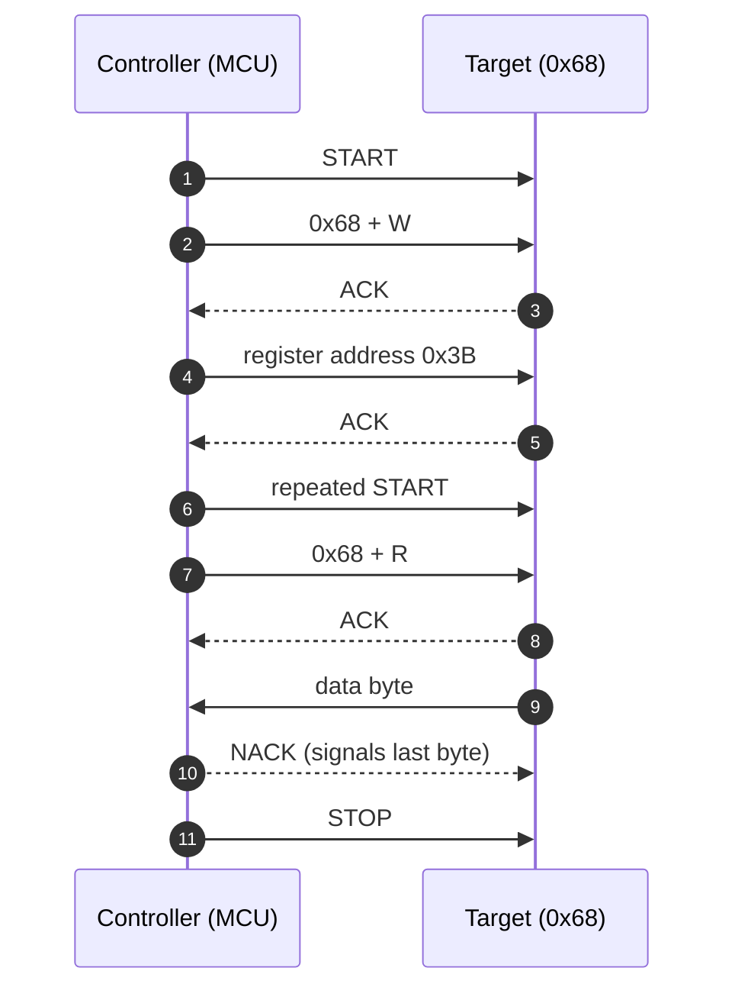
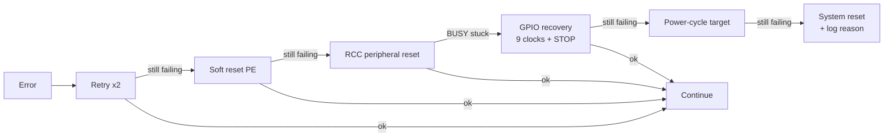
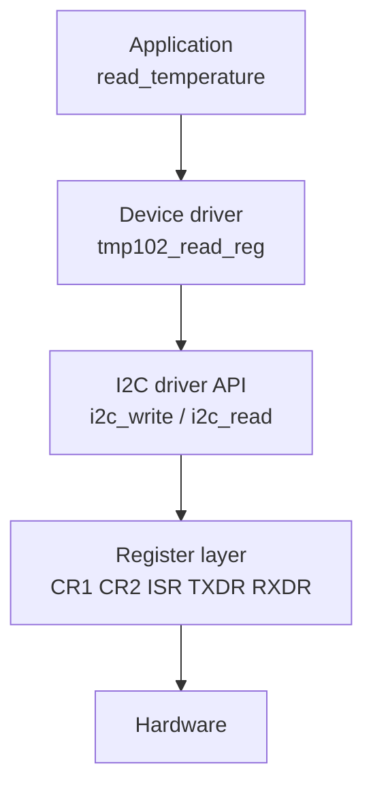
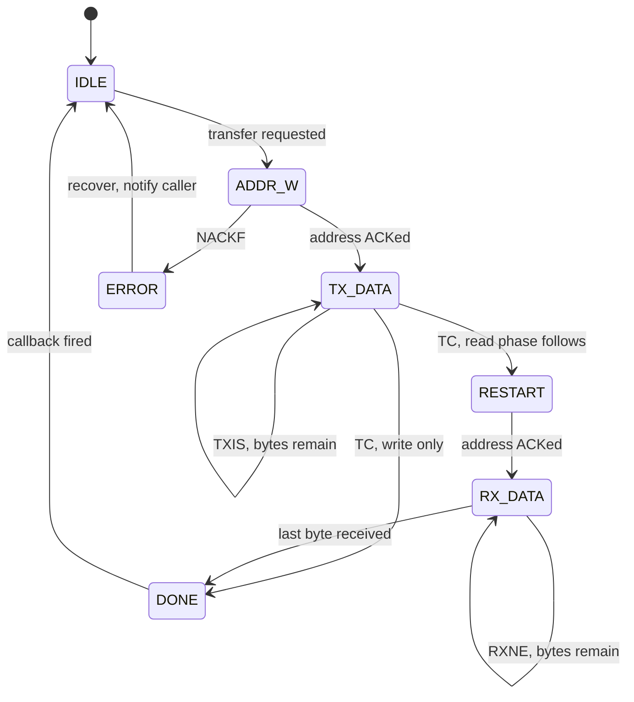

# I2C — Inter-Integrated Circuit

> A two-wire, synchronous, half-duplex bus that lets one controller talk to many chips on the same PCB, using shared open-drain lines and addresses instead of chip-select pins.

**Contents**
[Cheat sheet](#1-cheat-sheet) ·
[How it works](#2-how-it-actually-works) ·
[Frame format](#frame-format) ·
[ACK / NACK](#ack-and-nack) ·
[Clock stretching](#clock-stretching) ·
[Burst transfers](#continuous--burst-transfers) ·
[Finding an address](#finding-a-devices-address) ·
[Registers](#3-register-level-walkthrough) ·
[Code](#4-code) ·
[Captures](#5-captures) ·
[Debugging](#6-debugging-checklist) ·
[Q&A](#7-questions-i-should-be-able-to-answer) ·
[Sources](#8-sources)

---

## 1. Cheat sheet

| Property | Value |
| :--- | :--- |
| **Wires** | 2 — SDA (data), SCL (clock), plus common ground |
| **Duplex** | Half-duplex |
| **Clock** | Synchronous, driven by controller; target may stretch it |
| **Typical speed** | 100 kHz (Standard), 400 kHz (Fast) |
| **Max speed** | 5 MHz (Ultra Fast — unidirectional, rare) |
| **Distance** | Centimetres. Same PCB, sometimes a short ribbon |
| **Device select** | 7-bit address in the first byte (10-bit optional) |
| **Max devices** | Limited by address collisions and 400 pF bus capacitance |
| **Drive type** | Open-drain — external pull-ups required |
| **Error detection** | ACK/NACK per byte only. No CRC (except SMBus PEC) |
| **Pin cost** | 2 pins total, regardless of device count |

**Use it when** several low-speed chips share one board, pins are scarce, and throughput is not the constraint — sensors, EEPROMs, RTCs, PMICs, small OLEDs.

**Avoid it when** you need speed (use SPI), long cable runs (RS-485/CAN), noise immunity, or when the parts share a fixed address you cannot change.

### Top 5 gotchas

| # | Gotcha | Why it bites |
| :--- | :--- | :--- |
| 1 | **Missing or weak pull-ups** | No pull-ups, no rising edge, every transfer NACKs. Too weak, and it fails only at 400 kHz |
| 2 | **7-bit vs 8-bit address** | Datasheets print both. `0x68` shifted left is `0xD0`. The #1 cause of "sensor not responding" |
| 3 | **Bus lockup after reset** | MCU resets mid-transfer, target keeps driving SDA low, bus hangs until clocked out manually |
| 4 | **Clock stretching ignored** | Many peripherals and most bit-banged drivers skip it, and data corrupts silently |
| 5 | **Address collision** | Two identical sensors need an address pin, a TCA9548A mux, or a second bus |

### Key registers — STM32 `I2C_v2` (F0/F3/F7/L4/G0/G4/H7)

| Register | Bits that matter | Purpose |
| :--- | :--- | :--- |
| `CR1` | `PE`, `ANFOFF`, `DNF`, `NACKIE`, `ERRIE` | Enable peripheral, configure input filters |
| `CR2` | `SADD`, `RD_WRN`, `NBYTES`, `START`, `STOP`, `AUTOEND` | Describes the whole transfer; hardware sequences it |
| `TIMINGR` | `PRESC`, `SCLL`, `SCLH`, `SDADEL`, `SCLDEL` | Bus timing. Use CubeMX or AN4235 — do not guess |
| `ISR` | `TXIS`, `RXNE`, `TC`, `NACKF`, `BUSY`, `ARLO`, `BERR` | Everything you poll or interrupt on |
| `ICR` | `NACKCF`, `STOPCF`, `BERRCF`, `ARLOCF` | Flags must be cleared here explicitly |
| `OAR1` | `OA1`, `OA1EN` | Own address — target mode only |

> [!NOTE]
> The older `I2C_v1` peripheral (F1/F4/L1) differs: `CCR` and `TRISE` set timing instead of `TIMINGR`, and clearing `ADDR` requires reading `SR1` **then** `SR2` in that exact order — a well-known trap.

---

## 2. How it actually works

### Electrical basis

Every device drives SDA and SCL through an **open-drain** output. It can pull the line to ground, but it can never drive it high — pull-up resistors do that. The result is **wired-AND** logic: the line is high only if every device has let go.

```text
                    Vcc
                     |
              Rp  [ 4.7k ]        Rp  [ 4.7k ]
                     |                  |
    SDA  ─────────────┬──────────┬──────┴───────┬─────
                      │          │              │
    SCL  ─────────────┼──┬───────┼──┬───────────┼──┬──
                      │  │       │  │           │  │
                   ┌──┴──┴──┐ ┌──┴──┴──┐   ┌────┴──┴────┐
                   │  MCU   │ │ EEPROM │   │   Sensor   │
                   │ (ctrl) │ │ 0x50   │   │   0x68     │
                   └────────┘ └────────┘   └────────────┘
```

Two devices driving at once can never short supply into ground — that is what makes the bus safe. It is also why it is slow: every rising edge is an RC curve, not a driven transition.

<details>
<summary><b>Sizing the pull-ups — the actual math</b></summary>

Two limits bound the value:

| Limit | Formula | At 3.3 V |
| :--- | :--- | :--- |
| **Minimum** (sink current) | `Rp = (Vdd − Vol) / Iol` | ≈ 1 kΩ (0.4 V low, 3 mA sink) |
| **Maximum** (rise time) | `Rp = tr / (0.8473 × Cb)` | ≈ 3 kΩ at 400 pF, ≈ 11 kΩ at 100 pF |

Practical picks:

| Bus speed | Pull-up |
| :--- | :--- |
| 100 kHz | 4.7 kΩ |
| 400 kHz | 2.2 kΩ |
| 1 MHz | 1 kΩ |

Fit **one pair per bus**, not one pair per device. Stacking three breakout modules that each carry their own pull-ups puts them in parallel and over-loads the bus.

</details>

### Frame format

**The address byte** — 7 address bits MSB first, then the direction bit.

```text
    MSB                                     LSB
   ┌────┬────┬────┬────┬────┬────┬────┬─────┐
   │ A6 │ A5 │ A4 │ A3 │ A2 │ A1 │ A0 │ R/W │
   └────┴────┴────┴────┴────┴────┴────┴─────┘
     └──────── 7-bit address ────────┘   └── 0 = Write (ctrl → target)
                                             1 = Read  (target → ctrl)
```

**Write frame** — controller sends, target acknowledges every byte.

```text
 ┌───┬───────────────┬─────┬─────┬──────────┬─────┬──────────┬─────┬───┐
 │ S │ Address 7-bit │ W=0 │ ACK │ Data (8) │ ACK │ Data (8) │ ACK │ P │
 └───┴───────────────┴─────┴─────┴──────────┴─────┴──────────┴─────┴───┘
   ▲                          ▲                                      ▲
   │                          │                                      │
 START                   target pulls                              STOP
                          SDA low
```

**Read frame** — target sends, controller acknowledges, and **NACKs the last byte**.

```text
 ┌───┬───────────────┬─────┬─────┬──────────┬─────┬──────────┬──────┬───┐
 │ S │ Address 7-bit │ R=1 │ ACK │ Data (8) │ ACK │ Data (8) │ NACK │ P │
 └───┴───────────────┴─────┴─────┴──────────┴─────┴──────────┴──────┴───┘
                              ▲                                  ▲
                        target ACKs               controller NACKs to say
                        its address                  "that was the last one"
```

**Combined register read** — the pattern you will use 90% of the time. A write to
set the register pointer, a repeated START, then a read. No STOP in the middle.

```text
 ┌───┬──────┬───┬─────┬──────────┬─────┬────┬──────┬───┬─────┬──────┬──────┬───┐
 │ S │ Addr │ W │ ACK │ Reg addr │ ACK │ Sr │ Addr │ R │ ACK │ Data │ NACK │ P │
 └───┴──────┴───┴─────┴──────────┴─────┴────┴──────┴───┴─────┴──────┴──────┴───┘
   └───────── phase 1: where to read ────────┘└────── phase 2: read it ───────┘
```

`Sr` is the repeated START. Because no STOP was issued, the bus stays reserved
across both phases — no other controller can slip in and move the target's
internal register pointer between them.

### A complete transaction



### START and STOP conditions

These are the only times SDA is allowed to change while SCL is high — which is exactly what makes them unambiguous against data.

```text
        START (S)                        STOP (P)

  SDA  ‾‾‾‾‾‾‾\_________          SDA  _________/‾‾‾‾‾‾‾
  SCL  ‾‾‾‾‾‾‾‾‾‾‾\_____          SCL  _____/‾‾‾‾‾‾‾‾‾‾‾
               ^                            ^
       SDA falls while                SDA rises while
         SCL is HIGH                    SCL is HIGH
```

### ACK and NACK

Every byte is 9 clocks, not 8. The 9th is the acknowledgement, and the **receiver**
drives it — whoever that is at that moment.

```text
         bit 1   bit 2         bit 8    ACK bit
        ┌─┐     ┌─┐           ┌─┐      ┌─┐
 SCL  ──┘ └─────┘ └── ... ────┘ └──────┘ └──
        ─────────────────────────────
 SDA    ╳ data bits (sender drives) ╳ ▁▁▁▁▁   ← ACK: receiver pulls LOW
                                      ‾‾‾‾‾   ← NACK: nobody pulls, stays HIGH
                                      └─ sender releases SDA here
```

The sender releases SDA for that 9th clock and samples it. Low means "got it."
High means nothing pulled it down.

**Who ACKs whom**

| Phase | Sender | Who drives the ACK bit |
| :--- | :--- | :--- |
| Address byte | Controller | Target with the matching address |
| Data, during a write | Controller | Target |
| Data, during a read | Target | Controller |

**What a NACK means depends on where it lands**

| Where | Meaning | Usual cause |
| :--- | :--- | :--- |
| After the address | Nobody answered | Wrong address, device unpowered, wiring, or 7-vs-8-bit confusion |
| Mid-write | Target cannot take more | Buffer full, or an EEPROM still busy with an internal write cycle |
| Last byte of a read | **Normal and intended** | The controller ends the read this way |
| After a register address | Register does not exist | Wrong register map, or wrong device entirely |

> [!TIP]
> An EEPROM NACKing its address right after a write is not a fault — it is
> **acknowledge polling**. The part is busy committing the page internally. Retry
> the address every so often, and the ACK returning is your "write finished"
> signal. Far better than a fixed 5 ms delay.

A NACK is not an error condition on the bus itself. It carries no information about
*why*, only that the low never came — which is exactly why address NACKs are so
often misdiagnosed.

### Clock stretching

A target that needs thinking time holds SCL low after releasing the ACK. Because the
bus is wired-AND, the controller physically cannot raise the clock, so it waits.

```text
              controller releases SCL here
                        │
                        ▼
 SCL  ──┐         ┌─────╳▁▁▁▁▁▁▁▁▁▁▁▁┌─────┐
        └─────────┘     └── target holds it LOW ──┘
                          ← stretch →

 The controller must poll SCL and only proceed once it has actually risen.
```

**Where a target may stretch**

| Point | Why |
| :--- | :--- |
| After the address ACK | Waking from sleep, or preparing a conversion |
| After each byte written to it | Processing or storing the byte |
| Before each byte it sends | ADC conversion not finished yet |

**Why it goes wrong**

- **Bit-banged drivers** that generate a fixed-delay clock instead of reading SCL
  back will simply clock over the top of the stretch. The data is garbage, and the
  bug is intermittent because it depends on target timing.
- **Some MCU peripherals** do not support it, or support it only in target mode.
  Some silicon errata disable it. Check the reference manual, not the marketing
  table.
- **A stuck stretch hangs your firmware** if you poll without a timeout. SMBus
  defines a 25–35 ms limit for this reason; base I2C defines none, so add your own.

> [!WARNING]
> Never block forever waiting for SCL to rise. Always bound the wait, and treat a
> timeout as a trigger for the bus recovery sequence.

### Continuous / burst transfers

Most devices hold an **internal register pointer** that auto-increments after each
byte. Set it once, then keep clocking — you do not resend the register address.

```text
 ┌───┬──────┬───┬─────┬──────────┬─────┬────┬──────┬───┬─────┐
 │ S │ Addr │ W │ ACK │ Reg 0x3B │ ACK │ Sr │ Addr │ R │ ACK │
 └───┴──────┴───┴─────┴──────────┴─────┴────┴──────┴───┴─────┘
   ┌──────┬─────┬──────┬─────┬──────┬─────┬─────┬──────┬───┐
 → │ 0x3B │ ACK │ 0x3C │ ACK │ 0x3D │ ACK │ ... │ 0x40 │ P │
   └──────┴─────┴──────┴─────┴──────┴─────┴─────┴──────┴───┘
     pointer auto-increments ───────────────────►  ▲
                                          NACK on the last byte
```

**Why this matters beyond speed:** reading an accelerometer's X, Y and Z as three
separate transactions can straddle a sensor update, giving you X from one sample and
Z from the next. A single burst read of all six bytes is **atomic** with respect to
the device's update. Many IMUs and ADCs latch their output registers for exactly
this reason.

**Sequential write / page write.** The same trick going the other way. EEPROMs accept
a whole page in one transaction, but the pointer wraps **within the page** rather
than rolling into the next one — write past a 64-byte boundary and you overwrite the
start of the same page instead of continuing. Page size is in the datasheet, and
getting this wrong produces beautifully confusing corruption.

**On STM32 `I2C_v2`:** `NBYTES` is 8 bits, so a transfer longer than 255 bytes needs
the `RELOAD` bit — set it, reload `NBYTES` when `TCR` fires, and clear `RELOAD` for
the final chunk. Use DMA for anything large so the CPU is not babysitting `RXNE`.

> [!NOTE]
> Not every device auto-increments. Some require the register address before every
> single byte, and a few need a specific bit set in the register address to enable
> increment (the MSB, on several ST and Bosch parts). Check the datasheet.

### Finding a device's address

Six ways, roughly in order of how much you should trust them.

**1. The datasheet — and mind the shift.** The address is usually printed as 7-bit,
but plenty of datasheets show the full 8-bit write byte instead. If you see a pair
like "0xD0 write / 0xD1 read," that is the 8-bit form and the 7-bit address is
`0xD0 >> 1 = 0x68`.

| API style | Wants | Example |
| :--- | :--- | :--- |
| STM32 HAL | 8-bit, already shifted | `0xD0` |
| Arduino `Wire` | 7-bit | `0x68` |
| Linux `i2c-tools` | 7-bit | `0x68` |

**2. Address-select pins.** Most parts with a collision risk expose 1–3 pins that set
the low address bits. Tie them, do not float them.

```text
 MPU6050:   AD0 = 0 → 0x68        AD0 = 1 → 0x69
 24LC256:   A2 A1 A0 → 0x50 .. 0x57
 PCF8574:   A2 A1 A0 → 0x20 .. 0x27   (PCF8574A: 0x38 .. 0x3F)
```

**3. Scan the bus.** The definitive answer: try every address and see who ACKs.

- **Arduino:** the stock `i2c_scanner` sketch — `Wire.beginTransmission(addr)` then
  `Wire.endTransmission()`, and a return of 0 means something ACKed.
- **Raspberry Pi / Linux:** `i2cdetect -y 1` prints a grid of what responded.
- **STM32 HAL:** loop `HAL_I2C_IsDeviceReady(&hi2c1, addr << 1, 2, 10)` across the
  range and log every `HAL_OK`.
- **Bare metal:** send START + address + W and check `NACKF` in `ISR`. No `NACKF`
  means a device answered.

Scan `0x08` to `0x77` only. Probing the reserved ranges can put some parts into odd
modes.

**4. Logic analyzer.** If a vendor library already works, capture one transaction and
read the address straight off the decoded output. This also settles the shift
question permanently, because you see the raw byte on the wire.

**5. Part-number variants.** Address is often baked into the suffix — `PCF8574` and
`PCF8574A` differ only by address block, and several sensors ship in `-A`/`-B` variants
for the same reason. Match the exact marking on the chip, not the family name.

**6. Vendor library source.** Grep the driver for a `#define` such as
`MPU6050_ADDR` or `DEV_ADDR`. Quick, and it tells you which convention that library
expects.

> [!TIP]
> Scan **before** writing any driver code. Thirty seconds of scanning removes the
> single most common cause of a sensor that will not talk, and tells you at once
> whether the problem is addressing or wiring — a device that appears in the scan is
> powered, grounded, pulled up, and reachable.

### Arbitration

Each controller reads back what it drives. Write a 1, read a 0, and you have been overruled by someone writing 0 — so you withdraw immediately. The winner never saw a disturbance, so **no data is lost**. Clock synchronisation works the same way: the slowest low period wins.

### Reserved addresses

7-bit addressing gives 128 slots, but not all are usable:

| Address | Reserved for |
| :--- | :--- |
| `0x00` | General call (write) / START byte (read) |
| `0x01`–`0x03` | CBUS and other bus formats |
| `0x04`–`0x07` | Hs-mode controller code |
| `0x78`–`0x7B` | 10-bit addressing |
| `0x7C`–`0x7F` | Reserved |

That leaves roughly **112 usable addresses**.

### Speed modes

| Mode | Max clock | Max bus capacitance | Notes |
| :--- | ---: | ---: | :--- |
| Standard (Sm) | 100 kHz | 400 pF | Works nearly everywhere |
| Fast (Fm) | 400 kHz | 400 pF | Very widely supported |
| Fast Plus (Fm+) | 1 MHz | 550 pF | Needs stronger drivers |
| High Speed (Hs) | 3.4 MHz | 100 pF | Current-source pull-up, uncommon |
| Ultra Fast (UFm) | 5 MHz | — | Push-pull, write-only, effectively unused |

> [!IMPORTANT]
> The bus runs at the speed of its **slowest** device.

---

## 3. Register-level walkthrough

*A single-byte register read, on the `I2C_v2` peripheral.*

**1 — Clocks and pins**
Enable I2C and GPIO clocks. Set both pins to alternate function, **open-drain**, correct AF number. Push-pull here is a classic mistake and will fight the pull-ups.

**2 — Timing**
With `PE = 0`, write `TIMINGR`. `PRESC` divides the peripheral clock, `SCLL`/`SCLH` set low and high periods, `SDADEL`/`SCLDEL` set data setup and hold. These interact with the analogue and digital filters — take the values from CubeMX or AN4235.

**3 — Enable**
Set `PE` in `CR1`.

**4 — Write phase**
Load `CR2`: `SADD` = address, `RD_WRN = 0`, `NBYTES = 1`, `AUTOEND = 0` (a repeated START is coming, so no automatic STOP). Set `START`. Hardware emits START and the address frame.

**5 — Send the register**
Wait for `TXIS`, write the register address to `TXDR`. Wait for `TC` — transfer complete, bus held, no STOP yet.

**6 — Read phase**
Rewrite `CR2`: same address, `RD_WRN = 1`, `NBYTES = 1`, `AUTOEND = 1`, set `START` again. Because the bus was never released, this becomes a **repeated START**.

**7 — Receive**
Wait for `RXNE`, read `RXDR`. The peripheral NACKs the final byte and issues STOP automatically, because `AUTOEND` was set.

**8 — Errors**

| Flag | Meaning |
| :--- | :--- |
| `NACKF` | Nobody home, or wrong address |
| `BERR` | Misplaced START or STOP |
| `ARLO` | Lost arbitration |

Clear each through `ICR`. They do not self-clear.

> [!TIP]
> The thing worth internalising: here you describe the *whole transfer* in `CR2` and hardware sequences it. On the older `v1` peripheral you drive each phase yourself and poll `SR1`/`SR2` — which is why so much legacy STM32 I2C code is full of fragile flag-clearing rituals.

---

## 4. Code

| File | What it is | Verified how |
| :--- | :--- | :--- |
| [`code/stm32f4/i2c_master.c`](../code/stm32f4/i2c_master.c) | STM32F4 I2C1 master, registers only. Timeouts on every wait, documented ADDR-clear sequence, NACK handling, and a manual bus-recovery routine | Compiles clean for Cortex-M4 at `-Werror -Wconversion`. **Not run on hardware yet.** |
| [`code/stm32f4/stm32f4_regs.h`](../code/stm32f4/stm32f4_regs.h) | Register map typed out of RM0090 rather than pulled from CMSIS | — |

```bash
cd code/stm32f4 && make
```

Three details in that file are worth reading even if you never build it,
because each one is a bug this document describes in the abstract:

- **Every wait loop has a bounded budget.** `while (!(SR1 & SB));` with no
  timeout is how an I2C driver hangs a product permanently — one target
  holding SDA low is enough.
- **`i2c_write` waits for `BTF`, not `TXE`, before issuing STOP.** `TXE` only
  means the shift register accepted the byte. Stopping on `TXE` truncates the
  last byte, and the analyzer shows N−1 bytes while the code shows N.
- **`i2c_read` NACKs the final byte before reading it.** ACKing the last byte
  asks the target for another one and wedges the bus.

`i2c_bus_recover()` implements the nine-clock unwedge described in section 11.
It is the part most drivers omit and most field failures need.

> [!WARNING]
> **Status: reviewed, compiled, not flashed.** Everything above is logic that
> a compiler can check. The parts of I2C that a compiler cannot check —
> rise time against real bus capacitance, a target that clock-stretches for
> longer than your timeout, address collisions, a marginal pull-up — are
> unverified until this runs on a board with a logic analyzer attached.
> Do not cite this file as hardware-proven.

---

## 5. Captures

Screenshots will live in `captures/`, each captioned with what to look at and
what a failure looks like instead. **Not yet taken** — needs a logic analyzer.

- [ ] **Normal register read** — START, addr+W, ACK, reg, repeated START, addr+R, data, NACK, STOP
- [ ] **Address NACK** — remove the device, watch the 9th clock stay high
- [ ] **Rise-time comparison** — same transfer at 10 kΩ vs 2.2 kΩ, showing the rounded edge
- [ ] **Clock stretching** — if the target does it
- [ ] **A wedged bus and `i2c_bus_recover()` freeing it**

A cheap 8-channel logic analyzer with I2C decoding covers all five.

---

## 6. Debugging checklist

Symptom-first, so it is usable at 1am.

| Symptom | Likely cause | How to confirm |
| :--- | :--- | :--- |
| Both lines stuck low | No pull-ups, a short, or a target holding the bus | Power off, measure resistance to ground on SDA and SCL |
| Both lines high, no activity | Peripheral not enabled, wrong AF, or pins not open-drain | Toggle the pins as plain GPIO and watch them |
| Address NACKs every time | 7-bit vs 8-bit address confusion | Bus-scan `0x08`–`0x77` and see what answers |
| Nothing answers a bus scan | Wrong pins, device unpowered, no shared ground | Check target supply and ground between boards first |
| Works at 100 kHz, fails at 400 kHz | Pull-ups too weak, bus capacitance too high | Look at the rising edge — should be a corner, not a curve |
| SDA stuck low after MCU reset | Target was mid-byte when the controller vanished | Run bus recovery below |
| Random corruption under load | Clock stretching unhandled, or an ISR starving the driver | Capture SCL, look for stretched low periods |
| Two identical sensors, one visible | Address collision | Use the address-select pin, or a TCA9548A mux |

<details>
<summary><b>Bus recovery sequence — SDA stuck low</b></summary>

The target is part-way through sending a byte and waiting for clocks that never came.

1. Release SDA — make it an input, or drive it high.
2. Reconfigure SCL as a plain GPIO output.
3. Toggle SCL up to **9 times**, checking SDA after each pulse. The target finishes its byte and lets go.
4. Once SDA is high, generate a manual STOP: SDA low → SCL high → SDA high.
5. Reinitialise the peripheral.

Worth building into `i2c_init()` from the start. It turns a hardware-reset bug into a non-event.

</details>

---

## 7. Questions I should be able to answer

Cover the answer, try it from memory, then check.

<details>
<summary><b>Why does I2C need external pull-up resistors?</b></summary>

Outputs are open-drain — they can only sink current, never source it. Without a pull-up, nothing returns the line to a high level. Open-drain is also what makes wired-AND behaviour, arbitration, and clock stretching possible in the first place.

</details>

<details>
<summary><b>How do you pick the pull-up value?</b></summary>

Bounded below by sink current, `(Vdd − Vol) / Iol` ≈ 1 kΩ at 3.3 V. Bounded above by rise time, `tr / (0.8473 × Cb)`. In practice: 4.7 kΩ at 100 kHz, 2.2 kΩ at 400 kHz. Lower resistance means faster edges and more current.

</details>

<details>
<summary><b>What makes START and STOP distinguishable from data?</b></summary>

They are the only transitions on SDA while SCL is high. During data, SDA may only change while SCL is low.

</details>

<details>
<summary><b>What is a repeated START, and why does a register read need one?</b></summary>

A second START with no STOP in between. It keeps the bus reserved between the "which register" write and the "give me the data" read, so no other controller can interleave a transaction and leave the target pointing somewhere else.

</details>

<details>
<summary><b>The datasheet says 0x68 but my code uses 0xD0. Why?</b></summary>

`0x68` is the 7-bit address. `0xD0` is the same address already shifted left with a write bit in position 0. Some APIs want one, some the other.

</details>

<details>
<summary><b>What is clock stretching, and who does it?</b></summary>

The target holds SCL low after an ACK to buy processing time. The controller must wait for the line to rise before continuing. Support is not universal on either side.

</details>

<details>
<summary><b>Two controllers transmit at once. What happens?</b></summary>

Each reads back what it drives. The one that writes a 1 but sees a 0 has lost, and stops immediately. The winner is unaffected and its data survives intact, because a 0 always wins on a wired-AND bus.

</details>

<details>
<summary><b>SDA is stuck low after a reset. What now?</b></summary>

A target is mid-byte. Clock SCL manually up to 9 times until it releases SDA, then issue a manual STOP and reinitialise.

</details>

<details>
<summary><b>Why is each byte 9 clock cycles?</b></summary>

Eight data bits plus the acknowledgement bit. On the 9th clock the sender releases SDA and the receiver either pulls it low (ACK) or leaves it high (NACK).

</details>

<details>
<summary><b>An EEPROM NACKs its address right after I wrote to it. Is it broken?</b></summary>

No — it is busy with its internal write cycle. This is acknowledge polling: keep retrying the address, and the ACK coming back tells you the write has committed. More reliable than a fixed delay.

</details>

<details>
<summary><b>Why read six sensor registers in one burst instead of six transactions?</b></summary>

Atomicity, not just speed. Separate reads can straddle a sensor update and mix bytes from two different samples. A burst read is consistent with respect to the device's own update, which is why many IMUs latch their output registers during one.

</details>

<details>
<summary><b>You write past the end of an EEPROM page. What happens?</b></summary>

The internal pointer wraps to the start of the *same* page rather than moving to the next one, so you overwrite what you just wrote. Page size comes from the datasheet.

</details>

<details>
<summary><b>How do you find an unknown device's address?</b></summary>

Scan `0x08`–`0x77` and see what ACKs — `i2cdetect -y 1` on Linux, the `i2c_scanner` sketch on Arduino, or `HAL_I2C_IsDeviceReady` in a loop on STM32. Cross-check against the datasheet and the address-select pin wiring, watching for the 7-bit vs 8-bit shift.

</details>

<details>
<summary><b>When would you choose SPI instead?</b></summary>

When you need throughput, full duplex, or low latency — SPI runs at tens of MHz against I2C's typical 400 kHz. The cost is a chip-select line per device, and no built-in acknowledgement.

</details>

<details>
<summary><b>How many devices fit on one bus?</b></summary>

Not a fixed number. 7-bit addressing gives about 112 usable addresses after the reserved ones, but the real limit is usually 400 pF of bus capacitance, or simply address collisions between identical parts.

</details>

<details>
<summary><b>Why is there no CRC?</b></summary>

There isn't one in base I2C — only a per-byte ACK, which proves a byte arrived but not that it was correct. SMBus adds an optional PEC byte for this.

</details>

---

## 8. Sources

| Document | Use it for |
| :--- | :--- |
| NXP **UM10204** | The actual I2C specification |
| ST **AN4235** | `TIMINGR` calculation |
| STM32 reference manual, I2C chapter | Register detail for your specific part |
| The part's **errata sheet** | Several STM32 families have documented I2C lockup behaviour with published workarounds |
---

## 9. Electrical characteristics

The numbers behind "it works on the bench but fails on the panel."

| Parameter | Symbol | Value |
| :--- | :--- | :--- |
| Supply voltage | `VDD` | 1.8 V – 5.5 V |
| Logic high, input | `VIH` | ≥ 0.7 × VDD |
| Logic low, input | `VIL` | ≤ 0.3 × VDD |
| Output low voltage | `VOL` | ≤ 0.4 V at 3 mA sink |
| Sink current | `IOL` | 3 mA (Sm/Fm), 20 mA (Fm+) |
| Bus capacitance | `Cb` | ≤ 400 pF (Sm/Fm), ≤ 550 pF (Fm+) |
| Input leakage per device | — | ±10 µA typical |
| Rise time | `tr` | `0.8473 × Rp × Cb` |

Two consequences worth carrying around:

**Thresholds are ratios, not fixed volts.** A 3.3 V device needs 2.31 V to read a
high; a 5 V device needs 3.5 V. Mixing supplies on one bus without a level shifter
means the 5 V part may never see a valid high from the 3.3 V part.

**Capacitance is cumulative.** Every device adds roughly 10 pF of pin capacitance,
plus trace capacitance of about 1 pF per cm. Ten devices on a 20 cm bus is already
around 120 pF before connectors and cabling. Exceed 400 pF and the rising edge stops
reaching `VIH` in time, which shows up as errors that only appear at higher speeds or
only on the fully populated board.

---

## 10. Timing parameters

From NXP UM10204. Every one of these is enforced by the peripheral's timing
registers — this is what `TIMINGR` is actually setting.

| Parameter | Symbol | Standard (100 kHz) | Fast (400 kHz) |
| :--- | :--- | ---: | ---: |
| SCL frequency | `fSCL` | 0 – 100 kHz | 0 – 400 kHz |
| Clock low period | `tLOW` | min 4.7 µs | min 1.3 µs |
| Clock high period | `tHIGH` | min 4.0 µs | min 0.6 µs |
| START hold time | `tHD;STA` | min 4.0 µs | min 0.6 µs |
| Repeated START setup | `tSU;STA` | min 4.7 µs | min 0.6 µs |
| Data setup time | `tSU;DAT` | min 250 ns | min 100 ns |
| Data hold time | `tHD;DAT` | min 0 ns | min 0 ns |
| Rise time | `tr` | max 1000 ns | max 300 ns |
| Fall time | `tf` | max 300 ns | max 300 ns |
| STOP setup time | `tSU;STO` | min 4.0 µs | min 0.6 µs |
| Bus free, STOP to START | `tBUF` | min 4.7 µs | min 1.3 µs |

```text
        tBUF          tHD;STA        tLOW      tHIGH      tSU;STO
      ◄──────►       ◄──────►      ◄──────►  ◄──────►    ◄──────►
 SDA  ‾‾‾‾‾‾‾‾‾\_____________╳════╳═════════╳════________/‾‾‾‾‾‾‾
 SCL  ‾‾‾‾‾‾‾‾‾‾‾‾‾‾‾\________/‾‾‾‾‾\_______/‾‾‾‾‾\______/‾‾‾‾‾‾‾
                  S                                        P
                              ◄─►
                            tSU;DAT
```

> [!IMPORTANT]
> `tBUF` is the one people forget. Firing a new START immediately after a STOP
> violates the minimum bus-free time, and some targets simply miss it. If back-to-back
> transactions fail but spaced ones work, this is the first thing to check.

**Where they come from in `TIMINGR`:** `SCLL`/`SCLH` set `tLOW`/`tHIGH`. `SDADEL`
sets data hold. `SCLDEL` sets data setup. `PRESC` scales all of it. The filters add
delay on top, which is why hand-calculated values so often fail — use CubeMX or the
tables in AN4235.

---

## 11. Error recovery ladder

Escalate. Do not jump straight to a system reset, and do not retry forever.

| Step | Action | Use when |
| ---: | :--- | :--- |
| 1 | **Retry the transaction** (bounded, 2–3 attempts) | Single NACK or `BERR`, likely transient noise |
| 2 | **Soft-reset the peripheral** — clear `PE`, wait, set `PE` again | Flags stuck, state machine confused |
| 3 | **Reset via RCC** — pulse the reset bit in `RCC_APB1RSTR` | Soft reset did not clear it |
| 4 | **GPIO bus recovery** — 9 clocks + manual STOP | `BUSY` stuck, or SDA held low by a target |
| 5 | **Power-cycle the target** if it has an enable or reset pin | Target itself is wedged, not the controller |
| 6 | **System reset**, with the reason logged first | Everything above failed |



> [!WARNING]
> Log which rung you reached. A board that silently recovers at step 4 twice an hour
> is a hardware problem you cannot see, and the log is the only thing that will tell
> you it is happening.

**On STM32 `I2C_v1` (F1/F4):** the errata documents several lockup conditions where
`BUSY` never clears. The published workaround is exactly step 4 followed by a `SWRST`
pulse in `CR1` — worth reading your part's errata sheet before assuming your driver is
at fault.

---

## 12. Driver architecture

### Layering

Keep the register access at the bottom and the application ignorant of it. Swapping
MCU families then touches one layer.



### API shape

Return a status, never `void`. Every one of these can fail.

```c
typedef enum {
    I2C_OK = 0,
    I2C_ERR_NACK_ADDR,
    I2C_ERR_NACK_DATA,
    I2C_ERR_ARLO,
    I2C_ERR_BERR,
    I2C_ERR_TIMEOUT,
    I2C_ERR_BUSY
} i2c_status_t;

i2c_status_t i2c_init(uint32_t speed_hz);
i2c_status_t i2c_write(uint8_t addr, const uint8_t *data, uint16_t len);
i2c_status_t i2c_read (uint8_t addr, uint8_t *data, uint16_t len);
i2c_status_t i2c_write_read(uint8_t addr,
                            const uint8_t *tx, uint16_t tx_len,
                            uint8_t *rx, uint16_t rx_len);   /* repeated START */
i2c_status_t i2c_recover_bus(void);
bool         i2c_device_present(uint8_t addr);               /* for scanning */
```

`i2c_write_read` deserves to be its own call rather than two chained ones — it is the
combined register read, and making it a single function is what stops a caller from
accidentally dropping a STOP into the middle.

### Polling vs interrupt vs DMA

| | Polling | Interrupt | DMA |
| :--- | :--- | :--- | :--- |
| CPU cost | Blocks entirely | One ISR per byte | Almost none |
| Latency | Lowest | Low | Setup overhead |
| Complexity | Trivial | State machine needed | Highest |
| Good for | Init, scanning, short reads | Mixed workloads | Large or frequent transfers |
| Bad for | Anything time-critical elsewhere | Very high byte rates | Single-byte reads |

Rule of thumb: polling for setup code that runs once, interrupts for normal operation,
DMA once you are moving display buffers or reading an IMU FIFO at rate.

> [!TIP]
> Always bound polling loops with a timeout. `while (!(I2C1->ISR & I2C_ISR_TXIS));`
> is the single most common way an embedded system hangs — one unpowered sensor and the
> whole product freezes.

### Interrupt-driven state machine



The ISR advances the state and returns immediately. It never blocks, never calls the
application directly, and never does the work — it sets a flag or posts to a queue and
lets the application layer handle the result.

### Concurrency

Two tasks sharing one bus will interleave transactions and corrupt each other's
register pointers. Guard the bus with a mutex taken for the whole transaction, not per
byte, and have the ISR signal completion through a semaphore rather than a spin flag.
If a high-priority task waits on a bus held by a low-priority one, that is priority
inversion — use a mutex with priority inheritance, which most RTOSes offer as an
option.

---

### Additions for section 7 — Q&A

<details>
<summary><b>Why is 400 pF the bus capacitance limit?</b></summary>

Because rise time is `0.8473 × Rp × Cb`. Past that capacitance, no pull-up value satisfies both the sink-current minimum and the rise-time maximum at once — the edge cannot reach `VIH` inside the spec window.

</details>

<details>
<summary><b>Back-to-back transactions fail, but spaced ones work. Why?</b></summary>

Likely a `tBUF` violation — the minimum bus-free time between STOP and the next START, 1.3 µs in Fast mode. Some targets miss a START that arrives too soon after a STOP.

</details>

<details>
<summary><b>Can you mix 3.3 V and 5 V devices on one bus?</b></summary>

Only with a level shifter. Thresholds are ratios of VDD, so a 5 V part needs 3.5 V to register a high and will not reliably see one from a 3.3 V bus. A MOSFET-based bidirectional shifter is the standard answer.

</details>

<details>
<summary><b>Your I2C read hangs the whole system. What did the driver do wrong?</b></summary>

Polled a status flag with no timeout. One unpowered or wedged target and the loop never exits. Every wait needs a bound, and a timeout should escalate through the recovery ladder.

</details>

<details>
<summary><b>When would you use DMA for I2C?</b></summary>

Large or frequent transfers — display frame buffers, IMU FIFO reads — where one interrupt per byte would dominate CPU time. Not worth the setup for single-byte register reads.

</details>

<details>
<summary><b>Two RTOS tasks use the same bus. What breaks, and what fixes it?</b></summary>

Their transactions interleave and corrupt each other's register pointers. Fix with a mutex held for the entire transaction, and prefer priority inheritance so a high-priority task is not blocked indefinitely by a low-priority holder.

</details>
---

## 13. Target (slave) mode

Everything above assumes your MCU is the controller. Being the *device* is a
different problem, and it is a common interview turn because it exposes whether you
understand that I2C is not symmetric.

**What changes:** you no longer own the clock. The controller decides when bytes
move, and your firmware has to be ready whenever it is addressed — including in the
middle of something else.

**STM32 `I2C_v2` setup**

| Register | Field | Purpose |
| :--- | :--- | :--- |
| `OAR1` | `OA1`, `OA1EN` | Your own address, and enable it |
| `OAR2` | `OA2`, `OA2MSK` | Optional second address, or a masked range |
| `CR1` | `NOSTRETCH` | **Leave at 0** so you are allowed to stretch |
| `CR1` | `SBC` | Slave byte control — needed if you want per-byte ACK control |
| `ISR` | `ADDR` | You have been addressed |
| `ISR` | `DIR` | 0 = controller is writing to you, 1 = reading from you |
| `ISR` | `STOPF` | Transaction ended |
| `ICR` | `ADDRCF`, `STOPCF` | Clear those flags |

**The standard pattern: emulate a register map.**

```c
static uint8_t regs[REG_COUNT];
static uint8_t reg_ptr;
static bool    first_byte;

/* addressed */
if (ISR & ADDR) {
    first_byte = true;
    ICR = ADDRCF;
}

/* controller is writing to us */
if (ISR & RXNE) {
    uint8_t b = RXDR;
    if (first_byte) { reg_ptr = b; first_byte = false; }   /* register select */
    else            { regs[reg_ptr++] = b; }               /* data, auto-increment */
}

/* controller is reading from us */
if (ISR & TXIS) {
    TXDR = regs[reg_ptr++];
}
```

That mirrors exactly how every sensor you have ever talked to behaves — first byte
sets the pointer, subsequent bytes stream from it.

> [!WARNING]
> **Never do real work inside the target ISR.** The controller is holding the bus
> waiting on you. Copy bytes into a buffer, set a flag, and process it in the
> application loop. A target that takes 2 ms to respond will stretch the clock for
> 2 ms, and some controllers will time out and abandon the transfer.

**Underrun and overrun.** If the controller reads faster than you can fill `TXDR`,
you get `OVR` and it clocks out garbage — often `0xFF`. Preload the first byte as
soon as `ADDR` fires with `DIR = 1`, rather than waiting for the first `TXIS`.

**Testing it** is awkward with one board. Easiest route: a Raspberry Pi as the
controller running `i2cget`/`i2cset`, or a second MCU. A logic analyzer is close to
mandatory here, because when target firmware misbehaves, the controller just reports
"NACK" and tells you nothing.

---

## 14. Bit-banged I2C

Asked as a whiteboard exercise more often than almost anything else in embedded
interviews, because it forces you to state the open-drain rule out loud.

**The one rule that matters:** you never drive a line high. To send a high, you
*release* it and let the pull-up do the work.

```c
/* Release = let the pull-up pull it high. Assert = drive it to ground. */
static inline void sda_release(void) { GPIO_SET_INPUT(SDA);  }   /* or OD high */
static inline void sda_assert (void) { GPIO_SET_OUTPUT_LOW(SDA); }
static inline bool sda_read   (void) { return GPIO_READ(SDA); }

static inline void scl_release(void) { GPIO_SET_INPUT(SCL); }
static inline void scl_assert (void) { GPIO_SET_OUTPUT_LOW(SCL); }
```

**Releasing SCL is not the same as SCL being high.** After releasing it you must
*wait until you actually read it high* — that is clock stretching support, and it is
the line most candidates leave out.

```c
static bool scl_release_and_wait(void) {
    scl_release();
    uint32_t t = 0;
    while (!GPIO_READ(SCL)) {              /* target is stretching */
        if (++t > STRETCH_TIMEOUT) return false;
    }
    return true;
}
```

**START, STOP, and a bit**

```c
void i2c_start(void) {          /* SDA falls while SCL is high */
    sda_release(); delay_qtr();
    scl_release_and_wait(); delay_qtr();
    sda_assert();  delay_qtr();
    scl_assert();  delay_qtr();
}

void i2c_stop(void) {           /* SDA rises while SCL is high */
    sda_assert();  delay_qtr();
    scl_release_and_wait(); delay_qtr();
    sda_release(); delay_qtr();
}

void write_bit(bool b) {
    scl_assert();               /* data may only change while SCL is low */
    b ? sda_release() : sda_assert();
    delay_qtr();
    scl_release_and_wait(); delay_half();
    scl_assert();
}

bool read_bit(void) {
    scl_assert(); sda_release(); delay_qtr();   /* let the sender drive */
    scl_release_and_wait(); delay_qtr();
    bool b = sda_read();                         /* sample while SCL is high */
    delay_qtr(); scl_assert();
    return b;
}
```

A byte is eight `write_bit` calls MSB first, then one `read_bit` for the ACK.

**Where bit-banging goes wrong**

| Problem | Consequence |
| :--- | :--- |
| Driving lines push-pull instead of open-drain | Fights the pull-ups, can damage pins if two devices drive opposite levels |
| Not reading SCL back after release | Clock stretching ignored, silent data corruption |
| Delay based on `__NOP()` counts | Timing breaks when the compiler, clock, or optimisation level changes |
| Interrupts firing mid-bit | A long ISR stretches one clock phase — usually harmless, occasionally not |
| No timeout on the stretch wait | One wedged target hangs the whole system |

Legitimate reasons to bit-bang: the peripheral is broken by errata, the pins you need
have no I2C alternate function, you need a second bus and only one peripheral exists,
or you are writing the bus-recovery routine — which is bit-banging by definition.

---

## 15. 10-bit addressing

Rare, but it is a fair question because the answer shows you understand why the
reserved range exists.

The address is split across two frames. The first begins with the fixed pattern
`11110`, which is why `0x78`–`0x7B` is reserved — a 7-bit device can never claim it.

**Write to a 10-bit target**

```text
 ┌───┬────────────────────┬───┬─────┬─────────────┬─────┬──────┬─────┬───┐
 │ S │ 11110 + A9 A8      │ W │ ACK │ A7 ... A0   │ ACK │ Data │ ACK │ P │
 └───┴────────────────────┴───┴─────┴─────────────┴─────┴──────┴─────┴───┘
        first address frame        second address frame
```

**Read from a 10-bit target** — you must send the *full* 10-bit address as a write
first, so the target knows it is selected, then repeated START with only the first
frame and R = 1.

```text
 ┌───┬───────────────┬───┬─────┬───────────┬─────┬────┬───────────────┬───┬─────┬──────┬──────┬───┐
 │ S │ 11110 + A9 A8 │ W │ ACK │ A7 ... A0 │ ACK │ Sr │ 11110 + A9 A8 │ R │ ACK │ Data │ NACK │ P │
 └───┴───────────────┴───┴─────┴───────────┴─────┴────┴───────────────┴───┴─────┴──────┴──────┴───┘
```

7-bit and 10-bit devices coexist on one bus safely, because the `11110` prefix is
reserved from the 7-bit space. On STM32, set `ADD10` in `CR2` and put the full
address in `SADD`.

---

## 16. SMBus and PMBus

SMBus is I2C with the ambiguity removed. If you interview anywhere near batteries,
power supplies, or server hardware, this comes up.

| | I2C | SMBus |
| :--- | :--- | :--- |
| Clock range | DC – 5 MHz | 10 kHz – 100 kHz (1 MHz in 3.0) |
| Clock low timeout | None | **25–35 ms**, then devices must reset |
| Logic thresholds | Ratiometric (0.3/0.7 × VDD) | Fixed: `VIL` 0.8 V, `VIH` 2.1 V |
| Error checking | ACK only | Optional **PEC** byte, CRC-8 |
| Transaction format | Whatever the device defines | Defined set of protocols |
| Alert mechanism | None | `SMBALERT#` line |
| Address assignment | Fixed or pin-strapped | Optional **ARP**, assigned dynamically |

**The timeout is the important one.** Base I2C has no way out of a target that
stretches forever — SMBus mandates that if SCL is held low past 35 ms, every device
resets its interface. That single rule turns an unrecoverable hang into a
self-healing bus, which is why safety-relevant designs prefer it.

**Defined protocols:** quick command, send/receive byte, write/read byte, write/read
word, block write/read, and process call. A device documenting itself as "SMBus
read word" tells you the exact wire format without you reading a timing diagram.

**PEC** appends a CRC-8 over all bytes including the address. It is the answer to
"I2C has no error detection, what would you do about it in a noisy system."

**PMBus** is SMBus plus a standard command set for power converters — output voltage,
current, temperature, fault status, margining. The value is that any PMBus supply
answers the same commands, so one driver covers many parts.

---

## 17. Bus hardware

### Level shifters

Mixing 1.8 V, 3.3 V and 5 V on one bus needs translation, because thresholds are
ratios of VDD.

The classic answer is a single N-channel MOSFET per line (NXP AN97055):

```text
        3.3V side                     5V side
           │                             │
         [Rp]                          [Rp]
           │            ┌───┐            │
   SDA_3V3 ├────────────┤ S │            │
                        │   │ MOSFET     │
              gate ─────┤ G │            │
              to 3.3V   │   │            │
                        │ D ├────────────┤ SDA_5V
                        └───┘
```

- Low side pulls low → FET conducts → high side pulled low too.
- High side pulled low → current flows through the body diode → low side follows.
- Both released → both pull-ups take over, each to its own rail.

Bidirectional, no direction pin, works because I2C only ever pulls down. Dedicated
parts (PCA9306, TXS0102) do the same thing with better edge rates.

> [!NOTE]
> A level shifter adds capacitance and slows edges. Budget for it — a bus that was
> marginal at 400 kHz will fail once shifters are added.

### Muxes, switches and repeaters

| Part type | Example | Use it for |
| :--- | :--- | :--- |
| Mux (one channel at a time) | TCA9548A, 8 channels | Identical addresses on separate branches |
| Switch (any combination) | PCA9546A, 4 channels | Segmenting capacitance, isolating a faulty branch |
| Mux with interrupt merge | PCA9544A | Branches that also need to signal upward |
| Buffer / repeater | PCA9515 | Splitting one bus into two capacitance domains |
| Long-line extender | P82B715 | Driving cables of a few metres |
| Active pull-up | LTC4311 | Sharpening rising edges on a heavy bus |

The mux is the standard answer to "how do you put four identical sensors on one bus."
Worth naming the trade-off too: the mux itself occupies an address, and every
transaction now costs an extra write to select the channel.

---

## 18. Board-level failure modes

The section that separates people who have read about I2C from people who have
debugged it.

**Back-powering (parasitic powering).** A target whose rail is off, sitting on a bus
whose pull-ups are still live. Current flows in through the pin's ESD protection
diode into the target's VDD net and partially powers the chip. Symptoms: the device
half-responds, the bus sits at a strange level, or the target's supply rail measures
about 0.6 V below the bus voltage with its regulator off.

Fixes: sequence the rails so the bus comes up last, isolate the branch with a bus
switch, or choose a part rated for powered-off bus operation.

**Missing common ground.** Two boards connected by SDA and SCL only. The signals have
no return path, levels float relative to each other, and behaviour depends on how the
boards are otherwise coupled. Always the first thing to check when a bus works on one
board and not across two.

**Stacked pull-ups.** Three breakout modules, each carrying its own 4.7 kΩ pair,
gives an effective 1.6 kΩ. Sometimes fine, sometimes over the sink-current budget.
Cut the jumpers on all but one.

**Layout.** Keep the pair short and together, keep a ground reference beneath them,
route them away from switching regulators and inductors, and remember that every
centimetre of trace is roughly 1 pF against a 400 pF budget. Long unterminated stubs
off the main bus are a common source of ringing.

**ESD and hot-plug.** A bus leaving the board — to a connector, a cable, a
hot-swappable module — needs protection and often a dedicated hot-swap buffer that
pre-charges the lines before connection, so plugging in does not yank the bus low
and corrupt a transaction in progress.

---

## 19. I2C vs SPI vs UART

| | I2C | SPI | UART |
| :--- | :--- | :--- | :--- |
| Wires | 2 | 3 + 1 CS per device | 2 |
| Clock | Shared, from controller | Shared, from controller | None — both sides agree a baud rate |
| Duplex | Half | Full | Full |
| Typical speed | 100–400 kHz | 1–50 MHz | 9.6–115.2 kbaud |
| Device select | Address in-band | Dedicated CS line | Point to point only |
| Multi-device | Yes, by address | Yes, by chip select | No |
| Multi-controller | Yes, with arbitration | No | No |
| Acknowledgement | Per byte | None | None (unless a protocol adds it) |
| Error detection | None built in | None | Parity bit, framing errors |
| Pin cost at 5 devices | 2 | 8 | 10 |
| Distance | Same board | Same board | Metres, more with RS-485 |

**How to answer "which would you pick":** name the constraint first. Pin count and
many slow devices → I2C. Throughput, an SD card, a display buffer → SPI. Talking to
another board, a module, or a PC → UART. Then mention the cost of the choice, because
that is what they are actually listening for.

---

## 20. I3C

Increasingly the closing question: *"what replaces I2C?"*

MIPI I3C keeps the two-wire, open-drain foundation for backward compatibility, then
fixes the things people complain about:

| Improvement | What it solves |
| :--- | :--- |
| Push-pull for most traffic | Open-drain rise time no longer caps speed — 12.5 MHz SDR, more in HDR modes |
| **In-band interrupts** | A device can signal the controller on SDA, so no dedicated IRQ pin per sensor |
| **Dynamic address assignment** | No more address collisions or strapping pins |
| **Hot-join** | Devices can appear on a live bus |
| Common Command Codes | A standard command set across vendors, unlike I2C's free-for-all |
| Lower power | Push-pull avoids the constant pull-up current |

Legacy I2C targets can share an I3C bus, which is the main reason for adoption. In
practice you will meet it first in phones and in newer IMUs and environmental
sensors.

---

## 21. Testing an I2C driver

Rarely the opening question, frequently the one that decides a senior interview.

**Unit tests.** Mock the register layer — replace `TXDR`, `RXDR`, `ISR` with a
fake — and drive your state machine through every path with no hardware present.
This is where you prove the NACK, timeout, and arbitration-loss branches actually
work, because they are nearly impossible to trigger on demand on a real bus.

**Fault injection on hardware**

| Fault | How to cause it deliberately |
| :--- | :--- |
| Address NACK | Address a device that is not there |
| Mid-transfer NACK | Write past an EEPROM's buffer |
| Bus stuck low | Ground SDA with a wire during a transfer |
| Clock stretch timeout | Hold SCL low from a second MCU pin |
| Arbitration loss | A second controller transmitting on the same bus |
| Marginal edges | Swap in 10 kΩ pull-ups and run at 400 kHz |

**Loopback.** A second MCU running target mode gives you a device you fully control,
including one that misbehaves on purpose.

**Soak testing.** Run a million transactions and count errors and recovery events by
rung of the ladder. A driver that works once is not a driver that works.

**The point to make in an interview:** the happy path is the easy part. What you
test is the error handling, and the recovery ladder is only real if you have
deliberately triggered every rung of it.

---

### Additions for section 7 — Q&A

<details>
<summary><b>Your MCU is the target. What must the ISR never do?</b></summary>

Any real work. The controller is holding the bus and you are stretching the clock while it waits. Copy the bytes, set a flag, return — and process it in the application loop.

</details>

<details>
<summary><b>Bit-bang I2C. What is the single rule that makes it correct?</b></summary>

Never drive a line high. To send a high, release the pin and let the pull-up raise it — then read the line back before continuing, which is what gives you clock stretching support for free.

</details>

<details>
<summary><b>Why does the 10-bit address start with 11110?</b></summary>

It is reserved out of the 7-bit space (`0x78`–`0x7B`), so no 7-bit device can ever claim it. That is what lets 7-bit and 10-bit devices share a bus safely.

</details>

<details>
<summary><b>How does SMBus prevent the hang that base I2C cannot?</b></summary>

A mandatory clock-low timeout of 25–35 ms. Base I2C allows a target to stretch forever, so there is no defined escape; SMBus requires every device to reset its interface past the limit.

</details>

<details>
<summary><b>How does a single-MOSFET level shifter work in both directions?</b></summary>

Pulling the low side down turns the FET on and drags the high side with it. Pulling the high side down conducts through the body diode to the low side. Nothing ever drives high, so no direction control is needed — it only works because I2C is open-drain.

</details>

<details>
<summary><b>A sensor half-works while its power rail is off. What is happening?</b></summary>

Back-powering. Current flows from the live bus pull-ups through the pin's ESD diode into the chip's VDD net, partially powering it. Check for the rail sitting about 0.6 V below the bus. Fix by sequencing the rails or isolating the branch with a bus switch.

</details>

<details>
<summary><b>Four identical sensors, one fixed address. What do you do?</b></summary>

An I2C mux such as the TCA9548A, or separate buses. Note the trade-offs: the mux consumes an address itself, and every transaction now needs an extra channel-select write.

</details>

<details>
<summary><b>How would you test the error handling in an I2C driver?</b></summary>

Mock the register layer for unit tests so every error branch runs without hardware, then inject real faults: address a missing device, ground SDA mid-transfer, hold SCL low from another pin, and run at 400 kHz with weak pull-ups. Soak-test and count which recovery rung fires.

</details>

<details>
<summary><b>What does I3C change, and why does it matter?</b></summary>

Push-pull signalling for speed, in-band interrupts so sensors need no dedicated IRQ pin, dynamic address assignment which removes collisions entirely, and hot-join. It stays backward compatible with legacy I2C targets, which is what makes adoption practical.

</details>
