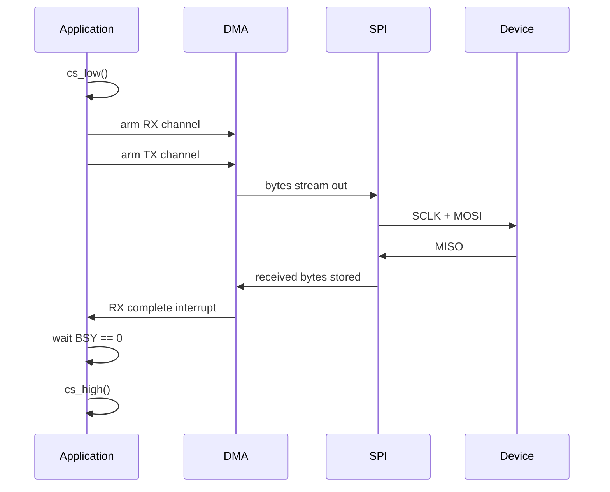

# SPI — Serial Peripheral Interface

> A four-wire, full-duplex, controller-driven bus built from two shift registers wired into a ring. There is no addressing, no acknowledgement, and no standard — which is exactly why it is fast and why every device behaves slightly differently.

**Contents**
[Cheat sheet](#1-cheat-sheet) ·
[Shift register model](#the-shift-register-model) ·
[Modes / CPOL & CPHA](#cpol-cpha-and-the-four-modes) ·
[Chip select](#chip-select) ·
[Topologies](#topologies) ·
[Registers](#3-register-level-walkthrough) ·
[Code](#4-code) ·
[Captures](#5-captures) ·
[Debugging](#6-debugging-checklist) ·
[Q&A](#7-questions-i-should-be-able-to-answer) ·
[Sources](#8-sources)

---

## 1. Cheat sheet

| Property | Value |
| :--- | :--- |
| **Wires** | 4 — SCLK, MOSI, MISO, CS — plus one extra CS per additional device |
| **Duplex** | **Full duplex.** Data moves both ways on every clock |
| **Clock** | Synchronous, always driven by the controller |
| **Bit order** | MSB first (usually — configurable) |
| **Typical speed** | 1–50 MHz on a PCB. Tens of MHz is routine |
| **Distance** | Same board. Centimetres |
| **Device select** | A dedicated CS pin per device, active low |
| **Addressing** | **None.** The wire you assert *is* the address |
| **Error detection** | **None.** No parity, no ACK, no CRC — unless the device adds one |
| **Acknowledgement** | None. The controller never learns whether anything is listening |
| **Flow control** | None |
| **Standard** | **There isn't one.** No governing spec — hence the variation between parts |

**Use it when** you need throughput: displays, SD cards, flash memory, high-rate ADCs
and IMUs, radio modules.

**Avoid it when** pins are scarce (each device costs a CS), the device is far away, or
you need any built-in confirmation that a transfer worked.

### Top 5 gotchas

| # | Gotcha | Why it bites |
| :--- | :--- | :--- |
| 1 | **Wrong SPI mode** | CPOL/CPHA mismatch gives you shifted or garbage data, not silence. Looks like a wiring fault |
| 2 | **Reading requires writing** | There is no "read" — you clock out dummy bytes to clock data in. Forget this and MISO stays idle |
| 3 | **CS released too early** | Deasserting on `TXE` instead of `BSY == 0` truncates the last byte mid-flight |
| 4 | **16-bit write to an 8-bit `DR`** | On STM32, writing a `uint16_t` when `DS = 8` sends **two** bytes. Cast the pointer |
| 5 | **No error detection at all** | Corruption is silent. If integrity matters, the protocol on top must add a CRC |

### Key registers — STM32 SPI

| Register | Bits that matter | Purpose |
| :--- | :--- | :--- |
| `CR1` | `SPE`, `MSTR`, `BR[2:0]`, `CPOL`, `CPHA`, `LSBFIRST`, `SSM`, `SSI`, `BIDIMODE`, `RXONLY` | Enable, role, clock divider, mode, bit order, NSS handling |
| `CR2` | `DS[3:0]`, `SSOE`, `NSSP`, `FRXTH`, `TXDMAEN`, `RXDMAEN`, `ERRIE`, `RXNEIE`, `TXEIE` | Frame size, hardware NSS, FIFO threshold, DMA, interrupts |
| `SR` | `TXE`, `RXNE`, `BSY`, `OVR`, `MODF`, `CRCERR`, `FRE`, `FTLVL`, `FRLVL` | Status and errors, plus FIFO levels |
| `DR` | Data | **Access width matters** — see gotcha 4 |
| `CRCPR` / `RXCRCR` / `TXCRCR` | Polynomial and accumulators | Optional hardware CRC |

> [!IMPORTANT]
> `TXE` means the transmit register accepted your byte. `BSY` means the shift register
> is still clocking bits onto the wire. Deassert CS only after `TXE == 1` **and**
> `BSY == 0`. This is the SPI counterpart of UART's `TXE` versus `TC`, and it produces
> the same intermittent last-byte corruption.

---

## 2. How it actually works

### The shift register model

This is the whole protocol. Everything else is detail.

The controller and the device each hold a shift register, and the two are wired into a
single ring by MOSI and MISO. Every clock edge shifts one bit out of each and one bit
in. After eight clocks, the two registers have **swapped contents**.

```text
        ┌──────────── Controller ────────────┐
        │   ┌───────────────────────────┐    │
   MOSI │   │ 1 0 1 1 0 0 1 0 │ shift → │────┼───────┐
        │   └───────────────────────────┘    │       │
        │              ▲                     │       ▼
        └──────────────┼─────────────────────┘   ┌───────────────────┐
                       │                         │ 0 1 0 0 1 1 0 1   │  Device
                       │                         └───────────────────┘
   MISO ───────────────┴─────────────────────────────────┘

   SCLK ──┐ ┌─┐ ┌─┐ ┌─┐ ┌─┐ ┌─┐ ┌─┐ ┌─┐ ┌──   8 clocks = full exchange
          └─┘ └─┘ └─┘ └─┘ └─┘ └─┘ └─┘ └─┘
```

Three consequences follow immediately, and they explain most beginner confusion:

**1. There is no such thing as a read.** To receive a byte you must transmit one,
because the clock only runs while the controller drives it. Reading a sensor register
means sending a dummy byte — `0xFF` or `0x00` — purely to generate eight clock edges.

```c
uint8_t spi_read(void) {
    return spi_transfer(0xFF);   /* the 0xFF is thrown away by the device */
}
```

**2. Every transfer is simultaneous.** You send and receive at the same time. The byte
you receive during a command byte is usually meaningless and must be discarded — a
very common source of off-by-one errors in drivers.

**3. Transactions are inherently pipelined.** Ask for a register at byte 1 and the
answer arrives at byte 2, not byte 1. The device needs the address before it can
respond.

```text
   MOSI:  [ 0x8B addr ] [ 0xFF dummy ]
   MISO:  [ junk      ] [ 0x42 data  ]
                  ▲            ▲
           discard this   this is the answer
```

### Wiring

```text
   Controller                  Device
     SCLK  ──────────────────►  SCLK
     MOSI  ──────────────────►  MOSI     (controller out, device in)
     MISO  ◄──────────────────  MISO     (device out, controller in)
     CS    ──────────────────►  CS       (active LOW)
     GND   ───────────────────  GND
```

Unlike UART, **MOSI goes to MOSI and MISO goes to MISO** — the names already encode
direction, so there is no crossover. Newer naming avoids the master/slave terms:

| Old | New | Meaning |
| :--- | :--- | :--- |
| MOSI | COPI / SDO→SDI | Controller Out, Peripheral In |
| MISO | CIPO / SDI←SDO | Controller In, Peripheral Out |
| SS / NSS | CS | Chip Select |
| Master / Slave | Controller / Peripheral | — |

> [!WARNING]
> Some datasheets label pins from the *device's* point of view — a chip's "SDO" is your
> MISO. When a board refuses to talk and the mode is right, this is the next thing to
> check.

### CPOL, CPHA and the four modes

Two bits decide when the clock idles and which edge samples data. Get them wrong and
you receive plausible-looking garbage, usually shifted by one bit.

| Mode | CPOL | CPHA | Clock idles | Data sampled on | Data changes on |
| ---: | ---: | ---: | :--- | :--- | :--- |
| **0** | 0 | 0 | Low | Rising (leading) edge | Falling edge |
| **1** | 0 | 1 | Low | Falling (trailing) edge | Rising edge |
| **2** | 1 | 0 | High | Falling (leading) edge | Rising edge |
| **3** | 1 | 1 | High | Rising (trailing) edge | Falling edge |

```text
   CPOL = 0                          CPOL = 1
   SCLK  __┌─┐_┌─┐_┌─┐__             SCLK  ‾‾└─┘‾└─┘‾└─┘‾‾
           idles low                        idles high

   CPHA = 0  →  sample on the FIRST edge after CS falls
   CPHA = 1  →  shift on the first edge, sample on the SECOND
```

**Modes 0 and 3 cover the vast majority of devices.** They are interchangeable more
often than people expect, because both sample on the edge that follows a data change —
but never assume it; read the timing diagram.

<details>
<summary><b>Why CPHA = 0 forces the first bit out at CS assertion</b></summary>

With CPHA = 0 the very first clock edge *samples*. That means the first data bit has to already be sitting on the line before any clock edge occurs — so it is placed there when CS falls.

Two practical consequences:

- Some CPHA = 0 devices require **CS to be pulsed between every frame**, because that falling edge is what loads the next bit. Holding CS low across a multi-byte transfer then fails, and the symptom is that only the first byte is correct.
- The STM32 hardware NSS output does not pulse between frames unless `NSSP` is set. Software GPIO chip select is the usual answer, precisely because it gives you that control.

</details>

**Diagnosing a mode mismatch from a capture:** if your data appears shifted by one bit
position, CPHA is wrong. If it looks entirely unrelated, check CPOL as well, or the
bit order.

### Frame size and bit order

STM32 supports 4- to 16-bit frames via `DS[3:0]`, and `LSBFIRST` flips bit order. Most
devices are 8-bit MSB first, but 12- and 16-bit frames are common in ADCs and DACs,
where the frame is the sample.

> [!WARNING]
> **The `DR` access-width trap.** On STM32 parts with a FIFO, `SPI->DR` is a 16-bit
> register. Writing a 16-bit value while `DS = 8` pushes **two bytes** into the FIFO.
> To send one byte you must write through an 8-bit pointer:
> ```c
> *(__IO uint8_t *)&SPI1->DR = byte;     /* correct */
> SPI1->DR = byte;                        /* sends TWO bytes */
> ```
> On the receive side, `FRXTH` sets whether `RXNE` fires at a quarter-full or half-full
> FIFO. Leave it at quarter for 8-bit frames, or `RXNE` never fires for a single byte.

### Chip select

CS is the entire addressing mechanism. Asserting it selects the device; releasing it
resets that device's internal state machine.

| Approach | How | When to use |
| :--- | :--- | :--- |
| **Software GPIO** | Toggle a normal pin around the transfer | Default choice. Full control over timing and multi-byte framing |
| **Hardware NSS output** | `SSOE = 1`, optionally `NSSP` for a pulse between frames | Only when the timing happens to match the device |
| **NSS input** | `SSM = 0` in peripheral mode | Required when *you* are the device |
| **Software NSS management** | `SSM = 1`, `SSI = 1` | Controller mode with no NSS pin at all |

> [!IMPORTANT]
> In controller mode with `SSM = 1`, you must also set `SSI = 1`. If `SSI` reads 0 the
> peripheral thinks another controller has taken the bus, raises `MODF`, and silently
> clears `MSTR` and `SPE`. Symptom: SPI appears to initialise, then does nothing at all.

**Holding CS across bytes matters.** A flash read is `[command][addr][addr][addr][data...]`
in one CS assertion. Release CS in the middle and the device aborts. Conversely some
ADCs require CS to rise between conversions. There is no rule — only the datasheet.

### Topologies

**Independent (star) — the common case.** One CS per device, MISO shared.

```text
                ┌────────────► CS1 ──► Device 1
   Controller ──┼────────────► CS2 ──► Device 2
                └────────────► CS3 ──► Device 3
   SCLK / MOSI / MISO shared by all
```

The critical requirement: a deselected device **must tri-state its MISO**. Most do.
Some cheap parts do not, and will fight whichever device is actually selected — the
classic symptom is that everything works with one device attached and nothing works
with two. A buffer or a mux is the fix.

**Daisy chain.** MISO of each device feeds MOSI of the next, and one CS drives them all.

```text
   Controller ──MOSI──► Dev1 ──►  Dev2 ──►  Dev3 ──MISO──► Controller
                          ▲         ▲         ▲
                          └─────────┴─────────┴── one shared CS
```

Send N bytes and they ripple through, one landing in each device when CS rises. Saves
pins and is common in LED drivers and shift registers, but only works if the parts
support pass-through, and latency grows with chain length.

### Half duplex and 3-wire

`BIDIMODE` turns MOSI into a single bidirectional data line, dropping to three wires.
`RXONLY` drops the transmit side entirely, letting the controller clock in data
continuously. Useful for devices that only ever talk one way, and for saving a pin.

---

## 3. Register-level walkthrough

*Reading one register from an SPI sensor, STM32 controller mode, software CS.*

**1 — Clocks and pins**
Enable SPI and GPIO clocks. SCLK, MOSI, MISO to alternate function push-pull. CS as a
plain GPIO output, initialised **high** — a CS that starts low selects a device before
you have configured anything.

**2 — Configure `CR1`**
`MSTR = 1`, `BR[2:0]` for the divider, `CPOL`/`CPHA` from the device datasheet,
`LSBFIRST = 0`, `SSM = 1`, `SSI = 1`.

**3 — Configure `CR2`**
`DS = 0b0111` for 8-bit frames. `FRXTH = 1` so `RXNE` fires on a single byte rather
than waiting for two.

**4 — Enable**
Set `SPE`.

**5 — The transaction**

```c
cs_low();                                        /* select */

/* byte 1: register address, with the read bit set */
while (!(SPI1->SR & SPI_SR_TXE));
*(__IO uint8_t *)&SPI1->DR = (reg | 0x80);
while (!(SPI1->SR & SPI_SR_RXNE));
(void)*(__IO uint8_t *)&SPI1->DR;                /* discard — junk from the address phase */

/* byte 2: dummy out, data in */
while (!(SPI1->SR & SPI_SR_TXE));
*(__IO uint8_t *)&SPI1->DR = 0xFF;
while (!(SPI1->SR & SPI_SR_RXNE));
uint8_t value = *(__IO uint8_t *)&SPI1->DR;      /* the answer */

while (SPI1->SR & SPI_SR_BSY);                   /* ← wait for the wire to finish */
cs_high();                                       /* release */
```

**Every step above has a reason**

| Line | Why |
| :--- | :--- |
| Discarding the first `RXNE` | Full duplex means a byte came back during the address phase. It is junk |
| Sending `0xFF` | Purely to generate clocks. The device ignores it |
| Reading `DR` after every write | If you do not, the receive FIFO fills and sets `OVR` |
| 8-bit pointer casts | A 16-bit write would push two bytes |
| `BSY` before `cs_high()` | `RXNE` says the data arrived; `BSY` says the wire is idle |

> [!TIP]
> A read that returns your own transmitted byte means MOSI and MISO are shorted, or
> the device is absent and you are seeing a floating line follow MOSI through
> capacitive coupling. A read of all `0x00` or all `0xFF` usually means the device is
> not selected, not powered, or MISO is disconnected.

---

## 4. Code

| File | What it is | Verified how |
| :--- | :--- | :--- |
| [`code/stm32f4/spi_master.c`](../code/stm32f4/spi_master.c) | STM32F4 SPI1 master, registers only. Mode 0–3 from a single argument, prescaler chosen to stay under the device maximum, software chip select | Compiles clean for Cortex-M4 at `-Werror -Wconversion`. **Not run on hardware yet.** |
| [`code/stm32f4/stm32f4_regs.h`](../code/stm32f4/stm32f4_regs.h) | Register map typed out of RM0090 rather than pulled from CMSIS | — |

```bash
cd code/stm32f4 && make
```

The three bugs this file exists to demonstrate:

- **SPI is a shift register, not a transmitter.** Every byte out produces a
  byte in. `spi_transfer` always reads `DR`, because leaving `RXNE` set makes
  the *next* read return stale data — which presents as a sensor that is
  permanently one sample behind.
- **`TXE` is not "done".** `spi_cs_release()` waits for `BSY` to clear before
  deasserting CS. Releasing on `TXE` cuts the final byte off mid-shift.
- **The prescaler is powers of two only.** `spi_init` picks the fastest
  divider that stays *under* the requested maximum, never the nearest — the
  nearest can be 10% over spec and the device latches garbage.

> [!WARNING]
> **Status: reviewed, compiled, not flashed.** Signal integrity at high SCK,
> MISO tri-state timing between devices sharing the bus, and mode mismatches
> against a real peripheral all need a scope. Do not cite this file as
> hardware-proven.

---

## 5. Captures

**Not yet taken** — needs a logic analyzer.

- [ ] **One clean 8-bit transfer** — CS, SCLK, MOSI, MISO on four channels
- [ ] **All four modes** on the same byte, showing where sampling moves
- [ ] **CS held across a multi-byte transfer** versus pulsed per byte
- [ ] **A mode mismatch** — deliberately set mode 1 against a mode 0 device
- [ ] **CS released too early**, truncating the last byte
- [ ] **Two devices sharing MISO**, showing tri-state between selections

---

## 6. Debugging checklist

| Symptom | Likely cause | How to confirm |
| :--- | :--- | :--- |
| MISO always `0x00` | Device not selected, unpowered, or MISO not connected | Scope CS — does it actually go low? |
| MISO always `0xFF` | MISO floating, pulled up, nothing driving it | Disconnect the device — does the reading change? |
| MISO mirrors MOSI | Lines shorted, or device absent with coupling | Scope both. They should differ |
| Data shifted by one bit | **CPHA wrong** | Try the other CPHA at the same CPOL |
| Data unrecognisable | CPOL wrong, or bit order wrong | Capture and decode manually against the datasheet |
| Only the first byte correct | Device needs CS pulsed per frame (CPHA = 0) | Toggle CS between bytes and retest |
| Last byte corrupted or lost | CS released on `TXE` instead of `BSY == 0` | Capture CS against the final clock edge |
| Two bytes sent when you sent one | 16-bit write to `DR` with `DS = 8` | Cast to `__IO uint8_t *` |
| `RXNE` never fires for one byte | `FRXTH` set for half-full FIFO | Set `FRXTH = 1` |
| SPI initialises then does nothing | `MODF` — `SSI = 0` with `SSM = 1`, cleared `MSTR` | Read `SR`. Is `MODF` set? |
| Works alone, fails with a second device | A deselected device is not tri-stating MISO | Remove one device and retest |
| Works slow, fails fast | Round-trip delay, ringing, or wiring capacitance | Halve the clock. If it works, it is signal integrity |
| Works with short wires, fails with long | Same — SCLK ringing and skew | Series resistor on SCLK, or shorten the run |
| Intermittent corruption, no pattern | No CRC anywhere, so real errors go undetected | Add a checksum at the protocol layer and count failures |

<details>
<summary><b>Finding an unknown device's mode empirically</b></summary>

There are only four. If the datasheet is unavailable or ambiguous, loop through all four, issue a command with a known constant response — a WHO_AM_I or JEDEC ID register — and see which one returns the expected value.

Worth keeping as a permanent bring-up utility. It takes minutes to write and saves hours whenever a new part arrives.

</details>

---

## 7. Questions I should be able to answer

<details>
<summary><b>Why must you transmit in order to receive?</b></summary>

The controller owns the clock, and data only moves while the clock runs. Sending a dummy byte is how you generate the eight edges that shift the device's data into your register. There is no read operation — only exchange.

</details>

<details>
<summary><b>Explain the shift register model.</b></summary>

Controller and device each hold a shift register, joined into a ring by MOSI and MISO. Each clock edge shifts one bit out of each and one into each, so after eight clocks the two registers have swapped contents. Full duplex is not a feature bolted on — it is what the topology inevitably does.

</details>

<details>
<summary><b>What do CPOL and CPHA control?</b></summary>

CPOL sets the clock's idle level. CPHA sets whether data is sampled on the leading or trailing edge. Together they give four modes, and both ends must agree exactly.

</details>

<details>
<summary><b>Your data comes back shifted by one bit. What is wrong?</b></summary>

CPHA. You are sampling on the wrong edge, so every bit is caught one position out. Wrong CPOL usually produces something less structured than a clean single-bit shift.

</details>

<details>
<summary><b>Why do some devices need CS pulsed between every byte?</b></summary>

Because with CPHA = 0 the first clock edge samples, so the first data bit must already be on the line — and it is the CS falling edge that loads it. Those devices cannot latch a new first bit without a fresh CS transition.

</details>

<details>
<summary><b>When exactly can you raise CS?</b></summary>

After `TXE` is set and `BSY` is clear. `TXE` only means the data register accepted the byte; the shift register may still be clocking it onto the wire. Raising CS early truncates it.

</details>

<details>
<summary><b>Three devices share MISO. What must each one do?</b></summary>

Tri-state its MISO output whenever it is not selected. A device that drives MISO permanently will fight the selected one — which is why a system can work with one device attached and fail as soon as a second is added.

</details>

<details>
<summary><b>How does SPI detect a corrupted transfer?</b></summary>

It does not. There is no parity, no acknowledgement, no CRC, and no addressing. If integrity matters, the protocol layered on top must supply it. Some STM32 parts offer an optional hardware CRC, but the device at the other end has to support the same scheme.

</details>

<details>
<summary><b>What limits SPI clock speed in practice?</b></summary>

The MISO round trip. The clock edge leaves the controller, the device responds after its own propagation delay, and the result has to arrive back before the controller samples. Beyond a few tens of MHz — much less on jumper wires — the data is simply not back in time.

</details>

<details>
<summary><b>Why is SPI faster than I2C?</b></summary>

Push-pull outputs with actively driven edges, instead of open-drain lines waiting on an RC rise. No addressing overhead, no per-byte acknowledgement, and separate lines for each direction.

</details>

<details>
<summary><b>What is a mode fault (MODF)?</b></summary>

The peripheral believes another controller has taken the bus — typically NSS pulled low while you are the controller, or `SSI = 0` with `SSM = 1`. It clears `MSTR` and `SPE`, so SPI appears to initialise and then does nothing.

</details>

<details>
<summary><b>You send one byte and two appear on the wire. Why?</b></summary>

A 16-bit write to a 16-bit `DR` while the frame size is 8 bits, which pushes two bytes into the FIFO. Write through an 8-bit pointer instead.

</details>

---

## 8. Sources

| Document | Use it for |
| :--- | :--- |
| STM32 reference manual, SPI/I2S chapter | Register detail for your specific part |
| ST **AN5543** and SPI application notes | DMA patterns, timing, FIFO behaviour |
| The **device** datasheet's timing diagram | Mode, CS behaviour, and required delays — the only authority |
| **JESD251** / vendor QSPI datasheets | Quad SPI command sets |
| SD Association simplified spec | SPI-mode SD card commands |

---

## 9. Electrical characteristics and signal integrity

SPI is push-pull CMOS, actively driven both ways. There are no pull-ups and no
wired-AND behaviour — which is why it is fast, and why it fails differently from I2C.

| Parameter | Typical | Notes |
| :--- | :--- | :--- |
| Output high | VDD − 0.4 V | Actively driven |
| Output low | 0.4 V | |
| Input thresholds | ~0.3 / 0.7 × VDD | Mixing 3.3 V and 5 V needs translation |
| Drive current | 4–20 mA | Configurable slew rate on many MCUs |
| Bus capacitance | No spec limit | But it governs the achievable clock rate |
| Practical clock | 1–50 MHz on PCB | 1–4 MHz on jumper wires |

**SCLK is the fastest edge on your board.** At 20 MHz-plus it behaves as a
transmission line: reflections off an unterminated end appear as ringing, and ringing
around the input threshold produces double-clocking — the device sees nine clocks where
you sent eight, and everything after that is shifted.

**Series termination** is the standard fix: 22–33 Ω in series with SCLK, placed *at the
driver*, damps the reflection. Cheap insurance on any board running above ~10 MHz.

**Layout rules that actually matter**

- Keep SCLK short and give it a continuous ground reference beneath it
- Route MISO and MOSI alongside SCLK so their propagation delays track
- Avoid stubs. A daisy-chained CS with a long branch will ring
- Lower the MCU's GPIO slew rate if you do not need the speed — slower edges radiate
  less and ring less
- Long jumper wires are the number one cause of "works at 1 MHz, fails at 8"

> [!TIP]
> Halving the clock is the fastest diagnostic in SPI. If the problem disappears, it is
> signal integrity or round-trip timing, not logic. If it persists identically, it is
> configuration.

---

## 10. Clock speed and round-trip timing

The controller drives SCLK and samples MISO on a fixed edge. That sets a hard budget:

```
   t_SCLK_out  +  t_device_response  +  t_MISO_return   <   half a clock period
```

Every term is fixed by physics and the device. Only the clock period is yours to
change, which is why the ceiling is a property of the *system*, not the peripheral.

| Contribution | Typical |
| :--- | :--- |
| Controller output delay | a few ns |
| Trace propagation | ~5 ns per metre — negligible on a PCB, real on cables |
| **Device output valid after clock edge** | **often 10–30 ns — usually dominant** |
| Controller setup time before sampling | a few ns |

At 25 MHz the half period is 20 ns. A device quoting 25 ns output delay cannot work at
that rate no matter how good your board is. The datasheet number to look for is
`t_V` or "output valid after SCLK edge."

**Symptoms of exceeding the budget:** MOSI is correct on a capture, the device is
clearly responding, but the controller reads wrong values — and halving the clock fixes
it instantly. Some MCUs offer a receive sample-delay setting to buy margin; most do
not, so you slow down.

**Writing is cheaper than reading.** A write-only transfer has no return path in the
budget, so the maximum write clock is often well above the maximum read clock for the
same device. Flash programming exploits this.

---

## 11. Error handling

SPI gives you almost nothing, so the driver's job is mostly to detect the few things
the peripheral does report and to add what it does not.

| Flag | Meaning | Cause | Response |
| :--- | :--- | :--- | :--- |
| `OVR` | Receive overrun | A frame completed before you read the previous one | Read `DR` then `SR` to clear. Data is lost |
| `MODF` | Mode fault | NSS low while controller, or `SSI = 0` with `SSM = 1` | Clears `MSTR` and `SPE` — must fully reinitialise |
| `CRCERR` | Hardware CRC mismatch | Corruption, if CRC is enabled | Retry the transaction |
| `FRE` | Frame error | TI mode framing violation | Rare outside TI mode |

**`OVR` is the one you will meet.** Because SPI is full duplex, every byte you send
produces a byte you must read. A driver that writes in a loop without reading fills the
receive FIFO and stalls.

```c
/* wrong — sets OVR after a couple of bytes */
for (i = 0; i < len; i++) {
    while (!(SPI1->SR & SPI_SR_TXE));
    *(__IO uint8_t *)&SPI1->DR = tx[i];
}

/* right — every write is matched by a read */
for (i = 0; i < len; i++) {
    while (!(SPI1->SR & SPI_SR_TXE));
    *(__IO uint8_t *)&SPI1->DR = tx[i];
    while (!(SPI1->SR & SPI_SR_RXNE));
    rx[i] = *(__IO uint8_t *)&SPI1->DR;    /* even if you discard it */
}
```

**Recovery ladder**

| Step | Action | Use when |
| ---: | :--- | :--- |
| 1 | Retry the transaction | Single unexpected value, CRC mismatch |
| 2 | Raise CS, pause, retry | Device state machine may be mid-command |
| 3 | Drain the RX FIFO, clear `OVR` | Overrun |
| 4 | Disable and re-enable `SPE` | Flags stuck |
| 5 | Full reinitialise | After `MODF`, which clears `MSTR` |
| 6 | Reset the device itself | Device has a reset pin or a soft-reset command |

> [!IMPORTANT]
> **Add your own integrity check.** SPI will happily hand you corrupted data with no
> indication whatsoever. For anything that matters — firmware images, configuration,
> stored data — put a CRC in the payload and verify it. Many devices provide a fixed ID
> register precisely so you can sanity-check the link before trusting anything else.

---

## 12. Driver architecture

### API shape

```c
typedef enum {
    SPI_OK = 0,
    SPI_ERR_TIMEOUT,
    SPI_ERR_OVERRUN,
    SPI_ERR_MODE_FAULT,
    SPI_ERR_BUSY
} spi_status_t;

spi_status_t spi_init(spi_config_t cfg);                       /* mode, speed, frame size */
spi_status_t spi_transfer(const uint8_t *tx, uint8_t *rx, uint16_t len);
spi_status_t spi_write(const uint8_t *tx, uint16_t len);       /* rx discarded internally */
spi_status_t spi_read(uint8_t *rx, uint16_t len);              /* sends 0xFF internally */
spi_status_t spi_transfer_dma(const uint8_t *tx, uint8_t *rx, uint16_t len, spi_cb_t done);
```

`spi_transfer` with both buffers is the honest primitive, because that is what the
hardware does. `spi_write` and `spi_read` are conveniences built on it — and writing
them that way round stops you forgetting the discarded byte.

**Per-device configuration.** Different devices on one bus need different modes and
speeds, so the driver must reconfigure between them.

```c
typedef struct {
    GPIO_TypeDef *cs_port;
    uint16_t      cs_pin;
    uint8_t       mode;          /* 0–3 */
    uint32_t      max_hz;
    bool          cs_per_byte;   /* some CPHA=0 parts need this */
} spi_device_t;
```

Then `spi_select(dev)` applies the mode and divider before asserting CS. Skipping this
is why "the display works until I add the SD card" is such a common report.

### Polling vs interrupt vs DMA

| | Polling | Interrupt | DMA |
| :--- | :--- | :--- | :--- |
| CPU cost | Blocks entirely | One ISR per frame — brutal at 20 MHz | Almost none |
| Practical ceiling | Low rates, short transfers | Moderate | Full clock rate |
| Complexity | Trivial | Moderate | Highest |
| Good for | Register reads, bring-up | Rarely the right answer for SPI | Displays, SD cards, flash, anything bulk |

SPI is the bus where interrupts age worst. At 20 MHz a byte completes every 400 ns —
no ISR survives that. The realistic split is **polling for short register access, DMA
for everything bulk**, with interrupt mode used mainly for the DMA-complete callback.

---

## 13. DMA

**Both directions must be armed.** Full duplex means every transmitted byte produces a
received one, so a TX-only DMA still overruns the receive FIFO. If you do not want the
data, DMA it into a scratch buffer with the memory-increment bit turned off, so every
byte lands in the same discarded location.

```c
/* TX: memory → peripheral, increment source */
/* RX: peripheral → memory, increment destination */
/* Enable RX first, then TX — otherwise the first bytes arrive with no destination */

SPI1->CR2 |= SPI_CR2_RXDMAEN;
SPI1->CR2 |= SPI_CR2_TXDMAEN;      /* this starts the transfer */
```

**Order matters.** Arm receive before transmit. Enabling `TXDMAEN` begins clocking
immediately, and if the receive channel is not ready those first bytes are lost and
`OVR` is set.

**Completion.** Wait for the RX DMA complete interrupt — not TX. TX complete only means
the last byte reached the peripheral; the RX side finishing is what tells you the wire
transaction is over. Then still check `BSY` before raising CS.



**Half-transfer interrupts** let you double-buffer a display: refill the first half
while the second is still being sent, giving continuous output with no gaps.

---

## 14. Quad SPI and memory-mapped flash

Standard SPI moves one bit per clock. QSPI widens the data path and is how modern
external flash is actually used.

| Mode | Data lines | Relative throughput |
| :--- | ---: | ---: |
| Single SPI | 1 | 1× |
| Dual SPI | 2 | 2× |
| Quad SPI | 4 | 4× |
| Octo SPI | 8 | 8× |

A QSPI transaction has distinct phases, each independently configurable for width:

```text
 ┌─────────────┬──────────┬─────────────┬────────┬──────────┐
 │ INSTRUCTION │ ADDRESS  │ ALTERNATE   │ DUMMY  │  DATA    │
 │ e.g. 0xEB   │ 24/32bit │ mode bits   │ cycles │ 1–4 lines│
 └─────────────┴──────────┴─────────────┴────────┴──────────┘
```

**Dummy cycles** are the phase people forget. Flash needs internal time between
receiving an address and producing data, and that latency is expressed as clock cycles
with nothing on the bus. The required count *rises with clock frequency* and is
configurable in the flash's own registers — mismatch it and you read shifted garbage
that looks exactly like a mode error.

**Memory-mapped mode** is the payoff: the QSPI peripheral maps the external flash into
the MCU's address space, so the core can read it with ordinary load instructions and
even execute from it (XIP). No driver calls, no explicit transactions. The cost is that
writes still require command sequences, and any cache must be managed carefully.

**Typical flash workflow** (W25Q, MX25 and similar):

1. `0x06` — write enable, sets the WEL bit
2. `0x20` / `0xD8` — sector or block erase
3. Poll `0x05` — read status register until the busy bit clears
4. `0x06` again — WEL is cleared by every completed operation
5. `0x02` — page program, up to 256 bytes, never crossing a page boundary
6. Poll busy again
7. `0x03` or `0xEB` — read, single or quad

> [!WARNING]
> Two rules that bite everyone: **write enable must be re-issued before every single
> write or erase**, because it self-clears; and **a page program must not cross a
> 256-byte page boundary** — it wraps to the start of the same page rather than
> continuing, silently corrupting what you just wrote. Exactly the same trap as I2C
> EEPROM page writes.

---

## 15. SD cards over SPI

A practical worked example, and a good one to have done, because it exercises nearly
every SPI concept at once.

**Initialisation is the fiddly part**

1. Power up, wait 1 ms
2. Send **at least 74 clock pulses with CS held high** — the card needs them to boot its
   internal controller. Clock out ten `0xFF` bytes
3. CS low, send `CMD0` (GO_IDLE_STATE) → expect `R1 = 0x01`. This is what switches the
   card from native SD mode into SPI mode
4. `CMD8` to establish voltage range and distinguish SDv2 from older cards
5. Loop `ACMD41` until the idle bit clears — initialisation can take hundreds of
   milliseconds
6. `CMD58` to read the OCR and determine byte versus block addressing
7. Only now raise the clock from the required 400 kHz init rate to full speed

**Reading a block**

```text
   CMD17 + address  →  R1 response  →  wait for data token 0xFE
                    →  512 data bytes  →  16-bit CRC
```

**Things that catch people**

- Responses are not immediate. Clock `0xFF` bytes and watch for the first byte with its
  MSB clear — that is `R1`. Give it at least eight tries
- The card may hold MISO low while busy after a write. Poll until it releases
- CRC is ignored in SPI mode after `CMD0`, except for `CMD0` and `CMD8` themselves,
  which need correct hard-coded CRCs — hence the magic constants in every driver
- Initialise at 400 kHz or below. Cards are not obliged to work faster until initialised
- SPI mode is significantly slower than native 4-bit SDIO. It is chosen for simplicity
  and pin count, not speed

---

## 16. Being the peripheral

Less common than controller mode, and a fair interview turn because the constraints
invert.

**You no longer control timing.** The controller can clock a byte at any moment, and
your data must already be in `DR` when it does — you cannot ask it to wait, because
there is no clock stretching in SPI. Miss the window and you transmit whatever was
left in the register.

| Requirement | Implication |
| :--- | :--- |
| Preload `DR` before CS falls | The first byte out is whatever is already loaded |
| DMA is close to mandatory | At any real clock rate, an ISR cannot keep up |
| CS falling edge as an interrupt | Use it to reset your frame state machine |
| Fixed-length frames help enormously | Variable length means tracking position with no timing guarantees |

**The standard pattern:** a fixed-size command/response structure, DMA armed for
exactly that length, and an EXTI interrupt on CS to resynchronise. The response to a
command usually arrives in the *next* transaction, because the device has no way to
generate data mid-frame — which mirrors the pipelining in section 2.

---

## 17. Board-level failure modes

**A deselected device driving MISO.** Should tri-state, sometimes does not, especially
on cheap modules. One device works, two do not.

**Long jumper wires.** SPI's most common practical failure. A 20 cm dupont lead at
8 MHz rings enough to double-clock. Shorten it, slow down, or add series termination.

**Mixed voltage devices.** 3.3 V controller with a 5 V device, or vice versa. Unlike
I2C there is no simple MOSFET trick — you need proper level translators on all four
lines, and they add delay to an already tight timing budget.

**CS floating at reset.** Before the MCU configures its pins, CS lines are inputs and
float. A device may see a spurious selection and enter an unknown state. Fit external
pull-ups on every CS line — cheap, and it also protects the device during MCU reset.

**Shared bus with a display.** Displays hold CS low for long bursts. If another device
on the bus is time-sensitive, it starves. Either give the display its own SPI
peripheral, or chunk its transfers.

**Missing ground return on a ribbon cable.** At SPI edge rates the return path matters
as much as the signal. Interleave grounds in the connector rather than using a single
ground pin at one end.

---

## 18. SPI vs I2C vs UART

| | SPI | I2C | UART |
| :--- | :--- | :--- | :--- |
| Wires | 3 + 1 CS per device | 2 | 2 |
| Clock | Shared, from controller | Shared, from controller | None — pre-agreed baud |
| Duplex | **Full** | Half | Full |
| Bit order | MSB first (usually) | MSB first | **LSB first** |
| Typical speed | 1–50 MHz | 100–400 kHz | 9.6–115.2 kbaud |
| Devices | Many, one CS each | Many, by address | 2 only |
| Addressing | Dedicated pin | 7-bit in-band | None |
| Acknowledgement | **None** | Per byte | None |
| Error detection | **None** | None built in | Parity, framing, noise |
| Pin cost at 5 devices | 8 | 2 | 10 |
| Standardisation | **None — every device differs** | Formal spec | Formal spec |
| Best at | Throughput | Many slow chips, few pins | Another board or a PC |

**The honest summary:** SPI trades every convenience for speed. No addressing, no
acknowledgement, no error detection, no standard — but actively driven push-pull lines
and a dedicated path in each direction, which is why it is an order of magnitude faster
than I2C.

---

## 19. Device quirks worth knowing

Because there is no standard, the variation *is* the subject.

| Device type | Quirk |
| :--- | :--- |
| **SD card** | Needs 74 clocks with CS high before anything works. 400 kHz until initialised |
| **NOR flash** | Write enable self-clears; page program wraps within 256 bytes; busy polling required |
| **Displays (ILI9341, ST7789)** | An extra D/C pin selects command versus data. Long CS-low bursts |
| **IMUs (MPU9250, BMI160)** | Read bit is the MSB of the register address. Burst read is atomic across axes |
| **Thermocouple (MAX31855)** | Read-only, no MOSI needed. Fixed 32-bit frame |
| **Radio (nRF24L01)** | Command byte returns the status register on MISO simultaneously |
| **ADCs** | Often need CS pulsed per conversion, and have a maximum clock for the return path only |
| **Shift registers (74HC595)** | Not real SPI. A latch pin replaces CS, and the timing is yours to get right |

The pattern to internalise: **the first byte you send is nearly always a command or
register address with a direction bit encoded in the top bit**, and the byte you receive
alongside it is meaningless. After that, devices diverge completely.

---

## 20. Testing an SPI driver

**Loopback first, and it is better than UART's.** Wire MOSI directly to MISO. Every byte
you send comes straight back, so you can verify frame size, bit order, clock polarity,
and the whole buffer path with no device attached at all. A mismatch here is your bug,
not the device's.

**Fault injection**

| Fault | How to cause it deliberately |
| :--- | :--- |
| Overrun | Write in a loop without reading `DR` |
| Mode fault | Set `SSM = 1` with `SSI = 0` |
| Wrong mode | Deliberately configure mode 1 against a mode 0 device and capture the shift |
| Truncated last byte | Raise CS on `TXE` instead of waiting for `BSY == 0` |
| Timing failure | Raise the clock until reads fail, then confirm halving it recovers |
| Bus contention | Attach two devices and check MISO tri-states between selections |

**Bring-up utilities worth writing once**

- **Mode sweep** — try all four modes against a known ID register and report which works
- **Speed sweep** — raise the divider until the ID register stops reading correctly, and
  record the last good rate. That number is your real timing margin
- **ID check on every init** — read WHO_AM_I or the JEDEC ID before trusting anything.
  It is the only acknowledgement SPI will ever give you

**Soak testing.** Loop a known pattern for hours with a CRC in the payload and count
mismatches. Because SPI reports nothing, a silent error rate is invisible until you
deliberately measure it.

---

### Additions for section 7 — Q&A

<details>
<summary><b>Why must DMA be armed on both channels even for a write-only transfer?</b></summary>

Full duplex means every transmitted byte produces a received one. Without an RX channel the receive FIFO fills and sets `OVR`. Point the RX DMA at a scratch byte with memory increment disabled.

</details>

<details>
<summary><b>Which DMA completion tells you the transaction is over?</b></summary>

The RX one. TX complete only means the final byte reached the peripheral; the shift register is still clocking. Wait for RX complete, then still check `BSY` before raising CS.

</details>

<details>
<summary><b>What are dummy cycles in QSPI and why do they vary?</b></summary>

Clock cycles with no data, giving the flash internal time between receiving an address and producing data. The number required rises with clock frequency and is configured inside the flash itself — mismatch it and you read shifted data that looks exactly like a mode error.

</details>

<details>
<summary><b>Why does an SD card need 74 clocks before you talk to it?</b></summary>

Its internal controller needs them to boot before it will accept any command. They must be sent with CS held high, which is why every SD driver starts by clocking out ten `0xFF` bytes into nothing.

</details>

<details>
<summary><b>Why can a device's maximum write clock exceed its maximum read clock?</b></summary>

Writing has no return path in the timing budget. Reading must complete a full round trip — clock out, device responds, data returns — before the controller samples. Only the read direction is constrained by that delay.

</details>

<details>
<summary><b>Why is interrupt-per-byte a poor fit for SPI?</b></summary>

At 20 MHz a byte completes every 400 ns. No ISR turns around that fast. Polling for short register access and DMA for bulk transfers is the realistic split.

</details>

<details>
<summary><b>You are the peripheral. Why can you not make the controller wait?</b></summary>

SPI has no clock stretching — the controller owns the clock unconditionally. Your data must already be in the transmit register when the clock arrives, which is why peripheral mode effectively requires DMA and a CS-edge interrupt to resynchronise.

</details>

<details>
<summary><b>Everything works at 1 MHz and fails at 8. Where do you look?</b></summary>

Signal integrity or round-trip timing, not logic. Check wire length, add series termination on SCLK, and compare the device's output-valid time against half your clock period. A configuration error would fail identically at both speeds.

</details>

<details>
<summary><b>Why fit pull-ups on CS lines?</b></summary>

Before the MCU configures its pins they float, and a device may see a spurious selection and enter an unknown state. A pull-up holds every device deselected through reset and start-up.

</details>
